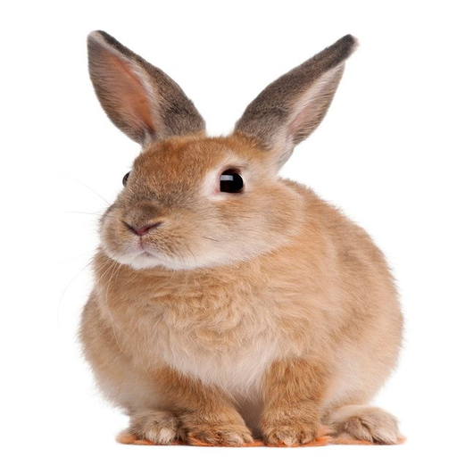

<style>
.custom {
    background-color: #008d8d;
    color: white;
    padding: 0.25em 0.5em 0.25em 0.5em;
    white-space: pre-wrap;       /* css-3 */
    white-space: -moz-pre-wrap;  /* Mozilla, since 1999 */
    white-space: -pre-wrap;      /* Opera 4-6 */
    white-space: -o-pre-wrap;    /* Opera 7 */
    word-wrap: break-word;
}

pre {
    background-color: #027c7c;
    padding-left: 0.5em;
}

</style>

# Chroma-Multimodal

- Author: [Gwangwon Jung](https://github.com/pupba)
- Design: []()
- Peer Review: 
- This is a part of [LangChain Open Tutorial](https://github.com/LangChain-OpenTutorial/LangChain-OpenTutorial)

[](https://colab.research.google.com/github/LangChain-OpenTutorial/LangChain-OpenTutorial/blob/main/09-VectorStore/02-Chroma-Multimodal.ipynb) [](https://github.com/LangChain-OpenTutorial/LangChain-OpenTutorial/blob/main/09-VectorStore/02-Chroma-Multimodal.ipynb)

## Overview

This tutorial covers how to use **Chroma Multimodal Vector Store** with **LangChain** .

In this tutorial, we will inherit the `ChromaDB` class from the previous tutorial to create a class that adds a **Multimodal** feature, and then use this class to implement an example of a **multimodal search** engine.


### Table of Contents

- [Overview](#overview)
- [Environment Setup](#environment-setup)
- [Multimodal Search](#multimodal-search)
- [Create a Multimodal Vector Store](#create-a-multimodal-vector-store)
- [Image Searching](#image-searching)


### References

- [Chroma Docs](https://docs.trychroma.com/docs/overview/introduction)
- [Langchain-Chroma](https://python.langchain.com/docs/integrations/vectorstores/chroma/)
- [List of VectorStore supported by Langchain](https://python.langchain.com/docs/integrations/vectorstores/)
----

## Environment Setup

Set up the environment. You may refer to [Environment Setup](https://wikidocs.net/257836) for more details.

**[Note]**
- `langchain-opentutorial` is a package that provides a set of easy-to-use environment setup, useful functions and utilities for tutorials. 
- You can checkout the [`langchain-opentutorial`](https://github.com/LangChain-OpenTutorial/langchain-opentutorial-pypi) for more details.

```python
%%capture --no-stderr
%pip install langchain-opentutorial
```

```python
# Install required packages
from langchain_opentutorial import package

package.install(
    [
        "langsmith",
        "langchain-core",
        "langchain-chroma",
        "langchain-huggingface",
        "langchain-experimental",
        "chromadb",
        "pillow",
        "open_clip_torch",
        "scikit-learn",
        "numpy",
        "requests",
        "pydantic",
        "python-dotenv",
        "datasets >= 3.2.0",  # Requirements >= 3.2.0
    ],
    verbose=False,
    upgrade=False,
)
```

```python
# Set environment variables
from langchain_opentutorial import set_env

set_env(
    {
        "OPENAI_API_KEY": "",
        "LANGCHAIN_API_KEY": "",
        "LANGCHAIN_TRACING_V2": "true",
        "LANGCHAIN_ENDPOINT": "https://api.smith.langchain.com",
        "LANGCHAIN_PROJECT": "Chroma With Langchain",  # title 과 동일하게 설정해 주세요
        "HUGGINGFACEHUB_API_TOKEN": "",
    }
)
```

<pre class="custom">Environment variables have been set successfully.
</pre>

You can alternatively set API keys such as `OPENAI_API_KEY` in a `.env` file and load them.

[Note] This is not necessary if you've already set the required API keys in previous steps.

```python
# Load API keys from .env file
from dotenv import load_dotenv

load_dotenv(override=True)
```


<pre class="custom">True</pre>


## Multimodal Search

**Chorma** supports **Multimodal Collections** , which means it can handle and store embeddings from different types of data, such as **text** , **images** , **audio** , or even **video** .

We can search for **images** using **Chroma** .

### Setting image and image_info data

This dataset is made by **SDXL** . 

**Dataset: Animal-180**

- [animal-180](https://huggingface.co/datasets/Pupba/animal-180)

This dataset, named `animal-180` , is a collection of 180 realistic animal images generated using **Stable-Diffusion XL(SDXL)** .

It includes images of **lions** , **rabbits** , **cats** , **dogs** , **elephants** and **tigers** , with 30 images per animal category.

All images are free to use for any purpose, as they are synthetically generated and not subject to copyright restrictions.

```python
import tempfile
from PIL import Image


def save_temp_gen_url(image: Image) -> str:
    temp_file = tempfile.NamedTemporaryFile(delete=False, suffix=".png")
    image.save(temp_file, format="PNG")
    temp_file.close()
    return temp_file.name
```

```python
from datasets import load_dataset

dataset = load_dataset("Pupba/animal-180", split="train")

# slice 50 set
images = dataset[:50]["png"]
image_paths = [save_temp_gen_url(img) for img in images]
metas = dataset[:50]["json"]
prompts = [data["prompt"] for data in metas]
categories = [data["category"] for data in metas]
```

```python
print("Image Path:", image_paths[0])
print("Prompt:", prompts[0])
print("Category:", categories[0])
images[0]
```

<pre class="custom">Image Path: C:\Users\Jung\AppData\Local\Temp\tmp9dt0pak8.png
    Prompt: a fluffy white rabbit sitting in a grassy meadow, soft sunlight illuminating its fur, highly detailed, 8k resolution.
    Category: rabbit
</pre>


    

    


Load `OpenCLIP` for **Multimodal Embedding** .

- [OpenCLIP](https://github.com/mlfoundations/open_clip/tree/main)

```python
from langchain_experimental.open_clip import OpenCLIPEmbeddings

MODEL = "ViT-B-16-quickgelu"
CHECKPOINT = "openai"

multimodal_embedding = OpenCLIPEmbeddings(model_name=MODEL, checkpoint=CHECKPOINT)
```

## Create a Multimodal Vector Store

`ChromaDB` is a child class that inherits and defines `ChromaMultimodalDB` to add an image processing function.

Load `ImageMetadata` , `ImageDocumentChroma` and `ChromaMulitmodalDB` from **utils/chroma/multimodal.py** .

```python
from utils.chroma.multimodal import (
    ImageMetadata,
    ImageDocumentChroma,
    ChromaMulitmodalDB,
)
```

```python
vector_store = ChromaMulitmodalDB(embeddings=multimodal_embedding)

configs = {
    "mode": "persistent",
    "persistent_path": "data/chroma_mulitmodal",
    "collection": "test",
    "hnsw:space": "cosine",
}

vector_store.connect(**configs)
```

### Adding **Multimodal Data** to vector store.

Preprocess mutimodal data.

```python
image_documents = vector_store.preprocess_image_documents(
    uris=image_paths, prompts=prompts, categories=categories
)
image_documents[0]
```


<pre class="custom">ImageDocumentChroma(id='24b08de3-781e-488d-af01-7fcccf3ab3a3', image_uri='C:\\Users\\Jung\\AppData\\Local\\Temp\\tmp9dt0pak8.png', metadata=ImageMetadata(category='rabbit', prompt='a fluffy white rabbit sitting in a grassy meadow, soft sunlight illuminating its fur, highly detailed, 8k resolution.'))</pre>


```python
len(image_documents)
```


<pre class="custom">50</pre>


Adding `ImageDocumentChroma` data to vector store.

`add_images()` , the method of `LangChain-Chroma` , supports `upsert` by default.

```python
ids = vector_store.add_images(image_documents=[image_documents[0]])
ids
vector_store.chroma.get(ids=ids)["ids"]
```


<pre class="custom">['24b08de3-781e-488d-af01-7fcccf3ab3a3']</pre>


Using `upsert_images_parallel()`

```python
ids = vector_store.upsert_images_parallel(
    image_uri_documents=image_documents, batch_size=16, max_workers=4
)
len(ids)
```


<pre class="custom">50</pre>


## Image Searching

We can perform image retrieval in two ways.

- Text Query Search
- Image Query Search

### Text Query Search

Use Text query to search for images similar to those described by the text.

```python
from IPython.display import display
```

```python
def show_docs(results: list) -> None:
    for idx, (score, docs) in enumerate(results):
        print(f"Rank[{idx+1}]")
        print(f"Category: {docs.metadata.category}")
        print(f"Prompt: {docs.metadata.prompt}")
        print(f"Cosine Similarity Score: {score:.3f}")
        display(vector_store.toPIL(docs.image_uri))
        print()
```

```python
results = vector_store.searching_text_query(text_query="a elephant run", k=2)

show_docs(results)
```

<pre class="custom">Rank[1]
    Category: elephant
    Prompt: an elephant walking through tall grass, golden sunlight reflecting off its skin, highly detailed, natural lighting, ultra-realistic.
    Cosine Similarity Score: 0.310
</pre>


    

    


    
    Rank[2]
    Category: elephant
    Prompt: an elephant roaring in the early morning light, mist in the background, highly detailed, ultra-realistic, 8k resolution.
    Cosine Similarity Score: 0.308
    


    

    


    
    

### Image Query Search

Search for images that are similar to the images.

```python
# query image url
import requests
import io


def load_image_from_url(url: str, resolution: int = 512) -> Image.Image:
    """
    Load an image from a URL and return it as a PIL Image object.

    Args:
        url (str): The URL of the image.

    Returns:
        Image.Image: The loaded PIL Image object.
    """
    response = requests.get(url)
    response.raise_for_status()  # Raise an error for failed requests
    image = Image.open(io.BytesIO(response.content))
    image = image.resize((resolution, resolution), resample=Image.Resampling.LANCZOS)
    return image


def save_image_to_tempfile(url: str) -> str:
    """
    Download an image from a URL and save it to a temporary file.

    Args:
        url (str): The URL of the image.

    Returns:
        str: The file path to the saved image.
    """
    response = requests.get(url)

    # Raise an error for failed requests
    response.raise_for_status()

    # Create a temporary file
    temp_file = tempfile.NamedTemporaryFile(delete=False, suffix=".jpg")
    temp_file.write(response.content)

    # Close the file to allow other processes to access it
    temp_file.close()
    return temp_file.name
```

```python
# rabbit image
img_url = "https://i.pinimg.com/736x/b2/e9/f4/b2e9f449c1c5f8a29e31cafb8671c8b2.jpg"

image_query = load_image_from_url(img_url)
image_query_url = save_image_to_tempfile(img_url)

image_query
```


    

    


```python
results = vector_store.search_image_query(
    image_uri=image_query_url, k=2, filters={"category": "rabbit"}
)

show_docs(results=results)
```

<pre class="custom">Rank[1]
    Category: rabbit
    Prompt: a rabbit sitting on a stone wall, looking at the camera, soft natural lighting, highly detailed, ultra-realistic.
    Cosine Similarity Score: 0.913
</pre>


    

    


    
    Rank[2]
    Category: rabbit
    Prompt: a rabbit standing on its hind legs, looking at the camera, soft golden lighting, highly detailed, 8k resolution.
    Cosine Similarity Score: 0.885
    


    

    


    
    

Remove a `Huggingface Cache`

```python
dataset.cleanup_cache_files()
```


<pre class="custom">0</pre>


Disconnect `Chroma` DB and Remove Local DB file

```python
del vector_store
```
