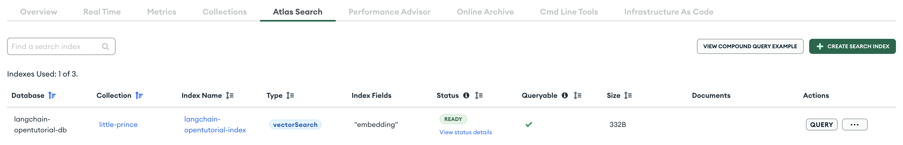

<style>
.custom {
    background-color: #008d8d;
    color: white;
    padding: 0.25em 0.5em 0.25em 0.5em;
    white-space: pre-wrap;       /* css-3 */
    white-space: -moz-pre-wrap;  /* Mozilla, since 1999 */
    white-space: -pre-wrap;      /* Opera 4-6 */
    white-space: -o-pre-wrap;    /* Opera 7 */
    word-wrap: break-word;
}

pre {
    background-color: #027c7c;
    padding-left: 0.5em;
}

</style>

# MongoDB Atlas

- Author: [Ivy Bae](https://github.com/ivybae)
- Peer Review :
- This is a part of [LangChain Open Tutorial](https://github.com/LangChain-OpenTutorial/LangChain-OpenTutorial)

[](https://colab.research.google.com/github/LangChain-OpenTutorial/LangChain-OpenTutorial/blob/main/09-VectorStore/07-MongoDB.ipynb) [](https://github.com/LangChain-OpenTutorial/LangChain-OpenTutorial/blob/main/09-VectorStore/07-MongoDB.ipynb)

## Overview

This tutorial covers the initial setup process for users who are new to **MongoDB Atlas**.

If you're already familiar with **MongoDB Atlas**, you can skip the [Initialization](#initialization) section.

All examples run on a free cluster, and once you add a **collection** to your database, you'll be ready to start.

You’ll learn preprocessing to preserve document structure after loading data from a **The Little Prince** file, how to add and delete documents to a **collection**, and manage vector store.

Once the documents added, you can learn how to query your data using **semantic search**, index updates for **filtering**, and **MQL operators**.

By the end of this tutorial, you'll be able to integrate **PyMongo with LangChain** and use VectorStore.

### Table of Contents

- [Overview](#overview)
- [Environement Setup](#environment-setup)
- [Initialization](#initialization)
- [Atlas Vector Search Indexes](#atlas-vector-search-indexes)
- [Vector Store](#vector-store)
- [Load Data](#load-data)
- [Data Preprocessing](#data-preprocessing)
- [Manage vector store](#manage-vector-store)
- [Query vector store](#query-vector-store)
- [CRUD Operations with PyMongo](#crud-operations-with-pymongo)

### References

- [Get Started with Atlas](https://www.mongodb.com/docs/atlas/getting-started/)
- [Deploy a Free Cluster](https://www.mongodb.com/docs/atlas/tutorial/deploy-free-tier-cluster/)
- [Connection Strings](https://www.mongodb.com/docs/manual/reference/connection-string/)
- [Atlas Search and Vector Search Indexes](https://www.mongodb.com/docs/languages/python/pymongo-driver/current/indexes/atlas-search-index/)
- [Review Atlas Search Index Syntax](https://www.mongodb.com/docs/atlas/atlas-search/index-definitions/)
- [JSON and BSON](https://www.mongodb.com/resources/basics/json-and-bson)
- [Write Data to MongoDB](https://www.mongodb.com/docs/languages/python/pymongo-driver/current/write-operations/)
- [Read Data from MongoDB](https://www.mongodb.com/docs/languages/python/pymongo-driver/current/read/)
- [Query Filter Documents](https://www.mongodb.com/docs/manual/core/document/#query-filter-documents)
- [Update Operators](https://www.mongodb.com/docs/manual/reference/operator/update/)
- [Integrate Atlas Vector Search with LangChain](https://www.mongodb.com/docs/atlas/atlas-vector-search/ai-integrations/langchain/)
- [Get Started with the LangChain Integration](https://www.mongodb.com/docs/atlas/atlas-vector-search/ai-integrations/langchain/get-started/)
- [Comparison Query Operators](https://www.mongodb.com/docs/manual/reference/operator/query-comparison/)
- [MongoDB Atlas](https://python.langchain.com/docs/integrations/vectorstores/mongodb_atlas/)
- [Document loaders](https://python.langchain.com/docs/concepts/document_loaders/)
- [Text splitters](https://python.langchain.com/docs/concepts/text_splitters/)

---


## Environment Setup

Set up the environment. You may refer to [Environment Setup](https://wikidocs.net/257836) for more details.

**[Note]**

- `langchain-opentutorial` is a package that provides a set of easy-to-use environment setup, useful functions and utilities for tutorials.
- You can checkout the [`langchain-opentutorial`](https://github.com/LangChain-OpenTutorial/langchain-opentutorial-pypi) for more details.


```python
%%capture --no-stderr
%pip install langchain-opentutorial
```

```python
# Install required packages
from langchain_opentutorial import package

package.install(
    [
        "langchain_openai",
        "langsmith",
        "langchain_core",
        "langchain_community",
        "langchain-mongodb",
        "pymongo",
        "certifi",
    ],
    verbose=False,
    upgrade=False,
)
```

<pre class="custom">
    [notice] A new release of pip is available: 24.1 -> 24.3.1
    [notice] To update, run: pip install --upgrade pip
</pre>

```python
# Set environment variables
from langchain_opentutorial import set_env

set_env(
    {
        "OPENAI_API_KEY": "",
        "LANGCHAIN_API_KEY": "",
        "MONGODB_ATLAS_CLUSTER_URI": "",
        "LANGCHAIN_TRACING_V2": "true",
        "LANGCHAIN_ENDPOINT": "https://api.smith.langchain.com",
        "LANGCHAIN_PROJECT": "07-MongoDB-Atlas",
    }
)
```

<pre class="custom">Environment variables have been set successfully.
</pre>

You can alternatively set API keys such as `OPENAI_API_KEY` in a `.env` file and load them.

[Note] This is not necessary if you've already set the required API keys in previous steps.

`MONGODB_ATLAS_CLUSTER_URI` is required to use **MongoDB Atlas** and is explained in the [Connect to your cluster](#connect-to-your-cluster).

If you are already using **MongoDB Atlas**, you can set the cluster **connection string** to `MONGODB_ATLAS_CLUSTER_URI` in your `.env` file.


```python
# Load API keys from .env file
from dotenv import load_dotenv

load_dotenv(override=True)
```


<pre class="custom">True</pre>


## Initialization

[MongoDB Atlas](https://www.mongodb.com/en/atlas) is a multi-cloud database service that provides an easy way to host and manage your data in the cloud.

After you register with and log in to **Atlas**, you can create a Free cluster.

**Atlas** can be started with [Atlas CLI](https://www.mongodb.com/docs/atlas/cli/current/atlas-cli-getting-started/) or **Atlas UI**.

**Atlas CLI** can be difficult to use if you're not used to working with development tools, so this tutorial will walk you through how to use **Atlas UI**.

### Deploy a cluster

Please select the appropriate project in your **Organization**. If the project doesn't exist, you'll need to create it.

If you select a project, you can create a cluster.


Follow the procedure below to deploy a cluster

- select **Cluster**: **M0** Free cluster option

> Note: You can deploy only one Free cluster per Atlas project

- select **Provider**: **M0** on AWS, GCP, and Azure

- select **Region**

- create a database user and add your IP address settings.

After you deploy a cluster, you can see the cluster you deployed as shown in the image below.


### Connect to your cluster

Click **Get connection string** in the image above to get the cluster URI and set the value of `MONGODB_ATLAS_CLUSTER_URI` in the `.env` file.

The **connection string** resembles the following example:

> mongodb+srv://[databaseUser]:[databasePassword]@[clusterName].[hostName].mongodb.net/?retryWrites=true&w=majority

Then go back to the [Environment Setup](#environment-setup) and run the `load_dotenv` function again.


### Initialize MongoDB python client

To integrate with LangChain, you need to connect to the cluster using [PyMongo](https://github.com/mongodb/mongo-python-driver), the MongoDB python driver.


```python
import os
import certifi
from pymongo import MongoClient

MONGODB_ATLAS_CLUSTER_URI = os.getenv("MONGODB_ATLAS_CLUSTER_URI")
client = MongoClient(MONGODB_ATLAS_CLUSTER_URI, tlsCAFile=certifi.where())
```

### Initialize database and collection

A **MongoDB database** stores a collections of documents.


```python
DB_NAME = "langchain-opentutorial-db"
COLLECTION_NAME = "little-prince"

database = client[DB_NAME]
collection_names = database.list_collection_names()
if COLLECTION_NAME not in collection_names:
    collection = database.create_collection(COLLECTION_NAME)
else:
    collection = database[COLLECTION_NAME]
```

You can **browse collections** to see the **little-prince** collection you just created and the sample data provided by Atlas.

- [available sample datasets](https://www.mongodb.com/docs/atlas/sample-data/#std-label-available-sample-datasets)


In this tutorial, we will use the **little-prince** collection in the **langchain-opentutorial-db** database.


## Atlas Vector Search Indexes

When performing vector search in Atlas, you must create an **Atlas Vector Search Index**.


### Retrieve a Search Index

- `list_search_indexes` : check if a **Search Index** with the same name exists.


```python
def is_index_exists(collection, index_name):
    search_indexes = collection.list_search_indexes()
    index_names = [search_index["name"] for search_index in search_indexes]
    return index_name in index_names
```

### Create a Search Index or Vector Search Index

You can define **Atlas Search Index** or **Atlas Vector Search Index** using `SearchIndexModel` object.

- `definition` : define the **Search Index**.

- `name` : query the **Search Index** by name.

To learn more about `definition` of `SearchIndexModel` , see [Review Atlas Search Index Syntax](https://www.mongodb.com/docs/atlas/atlas-search/index-definitions/).


```python
from pymongo.operations import SearchIndexModel

TEST_SEARCH_INDEX_NAME = "test_search_index"
TEST_VECTOR_SEARCH_INDEX_NAME = "test_vector_index"

search_index = SearchIndexModel(
    definition={
        "mappings": {"dynamic": True},
    },
    name=TEST_SEARCH_INDEX_NAME,
)

vector_index = SearchIndexModel(
    definition={
        "fields": [
            {
                "type": "vector",
                "numDimensions": 1536,
                "path": "embedding",
                "similarity": "cosine",
            }
        ]
    },
    name=TEST_VECTOR_SEARCH_INDEX_NAME,
    type="vectorSearch",
)
```

- `create_search_index` : create a single **Atlas Search Index** or **Atlas Vector Search Index**.

- `create_search_indexes` : create multiple indexes.


```python
def create_index(collection, index_name, model):
    if not is_index_exists(collection, index_name):
        collection.create_search_index(model)


create_index(collection, TEST_SEARCH_INDEX_NAME, search_index)
create_index(collection, TEST_VECTOR_SEARCH_INDEX_NAME, vector_index)
```

Click the **Atlas Search tab** to see the search indexes that you created.


### Update a Search Index

- `update_search_index` : update an **Atlas Search Index** or **Atlas Vector Search Index**.


```python
new_vector_index = {
    "fields": [
        {
            "type": "vector",
            "numDimensions": 1536,
            "path": "embedding",
            "similarity": "euclidean",
        }
    ]
}

collection.update_search_index(
    name=TEST_VECTOR_SEARCH_INDEX_NAME, definition=new_vector_index
)
```

If the update is successful, click **test_vector_index** in the list of **Index Name** on the **Atlas Search tab** to see more information.

You can see that the **Similarity Method** for the **Vector Field** has changed to **euclidean**.


You can also click the **Edit Index Definition** button on the right side of the **Atlas UI** to update it.


### Delete a Search Index

- `drop_search_index` : remove an **Atlas Search Index** or **Atlas Vector Search Index**.


```python
def delete_index(collection, index_name):
    if is_index_exists(collection, index_name):
        collection.drop_search_index(index_name)


delete_index(collection, TEST_SEARCH_INDEX_NAME)
delete_index(collection, TEST_VECTOR_SEARCH_INDEX_NAME)
```

## Vector Store

Create a vector store using `MongoDBAtlasVectorSearch` .

- `collection` : documents to store in the vector database

- `embedding` : use OpenAI `text-embedding-3-small` model

- `index_name` : index to use when querying the vector store.


```python
from langchain_openai import OpenAIEmbeddings
from langchain_mongodb import MongoDBAtlasVectorSearch

TUTORIAL_VECTOR_SEARCH_INDEX_NAME = "langchain-opentutorial-index"

embeddings = OpenAIEmbeddings(model="text-embedding-3-small")

vector_store = MongoDBAtlasVectorSearch(
    collection=collection,
    embedding=embeddings,
    index_name=TUTORIAL_VECTOR_SEARCH_INDEX_NAME,
    relevance_score_fn="cosine",
)
```

### Create a Index

- `create_vector_search_index` : Alternative to the above [Create a Search Index or Vector Search Index](#create-a-search-index-or-vector-search-index) section that creates a Vector Search Index.


```python
if not is_index_exists(collection, TUTORIAL_VECTOR_SEARCH_INDEX_NAME):
    vector_store.create_vector_search_index(dimensions=1536)
```

Click the **Atlas Search tab** to see the search index **langchain-opentutorial-index** that you created.




## Load Data

LangChain provides **Document loaders** that can load a variety of data sources.

### Document loaders

In this tutorial, we'll use `TextLoader` to add data from the **the_little_prince.txt** in the data directory to the **little-prince** collection.


```python
from langchain_community.document_loaders import TextLoader

loader = TextLoader("./data/the_little_prince.txt", encoding="utf-8")
documents = loader.load()
```

If you are working with large datasets, you can use `lazy_load` instead of the `load` method.

The `load` method returns **List[Document]**, so let's check for the first **Document** object.

- `metadata` : data associated with content

- `page_content` : string text

If you open the file **the_little_prince.txt** and compare the contents of the `page_content` , they are the same.


## Data Preprocessing

### Preserving text file structure

In the [Document loaders](#document-loaders) section above, `page_content` has all the text in the file assigned to it.

To preserve the structure of the text file, let's modify it to **split the file into chapters.**

**the_little_prince.txt** used **[ Chapter X ]** as a delimiter to separate the chapters.

- Create a `Document` by `chapter` .

- Add `chapter_index` to metadata

The **the_little_prince.txt** file has a preface before the start of Chapter 1, so add it as Chapter 0.


```python
from langchain_core.documents import Document

split_chapters = []
for _, doc in enumerate(documents):
    chapters = doc.page_content.split("[ Chapter ")
    if chapters:  # preface
        split_chapters.append(
            Document(
                page_content=chapters[0].strip(),
                metadata={"chapter": 0},
            )
        )

    for chapter_index, chapter in enumerate(chapters[1:], start=1):
        content = chapter.split(" ]")
        split_chapters.append(
            Document(
                page_content=content[-1].strip(), metadata={"chapter": chapter_index}
            )
        )
```

If you compare the `documents` to `split_chapters` , you can see that `page_content` is split by `chapter` .


```python
split_chapters[:2]
```


<pre class="custom">[Document(metadata={'chapter': 0}, page_content="The Little Prince\nWritten By Antoine de Saiot-Exupery (1900〜1944)\n\n[ Antoine de Saiot-Exupery ]\nOver the past century, the thrill of flying has inspired some to perform remarkable feats of daring. For others, their desire to soar into the skies led to dramatic leaps in technology. For Antoine de Saint-Exupéry, his love of aviation inspired stories, which have touched the hearts of millions around the world.\nBorn in 1900 in Lyons, France, young Antoine was filled with a passion for adventure. When he failed an entrance exam for the Naval Academy, his interest in aviation took hold. He joined the French Army Air Force in 1921 where he first learned to fly a plane. Five years later, he would leave the military in order to begin flying air mail between remote settlements in the Sahara desert.\nFor Saint-Exupéry, it was a grand adventure - one with dangers lurking at every corner. Flying his open cockpit biplane, Saint-Exupéry had to fight the desert's swirling sandstorms. Worse, still, he ran the risk of being shot at by unfriendly tribesmen below. Saint-Exupéry couldn't have been more thrilled. Soaring across the Sahara inspired him to spend his nights writing about his love affair with flying.\nWhen World War II broke out, Saint-Exupéry rejoined the French Air Force. After Nazi troops overtook France in 1940, Saint-Exupéry fled to the United States. He had hoped to join the U. S. war effort as a fighter pilot, but was dismissed because of his age. To console himself, he drew upon his experiences over the Saharan desert to write and illustrate what would become his most famous book, The Little Prince (1943). Mystical and enchanting, this small book has fascinated both children and adults for decades. In the book, a pilot is stranded in the midst of the Sahara where he meets a tiny prince from another world traveling the universe in order to understand life. In the book, the little prince discovers the true meaning of life. At the end of his conversation with the Little Prince, the aviator manages to fix his plane and both he and the little prince continue on their journeys \nShortly after completing the book, Saint-Exupéry finally got his wish. He returned to North Africa to fly a warplane for his country. On July 31, 1944, Saint-Exupéry took off on a mission. Sadly, he was never heard from again.\n\n[ TO LEON WERTH ]\nI ask the indulgence of the children who may read this book for dedicating it to a grown-up. I have a serious reason: he is the best friend I have in the world. I have another reason: this grown-up understands everything, even books about children. I have a third reason: he lives in France where he is hungry and cold. He needs cheering up. If all these reasons are not enough, I will dedicate the book to the child from whom this grown-up grew. All grown-ups were once children-- although few of them remember it. And so I correct my dedication: \nTO LEON WERTH WHEN HE WAS A LITTLE BOY"),
     Document(metadata={'chapter': 1}, page_content='- we are introduced to the narrator, a pilot, and his ideas about grown-ups\nOnce when I was six years old I saw a magnificent picture in a book, called True Stories from Nature, about the primeval forest. It was a picture of a boa constrictor in the act of swallowing an animal. Here is a copy of the drawing. \n(picture)\nIn the book it said: "Boa constrictors swallow their prey whole, without chewing it. After that they are not able to move, and they sleep through the six months that they need for digestion." \nI pondered deeply, then, over the adventures of the jungle. And after some work with a colored pencil I succeeded in making my first drawing. My Drawing Number One. It looked like this: \n(picture)\nI showed my masterpiece to the grown-ups, and asked them whether the drawing frightened them.\nBut they answered: "Frighten? Why should any one be frightened by a hat?" \nMy drawing was not a picture of a hat. It was a picture of a boa constrictor digesting an elephant. But since the grown-ups were not able to understand it, I made another drawing: I drew the inside of the boa constrictor, so that the grown-ups could see it clearly. They always need to have things explained. My Drawing Number Two looked like this: \n(picture)\nThe grown-ups‘ response, this time, was to advise me to lay aside my drawings of boa constrictors, whether from the inside or the outside, and devote myself instead to geography, history, arithmetic and grammar. That is why, at the age of six, I gave up what might have been a magnificent career as a painter. I had been disheartened by the failure of my Drawing Number One and my Drawing Number Two. Grown-ups never understand anything by themselves, and it is tiresome for children to be always and forever explaining things to them.\nSo then I chose another profession, and learned to pilot airplanes. I have flown a little over all parts of the world; and it is true that geography has been very useful to me. At a glance I can distinguish China from Arizona. If one gets lost in the night, such knowledge is valuable. \nIn the course of this life I have had a great many encounters with a great many people who have been concerned with matters of consequence. I have lived a great deal among grown-ups. I have seen them intimately, close at hand. And that hasn‘t much improved my opinion of them.\nWhenever I met one of them who seemed to me at all clear-sighted, I tried the experiment of showing him my Drawing Number One, which I have always kept. I would try to find out, so, if this was a person of true understanding. But, whoever it was, he, or she, would always say:\n"That is a hat."\nThen I would never talk to that person about boa constrictors, or primeval forests, or stars. I would bring myself down to his level. I would talk to him about bridge, and golf, and politics, and neckties. And the grown-up would be greatly pleased to have met such a sensible man.')]</pre>


### Text splitters

Splitting a `Document` into appropriately sized chunks allows you to process text data more efficiently.

To split a `Document` while preserving paragraph and sentence structure, use `RecursiveCharacterTextSplitter` .

- `chunk_size` : setting the maximum size of chunks

- `chunk_overlap` : setting the character overlap size between chunks


```python
from langchain_text_splitters import RecursiveCharacterTextSplitter

text_splitter = RecursiveCharacterTextSplitter(chunk_size=800, chunk_overlap=200)
split_documents = text_splitter.split_documents(split_chapters)
```

### Add metadata

Splitting the document into `chunk_size` increases the number of documents.

Add an `index` key to the metadata to identify the document index, since it is not split into one `Document` per chapter.


```python
for index, doc in enumerate(split_documents):
    doc.metadata.update({"index": index})
```

The `index` has been added to the metadata.

You can see that some of the `page_content` text in the `Document` overlaps, such as index 7 and index 8.


```python
split_documents[7:9]
```


<pre class="custom">[Document(metadata={'chapter': 1, 'index': 7}, page_content='- we are introduced to the narrator, a pilot, and his ideas about grown-ups\nOnce when I was six years old I saw a magnificent picture in a book, called True Stories from Nature, about the primeval forest. It was a picture of a boa constrictor in the act of swallowing an animal. Here is a copy of the drawing. \n(picture)\nIn the book it said: "Boa constrictors swallow their prey whole, without chewing it. After that they are not able to move, and they sleep through the six months that they need for digestion." \nI pondered deeply, then, over the adventures of the jungle. And after some work with a colored pencil I succeeded in making my first drawing. My Drawing Number One. It looked like this: \n(picture)'),
     Document(metadata={'chapter': 1, 'index': 8}, page_content='I pondered deeply, then, over the adventures of the jungle. And after some work with a colored pencil I succeeded in making my first drawing. My Drawing Number One. It looked like this: \n(picture)\nI showed my masterpiece to the grown-ups, and asked them whether the drawing frightened them.\nBut they answered: "Frighten? Why should any one be frightened by a hat?" \nMy drawing was not a picture of a hat. It was a picture of a boa constrictor digesting an elephant. But since the grown-ups were not able to understand it, I made another drawing: I drew the inside of the boa constrictor, so that the grown-ups could see it clearly. They always need to have things explained. My Drawing Number Two looked like this: \n(picture)')]</pre>


## Manage vector store

Now that you've initialized the `vector_store` and loaded the data, you can add and delete **Documents** to the **little-prince** collection.

### Add

- `add_documents` : Add **documents** to the `vector_store` and returns a List of IDs for the added documents.


```python
ids = vector_store.add_documents(documents=split_documents)
```

`delete` function allow specify the Document IDs to delete, so `ids` store the IDs of the added documents.

Check the first document ID. The number of **IDs** matches the number of **documents**, and each ID is a unique value.

In the image below, after adding **documents** the **STORAGE SIZE** of the collection increases and you can see the documents corresponding to each ID, such as `ids[0]` .


The `embedding` field is a **vector representation of the text** data. It is used to determine similarity to the query vector for vector search.


### Query Filter

Create a `Document` object, add it to a **collection**.


```python
from langchain_core.documents import Document

sample_document = Document(
    page_content="I am leveraging my experience as a developer to provide development education and nurture many new developers.",
    metadata={"source": "linkedin"},
)
sample_id = vector_store.add_documents([sample_document])
```

**TOTAL DOCUMENTS** has increased from 164 to 165.

On the last page, you can see the `page_content` of `sample_document` .

Alternatively, you can add **query filter**, such as the `source` field, to view the search results.


### Delete

You can specify the **document IDs to delete** as arguments to the `delete` function, such as `sample_id` .


```python
vector_store.delete(ids=sample_id)
```


<pre class="custom">True</pre>


If `True` returns, the deletion is successful.

You can see that **TOTAL DOCUMENTS** has decreasesd from 165 to 164 and that `sample_document` has been deleted.


## Query vector store

Make a `query` related to the content of The Little Prince and see if the `vector_store` returns results from a search for similar documents.

The `query` is based on the most well-known story about the relationship between the Little Prince and the Fox.


```python
query = "What does it mean to be tamed according to the fox?"
```

### Semantic Search

`similarity_search` method performs a basic semantic search

It returns a **List[Document]** ranked by relevance.


```python
vector_store.similarity_search(query=query)
```


<pre class="custom">[Document(metadata={'_id': '678d9f226d9526b32c474d66', 'chapter': 21, 'index': 123}, page_content='The fox gazed at the little prince, for a long time. \n(picture)\n"Please-- tame me!" he said. \n"I want to, very much," the little prince replied. "But I have not much time. I have friends to discover, and a great many things to understand." \n"One only understands the things that one tames," said the fox. "Men have no more time to understand anything. They buy things all ready made at the shops. But there is no shop anywhere where one can buy friendship, and so men have no friends any more. If you want a friend, tame me..." \n"What must I do, to tame you?" asked the little prince.'),
     Document(metadata={'_id': '678d9f226d9526b32c474d62', 'chapter': 21, 'index': 119}, page_content='"No," said the little prince. "I am looking for friends. What does that mean-- ‘tame‘?" \n"It is an act too often neglected," said the fox. It means to establish ties." \n"\'To establish ties\'?"\n"Just that," said the fox. "To me, you are still nothing more than a little boy who is just like a hundred thousand other little boys. And I have no need of you. And you, on your part, have no need of me. To you, I am nothing more than a fox like a hundred thousand other foxes. But if you tame me, then we shall need each other. To me, you will be unique in all the world. To you, I shall be unique in all the world..." \n"I am beginning to understand," said the little prince. "There is a flower... I think that she has tamed me..."'),
     Document(metadata={'_id': '678d9f226d9526b32c474d61', 'chapter': 21, 'index': 118}, page_content='"What does that mean-- ‘tame‘?" \n"You do not live here," said the fox. "What is it that you are looking for?" \n"I am looking for men," said the little prince. "What does that mean-- ‘tame‘?" \n"Men," said the fox. "They have guns, and they hunt. It is very disturbing. They also raise chickens. These are their only interests. Are you looking for chickens?" \n"No," said the little prince. "I am looking for friends. What does that mean-- ‘tame‘?" \n"It is an act too often neglected," said the fox. It means to establish ties." \n"\'To establish ties\'?"'),
     Document(metadata={'_id': '678d9f226d9526b32c474d64', 'chapter': 21, 'index': 121}, page_content='"My life is very monotonous," the fox said. "I hunt chickens; men hunt me. All the chickens are just alike, and all the men are just alike. And, in consequence, I am a little bored. But if you tame me, it will be as if the sun came to shine on my life . I shall know the sound of a step that will be different from all the others. Other steps send me hurrying back underneath the ground. Yours will call me, like music, out of my burrow. And then look: you see the grain-fields down yonder? I do not ea t bread. Wheat is of no use to me. The wheat fields have nothing to say to me. And that is sad. But you have hair that is the colour of gold. Think how wonderful that will be when you have tamed me! The grain, which is also golden, will bring me bac k the thought of you. And I shall love to')]</pre>


### Semantic Search with Score

`similarity_search_with_score` method also performs a semantic search.

The difference with the `similarity_search` method is that it returns a **relevance score** of documents between 0 and 1.

The `k` parameter in the example below specifies the number of documents. This is also supported by `similarity_search` method.


```python
vector_store.similarity_search_with_score(query=query, k=10)
```


<pre class="custom">[(Document(metadata={'_id': '678d9f226d9526b32c474d66', 'chapter': 21, 'index': 123}, page_content='The fox gazed at the little prince, for a long time. \n(picture)\n"Please-- tame me!" he said. \n"I want to, very much," the little prince replied. "But I have not much time. I have friends to discover, and a great many things to understand." \n"One only understands the things that one tames," said the fox. "Men have no more time to understand anything. They buy things all ready made at the shops. But there is no shop anywhere where one can buy friendship, and so men have no friends any more. If you want a friend, tame me..." \n"What must I do, to tame you?" asked the little prince.'),
      0.8046818971633911),
     (Document(metadata={'_id': '678d9f226d9526b32c474d62', 'chapter': 21, 'index': 119}, page_content='"No," said the little prince. "I am looking for friends. What does that mean-- ‘tame‘?" \n"It is an act too often neglected," said the fox. It means to establish ties." \n"\'To establish ties\'?"\n"Just that," said the fox. "To me, you are still nothing more than a little boy who is just like a hundred thousand other little boys. And I have no need of you. And you, on your part, have no need of me. To you, I am nothing more than a fox like a hundred thousand other foxes. But if you tame me, then we shall need each other. To me, you will be unique in all the world. To you, I shall be unique in all the world..." \n"I am beginning to understand," said the little prince. "There is a flower... I think that she has tamed me..."'),
      0.7951266765594482),
     (Document(metadata={'_id': '678d9f226d9526b32c474d61', 'chapter': 21, 'index': 118}, page_content='"What does that mean-- ‘tame‘?" \n"You do not live here," said the fox. "What is it that you are looking for?" \n"I am looking for men," said the little prince. "What does that mean-- ‘tame‘?" \n"Men," said the fox. "They have guns, and they hunt. It is very disturbing. They also raise chickens. These are their only interests. Are you looking for chickens?" \n"No," said the little prince. "I am looking for friends. What does that mean-- ‘tame‘?" \n"It is an act too often neglected," said the fox. It means to establish ties." \n"\'To establish ties\'?"'),
      0.7918555736541748),
     (Document(metadata={'_id': '678d9f226d9526b32c474d64', 'chapter': 21, 'index': 121}, page_content='"My life is very monotonous," the fox said. "I hunt chickens; men hunt me. All the chickens are just alike, and all the men are just alike. And, in consequence, I am a little bored. But if you tame me, it will be as if the sun came to shine on my life . I shall know the sound of a step that will be different from all the others. Other steps send me hurrying back underneath the ground. Yours will call me, like music, out of my burrow. And then look: you see the grain-fields down yonder? I do not ea t bread. Wheat is of no use to me. The wheat fields have nothing to say to me. And that is sad. But you have hair that is the colour of gold. Think how wonderful that will be when you have tamed me! The grain, which is also golden, will bring me bac k the thought of you. And I shall love to'),
      0.773917555809021),
     (Document(metadata={'_id': '678d9f226d9526b32c474d60', 'chapter': 21, 'index': 117}, page_content='- the little prince befriends the fox\nIt was then that the fox appeared.\n"Good morning," said the fox. \n"Good morning," the little prince responded politely, although when he turned around he saw nothing. \n"I am right here," the voice said, "under the apple tree." \n(picture)\n"Who are you?" asked the little prince, and added, "You are very pretty to look at." \n"I am a fox," said the fox. \n"Come and play with me," proposed the little prince. "I am so unhappy." \n"I cannot play with you," the fox said. "I am not tamed." \n"Ah! Please excuse me," said the little prince. \nBut, after some thought, he added: \n"What does that mean-- ‘tame‘?" \n"You do not live here," said the fox. "What is it that you are looking for?" \n"I am looking for men," said the little prince. "What does that mean-- ‘tame‘?"'),
      0.7720270156860352),
     (Document(metadata={'_id': '678d9f226d9526b32c474d67', 'chapter': 21, 'index': 124}, page_content='"What must I do, to tame you?" asked the little prince. \n"You must be very patient," replied the fox. "First you will sit down at a little distance from me-- like that-- in the grass. I shall look at you out of the corner of my eye, and you will say nothing. Words are the source of misunderstandings. But yo u will sit a little closer to me, every day..." \nThe next day the little prince came back.'),
      0.770125150680542),
     (Document(metadata={'_id': '678d9f226d9526b32c474d69', 'chapter': 21, 'index': 126}, page_content='"What is a rite?" asked the little prince. \n"Those also are actions too often neglected," said the fox. "They are what make one day different from other days, one hour from other hours. There is a rite, for example, among my hunters. Every Thursday they dance with the village girls. So Thursday is a wonderful day for me! I can take a walk as far as the vineyards. But if the hunters danced at just any time, every day would be like every other day, and I should never have any vacation at all." \nSo the little prince tamed the fox. And when the hour of his departure drew near-- \n"Ah," said the fox, "I shall cry." \n"It is your own fault," said the little prince. "I never wished you any sort of harm; but you wanted me to tame you..." \n"Yes, that is so," said the fox.'),
      0.7536178827285767),
     (Document(metadata={'_id': '678d9f226d9526b32c474d63', 'chapter': 21, 'index': 120}, page_content='"I am beginning to understand," said the little prince. "There is a flower... I think that she has tamed me..." \n"It is possible," said the fox. "On the Earth one sees all sorts of things." \n"Oh, but this is not on the Earth!" said the little prince. \nThe fox seemed perplexed, and very curious. \n"On another planet?" \n"Yes." \n"Are there hunters on this planet?" \n"No." \n"Ah, that is interesting! Are there chickens?" \n"No." \n"Nothing is perfect," sighed the fox. \nBut he came back to his idea.'),
      0.7314475178718567),
     (Document(metadata={'_id': '678d9f226d9526b32c474d6e', 'chapter': 21, 'index': 131}, page_content='"Men have forgotten this truth," said the fox. "But you must not forget it. You become responsible, forever, for what you have tamed. You are responsible for your rose..." \n"I am responsible for my rose," the little prince repeated, so that he would be sure to remember.'),
      0.7110254168510437),
     (Document(metadata={'_id': '678d9f226d9526b32c474d6a', 'chapter': 21, 'index': 127}, page_content='"Ah," said the fox, "I shall cry." \n"It is your own fault," said the little prince. "I never wished you any sort of harm; but you wanted me to tame you..." \n"Yes, that is so," said the fox. \n"But now you are going to cry!" said the little prince. \n"Yes, that is so," said the fox. \n"Then it has done you no good at all!" \n"It has done me good," said the fox, "because of the color of the wheat fields." And then he added: \n"Go and look again at the roses. You will understand now that yours is unique in all the world. Then come back to say goodbye to me, and I will make you a present of a secret." \nThe little prince went away, to look again at the roses.'),
      0.7037004232406616)]</pre>


### Semantic Search with Filtering

**MongoDB Atlas** supports pre-filtering your data using **MongoDB Query Language(MQL) Operators**.

You must update the index definition using `create_vector_search_index` .


```python
vector_store.create_vector_search_index(dimensions=1536, filters=["index"], update=True)
```

Compare the image below to when you first created the index in [Vector Store](#vector-store).

Notice that `index` have been added to the **Index Fields** and **Documents** have been added as well.


There are **comparison query operators** that find values that match a condition.

For example, the `$eq` operator finds **documents** that match a specified value.

Now you can add a `pre_filter` condition that documents **index** are lower than or equal to 123 using the `$lte` operator.


```python
vector_store.similarity_search_with_score(
    query=query, k=10, pre_filter={"index": {"$lte": 123}}
)
```


<pre class="custom">[(Document(metadata={'_id': '678d9f226d9526b32c474d66', 'chapter': 21, 'index': 123}, page_content='The fox gazed at the little prince, for a long time. \n(picture)\n"Please-- tame me!" he said. \n"I want to, very much," the little prince replied. "But I have not much time. I have friends to discover, and a great many things to understand." \n"One only understands the things that one tames," said the fox. "Men have no more time to understand anything. They buy things all ready made at the shops. But there is no shop anywhere where one can buy friendship, and so men have no friends any more. If you want a friend, tame me..." \n"What must I do, to tame you?" asked the little prince.'),
      0.8046818971633911),
     (Document(metadata={'_id': '678d9f226d9526b32c474d62', 'chapter': 21, 'index': 119}, page_content='"No," said the little prince. "I am looking for friends. What does that mean-- ‘tame‘?" \n"It is an act too often neglected," said the fox. It means to establish ties." \n"\'To establish ties\'?"\n"Just that," said the fox. "To me, you are still nothing more than a little boy who is just like a hundred thousand other little boys. And I have no need of you. And you, on your part, have no need of me. To you, I am nothing more than a fox like a hundred thousand other foxes. But if you tame me, then we shall need each other. To me, you will be unique in all the world. To you, I shall be unique in all the world..." \n"I am beginning to understand," said the little prince. "There is a flower... I think that she has tamed me..."'),
      0.7951266765594482),
     (Document(metadata={'_id': '678d9f226d9526b32c474d61', 'chapter': 21, 'index': 118}, page_content='"What does that mean-- ‘tame‘?" \n"You do not live here," said the fox. "What is it that you are looking for?" \n"I am looking for men," said the little prince. "What does that mean-- ‘tame‘?" \n"Men," said the fox. "They have guns, and they hunt. It is very disturbing. They also raise chickens. These are their only interests. Are you looking for chickens?" \n"No," said the little prince. "I am looking for friends. What does that mean-- ‘tame‘?" \n"It is an act too often neglected," said the fox. It means to establish ties." \n"\'To establish ties\'?"'),
      0.7918555736541748),
     (Document(metadata={'_id': '678d9f226d9526b32c474d64', 'chapter': 21, 'index': 121}, page_content='"My life is very monotonous," the fox said. "I hunt chickens; men hunt me. All the chickens are just alike, and all the men are just alike. And, in consequence, I am a little bored. But if you tame me, it will be as if the sun came to shine on my life . I shall know the sound of a step that will be different from all the others. Other steps send me hurrying back underneath the ground. Yours will call me, like music, out of my burrow. And then look: you see the grain-fields down yonder? I do not ea t bread. Wheat is of no use to me. The wheat fields have nothing to say to me. And that is sad. But you have hair that is the colour of gold. Think how wonderful that will be when you have tamed me! The grain, which is also golden, will bring me bac k the thought of you. And I shall love to'),
      0.773917555809021),
     (Document(metadata={'_id': '678d9f226d9526b32c474d60', 'chapter': 21, 'index': 117}, page_content='- the little prince befriends the fox\nIt was then that the fox appeared.\n"Good morning," said the fox. \n"Good morning," the little prince responded politely, although when he turned around he saw nothing. \n"I am right here," the voice said, "under the apple tree." \n(picture)\n"Who are you?" asked the little prince, and added, "You are very pretty to look at." \n"I am a fox," said the fox. \n"Come and play with me," proposed the little prince. "I am so unhappy." \n"I cannot play with you," the fox said. "I am not tamed." \n"Ah! Please excuse me," said the little prince. \nBut, after some thought, he added: \n"What does that mean-- ‘tame‘?" \n"You do not live here," said the fox. "What is it that you are looking for?" \n"I am looking for men," said the little prince. "What does that mean-- ‘tame‘?"'),
      0.7720270156860352),
     (Document(metadata={'_id': '678d9f226d9526b32c474d63', 'chapter': 21, 'index': 120}, page_content='"I am beginning to understand," said the little prince. "There is a flower... I think that she has tamed me..." \n"It is possible," said the fox. "On the Earth one sees all sorts of things." \n"Oh, but this is not on the Earth!" said the little prince. \nThe fox seemed perplexed, and very curious. \n"On another planet?" \n"Yes." \n"Are there hunters on this planet?" \n"No." \n"Ah, that is interesting! Are there chickens?" \n"No." \n"Nothing is perfect," sighed the fox. \nBut he came back to his idea.'),
      0.7314475178718567),
     (Document(metadata={'_id': '678d9f226d9526b32c474d20', 'chapter': 8, 'index': 53}, page_content='And the little prince, completely abashed, went to look for a sprinkling-can of fresh water. So, he tended the flower. \n(picture)\nSo, too, she began very quickly to torment him with her vanity-- which was, if the truth be known, a little difficult to deal with. One day, for instance, when she was speaking of her four thorns, she said to the little prince: \n"Let the tigers come with their claws!" \n"There are no tigers on my planet," the little prince objected. "And, anyway, tigers do not eat weeds." \n"I am not a weed," the flower replied, sweetly. \n"Please excuse me..."\n"I am not at all afraid of tigers," she went on, "but I have a horror of drafts. I suppose you wouldn‘t have a screen for me?"'),
      0.6490210890769958),
     (Document(metadata={'_id': '678d9f226d9526b32c474d27', 'chapter': 9, 'index': 60}, page_content='"But the wind--" \n"My cold is not so bad as all that... the cool night air will do me good. I am a flower." \n"But the animals--" \n"Well, I must endure the presence of two or three caterpillars if I wish to become acquainted with the butterflies. It seems that they are very beautiful. And if not the butterflies-- and the caterpillars-- who will call upon me? You will be far away... as for the large animals-- I am not at all afraid of any of them. I have my claws." \nAnd, naïvely, she showed her four thorns. Then she added: \n"Don‘t linger like this. You have decided to go away. Now go!" \nFor she did not want him to see her crying. She was such a proud flower...'),
      0.6461950540542603),
     (Document(metadata={'_id': '678d9f226d9526b32c474d01', 'chapter': 3, 'index': 22}, page_content='After a reflective silence he answered: \n"The thing that is so good about the box you have given me is that at night he can use it as his house." \n"That is so. And if you are good I will give you a string, too, so that you can tie him during the day, and a post to tie him to." \nBut the little prince seemed shocked by this offer: \n"Tie him! What a queer idea!" \n"But if you don‘t tie him," I said, "he will wander off somewhere, and get lost." \nMy friend broke into another peal of laughter: "But where do you think he would go?" \n"Anywhere. Straight ahead of him." \nThen the little prince said, earnestly: \n"That doesn‘t matter. Where I live, everything is so small!" \nAnd, with perhaps a hint of sadness, he added: \n"Straight ahead of him, nobody can go very far..."'),
      0.6453869938850403),
     (Document(metadata={'_id': '678d9f226d9526b32c474d15', 'chapter': 7, 'index': 42}, page_content='- the narrator learns about the secret of the little prince‘s life \nOn the fifth day-- again, as always, it was thanks to the sheep-- the secret of the little prince‘s life was revealed to me. Abruptly, without anything to lead up to it, and as if the question had been born of long and silent meditation on his problem, he demanded: \n"A sheep-- if it eats little bushes, does it eat flowers, too?"\n"A sheep," I answered, "eats anything it finds in its reach."\n"Even flowers that have thorns?"\n"Yes, even flowers that have thorns." \n"Then the thorns-- what use are they?"'),
      0.6451370716094971)]</pre>


## CRUD Operations with PyMongo

Let's use **PyMongo Collection** instead of `MongoDBAtlasVectorSearch` for our **Document CRUD Operations**.

### Setting up with an empty collection

Delete all documents in `vector_store` and start with an empty collection.

- `delete` : If you don't specify an ID, all documents added to the collection are deleted.


```python
vector_store.delete()
```


<pre class="custom">True</pre>


If `True` returns, the deletion is successful.

You can see that **TOTAL DOCUMENTS** has decreasesd to 0.


### Binary JSON(BSON) Document

**BSON**, the binary representation of **JSON**, is primarily used internally by MongoDB.

- Faster traversal compared to **JSON**.

- `RawBSONDocument` : represent BSON document using the raw bytes.


```python
from typing import List, Iterable
from bson import encode
from bson.raw_bson import RawBSONDocument
from langchain_core.documents import Document


def convert_document_to_raw_bson(
    document: Document,
) -> RawBSONDocument:
    document_dict = {
        "page_content": document.page_content,
        "metadata": document.metadata,
    }
    return RawBSONDocument(encode(document_dict))


def convert_documents_to_raw_bson(
    documents: List[Document],
) -> Iterable[RawBSONDocument]:
    for document in documents:
        yield convert_document_to_raw_bson(document)
```

### Insert

- `insert_one` : add a single document.

- `insert_many` : add multiple documents.


```python
sample_document_bson = convert_document_to_raw_bson(sample_document)
collection.insert_one(sample_document_bson)
```


<pre class="custom">InsertOneResult(None, acknowledged=True)</pre>


```python
split_documents_bson = convert_documents_to_raw_bson(split_documents)
collection.insert_many(documents=split_documents_bson)
```


<pre class="custom">InsertManyResult([], acknowledged=True)</pre>


### Read with Evaluation Operators

To compare the equality, use `<field>` : `<value>` expression .

You can also use [evaluation operators](https://www.mongodb.com/docs/languages/python/pymongo-driver/current/read/specify-a-query/#evaluation-operators) to perform operations.

For example, `$regex` operator returns documents that match a regular expression.

- `fox_query_filter` : find all documents inclues the string `fox` in the `page_content` field.

- `find_one` : retrieve the first document that matches the condition.


```python
fox_query_filter = {"page_content": {"$regex": "fox"}}

collection.find_one(filter=fox_query_filter)
```


<pre class="custom">{'_id': ObjectId('678da0ff4352fdc7a3be6a02'),
     'page_content': '- the little prince befriends the fox\nIt was then that the fox appeared.\n"Good morning," said the fox. \n"Good morning," the little prince responded politely, although when he turned around he saw nothing. \n"I am right here," the voice said, "under the apple tree." \n(picture)\n"Who are you?" asked the little prince, and added, "You are very pretty to look at." \n"I am a fox," said the fox. \n"Come and play with me," proposed the little prince. "I am so unhappy." \n"I cannot play with you," the fox said. "I am not tamed." \n"Ah! Please excuse me," said the little prince. \nBut, after some thought, he added: \n"What does that mean-- ‘tame‘?" \n"You do not live here," said the fox. "What is it that you are looking for?" \n"I am looking for men," said the little prince. "What does that mean-- ‘tame‘?"',
     'metadata': {'chapter': 21, 'index': 117}}</pre>


- `find` : updates all documents that match the condition. Passing an empty filter will return all documents.


```python
cursor = collection.find(filter=fox_query_filter)

fox_story_documents = []
for doc in cursor:
    fox_story_documents.append(doc)
len(fox_story_documents)
```


<pre class="custom">19</pre>


### Update with query filter

You can use [update operators](https://www.mongodb.com/docs/manual/reference/operator/update/) to perform operations.

For example, `$set` operator sets the value of a field in a document.

- `preface_query_filter` : find all documents with the value `0` in the `metadata.chapter` field.

- `update_operation` : updates `0` in the document's `metadata.chapter` to `-1` .


```python
preface_query_filter = {"metadata.chapter": 0}
update_operation = {"$set": {"metadata.chapter": -1}}
```

- `update_one` : updates the first document that matches the condition.

- `update_many` : updates all documents that match the condition.


```python
updateOneResult = collection.update_one(preface_query_filter, update_operation)
updateManyResult = collection.update_many(preface_query_filter, update_operation)
```

`update_one` and `update_many` return `UpdateResult` object that contains the properties below:

- `matched_count` : The number of documents that matched the query filter.

- `modified_count` : The number of documents modified.


```python
print(
    f"matched: {updateOneResult.matched_count}, modified: {updateOneResult.modified_count}"
)
print(
    f"matched: {updateManyResult.matched_count}, modified: {updateManyResult.modified_count}"
)
```

<pre class="custom">matched: 1, modified: 1
    matched: 6, modified: 6
</pre>

### Upsert option

If you set the `upsert` to `True` in update operation, inserts a new document if no document matches the query filter.

- `source_query_filter` : find all documents with the value `facebook` in the `metadata.source` field.

- `upsert_operation` : updates `facebook` in the document's `metadata.source` to `book` .


```python
source_query_filter = {"metadata.source": "facebook"}
upsert_operation = {"$set": {"metadata.source": "book"}}
upsertResult = collection.update_many(
    source_query_filter, upsert_operation, upsert=True
)
print(
    f"matched: {upsertResult.matched_count}, modified: {upsertResult.modified_count}, upserted_id: {upsertResult.upserted_id}"
)
```

<pre class="custom">matched: 0, modified: 0, upserted_id: 678da1104352fdc7a3be6a31
</pre>

### Delete with query filter

- `delete_one` : deletes the first document that matches the condition.

- `delete_many` : deletes all documents that match the condition.

`delete_one` and `delete_many` return `DeleteResult` object.

- `deleted_count` : The number of documents deleted.


```python
deleteOneResult = collection.delete_one(
    fox_query_filter, comment="Deleting the first document containing fox"
)
deleteManyResult = collection.delete_many(
    fox_query_filter, comment="Deleting the documents containing fox"
)

print(
    f"delete_one deleted: {deleteOneResult.deleted_count}, delete_many deleted: {deleteManyResult.deleted_count}"
)
```

<pre class="custom">delete_one deleted: 1, delete_many deleted: 18
</pre>
