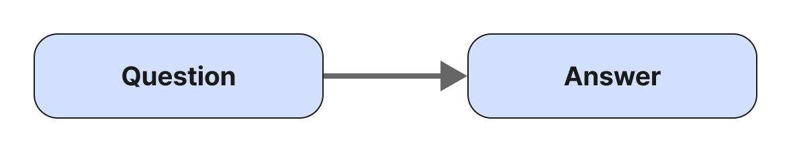
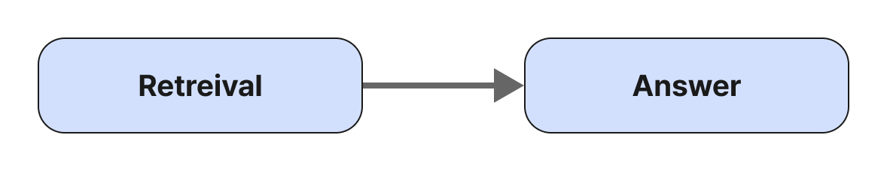

<style>
.custom {
    background-color: #008d8d;
    color: white;
    padding: 0.25em 0.5em 0.25em 0.5em;
    white-space: pre-wrap;       /* css-3 */
    white-space: -moz-pre-wrap;  /* Mozilla, since 1999 */
    white-space: -pre-wrap;      /* Opera 4-6 */
    white-space: -o-pre-wrap;    /* Opera 7 */
    word-wrap: break-word;
}

pre {
    background-color: #027c7c;
    padding-left: 0.5em;
}

</style>

# LangSmith-Dataset 

- Author: [Minji](https://github.com/r14minji)
- Design: 
- Peer Review: 
- This is a part of [LangChain Open Tutorial](https://github.com/LangChain-OpenTutorial/LangChain-OpenTutorial)

[](https://colab.research.google.com/github/LangChain-OpenTutorial/LangChain-OpenTutorial/blob/main/99-TEMPLATE/00-BASE-TEMPLATE-EXAMPLE.ipynb) [](https://github.com/LangChain-OpenTutorial/LangChain-OpenTutorial/blob/main/99-TEMPLATE/00-BASE-TEMPLATE-EXAMPLE.ipynb)

## Overview

The notebook demonstrates how to create a dataset for evaluating Retrieval-Augmented Generation (RAG) models using LangSmith. It includes steps for setting up environment variables, creating datasets with questions and answers, and uploading examples to LangSmith for testing. Additionally, it provides instructions on using HuggingFace datasets and updating datasets with new examples.

### Table of Contents

- [Overview](#overview)
- [Environment Setup](#environment-setup)
- [Creating a LangSmith Dataset](#creating-a-langsmith-dataset)
- [Creating Examples for LangSmith Dataset](#creating-examples-for-langsmith-dataset)
- [Creating a Dataset for LangSmith Testing](#creating-a-dataset-for-langsmith-testing)


### References

- [LangChain](https://blog.langchain.dev/)
- [LangSmith](https://docs.smith.langchain.com)
----

## Environment Setup

Setting up your environment is the first step. See the [Environment Setup](https://wikidocs.net/257836) guide for more details.


**[Note]**

The langchain-opentutorial is a package of easy-to-use environment setup guidance, useful functions and utilities for tutorials.
Check out the  [`langchain-opentutorial`](https://github.com/LangChain-OpenTutorial/langchain-opentutorial-pypi) for more details.

```python
%%capture --no-stderr
%pip install langchain-opentutorial
```

```python
# Install required packages
from langchain_opentutorial import package

package.install(
    [
        "langsmith",
        "langchain",
    ],
    verbose=False,
    upgrade=False,
)
```

<pre class="custom">
    [notice] A new release of pip is available: 24.3.1 -> 25.0
    [notice] To update, run: pip install --upgrade pip
</pre>

You can set API keys in a `.env` file or set them manually.

[Note] If you’re not using the `.env` file, no worries! Just enter the keys directly in the cell below, and you’re good to go.

```python
from dotenv import load_dotenv
from langchain_opentutorial import set_env

# Attempt to load environment variables from a .env file; if unsuccessful, set them manually.
if not load_dotenv():
    set_env(
        {
            "OPENAI_API_KEY": "",
            "LANGCHAIN_API_KEY": "",
            "LANGCHAIN_TRACING_V2": "true",
            "LANGCHAIN_ENDPOINT": "https://api.smith.langchain.com",
            "LANGCHAIN_PROJECT": "04-LangSmith-Dataset ",  # set the project name same as the title
            "HUGGINGFACEHUB_API_TOKEN": "",
        }
    )
```

You can alternatively set API keys such as `OPENAI_API_KEY` in a `.env` file and load them.

[Note] This is not necessary if you've already set the required API keys in previous steps.

```python
# Configuration file to manage the API KEY as an environment variable
from dotenv import load_dotenv

# Load API KEY information
load_dotenv(override=True)
```


<pre class="custom">True</pre>


## Creating a LangSmith Dataset

Let's learn how to build a custom RAG evaluation dataset.

To construct a dataset, you need to understand three main processes:

Case: Evaluating whether the retrieval is relevant to the question

> Question - Retrieval


Case: Evaluating whether the answer is relevant to the question

> Question - Answer



Case: Checking if the answer is based on the retrieved documents (Hallucination Check)

> Retrieval - Answer



Thus, you typically need `Question`, `Retrieval`, and `Answer` information. However, it is practically challenging to construct ground truth for `Retrieval`.


If ground truth for `Retrieval` exists, you can save and use it all in your dataset. Otherwise, you can create and use a dataset with only `Question` and `Answer`

## Creating Examples for LangSmith Dataset

Use `inputs` and `outputs` to create a dataset.

The dataset consists of `questions` and `answers`.

```python
import pandas as pd

# List of questions and answers
inputs = [
    "What is the name of the generative AI created by Samsung Electronics?",
    "On what date did U.S. President Biden issue an executive order ensuring safe and trustworthy AI development and usage?",
    "Please briefly describe Cohere's data provenance explorer."
]

# List of corresponding answers
outputs = [
    "The name of the generative AI created by Samsung Electronics is Samsung Gauss.",
    "On October 30, 2023, U.S. President Biden issued an executive order.",
    "Cohere's data provenance explorer is a platform that tracks the sources and licensing status of datasets used for training AI models, ensuring transparency. It collaborates with 12 organizations and provides source information for over 2,000 datasets, helping developers understand data composition and lineage.",
]

# Create question-answer pairs
qa_pairs = [{"question": q, "answer": a} for q, a in zip(inputs, outputs)]

# Convert to a DataFrame
df = pd.DataFrame(qa_pairs)

# Display the DataFrame,
df.head()
```


<div>
<style scoped>
    .dataframe tbody tr th:only-of-type {
        vertical-align: middle;
    }

    .dataframe tbody tr th {
        vertical-align: top;
    }

    .dataframe thead th {
        text-align: right;
    }
</style>
<table border="1" class="dataframe">
  <thead>
    <tr style="text-align: right;">
      <th></th>
      <th>question</th>
      <th>answer</th>
    </tr>
  </thead>
  <tbody>
    <tr>
      <th>0</th>
      <td>What is the name of the generative AI created ...</td>
      <td>The name of the generative AI created by Samsu...</td>
    </tr>
    <tr>
      <th>1</th>
      <td>On what date did U.S. President Biden issue an...</td>
      <td>On October 30, 2023, U.S. President Biden issu...</td>
    </tr>
    <tr>
      <th>2</th>
      <td>Please briefly describe Cohere's data provenan...</td>
      <td>Cohere's data provenance explorer is a platfor...</td>
    </tr>
  </tbody>
</table>
</div>


Alternatively, you can use the Synthetic Dataset generated in a previous tutorial.

The code below shows an example of using an uploaded HuggingFace Dataset.

```python
%pip install -qU datasets
```

<pre class="custom">
    [notice] A new release of pip is available: 24.3.1 -> 25.0
    [notice] To update, run: pip install --upgrade pip
    Note: you may need to restart the kernel to use updated packages.
</pre>

After installing the package, you may need to restart the kernel for the changes to take effect. This is because newly installed packages might not be recognized immediately in the current session.

In Google Colab, you must run %pip install each time you start a new session, even if you installed the package before. Colab environments are temporary, so installed packages are lost when the session restarts.

```python
from datasets import load_dataset
import os

# Set dataset name (change to your desired name)
huggingface_id = ""  # Your Hugging Face username(ID)
dataset_name = f"{huggingface_id}/rag-synthetic-dataset"

# Download dataset from HuggingFace Dataset using the repo_id
dataset = load_dataset(
    dataset_name,
    token=os.environ["HUGGINGFACEHUB_API_TOKEN"], 
)

# View dataset by split
huggingface_df = dataset["test_v1"].to_pandas()
huggingface_df.head()
```


<pre class="custom">README.md:   0%|          | 0.00/408 [00:00<?, ?B/s]</pre>


    test_v1-00000-of-00001.parquet:   0%|          | 0.00/21.1k [00:00<?, ?B/s]


    Generating test_v1 split:   0%|          | 0/10 [00:00<?, ? examples/s]


<div>
<style scoped>
    .dataframe tbody tr th:only-of-type {
        vertical-align: middle;
    }

    .dataframe tbody tr th {
        vertical-align: top;
    }

    .dataframe thead th {
        text-align: right;
    }
</style>
<table border="1" class="dataframe">
  <thead>
    <tr style="text-align: right;">
      <th></th>
      <th>user_input</th>
      <th>reference_contexts</th>
      <th>reference</th>
      <th>synthesizer_name</th>
    </tr>
  </thead>
  <tbody>
    <tr>
      <th>0</th>
      <td>Wht is an API?</td>
      <td>["Agents\nThis combination of reasoning,\nlogi...</td>
      <td>An API can be used by a model to make various ...</td>
      <td>single_hop_specifc_query_synthesizer</td>
    </tr>
    <tr>
      <th>1</th>
      <td>What are the three essential components in an ...</td>
      <td>['Agents\nWhat is an agent?\nIn its most funda...</td>
      <td>The three essential components in an agent's c...</td>
      <td>single_hop_specifc_query_synthesizer</td>
    </tr>
    <tr>
      <th>2</th>
      <td>What Chain-of-Thought do in agent model, how i...</td>
      <td>['Agents\nFigure 1. General agent architecture...</td>
      <td>Chain-of-Thought is a reasoning and logic fram...</td>
      <td>single_hop_specifc_query_synthesizer</td>
    </tr>
    <tr>
      <th>3</th>
      <td>Waht is the DELETE method used for?</td>
      <td>['Agents\nThe tools\nFoundational models, desp...</td>
      <td>The DELETE method is a common web API method t...</td>
      <td>single_hop_specifc_query_synthesizer</td>
    </tr>
    <tr>
      <th>4</th>
      <td>How do foundational components contribute to t...</td>
      <td>['&lt;1-hop&gt;\n\nAgents\ncombining specialized age...</td>
      <td>Foundational components contribute to the cogn...</td>
      <td>NewMultiHopQuery</td>
    </tr>
  </tbody>
</table>
</div>


## Creating a Dataset for LangSmith Testing

- Create a new dataset under `Datasets & Testing`.


You can also create a dataset directly using the LangSmith UI from a CSV file.

For more details, refer to the documentation below:

- [LangSmith UI Documentation](https://docs.smith.langchain.com/observability/how_to_guides/tracing/upload_files_with_traces)


```python
from langsmith import Client

client = Client()
dataset_name = "RAG_EVAL_DATASET"


# Function to create a dataset
def create_dataset(client, dataset_name, description=None):
    for dataset in client.list_datasets():
        if dataset.name == dataset_name:
            return dataset

    dataset = client.create_dataset(
        dataset_name=dataset_name,
        description=description,
    )
    return dataset


# Create dataset
dataset = create_dataset(client, dataset_name)

# Add examples to the created dataset
client.create_examples(
    inputs=[{"question": q} for q in df["question"].tolist()],
    outputs=[{"answer": a} for a in df["answer"].tolist()],
    dataset_id=dataset.id,
)

```

You can add examples to the dataset later.

```python
# New list of questions
new_questions = [
    "What is the name of the generative AI created by Samsung Electronics?",
    "Is it true that Google invested $2 billion in Teddynote?",
]

# New list of corresponding answers
new_answers = [
    "The name of the generative AI created by Samsung Electronics is Teddynote.",
    "This is not true. Google agreed to invest up to $2 billion in Anthropic, starting with $500 million and planning to invest an additional $1.5 billion in the future.",
]

# Verify the updated version in the UI
client.create_examples(
    inputs=[{"question": q} for q in new_questions],
    outputs=[{"answer": a} for a in new_answers],
    dataset_id=dataset.id,
)

```

Congratulations! The dataset is now ready.
