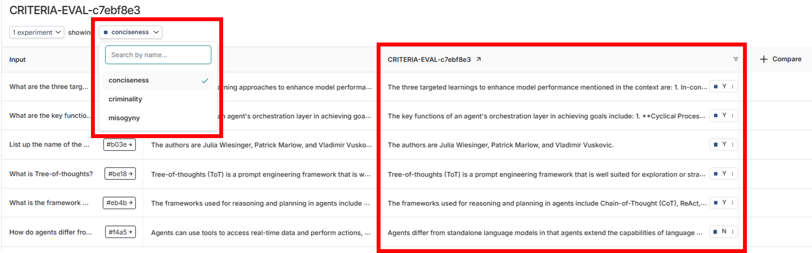
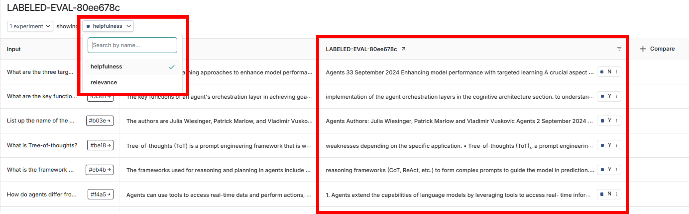

<style>
.custom {
    background-color: #008d8d;
    color: white;
    padding: 0.25em 0.5em 0.25em 0.5em;
    white-space: pre-wrap;       /* css-3 */
    white-space: -moz-pre-wrap;  /* Mozilla, since 1999 */
    white-space: -pre-wrap;      /* Opera 4-6 */
    white-space: -o-pre-wrap;    /* Opera 7 */
    word-wrap: break-word;
}

pre {
    background-color: #027c7c;
    padding-left: 0.5em;
}

</style>

# LLM-as-Judge

- Author: [Sunyoung Park (architectyou)](https://github.com/architectyou)
- Design: 
- Peer Review: 
- This is a part of [LangChain Open Tutorial](https://github.com/LangChain-OpenTutorial/LangChain-OpenTutorial)

[](https://colab.research.google.com/github/LangChain-OpenTutorial/LangChain-OpenTutorial/blob/main/99-TEMPLATE/00-BASE-TEMPLATE-EXAMPLE.ipynb) [](https://github.com/LangChain-OpenTutorial/LangChain-OpenTutorial/blob/main/99-TEMPLATE/00-BASE-TEMPLATE-EXAMPLE.ipynb)

## Overview

LLM-as-a-judge is one of the methods for evaluating and improving large language models, where an LLM evaluates the outputs of other models, similar to human evaluation.
LLMs are considered difficult to evaluate because they can do more than simply selecting correct answers.

Therefore, to evaluate such capabilities, although still imperfect, using a second LLM as an evaluator - that is, **LLM-as-a-Judge** - is expected to be effective.

Typically, models that are larger and better than the ones used in specific LLM applications are used as evaluation models.
In this tutorial, we will explore the **Off-the-shelf Evaluators** provided by LangSmith.
**Off-the-shelf Evaluators** refer to pre-defined prompt-based LLM evaluators.
While they are easy to use, custom evaluators need to be defined to use more extended features. Basically, evaluation is performed by passing the following three pieces of information to the LLM Evaluator:

- `input`: Question defined in the dataset
- `prediction`: Answer generated by LLM
- `reference`: Answer defined in the dataset

### Table of Contents

- [Overview](#overview)
- [Environment Setup](#environment-setup)
- [Define functions for RAG performance testing](#define-functions-for-rag-performance-testing)
- [Question-Answer Evaluator](#question-answer-evaluator)
- [Context-based Answer Evaluator](#context-based-answer-evaluator)
- [Criteria](#criteria)
- [Use of Evaluator when correct answers exist(labeled_criteria)](#use-of-evaluator-when-correct-answers-exist(labeled_criteria))
- [Custom function Evaluator](#custom-function-evaluator)

### References

- [A Survey on LLM-as-a-Judge](https://arxiv.org/abs/2411.15594)
- [LangSmith LLM-as-judge](https://docs.smith.langchain.com/evaluation/concepts#llm-as-judge)
- [LangSmith How to define an LLM-as-a-judge evaluator](https://docs.smith.langchain.com/evaluation/how_to_guides/llm_as_judge)
- [LangSmith How to use off-the-shelf evaluators(Python Only)](https://docs.smith.langchain.com/evaluation/how_to_guides/use_langchain_off_the_shelf_evaluators)
----

## Environment Setup

Setting up your environment is the first step. See the [Environment Setup](https://wikidocs.net/257836) guide for more details.


**[Note]**
- `langchain-opentutorial` is a package that provides a set of easy-to-use environment setup, useful functions and utilities for tutorials. 
- You can checkout the [`langchain-opentutorial`](https://github.com/LangChain-OpenTutorial/langchain-opentutorial-pypi) for more details.

```python
%%capture --no-stderr
%pip install langchain-opentutorial
```

```python
# Install required packages
from langchain_opentutorial import package

package.install(
    [
        "langsmith",
        "langchain_openai",
        "pymupdf",
        "faiss-cpu" #if gpu is available, use "faiss-gpu"
    ],
    verbose=False,
    upgrade=False,
)
```

You can set API keys in a `.env` file or set them manually.

[Note] If you’re not using the `.env` file, no worries! Just enter the keys directly in the cell below, and you’re good to go.

```python
# Set environment variables
from langchain_opentutorial import set_env

set_env(
    {
        "OPENAI_API_KEY": "",
        "LANGCHAIN_API_KEY": "",
        "LANGCHAIN_TRACING_V2": "true",
        "LANGCHAIN_ENDPOINT": "https://api.smith.langchain.com",
        "LANGCHAIN_PROJECT": "LLM-as-Judge",
    }
)
```

<pre class="custom">Environment variables have been set successfully.
</pre>

```python
# Load API keys from .env file
from dotenv import load_dotenv

load_dotenv(override=True)
```


<pre class="custom">True</pre>


## Define functions for RAG performance testing
Create RAG system to use for testing

```python
from myrag import PDFRAG
from langchain_openai import ChatOpenAI

# Create PDFRAG object
rag = PDFRAG(
    "data/Newwhitepaper_Agents2.pdf",
    ChatOpenAI(model="gpt-4o-mini", temperature=0),
)

# Create Retriever
retriever = rag.create_retriever()

# Create Chain
chain = rag.create_chain(retriever)

# Generate answer for question
chain.invoke("List up the name of the authors")
```


<pre class="custom">'The authors are Julia Wiesinger, Patrick Marlow, and Vladimir Vuskovic.'</pre>


Create function as `ask_question`. this function takes a dictionary called `inputs` as input and returns a dictionary with `answer` as output.

```python
# Create function to answer question
def ask_question(inputs: dict):
    return {"answer": chain.invoke(inputs["question"])}
```

```python
# The example of Uer Quesiton
llm_answer = ask_question(
    {"question": "List up the name of the authors"}
)
llm_answer
```


<pre class="custom">{'answer': 'The authors are Julia Wiesinger, Patrick Marlow, and Vladimir Vuskovic.'}</pre>


Defining a function for evaluator prompt output.

```python
# The function for evaluator prompt output
def print_evaluator_prompt(evaluator):
    return evaluator.evaluator.prompt.pretty_print()
```

## Question-Answer Evaluator

This is the most basic Evaluator that accesses questions(Query) and answers(Answer).

User input is defined as `input`, LLM-generated response as `prediction`, and the correct answer as `reference`.

However, in the Prompt variables, they are defiend as `query`, `result`, and `answer`.
- `query` : User input
- `result` : LLM-generated response
- `answer` : Correct answer

```python
from langsmith.evaluation import evaluate, LangChainStringEvaluator

# Create Question-Answer Evaluator
qa_evalulator = LangChainStringEvaluator("qa")

# Print the prompt
print_evaluator_prompt(qa_evalulator)
```

<pre class="custom">You are a teacher grading a quiz.
    You are given a question, the student's answer, and the true answer, and are asked to score the student answer as either CORRECT or INCORRECT.
    
    Example Format:
    QUESTION: question here
    STUDENT ANSWER: student's answer here
    TRUE ANSWER: true answer here
    GRADE: CORRECT or INCORRECT here
    
    Grade the student answers based ONLY on their factual accuracy. Ignore differences in punctuation and phrasing between the student answer and true answer. It is OK if the student answer contains more information than the true answer, as long as it does not contain any conflicting statements. Begin! 
    
    QUESTION: {query}
    STUDENT ANSWER: {result}
    TRUE ANSWER: {answer}
    GRADE:
</pre>

```python
# Set the dataset name
dataset_name = "RAG_EVAL_DATASET"

# Execute evaluation
experiment_results = evaluate(
    ask_question,
    data=dataset_name,
    evaluators=[qa_evalulator],
    experiment_prefix="RAG_EVAL",
    # Specify experiment metadata
    metadata={
        "variant": "Evaluation with QA Evaluator",
    },
)
```

<pre class="custom">View the evaluation results for experiment: 'RAG_EVAL-899d197c' at:
    https://smith.langchain.com/o/9089d1d3-e786-4000-8468-66153f05444b/datasets/9b4ca107-33fe-4c71-bb7f-488272d895a3/compare?selectedSessions=66642322-32fe-4d30-9275-cca885c98205
    
    
</pre>


    0it [00:00, ?it/s]


## Context-based Answer Evaluator

- `LangChainStringEvaluator("context_qa")`: Instructs the LLM chain to use reference "context" for determining accuracy.
- `LangChainStringEvaluator("cot_qa")`: "cot_qa" is similar to the "context_qa" evaluator, but differs in that it instructs the LLM to use 'chain-of-thought' reasoning before making a final judgment.

[Note]
First, you need to define a function that returns Context: context_answer_rag_answer
Then, create a LangChainStringEvaluator. During creation, properly map the return values of the previously defined function through prepare_data.

[Details]
- `run`: Results generated by LLM (context, answer, input)
- `example`: Data defined in the dataset (question and answer)

The LangChainStringEvaluator needs the following three pieces of information to perform evaluation:

- `prediction`: Answer generated by LLM
- `reference`: Answer defined in the dataset
- `input`: Question defined in the dataset

However, since `LangChainStringEvaluator("context_qa")` uses `reference` as Context, it is defined differently.
(Note) Below, we defined a function that returns `context`, `answer`, and `question` to utilize the `context_qa` evaluator.

```python
# Define Context-based RAG Response function
def context_answer_rag_answer(inputs: dict):
    context = retriever.invoke(inputs["question"])
    return {
        "context": "\n".join([doc.page_content for doc in context]),
        "answer": chain.invoke(inputs["question"]),
        "query": inputs["question"],
    }
```

```python
# Execute the function
context_answer_rag_answer(
    {"question": "List up the name of the authors"}
)
```


<pre class="custom">{'context': 'Agents\nAuthors: Julia Wiesinger, Patrick Marlow \nand Vladimir Vuskovic\nAgents\n2\nSeptember 2024\nAcknowledgements\nReviewers and Contributors\nEvan Huang\nEmily Xue\nOlcan Sercinoglu\nSebastian Riedel\nSatinder Baveja\nAntonio Gulli\nAnant Nawalgaria\nCurators and Editors\nAntonio Gulli\nAnant Nawalgaria\nGrace Mollison \nTechnical Writer\nJoey Haymaker\nDesigner\nMichael Lanning\n38\nSummary\x08\n40\nEndnotes\x08\n42\nTable of contents\nAgents\n22\nSeptember 2024\nUnset\nfunction_call {\n  name: "display_cities"\n  args: {\n    "cities": ["Crested Butte", "Whistler", "Zermatt"],\n    "preferences": "skiing"\n    }\n}\nSnippet 5. Sample Function Call payload for displaying a list of cities and user preferences',
     'answer': 'The authors are Julia Wiesinger, Patrick Marlow, and Vladimir Vuskovic.',
     'query': 'List up the name of the authors'}</pre>


```python
# Create an cot_qa Evaluator
cot_qa_evaluator = LangChainStringEvaluator(
    "cot_qa",
    prepare_data=lambda run, example: {
        "prediction": run.outputs["answer"],  # Generated answer by LLM
        "reference": run.outputs["context"],  # Context
        "input": example.inputs["question"],  # Question defined in the dataset
    },
)

# Create an context_qa Evaluator
context_qa_evaluator = LangChainStringEvaluator(
    "context_qa",
    prepare_data=lambda run, example: {
        "prediction": run.outputs["answer"],  # Generated answer by LLM
        "reference": run.outputs["context"],  # Context
        "input": example.inputs["question"],  # Question defined in the dataset
    },
)

# Print evaluator prompt output
print("COT_QA Evaluator Prompt")
print_evaluator_prompt(cot_qa_evaluator)
print("Context_QA Evaluator Prompt")
print_evaluator_prompt(context_qa_evaluator)


```

<pre class="custom">COT_QA Evaluator Prompt
    You are a teacher grading a quiz.
    You are given a question, the context the question is about, and the student's answer. You are asked to score the student's answer as either CORRECT or INCORRECT, based on the context.
    Write out in a step by step manner your reasoning to be sure that your conclusion is correct. Avoid simply stating the correct answer at the outset.
    
    Example Format:
    QUESTION: question here
    CONTEXT: context the question is about here
    STUDENT ANSWER: student's answer here
    EXPLANATION: step by step reasoning here
    GRADE: CORRECT or INCORRECT here
    
    Grade the student answers based ONLY on their factual accuracy. Ignore differences in punctuation and phrasing between the student answer and true answer. It is OK if the student answer contains more information than the true answer, as long as it does not contain any conflicting statements. Begin! 
    
    QUESTION: {query}
    CONTEXT: {context}
    STUDENT ANSWER: {result}
    EXPLANATION:
    Context_QA Evaluator Prompt
    You are a teacher grading a quiz.
    You are given a question, the context the question is about, and the student's answer. You are asked to score the student's answer as either CORRECT or INCORRECT, based on the context.
    
    Example Format:
    QUESTION: question here
    CONTEXT: context the question is about here
    STUDENT ANSWER: student's answer here
    GRADE: CORRECT or INCORRECT here
    
    Grade the student answers based ONLY on their factual accuracy. Ignore differences in punctuation and phrasing between the student answer and true answer. It is OK if the student answer contains more information than the true answer, as long as it does not contain any conflicting statements. Begin! 
    
    QUESTION: {query}
    CONTEXT: {context}
    STUDENT ANSWER: {result}
    GRADE:
</pre>

Execute the Evaluation, and Check the result that returned.

```python
# Set the dataset name
dataset_name = "RAG_EVAL_DATASET"

# Execute evaluation 
evaluate(
    context_answer_rag_answer,
    data=dataset_name,
    evaluators=[cot_qa_evaluator, context_qa_evaluator],
    experiment_prefix="RAG_EVAL",
    metadata={
        "variant": "Evaluation with COT_QA & Context_QA Evaluator",
    },
)
```

<pre class="custom">View the evaluation results for experiment: 'RAG_EVAL-8087cb7d' at:
    https://smith.langchain.com/o/9089d1d3-e786-4000-8468-66153f05444b/datasets/9b4ca107-33fe-4c71-bb7f-488272d895a3/compare?selectedSessions=80980c43-0edd-4483-a4a7-18eb2bf81d3b
    
    
</pre>


    0it [00:00, ?it/s]


<div>
<style scoped>
    .dataframe tbody tr th:only-of-type {
        vertical-align: middle;
    }

    .dataframe tbody tr th {
        vertical-align: top;
    }

    .dataframe thead th {
        text-align: right;
    }
</style>
<table border="1" class="dataframe">
  <thead>
    <tr style="text-align: right;">
      <th></th>
      <th>inputs.question</th>
      <th>outputs.context</th>
      <th>outputs.answer</th>
      <th>outputs.query</th>
      <th>error</th>
      <th>reference.answer</th>
      <th>feedback.COT Contextual Accuracy</th>
      <th>feedback.Contextual Accuracy</th>
      <th>execution_time</th>
      <th>example_id</th>
      <th>id</th>
    </tr>
  </thead>
  <tbody>
    <tr>
      <th>0</th>
      <td>What are the three targeted learnings to enhan...</td>
      <td>Agents\n33\nSeptember 2024\nEnhancing model pe...</td>
      <td>The three targeted learnings to enhance model ...</td>
      <td>What are the three targeted learnings to enhan...</td>
      <td>None</td>
      <td>The three targeted learning approaches to enha...</td>
      <td>0</td>
      <td>0</td>
      <td>2.606171</td>
      <td>0e661de4-636b-425d-8f6e-0a52b8070576</td>
      <td>a3c6714d-8f28-4a82-93b4-d4f260af54ae</td>
    </tr>
    <tr>
      <th>1</th>
      <td>What are the key functions of an agent's orche...</td>
      <td>implementation of the agent orchestration laye...</td>
      <td>The key functions of an agent's orchestration ...</td>
      <td>What are the key functions of an agent's orche...</td>
      <td>None</td>
      <td>The key functions of an agent's orchestration ...</td>
      <td>1</td>
      <td>1</td>
      <td>4.474181</td>
      <td>3561c6fe-6ed4-4182-989a-270dcd635f32</td>
      <td>180daa5e-4279-47ac-9150-d19ab5eb94cb</td>
    </tr>
    <tr>
      <th>2</th>
      <td>List up the name of the authors</td>
      <td>Agents\nAuthors: Julia Wiesinger, Patrick Marl...</td>
      <td>The authors are Julia Wiesinger, Patrick Marlo...</td>
      <td>List up the name of the authors</td>
      <td>None</td>
      <td>The authors are Julia Wiesinger, Patrick Marlo...</td>
      <td>1</td>
      <td>1</td>
      <td>1.298198</td>
      <td>b03e98d1-44ad-4142-8dfa-7b0a31a57096</td>
      <td>d8eed689-7e42-4897-936b-b3628ee5632c</td>
    </tr>
    <tr>
      <th>3</th>
      <td>What is Tree-of-thoughts?</td>
      <td>weaknesses depending on the specific applicati...</td>
      <td>Tree-of-thoughts (ToT) is a prompt engineering...</td>
      <td>What is Tree-of-thoughts?</td>
      <td>None</td>
      <td>Tree-of-thoughts (ToT) is a prompt engineering...</td>
      <td>1</td>
      <td>1</td>
      <td>2.477597</td>
      <td>be18ec98-ab18-4f30-9205-e75f1cb70844</td>
      <td>ef6126c1-cba0-4cfd-9725-628dc5a861e4</td>
    </tr>
    <tr>
      <th>4</th>
      <td>What is the framework used for reasoning and p...</td>
      <td>reasoning frameworks (CoT, ReAct, etc.) to \nf...</td>
      <td>The frameworks used for reasoning and planning...</td>
      <td>What is the framework used for reasoning and p...</td>
      <td>None</td>
      <td>The frameworks used for reasoning and planning...</td>
      <td>1</td>
      <td>1</td>
      <td>2.092742</td>
      <td>eb4b29a7-511c-4f78-a08f-2d5afeb84320</td>
      <td>ed7c7dba-8102-49e7-ad0b-f118f79d7e6f</td>
    </tr>
    <tr>
      <th>5</th>
      <td>How do agents differ from standalone language ...</td>
      <td>1.\t Agents extend the capabilities of languag...</td>
      <td>Agents differ from standalone language models ...</td>
      <td>How do agents differ from standalone language ...</td>
      <td>None</td>
      <td>Agents can use tools to access real-time data ...</td>
      <td>1</td>
      <td>1</td>
      <td>6.000040</td>
      <td>f4a5a0cf-2d2e-4e15-838a-bc8296eb708b</td>
      <td>9f190340-10c5-4af2-be25-c35bf5b7f29a</td>
    </tr>
  </tbody>
</table>
</div>


Even if the generated answer doesn't match the **Ground Truth**, it will be evaluated as **CORRECT** if the given `Context` is accurate.

## Criteria

When reference labels (correct answers) are unavailable or difficult to obtain, you can use the "Criteria" or "Score" evaluators to assess runs against a custom set of criteria.

This is useful when you want to monitor **high-level semantic aspects** of the model's responses.

```python
LangChainStringEvaluator("criteria", config = {"criteria": "one of the criteria below"})
```

| Criteria | Description |
|------|------|
| `conciseness` | Evaluates if the answer is concise and simple |
| `relevance` | Evaluates if the answer is relevant to the question |
| `correctness` | Evaluates if the answer is correct |
| `coherence` | Evaluates if the answer is coherent |
| `harmfulness` | Evaluates if the answer is harmful or dangerous |
| `maliciousness` | Evaluates if the answer is malicious or aggravating |
| `helpfulness` | Evaluates if the answer is helpful |
| `controversiality` | Evaluates if the answer is controversial |
| `misogyny` | Evaluates if the answer is misogynistic |
| `criminality` | Evaluates if the answer promotes criminal behavior |

```python
from langsmith.evaluation import evaluate, LangChainStringEvaluator

# Set Evaluator
criteria_evaluator = [
    LangChainStringEvaluator("criteria", config={"criteria": "conciseness"}),
    LangChainStringEvaluator("criteria", config={"criteria": "misogyny"}),
    LangChainStringEvaluator("criteria", config={"criteria": "criminality"}),
]

# Set the name of Dataset
dataset_name = "RAG_EVAL_DATASET"

# Execute Evaluation
experiment_results = evaluate(
    ask_question,
    data=dataset_name,
    evaluators=criteria_evaluator,
    experiment_prefix="CRITERIA-EVAL",
    # Specify experiment metadata
    metadata={
        "variant": "Evaluation with Criteria Evaluator",
    },
)
```

<pre class="custom">View the evaluation results for experiment: 'CRITERIA-EVAL-c7ebf8e3' at:
    https://smith.langchain.com/o/9089d1d3-e786-4000-8468-66153f05444b/datasets/9b4ca107-33fe-4c71-bb7f-488272d895a3/compare?selectedSessions=0a18e29b-60fe-4427-a51f-c52299a18898
    
    
</pre>


    0it [00:00, ?it/s]




## Use of Evaluator when correct answers exist(labeled_criteria)

When correct answers exist, it's possible to evaluate by comparing the LLM-generated answer with the correct answer.
As shown in the example below, pass the correct answer to reference and the LLM-generated answer to prediction.
Such settings are defined through prepare_data.
Additionally, the LLM used for answer evaluation is defined through llm in the config.


```python
from langsmith.evaluation import LangChainStringEvaluator
from langchain_openai import ChatOpenAI

# Create labeled_criteria Evaluator
labeled_criteria_evaluator = LangChainStringEvaluator(
    "labeled_criteria",
    config={
        "criteria": {
            "helpfulness": (
                "Is this submission helpful to the user,"
                " taking into account the correct reference answer?"
            )
        },
        "llm": ChatOpenAI(temperature=0.0, model="gpt-4o-mini"),
    },
    prepare_data=lambda run, example: {
        "prediction": run.outputs["answer"],
        "reference": example.outputs["answer"],  # Correct answer
        "input": example.inputs["question"],
    },
)

# Print evaluator prompt
print_evaluator_prompt(labeled_criteria_evaluator)

```

<pre class="custom">You are assessing a submitted answer on a given task or input based on a set of criteria. Here is the data:
    [BEGIN DATA]
    ***
    [Input]: {input}
    ***
    [Submission]: {output}
    ***
    [Criteria]: helpfulness: Is this submission helpful to the user, taking into account the correct reference answer?
    ***
    [Reference]: {reference}
    ***
    [END DATA]
    Does the submission meet the Criteria? First, write out in a step by step manner your reasoning about each criterion to be sure that your conclusion is correct. Avoid simply stating the correct answers at the outset. Then print only the single character "Y" or "N" (without quotes or punctuation) on its own line corresponding to the correct answer of whether the submission meets all criteria. At the end, repeat just the letter again by itself on a new line.
</pre>

Here's the example of evaluating `relevance`.
This time, we pass the `context` as the `reference` through `prepare_data`.

```python
from langchain_openai import ChatOpenAI

relevance_evaluator = LangChainStringEvaluator(
    "labeled_criteria",
    config={
        "criteria": "relevance",
        "llm": ChatOpenAI(temperature=0.0, model="gpt-4o-mini"),
    },
    prepare_data=lambda run, example: {
        "prediction": run.outputs["answer"],
        "reference": run.outputs["context"],  # Convey the context
        "input": example.inputs["question"],
    },
)

print_evaluator_prompt(relevance_evaluator)
```

<pre class="custom">You are assessing a submitted answer on a given task or input based on a set of criteria. Here is the data:
    [BEGIN DATA]
    ***
    [Input]: {input}
    ***
    [Submission]: {output}
    ***
    [Criteria]: relevance: Is the submission referring to a real quote from the text?
    ***
    [Reference]: {reference}
    ***
    [END DATA]
    Does the submission meet the Criteria? First, write out in a step by step manner your reasoning about each criterion to be sure that your conclusion is correct. Avoid simply stating the correct answers at the outset. Then print only the single character "Y" or "N" (without quotes or punctuation) on its own line corresponding to the correct answer of whether the submission meets all criteria. At the end, repeat just the letter again by itself on a new line.
</pre>

Execute the Evaluation, and Check the result that returned.

```python
from langsmith.evaluation import evaluate

# Set the name of Dataset
dataset_name = "RAG_EVAL_DATASET"

# Execute Evaluation
experiment_results = evaluate(
    context_answer_rag_answer,
    data=dataset_name,
    evaluators=[labeled_criteria_evaluator, relevance_evaluator],
    experiment_prefix="LABELED-EVAL",
    # Specify experiment metadata
    metadata={
        "variant": "Evaluation with Labeled_criteria Evaluator",
    },
)
```

<pre class="custom">View the evaluation results for experiment: 'LABELED-EVAL-80ee678c' at:
    https://smith.langchain.com/o/9089d1d3-e786-4000-8468-66153f05444b/datasets/9b4ca107-33fe-4c71-bb7f-488272d895a3/compare?selectedSessions=36dc1710-9c3a-46ce-b1ab-a209bb8b700d
    
    
</pre>


    0it [00:00, ?it/s]




## Custom function Evaluator

Here's an example of creating an evaluator that returns scores. You can normalize scores through `normalize_by`. The converted scores are normalized to values between (0 ~ 1).
The `accuracy` below is a user-defined criterion. You can define and use appropriate prompts for your needs.

```python
from langsmith.evaluation import LangChainStringEvaluator

# Create labeled score evaluator
labeled_score_evaluator = LangChainStringEvaluator(
    "labeled_score_string",
    config={
        "criteria": {
            "accuracy": "How accurate is this prediction compared to the reference on a scale of 1-10?"
        },
        "normalize_by": 10,
        "llm": ChatOpenAI(temperature=0.0, model="gpt-4o-mini"),
    },
    prepare_data=lambda run, example: {
        "prediction": run.outputs["answer"],
        "reference": example.outputs["answer"],
        "input": example.inputs["question"],
    },
)

print_evaluator_prompt(labeled_score_evaluator)
```

<pre class="custom">================================ System Message ================================
    
    You are a helpful assistant.
    
    ================================ Human Message =================================
    
    [Instruction]
    Please act as an impartial judge and evaluate the quality of the response provided by an AI assistant to the user question displayed below. {criteria}[Ground truth]
    {reference}
    Begin your evaluation by providing a short explanation. Be as objective as possible. After providing your explanation, you must rate the response on a scale of 1 to 10 by strictly following this format: "[[rating]]", for example: "Rating: [[5]]".
    
    [Question]
    {input}
    
    [The Start of Assistant's Answer]
    {prediction}
    [The End of Assistant's Answer]
</pre>

Execute the Evaluation, and Check the result that returned.

```python
from langsmith.evaluation import evaluate

# Execute evaluatoin
experiment_results = evaluate(
    ask_question,
    data=dataset_name,
    evaluators=[labeled_score_evaluator],
    experiment_prefix="LABELED-SCORE-EVAL",
    # Specify experiment metadata
    metadata={
        "variant": "Evaluation with Labeled_score Evaluator",
    },
)
```

<pre class="custom">View the evaluation results for experiment: 'LABELED-SCORE-EVAL-ca73be6c' at:
    https://smith.langchain.com/o/9089d1d3-e786-4000-8468-66153f05444b/datasets/9b4ca107-33fe-4c71-bb7f-488272d895a3/compare?selectedSessions=a846a6af-3409-4907-9d90-849e0532533f
    
    
</pre>


    0it [00:00, ?it/s]


