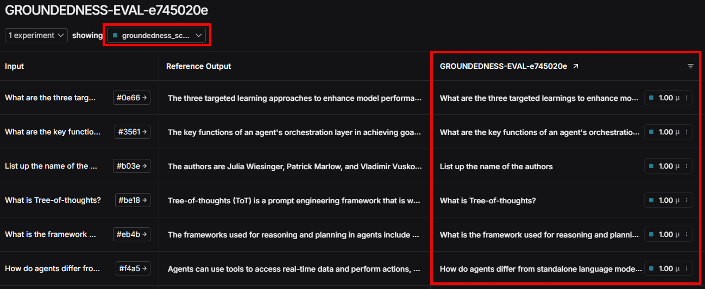
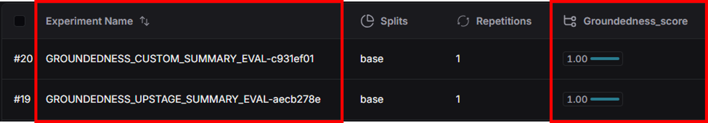

<style>
.custom {
    background-color: #008d8d;
    color: white;
    padding: 0.25em 0.5em 0.25em 0.5em;
    white-space: pre-wrap;       /* css-3 */
    white-space: -moz-pre-wrap;  /* Mozilla, since 1999 */
    white-space: -pre-wrap;      /* Opera 4-6 */
    white-space: -o-pre-wrap;    /* Opera 7 */
    word-wrap: break-word;
}

pre {
    background-color: #027c7c;
    padding-left: 0.5em;
}

</style>

# Groundedness Evaluation

- Author: [Sungchul Kim](https://github.com/rlatjcj)
- Peer Review: [Park Jeong-Ki](https://github.com/jeongkpa), [BokyungisaGod](https://github.com/BokyungisaGod)
- This is a part of [LangChain-OpenTutorial](https://github.com/LangChain-OpenTutorial/LangChain-OpenTutorial)

[](https://colab.research.google.com/github/LangChain-OpenTutorial/LangChain-OpenTutorial/blob/main/16-Evaluations/11-Groundedness-Evaluation.ipynb) [](https://github.com/LangChain-OpenTutorial/LangChain-OpenTutorial/blob/main/16-Evaluations/11-Groundedness-Evaluation.ipynb)

## Overview

**Groundedness Evaluator** an Evaluator that assesses whether answers are accurate based on the given context.
This Evaluator can be used to evaluate hallucinations in RAG's responses.
In this tutorial, we will look at how to evaluate Groundedness using Upstage Groundedness Checker (`UpstageGroundednessCheck`) and a custom-made Groundedness Checker.


### Table of Contents

- [Overview](#overview)
- [Environment Setup](#environment-setup)
- [Set Groundedness Checkers](#set-groundedness-checkers)
- [Comprehensive evaluation of dataset using summary evaluators](#comprehensive-evaluation-of-dataset-using-summary-evaluators)

### References

- [LangSmith Evaluation](https://docs.smith.langchain.com/evaluation)
- [Upstage Groundedness Checker](https://console.upstage.ai/docs/capabilities/groundedness-check)
----

## Environment Setup

Setting up your environment is the first step. See the [Environment Setup](https://wikidocs.net/257836) guide for more details.


**[Note]**

The `langchain-opentutorial` is a package of easy-to-use environment setup guidance, useful functions and utilities for tutorials.
Check out the  [`langchain-opentutorial`](https://github.com/LangChain-OpenTutorial/langchain-opentutorial-pypi) for more details.

```python
%%capture --no-stderr
%pip install langchain-opentutorial
```

```python
# Install required packages
from langchain_opentutorial import package

package.install(
    [
        "langsmith",
        "langchain_core",
        "langchain_community",
        "langchain_text_splitters",
        "langchain_openai",
        "langchain_upstage",
        "pymupdf",
        "faiss-cpu",
    ],
    verbose=False,
    upgrade=False,
)
```

```python
# Set environment variables
from langchain_opentutorial import set_env

set_env(
    {
        "OPENAI_API_KEY": "",
        "LANGCHAIN_API_KEY": "",
        "LANGCHAIN_TRACING_V2": "true",
        "LANGCHAIN_ENDPOINT": "https://api.smith.langchain.com",
        "LANGCHAIN_PROJECT": "Groundedness-Evaluations",
    }
)
```

<pre class="custom">Environment variables have been set successfully.
</pre>

You can alternatively set API keys such as `OPENAI_API_KEY` in a `.env` file and load them.

[Note] This is not necessary if you've already set the required API keys in previous steps.

```python
# Load API keys from .env file
from dotenv import load_dotenv

load_dotenv(override=True)
```


<pre class="custom">True</pre>


## Define a function for RAG performance testing

Let's create an RAG system that will be used for testing.

```python
from typing import Callable

from langchain_community.document_loaders import PyMuPDFLoader
from langchain_community.vectorstores import FAISS
from langchain_core.output_parsers import StrOutputParser
from langchain_core.prompts import PromptTemplate
from langchain_core.runnables import RunnablePassthrough
from langchain_openai import ChatOpenAI, OpenAIEmbeddings
from langchain_text_splitters import RecursiveCharacterTextSplitter


def ask_question_with_llm(llm: ChatOpenAI, file_path: str) -> Callable[[dict], dict]:
    """Create a function that answers questions.
    
    Args:
        llm (ChatOpenAI): Language Model
        file_path (str): Path to the PDF file
    
    Returns:
        (Callable[[dict], dict]): A function that answers questions
    """
    
    # Load documents
    loader = PyMuPDFLoader(file_path)
    docs = loader.load()
    
    # Split given documents
    text_splitter = RecursiveCharacterTextSplitter(chunk_size=300, chunk_overlap=50)
    split_documents = text_splitter.split_documents(docs)

    # Create a retriever
    embeddings = OpenAIEmbeddings(model="text-embedding-3-small")
    vectorstore = FAISS.from_documents(documents=split_documents, embedding=embeddings)
    retriever = vectorstore.as_retriever()

    # Create a chain
    prompt = PromptTemplate.from_template(
    """
    You are an assistant for question-answering tasks. 
    Use the following pieces of retrieved context to answer the question. 
    If you don't know the answer, just say that you don't know. 

    #Context: 
    {context}

    #Question:
    {question}

    #Answer:
    """
    )

    rag_chain = (
        {
            "context": retriever,
            "question": RunnablePassthrough(),
        }
        | prompt
        | llm
        | StrOutputParser()
    )

    def _ask_question(inputs: dict) -> dict:
        # Search for context related to the question
        context = retriever.invoke(inputs["question"])
        # Combine the retrieved documents into a single string
        context = "\n".join([doc.page_content for doc in context])
        # Return a dictionary containing the question, context, and answer
        return {
            "question": inputs["question"],
            "context": context,
            "answer": rag_chain.invoke(inputs["question"]),
        }

    return _ask_question

gpt_chain = ask_question_with_llm(
    llm=ChatOpenAI(model="gpt-4o-mini", temperature=0),
    file_path="data/Newwhitepaper_Agents2.pdf",
)
```

## Set Groundedness Checkers

To evaluate groundedness, `UpstageGroundednessCheck` and `Custom Groundedness Checker` will be used.

### Set `UpstageGroundednessCheck`

To use Upstage's Groundedness Checker (`UpstageGroundednessCheck`), you need to obtain an API key from the link below.
 - [Get API Key](https://console.upstage.ai/api-keys)

```python
from langchain_upstage import UpstageGroundednessCheck

# Create Upstage Groundedness Checker
upstage_groundedness_check = UpstageGroundednessCheck()
```

```python
# Run Groundedness Checker for evaluation
request_input = {
    "context": "Teddy's gender is male and he operates the Teddynote YouTube channel.",
    "answer": "Teddy is a male.",
}

response = upstage_groundedness_check.invoke(request_input)
print(response)
```

<pre class="custom">grounded
</pre>

```python
# Run Groundedness Checker for evaluation
request_input = {
    "context": "Teddy's gender is male and he operates the Teddynote YouTube channel.",
    "answer": "Teddy is a female.",
}

response = upstage_groundedness_check.invoke(request_input)
print(response)
```

<pre class="custom">notGrounded
</pre>

Define `UpstageGroundednessCheck` Evaluator. It will be used in `evaluate` function.

```python
from langsmith.schemas import Run, Example
from langsmith.evaluation import evaluate


def upstage_groundedness_check_evaluator(run: Run, example: Example) -> dict:
    # Get generated answer and context
    answer = run.outputs.get("answer", "")
    context = run.outputs.get("context", "")

    # Check groundedness
    groundedness_score = upstage_groundedness_check.invoke(
        {"answer": answer, "context": context}
    )
    groundedness_score = groundedness_score == "grounded"

    return {"key": "groundedness_score", "score": int(groundedness_score)}
```

### Set Custom Groundedness Checker

Create a custom Groundedness Checker using OpenAI's model.  
For this tutorial, we'll use the target `retrieval-answer`.
If you want to use other targets ('question-answer' or 'question-retrieval'), you should change the description in `GroundednessScore` and the prompt template in `GroundednessChecker.create()` accordingly.

```python
from langchain_core.runnables import RunnableSequence
from langchain_openai import ChatOpenAI
from langsmith.schemas import Example, Run
from pydantic import BaseModel, Field


class GroundednessScore(BaseModel):
    """Binary scores for relevance checks"""

    score: str = Field(
        description="relevant or not relevant. Answer 'yes' if the answer is relevant to the retrieved document else answer 'no'"
    )


class GroundednessChecker:
    """This class is used to evaluate the accuracy of a document.
    
    It returns 'yes' or 'no' as the evaluation result.

    Attributes:
        llm (ChatOpenAI): Language Model instance.
    """

    def __init__(self, llm: ChatOpenAI) -> None:
        self.llm = llm

    def create(self) -> RunnableSequence:
        """
        Create a chain for evaluating accuracy.

        Returns:
            Chain: A chain object that can evaluate accuracy
        """
        llm = self.llm.with_structured_output(GroundednessScore)

        # 프롬프트 선택
        template = """You are a grader assessing relevance of a retrieved document to a user question. \n 
            Here is the retrieved document: \n\n {context} \n\n
            Here is the answer: {answer} \n
            If the document contains keyword(s) or semantic meaning related to the user answer, grade it as relevant. \n
            
            Give a binary score 'yes' or 'no' score to indicate whether the retrieved document is relevant to the answer.
        """
        input_vars = ["context", "answer"]

        # Create a prompt
        prompt = PromptTemplate(
            template=template,
            input_variables=input_vars,
        )

        # Create a chain
        chain = prompt | llm
        return chain

# Create a Groundedness Checker
custom_groundedness_check = GroundednessChecker(
        ChatOpenAI(model="gpt-4o-mini", temperature=0)
    ).create()

def custom_groundedness_check_evaluator(run: Run, example: Example) -> dict:
    # Get generated answer and context
    answer = run.outputs.get("answer", "")
    context = run.outputs.get("context", "")

    # Groundedness Check
    groundedness_score = custom_groundedness_check.invoke(
        {"answer": answer, "context": context}
    )
    groundedness_score = groundedness_score.score == "yes"

    return {"key": "groundedness_score", "score": int(groundedness_score)}
```

## Evaluate Groundedness using Upstage's and Custom Groundedness Checker

Evaluate Groundedness using Upstage's and Custom Groundedness Checker.  
Before this, check if the dataset exists created before.
If you don't have the dataset, create one referring to [04-LangSmith-Dataset](https://github.com/LangChain-OpenTutorial/LangChain-OpenTutorial/blob/main/16-Evaluations/04-LangSmith-Dataset.ipynb).  
In this tutorial, we'll use custom Q&A dataset referred to [Google Whitepaper on AI Agents
](https://media.licdn.com/dms/document/media/v2/D561FAQH8tt1cvunj0w/feedshare-document-pdf-analyzed/B56ZQq.TtsG8AY-/0/1735887787265?e=1736985600&v=beta&t=pLuArcKyUcxE9B1Her1QWfMHF_UxZL9Q-Y0JTDuSn38).

```python
from langsmith.client import Client

client = Client()
datasets = client.list_datasets()

for dataset in datasets:
    print(dataset.name)
    for example in client.list_examples(dataset_name=dataset.name):
        print("inputs :", example.dict()["inputs"]["question"])
        print("outputs :", example.dict()["outputs"]["answer"])
        print("--------------------------------")
```

<pre class="custom">RAG_EVAL_DATASET
    inputs : What are the three targeted learnings to enhance model performance?
    outputs : The three targeted learning approaches to enhance model performance mentioned in the context are:
    
    1. In-context learning: This involves providing a generalized model with a prompt, tools, and few-shot examples at inference time, allowing it to learn "on the fly."
    
    2. Fine-tuning based learning: This method involves training a model using a larger dataset of specific examples prior to inference, helping the model understand when and how to apply certain tools.
    
    3. Using external memory: This includes examples like the 'Example Store' in Vertex AI extensions or data stores in RAG-based architecture, which help models access specific knowledge.
    --------------------------------
    inputs : What are the key functions of an agent's orchestration layer in achieving goals?
    outputs : The key functions of an agent's orchestration layer in achieving goals include structuring reasoning, planning, and decision-making, as well as guiding the agent's actions. It involves taking in information, performing internal reasoning, and generating informed decisions or responses. The orchestration layer can utilize various reasoning techniques such as ReAct, Chain-of-Thought, and Tree-of-Thoughts to facilitate these processes. Additionally, it can leverage language models and external tools to transition through states and execute complex tasks autonomously.
    --------------------------------
    inputs : List up the name of the authors
    outputs : The authors are Julia Wiesinger, Patrick Marlow, and Vladimir Vuskovic.
    --------------------------------
    inputs : What is Tree-of-thoughts?
    outputs : Tree-of-thoughts (ToT) is a prompt engineering framework that is well suited for exploration or strategic lookahead tasks. It generalizes over chain-of-thought prompting and allows the model to explore various thought chains that serve as intermediate steps for general problem solving with language models.
    --------------------------------
    inputs : What is the framework used for reasoning and planning in agent?
    outputs : The frameworks used for reasoning and planning in agents include ReAct, Chain-of-Thought, and Tree-of-Thoughts. These frameworks provide a structure for the orchestration layer to perform internal reasoning and generate informed decisions or responses.
    --------------------------------
    inputs : How do agents differ from standalone language models?
    outputs : Agents can use tools to access real-time data and perform actions, whereas models rely solely on their training data.
    Agents maintain session history for multi-turn reasoning, while models lack native session management.
    Agents incorporate cognitive architectures for advanced reasoning, such as ReAct or Chain-of-Thought.
    --------------------------------
</pre>

```python
from langsmith.evaluation import evaluate

dataset_name = "RAG_EVAL_DATASET"

# Run evaluation
experiment_results = evaluate(
    gpt_chain,
    data=dataset_name,
    evaluators=[upstage_groundedness_check_evaluator, custom_groundedness_check_evaluator],
    experiment_prefix="GROUNDEDNESS_EVAL",
    metadata={
        "variant": "Hallucination evaluation using Upstage's and Custom Groundedness Checker",
    },
)
```

<pre class="custom">View the evaluation results for experiment: 'GROUNDEDNESS_EVAL-929f91f7' at:
    https://smith.langchain.com/o/9089d1d3-e786-4000-8468-66153f05444b/datasets/9b4ca107-33fe-4c71-bb7f-488272d895a3/compare?selectedSessions=fd7bec12-fc0d-41d9-bf21-3db571a54f15
    
    
</pre>


    0it [00:00, ?it/s]




## Comprehensive evaluation of dataset using summary evaluators

This is useful when you want to evaluate the entire dataset. (The previous step was for individual data evaluation.)

```python
from typing import List
from langsmith.schemas import Example, Run


def upstage_groundedness_check_summary_evaluator(
    runs: List[Run], examples: List[Example]
) -> dict:
    def is_grounded(run: Run) -> bool:
        context = run.outputs["context"]
        answer = run.outputs["answer"]
        return (
            upstage_groundedness_check.invoke({"context": context, "answer": answer})
            == "grounded"
        )

    groundedness_scores = sum(1 for run in runs if is_grounded(run))
    return {"key": "groundedness_score", "score": groundedness_scores / len(runs)}


def custom_groundedness_check_summary_evaluator(
    runs: List[Run], examples: List[Example]
) -> dict:
    def is_grounded(run: Run) -> bool:
        context = run.outputs["context"]
        answer = run.outputs["answer"]
        return (
            custom_groundedness_check.invoke({"context": context, "answer": answer}).score
            == "yes"
        )

    groundedness_scores = sum(1 for run in runs if is_grounded(run))
    return {"key": "groundedness_score", "score": groundedness_scores / len(runs)}
```

```python
from langsmith.evaluation import evaluate

# Run evaluation
experiment_result1 = evaluate(
    gpt_chain,
    data=dataset_name,
    summary_evaluators=[
        upstage_groundedness_check_summary_evaluator,
    ],
    experiment_prefix="GROUNDEDNESS_UPSTAGE_SUMMARY_EVAL",
    # Set experiment metadata
    metadata={
        "variant": "Hallucination evaluation using Upstage Groundedness Checker",
    },
)

# Run evaluation
experiment_result2 = evaluate(
    gpt_chain,
    data=dataset_name,
    summary_evaluators=[
        custom_groundedness_check_summary_evaluator,
    ],
    experiment_prefix="GROUNDEDNESS_CUSTOM_SUMMARY_EVAL",
    # Set experiment metadata
    metadata={
        "variant": "Hallucination evaluation using Custom Groundedness Checker",
    },
)
```

<pre class="custom">View the evaluation results for experiment: 'GROUNDEDNESS_UPSTAGE_SUMMARY_EVAL-6d673c3a' at:
    https://smith.langchain.com/o/9089d1d3-e786-4000-8468-66153f05444b/datasets/9b4ca107-33fe-4c71-bb7f-488272d895a3/compare?selectedSessions=67a47286-2224-48d3-94d6-e2bb87a47aef
    
    
</pre>


    0it [00:00, ?it/s]


    View the evaluation results for experiment: 'GROUNDEDNESS_CUSTOM_SUMMARY_EVAL-af449083' at:
    https://smith.langchain.com/o/9089d1d3-e786-4000-8468-66153f05444b/datasets/9b4ca107-33fe-4c71-bb7f-488272d895a3/compare?selectedSessions=72ae6cbd-e53b-4311-9c2a-654585da9c5b
    
    
    


    0it [00:00, ?it/s]



