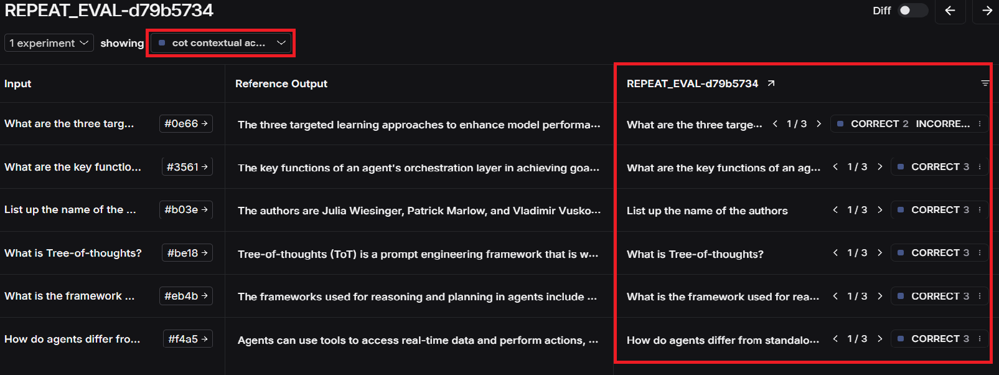

<style>
.custom {
    background-color: #008d8d;
    color: white;
    padding: 0.25em 0.5em 0.25em 0.5em;
    white-space: pre-wrap;       /* css-3 */
    white-space: -moz-pre-wrap;  /* Mozilla, since 1999 */
    white-space: -pre-wrap;      /* Opera 4-6 */
    white-space: -o-pre-wrap;    /* Opera 7 */
    word-wrap: break-word;
}

pre {
    background-color: #027c7c;
    padding-left: 0.5em;
}

</style>

# LangSmith Repeat Evaluation

- Author: [Hwayoung Cha](https://github.com/forwardyoung)
- Peer Review: []()
- This is a part of [LangChain Open Tutorial](https://github.com/LangChain-OpenTutorial/LangChain-OpenTutorial)

[](https://colab.research.google.com/github/langchain-ai/langchain-academy/blob/main/module-4/sub-graph.ipynb) [](https://academy.langchain.com/courses/take/intro-to-langgraph/lessons/58239937-lesson-2-sub-graphs)

## Overview

> Repetitive evaluation is a method of more accurately measuring a model's performance by conducting multiple evaluations on the same dataset.

You can add repetition to the experiment. This notebook demonstrates how to use `LangSmith` for repeatable evaluations of language models. It covers setting up evaluation workflows, running evaluations on different datasets, and analyzing results to ensure consistency. The focus is on leveraging `LangSmith`'s tools for reproducible and scalable model assessments.

This allows the evaluation to be repeated multiple times, which is useful in the following cases:

- For larger evaluation sets
- For chains that can generate variable responses
- For evaluations that can produce variable scores (e.g., `llm-as-judge`)

You can learn how to run an evaluation from [this site](https://docs.smith.langchain.com/evaluation/how_to_guides/evaluate_llm_application#evaluate-on-a-dataset-with-repetitions).

### Table of Contents

- [Overview](#overview)
- [Environment Setup](#environment-setup)
- [Performing Repetitive Evaluations with num_repetitions](#performing-repetitive-evaluations-with-num_repetitions)
- [Define a function for RAG performance testing](#define-a-function-for-rag-performance-testing)
- [Repetitive evaluation of RAG using GPT models](#repetitive-evaluation-of-rag-using-gpt-models)
- [Repetitive evaluation of RAG using Ollama models](#repetitive-evaluation-of-rag-using-ollama-models)

## References
- [How to run an evaluation](https://docs.smith.langchain.com/evaluation/how_to_guides/evaluate_llm_application#evaluate-on-a-dataset-with-repetitions)
- [How to evaluate with repetitions](https://docs.smith.langchain.com/evaluation/how_to_guides/repetition)

## Environment Setup

Set up the environment. You may refer to [Environment Setup](https://wikidocs.net/257836) for more details.

**[Note]**
- `langchain-opentutorial` is a package that provides a set of easy-to-use environment setup, useful functions and utilities for tutorials. 
- You can checkout the [`langchain-opentutorial`](https://github.com/LangChain-OpenTutorial/langchain-opentutorial-pypi) for more details.

```python
%%capture --no-stderr
%pip install langchain-opentutorial
```

<pre class="custom">
    [notice] A new release of pip is available: 23.1 -> 24.3.1
    [notice] To update, run: python.exe -m pip install --upgrade pip
</pre>

```python
# Install required packages
from langchain_opentutorial import package

package.install(
    [
        "langsmith",
        "langchain",
        "langchain_openai",
        "langchain_core",
        "langchain_community",
        "langchain_ollama",
        "faiss-cpu",
        "pymupdf",
    ],
    verbose=False,
    upgrade=False,
)
```

```python
# Set environment variables
from langchain_opentutorial import set_env

set_env(
    {
        "OPENAI_API_KEY": "",
        "LANGSMITH_TRACING_V2": "true",
        "LANGSMITH_ENDPOINT": "https://api.smith.langchain.com",
        "LANGCHAIN_API_KEY": "",
        "LANGCHAIN_PROJECT": "Repeat-Evaluations"
    }
)
```

<pre class="custom">Environment variables have been set successfully.
</pre>

You can alternatively set OPENAI_API_KEY in .env file and load it.

[Note] This is not necessary if you've already set OPENAI_API_KEY in previous steps.

```python
# Configuration file to manage API keys as environment variables
from dotenv import load_dotenv

# Load API key information
load_dotenv(override=True)
```


<pre class="custom">True</pre>


## Performing Repetitive Evaluations with `num_repetitions`

`LangSmith` provides a simple way to perform repetitive evaluations using the `num_repetitions` parameter in the evaluate function. This parameter specifies how many times each example in your dataset should be evaluated.

When you set `num_repetitions=N`, `LangSmith` will:

Run each example in your dataset N times.

Aggregate the results to provide a more accurate measure of your model's performance.

For example:

If your dataset has 10 examples and you set `num_repetitions=5`, each example will be evaluated 5 times, resulting in a total of 50 runs.

## Define a function for RAG performance testing

Create a RAG system to use for performance testing.

```python
from myrag import PDFRAG


# Create a function to generate responses to questions.
def ask_question_with_llm(llm):
    # Create a PDFRAG object
    rag = PDFRAG(
        "data/Newwhitepaper_Agents2.pdf",
        llm,
    )

    # Create a retriever
    retriever = rag.create_retriever()

    # Create a chain
    rag_chain = rag.create_chain(retriever)

    def _ask_question(inputs: dict):
        # Context retrieval for the question
        context = retriever.invoke(inputs["question"])
        # Combine the retrieved documents into a single string.
        context = "\n".join([doc.page_content for doc in context])
        # Return a dictionary containing the question, context, and answer.
        return {
            "question": inputs["question"],
            "context": context,
            "answer": rag_chain.invoke(inputs["question"]),
        }

    return _ask_question
```

In this tutorial, we use the `llama3.2` model for repetitive evaluations. Make sure to install [`Ollama`](https://ollama.com/) on your local machine and run `ollama pull llama3.2` to download the model before proceeding with this tutorial.

```python
!ollama pull llama3.2
```

<pre class="custom">[?25lpulling manifest ⠋ [?25h[?25lpulling manifest ⠙ [?25h[?25lpulling manifest ⠹ [?25h[?25lpulling manifest ⠸ [?25h[?25lpulling manifest ⠼ [?25h[?25lpulling manifest ⠴ [?25h[?25lpulling manifest ⠦ [?25h[?25lpulling manifest ⠧ [?25h[?25lpulling manifest ⠇ [?25h[?25lpulling manifest ⠏ [?25h[?25lpulling manifest ⠋ [?25h[?25lpulling manifest ⠙ [?25h[?25lpulling manifest ⠹ [?25h[?25lpulling manifest ⠸ [?25h[?25lpulling manifest ⠼ [?25h[?25lpulling manifest ⠴ [?25h[?25lpulling manifest ⠦ [?25h[?25lpulling manifest 
    pulling dde5aa3fc5ff... 100% ▕████████████████▏ 2.0 GB                         
    pulling 966de95ca8a6... 100% ▕████████████████▏ 1.4 KB                         
    pulling fcc5a6bec9da... 100% ▕████████████████▏ 7.7 KB                         
    pulling a70ff7e570d9... 100% ▕████████████████▏ 6.0 KB                         
    pulling 56bb8bd477a5... 100% ▕████████████████▏   96 B                         
    pulling 34bb5ab01051... 100% ▕████████████████▏  561 B                         
    verifying sha256 digest 
    writing manifest 
    success [?25h
</pre>


Below is an example of loading and invoking the model:

```python
from langchain_ollama import ChatOllama

# Load the Ollama model
ollama = ChatOllama(model="llama3.2")

# Call the Ollama model
ollama.invoke("hello") 
```


<pre class="custom">AIMessage(content='Hello! How can I assist you today?', additional_kwargs={}, response_metadata={'model': 'llama3.2', 'created_at': '2025-01-17T14:10:26.1794677Z', 'done': True, 'done_reason': 'stop', 'total_duration': 6188204400, 'load_duration': 4276032100, 'prompt_eval_count': 26, 'prompt_eval_duration': 1219000000, 'eval_count': 10, 'eval_duration': 686000000, 'message': Message(role='assistant', content='', images=None, tool_calls=None)}, id='run-02a9cbb2-a74a-48a2-831a-ca27cdf3a16d-0', usage_metadata={'input_tokens': 26, 'output_tokens': 10, 'total_tokens': 36})</pre>


```python
from langchain_openai import ChatOpenAI

gpt_chain = ask_question_with_llm(ChatOpenAI(model="gpt-4o-mini", temperature=1.0))

# Load the Ollama model.
ollama_chain = ask_question_with_llm(ChatOllama(model="llama3.2"))
```

## Repetitive evaluation of RAG using GPT models

This section demonstrates the process of conducting multiple evaluations of a RAG system using GPT models. It focuses on setting up and executing repeated tests to assess the consistency and performance of the RAG system across various scenarios, helping to identify potential areas for improvement and ensure reliable outputs.

```python
from langsmith.evaluation import evaluate, LangChainStringEvaluator

# Create a QA evaluator
cot_qa_evalulator = LangChainStringEvaluator(
    "cot_qa",
    config={"llm": ChatOpenAI(model="gpt-4o-mini", temperature=0)},
    prepare_data=lambda run, example: {
        "prediction": run.outputs["answer"],
        "reference": run.outputs["context"],
        "input": example.inputs["question"],
    },
)

dataset_name = "RAG_EVAL_DATASET"

# Run the evaluation
evaluate(
    gpt_chain,
    data=dataset_name,
    evaluators=[cot_qa_evalulator],
    experiment_prefix="REPEAT_EVAL",
    # Specify the experiment metadata.
    metadata={
        "variant": "Perform repeat evaluation. GPT-4o-mini model (cot_qa)",
    },
    num_repetitions=3,
)
```

<pre class="custom">View the evaluation results for experiment: 'REPEAT_EVAL-dde264a3' at:
    https://smith.langchain.com/o/9089d1d3-e786-4000-8468-66153f05444b/datasets/9b4ca107-33fe-4c71-bb7f-488272d895a3/compare?selectedSessions=bf0e89e5-421a-4dd8-9739-9158d18e2670
    
    
</pre>


    0it [00:00, ?it/s]


<div>
<style scoped>
    .dataframe tbody tr th:only-of-type {
        vertical-align: middle;
    }

    .dataframe tbody tr th {
        vertical-align: top;
    }

    .dataframe thead th {
        text-align: right;
    }
</style>
<table border="1" class="dataframe">
  <thead>
    <tr style="text-align: right;">
      <th></th>
      <th>inputs.question</th>
      <th>outputs.question</th>
      <th>outputs.context</th>
      <th>outputs.answer</th>
      <th>error</th>
      <th>reference.answer</th>
      <th>feedback.COT Contextual Accuracy</th>
      <th>execution_time</th>
      <th>example_id</th>
      <th>id</th>
    </tr>
  </thead>
  <tbody>
    <tr>
      <th>0</th>
      <td>What are the three targeted learnings to enhan...</td>
      <td>What are the three targeted learnings to enhan...</td>
      <td>Agents\n33\nSeptember 2024\nEnhancing model pe...</td>
      <td>The three targeted learning approaches to enha...</td>
      <td>None</td>
      <td>The three targeted learning approaches to enha...</td>
      <td>0</td>
      <td>4.314925</td>
      <td>0e661de4-636b-425d-8f6e-0a52b8070576</td>
      <td>3dd0330a-6fac-49cd-bc32-98fc8b2bc009</td>
    </tr>
    <tr>
      <th>1</th>
      <td>What are the key functions of an agent's orche...</td>
      <td>What are the key functions of an agent's orche...</td>
      <td>implementation of the agent orchestration laye...</td>
      <td>The orchestration layer of an agent is respons...</td>
      <td>None</td>
      <td>The key functions of an agent's orchestration ...</td>
      <td>1</td>
      <td>4.272081</td>
      <td>3561c6fe-6ed4-4182-989a-270dcd635f32</td>
      <td>210a2398-530f-4a7b-9c52-767396f73139</td>
    </tr>
    <tr>
      <th>2</th>
      <td>List up the name of the authors</td>
      <td>List up the name of the authors</td>
      <td>Agents\nAuthors: Julia Wiesinger, Patrick Marl...</td>
      <td>The authors listed are Julia Wiesinger, Patric...</td>
      <td>None</td>
      <td>The authors are Julia Wiesinger, Patrick Marlo...</td>
      <td>1</td>
      <td>2.029024</td>
      <td>b03e98d1-44ad-4142-8dfa-7b0a31a57096</td>
      <td>06e580a5-5120-456a-91a5-d1b69a9a0868</td>
    </tr>
    <tr>
      <th>3</th>
      <td>What is Tree-of-thoughts?</td>
      <td>What is Tree-of-thoughts?</td>
      <td>weaknesses depending on the specific applicati...</td>
      <td>Tree-of-thoughts (ToT) is a prompt engineering...</td>
      <td>None</td>
      <td>Tree-of-thoughts (ToT) is a prompt engineering...</td>
      <td>1</td>
      <td>3.765071</td>
      <td>be18ec98-ab18-4f30-9205-e75f1cb70844</td>
      <td>cd4a92d8-f2ea-447c-a18f-a0db533cb8cc</td>
    </tr>
    <tr>
      <th>4</th>
      <td>What is the framework used for reasoning and p...</td>
      <td>What is the framework used for reasoning and p...</td>
      <td>reasoning frameworks (CoT, ReAct, etc.) to \nf...</td>
      <td>The frameworks used for reasoning and planning...</td>
      <td>None</td>
      <td>The frameworks used for reasoning and planning...</td>
      <td>1</td>
      <td>3.013066</td>
      <td>eb4b29a7-511c-4f78-a08f-2d5afeb84320</td>
      <td>fec108d9-97d5-4b2d-b0d3-c8e77158a999</td>
    </tr>
    <tr>
      <th>5</th>
      <td>How do agents differ from standalone language ...</td>
      <td>How do agents differ from standalone language ...</td>
      <td>1.\t Agents extend the capabilities of languag...</td>
      <td>Agents differ from standalone language models ...</td>
      <td>None</td>
      <td>Agents can use tools to access real-time data ...</td>
      <td>1</td>
      <td>3.274887</td>
      <td>f4a5a0cf-2d2e-4e15-838a-bc8296eb708b</td>
      <td>80bc2b98-2026-416b-a588-d40a0b56770c</td>
    </tr>
    <tr>
      <th>6</th>
      <td>What are the three targeted learnings to enhan...</td>
      <td>What are the three targeted learnings to enhan...</td>
      <td>Agents\n33\nSeptember 2024\nEnhancing model pe...</td>
      <td>The three targeted learnings to enhance model ...</td>
      <td>None</td>
      <td>The three targeted learning approaches to enha...</td>
      <td>0</td>
      <td>4.848947</td>
      <td>0e661de4-636b-425d-8f6e-0a52b8070576</td>
      <td>91caf834-e66c-4538-95d0-1f3009d19c74</td>
    </tr>
    <tr>
      <th>7</th>
      <td>What are the key functions of an agent's orche...</td>
      <td>What are the key functions of an agent's orche...</td>
      <td>implementation of the agent orchestration laye...</td>
      <td>The key functions of an agent's orchestration ...</td>
      <td>None</td>
      <td>The key functions of an agent's orchestration ...</td>
      <td>1</td>
      <td>5.022591</td>
      <td>3561c6fe-6ed4-4182-989a-270dcd635f32</td>
      <td>ee18ccde-7acc-4afe-a1a8-06c7d3f258ff</td>
    </tr>
    <tr>
      <th>8</th>
      <td>List up the name of the authors</td>
      <td>List up the name of the authors</td>
      <td>Agents\nAuthors: Julia Wiesinger, Patrick Marl...</td>
      <td>The authors are Julia Wiesinger, Patrick Marlo...</td>
      <td>None</td>
      <td>The authors are Julia Wiesinger, Patrick Marlo...</td>
      <td>1</td>
      <td>3.086064</td>
      <td>b03e98d1-44ad-4142-8dfa-7b0a31a57096</td>
      <td>eb8223b6-668f-4873-9234-50a09a514555</td>
    </tr>
    <tr>
      <th>9</th>
      <td>What is Tree-of-thoughts?</td>
      <td>What is Tree-of-thoughts?</td>
      <td>weaknesses depending on the specific applicati...</td>
      <td>Tree-of-thoughts (ToT) is a prompt engineering...</td>
      <td>None</td>
      <td>Tree-of-thoughts (ToT) is a prompt engineering...</td>
      <td>1</td>
      <td>12.533168</td>
      <td>be18ec98-ab18-4f30-9205-e75f1cb70844</td>
      <td>2bc00521-a12a-4c0d-bacc-28b2f2fe8873</td>
    </tr>
    <tr>
      <th>10</th>
      <td>What is the framework used for reasoning and p...</td>
      <td>What is the framework used for reasoning and p...</td>
      <td>reasoning frameworks (CoT, ReAct, etc.) to \nf...</td>
      <td>The frameworks used for reasoning and planning...</td>
      <td>None</td>
      <td>The frameworks used for reasoning and planning...</td>
      <td>1</td>
      <td>3.769949</td>
      <td>eb4b29a7-511c-4f78-a08f-2d5afeb84320</td>
      <td>33540ddf-876b-45f6-b78e-5c7db014bf3f</td>
    </tr>
    <tr>
      <th>11</th>
      <td>How do agents differ from standalone language ...</td>
      <td>How do agents differ from standalone language ...</td>
      <td>1.\t Agents extend the capabilities of languag...</td>
      <td>Agents differ from standalone language models ...</td>
      <td>None</td>
      <td>Agents can use tools to access real-time data ...</td>
      <td>1</td>
      <td>3.677065</td>
      <td>f4a5a0cf-2d2e-4e15-838a-bc8296eb708b</td>
      <td>db404f5c-889c-4e68-9d76-7dc250506862</td>
    </tr>
    <tr>
      <th>12</th>
      <td>What are the three targeted learnings to enhan...</td>
      <td>What are the three targeted learnings to enhan...</td>
      <td>Agents\n33\nSeptember 2024\nEnhancing model pe...</td>
      <td>The three targeted learnings to enhance model ...</td>
      <td>None</td>
      <td>The three targeted learning approaches to enha...</td>
      <td>1</td>
      <td>9.244867</td>
      <td>0e661de4-636b-425d-8f6e-0a52b8070576</td>
      <td>9729b15c-156c-4753-83b3-37a72eb090e7</td>
    </tr>
    <tr>
      <th>13</th>
      <td>What are the key functions of an agent's orche...</td>
      <td>What are the key functions of an agent's orche...</td>
      <td>implementation of the agent orchestration laye...</td>
      <td>The key functions of an agent's orchestration ...</td>
      <td>None</td>
      <td>The key functions of an agent's orchestration ...</td>
      <td>1</td>
      <td>7.975982</td>
      <td>3561c6fe-6ed4-4182-989a-270dcd635f32</td>
      <td>75e6d19c-4532-4839-9947-2270b32b03d6</td>
    </tr>
    <tr>
      <th>14</th>
      <td>List up the name of the authors</td>
      <td>List up the name of the authors</td>
      <td>Agents\nAuthors: Julia Wiesinger, Patrick Marl...</td>
      <td>The authors are Julia Wiesinger, Patrick Marlo...</td>
      <td>None</td>
      <td>The authors are Julia Wiesinger, Patrick Marlo...</td>
      <td>1</td>
      <td>12.666265</td>
      <td>b03e98d1-44ad-4142-8dfa-7b0a31a57096</td>
      <td>a46059e8-f848-4406-b332-2eab00171033</td>
    </tr>
    <tr>
      <th>15</th>
      <td>What is Tree-of-thoughts?</td>
      <td>What is Tree-of-thoughts?</td>
      <td>weaknesses depending on the specific applicati...</td>
      <td>Tree-of-thoughts (ToT) is a prompt engineering...</td>
      <td>None</td>
      <td>Tree-of-thoughts (ToT) is a prompt engineering...</td>
      <td>1</td>
      <td>4.710261</td>
      <td>be18ec98-ab18-4f30-9205-e75f1cb70844</td>
      <td>4e3ce81f-f838-4614-bc5e-d32dbbb7bb23</td>
    </tr>
    <tr>
      <th>16</th>
      <td>What is the framework used for reasoning and p...</td>
      <td>What is the framework used for reasoning and p...</td>
      <td>reasoning frameworks (CoT, ReAct, etc.) to \nf...</td>
      <td>The frameworks used for reasoning and planning...</td>
      <td>None</td>
      <td>The frameworks used for reasoning and planning...</td>
      <td>1</td>
      <td>4.156800</td>
      <td>eb4b29a7-511c-4f78-a08f-2d5afeb84320</td>
      <td>2a679b30-7588-44ed-bb0d-31cce4f91663</td>
    </tr>
    <tr>
      <th>17</th>
      <td>How do agents differ from standalone language ...</td>
      <td>How do agents differ from standalone language ...</td>
      <td>1.\t Agents extend the capabilities of languag...</td>
      <td>Agents differ from standalone language models ...</td>
      <td>None</td>
      <td>Agents can use tools to access real-time data ...</td>
      <td>1</td>
      <td>2.865889</td>
      <td>f4a5a0cf-2d2e-4e15-838a-bc8296eb708b</td>
      <td>56826347-db40-4a16-a47f-d96d2abad4b2</td>
    </tr>
  </tbody>
</table>
</div>




## Repetitive evaluation of RAG using Ollama models

This part focuses on performing repetitive evaluations of the RAG system using Ollama models. It illustrates the process of setting up and running multiple tests with Ollama, allowing for a comprehensive assessment of the RAG system's performance with these specific models.

```python
# Create a QA evaluator
cot_qa_evalulator = LangChainStringEvaluator(
    "cot_qa",
    config={"llm": ChatOpenAI(model="gpt-4o-mini", temperature=0)},
    prepare_data=lambda run, example: {
        "prediction": run.outputs["answer"],
        "reference": run.outputs["context"],
        "input": example.inputs["question"],
    },
)

dataset_name = "RAG_EVAL_DATASET"

# Run the evaluation
evaluate(
    ollama_chain,
    data=dataset_name,
    evaluators=[cot_qa_evalulator],
    experiment_prefix="REPEAT_EVAL",
    # Specify the experiment metadata.
    metadata={
        "variant": "Perform repeat evaluation. Ollama(llama3.2) (cot_qa)",
    },
    num_repetitions=3,
)
```

<pre class="custom">View the evaluation results for experiment: 'REPEAT_EVAL-e5728ae5' at:
    https://smith.langchain.com/o/9089d1d3-e786-4000-8468-66153f05444b/datasets/9b4ca107-33fe-4c71-bb7f-488272d895a3/compare?selectedSessions=1a1b3b9f-dfd9-48b1-8256-796d3b1aa7c0
    
    
</pre>


    0it [00:00, ?it/s]


<div>
<style scoped>
    .dataframe tbody tr th:only-of-type {
        vertical-align: middle;
    }

    .dataframe tbody tr th {
        vertical-align: top;
    }

    .dataframe thead th {
        text-align: right;
    }
</style>
<table border="1" class="dataframe">
  <thead>
    <tr style="text-align: right;">
      <th></th>
      <th>inputs.question</th>
      <th>outputs.question</th>
      <th>outputs.context</th>
      <th>outputs.answer</th>
      <th>error</th>
      <th>reference.answer</th>
      <th>feedback.COT Contextual Accuracy</th>
      <th>execution_time</th>
      <th>example_id</th>
      <th>id</th>
    </tr>
  </thead>
  <tbody>
    <tr>
      <th>0</th>
      <td>What are the three targeted learnings to enhan...</td>
      <td>What are the three targeted learnings to enhan...</td>
      <td>Agents\n33\nSeptember 2024\nEnhancing model pe...</td>
      <td>The three targeted learnings to enhance model ...</td>
      <td>None</td>
      <td>The three targeted learning approaches to enha...</td>
      <td>0</td>
      <td>48.045735</td>
      <td>0e661de4-636b-425d-8f6e-0a52b8070576</td>
      <td>16073b43-be8c-4ac3-8ab8-1fcea5881e37</td>
    </tr>
    <tr>
      <th>1</th>
      <td>What are the key functions of an agent's orche...</td>
      <td>What are the key functions of an agent's orche...</td>
      <td>implementation of the agent orchestration laye...</td>
      <td>Based on the provided context, it appears that...</td>
      <td>None</td>
      <td>The key functions of an agent's orchestration ...</td>
      <td>1</td>
      <td>44.844708</td>
      <td>3561c6fe-6ed4-4182-989a-270dcd635f32</td>
      <td>36ba9035-a266-43bd-8317-2e5d716eaa5e</td>
    </tr>
    <tr>
      <th>2</th>
      <td>List up the name of the authors</td>
      <td>List up the name of the authors</td>
      <td>Agents\nAuthors: Julia Wiesinger, Patrick Marl...</td>
      <td>The names of the authors are:\n\n1. Julia Wies...</td>
      <td>None</td>
      <td>The authors are Julia Wiesinger, Patrick Marlo...</td>
      <td>1</td>
      <td>42.542528</td>
      <td>b03e98d1-44ad-4142-8dfa-7b0a31a57096</td>
      <td>878fbb3e-c01f-47d7-aa6c-4d32804b81de</td>
    </tr>
    <tr>
      <th>3</th>
      <td>What is Tree-of-thoughts?</td>
      <td>What is Tree-of-thoughts?</td>
      <td>weaknesses depending on the specific applicati...</td>
      <td>Tree-of-thoughts (ToT) is a prompt engineering...</td>
      <td>None</td>
      <td>Tree-of-thoughts (ToT) is a prompt engineering...</td>
      <td>1</td>
      <td>44.415462</td>
      <td>be18ec98-ab18-4f30-9205-e75f1cb70844</td>
      <td>312cf847-908c-4612-b3e3-86288c3757ea</td>
    </tr>
    <tr>
      <th>4</th>
      <td>What is the framework used for reasoning and p...</td>
      <td>What is the framework used for reasoning and p...</td>
      <td>reasoning frameworks (CoT, ReAct, etc.) to \nf...</td>
      <td>Based on the provided context, it appears that...</td>
      <td>None</td>
      <td>The frameworks used for reasoning and planning...</td>
      <td>1</td>
      <td>49.577862</td>
      <td>eb4b29a7-511c-4f78-a08f-2d5afeb84320</td>
      <td>7dd6ec03-95b4-45a0-bb14-2630250018d8</td>
    </tr>
    <tr>
      <th>5</th>
      <td>How do agents differ from standalone language ...</td>
      <td>How do agents differ from standalone language ...</td>
      <td>1.\t Agents extend the capabilities of languag...</td>
      <td>According to the retrieved context, agents and...</td>
      <td>None</td>
      <td>Agents can use tools to access real-time data ...</td>
      <td>1</td>
      <td>53.767911</td>
      <td>f4a5a0cf-2d2e-4e15-838a-bc8296eb708b</td>
      <td>d7d09ab0-a8f2-42ad-9842-a99758df77e0</td>
    </tr>
    <tr>
      <th>6</th>
      <td>What are the three targeted learnings to enhan...</td>
      <td>What are the three targeted learnings to enhan...</td>
      <td>Agents\n33\nSeptember 2024\nEnhancing model pe...</td>
      <td>In-context learning and fine-tuning-based lear...</td>
      <td>None</td>
      <td>The three targeted learning approaches to enha...</td>
      <td>0</td>
      <td>43.936210</td>
      <td>0e661de4-636b-425d-8f6e-0a52b8070576</td>
      <td>820d770a-c690-472e-8749-c453e761084e</td>
    </tr>
    <tr>
      <th>7</th>
      <td>What are the key functions of an agent's orche...</td>
      <td>What are the key functions of an agent's orche...</td>
      <td>implementation of the agent orchestration laye...</td>
      <td>The key functions of an agent's orchestration ...</td>
      <td>None</td>
      <td>The key functions of an agent's orchestration ...</td>
      <td>1</td>
      <td>50.533822</td>
      <td>3561c6fe-6ed4-4182-989a-270dcd635f32</td>
      <td>54a701fa-b9ad-4a5f-bdb9-1fad1251e0a8</td>
    </tr>
    <tr>
      <th>8</th>
      <td>List up the name of the authors</td>
      <td>List up the name of the authors</td>
      <td>Agents\nAuthors: Julia Wiesinger, Patrick Marl...</td>
      <td>The names of the authors are:\n\n1. Julia Wies...</td>
      <td>None</td>
      <td>The authors are Julia Wiesinger, Patrick Marlo...</td>
      <td>1</td>
      <td>44.877717</td>
      <td>b03e98d1-44ad-4142-8dfa-7b0a31a57096</td>
      <td>77fa15e6-774a-44cd-a60f-f4b27e1da713</td>
    </tr>
    <tr>
      <th>9</th>
      <td>What is Tree-of-thoughts?</td>
      <td>What is Tree-of-thoughts?</td>
      <td>weaknesses depending on the specific applicati...</td>
      <td>Tree-of-thoughts (ToT) is a prompt engineering...</td>
      <td>None</td>
      <td>Tree-of-thoughts (ToT) is a prompt engineering...</td>
      <td>1</td>
      <td>49.692480</td>
      <td>be18ec98-ab18-4f30-9205-e75f1cb70844</td>
      <td>9f228641-1476-4e17-84f9-0d2c3de33fb6</td>
    </tr>
    <tr>
      <th>10</th>
      <td>What is the framework used for reasoning and p...</td>
      <td>What is the framework used for reasoning and p...</td>
      <td>reasoning frameworks (CoT, ReAct, etc.) to \nf...</td>
      <td>The answer to the question "What is the framew...</td>
      <td>None</td>
      <td>The frameworks used for reasoning and planning...</td>
      <td>1</td>
      <td>57.079942</td>
      <td>eb4b29a7-511c-4f78-a08f-2d5afeb84320</td>
      <td>bf4f9953-6eaa-467d-86ba-9c94f529e6d2</td>
    </tr>
    <tr>
      <th>11</th>
      <td>How do agents differ from standalone language ...</td>
      <td>How do agents differ from standalone language ...</td>
      <td>1.\t Agents extend the capabilities of languag...</td>
      <td>According to the retrieved context, agents dif...</td>
      <td>None</td>
      <td>Agents can use tools to access real-time data ...</td>
      <td>1</td>
      <td>48.946233</td>
      <td>f4a5a0cf-2d2e-4e15-838a-bc8296eb708b</td>
      <td>cbfe2610-a4b7-4137-84ca-45dd42f83b48</td>
    </tr>
    <tr>
      <th>12</th>
      <td>What are the three targeted learnings to enhan...</td>
      <td>What are the three targeted learnings to enhan...</td>
      <td>Agents\n33\nSeptember 2024\nEnhancing model pe...</td>
      <td>The text doesn't explicitly mention "targeted ...</td>
      <td>None</td>
      <td>The three targeted learning approaches to enha...</td>
      <td>1</td>
      <td>48.183349</td>
      <td>0e661de4-636b-425d-8f6e-0a52b8070576</td>
      <td>2672a1f0-b0af-43b8-891a-eae188cde04f</td>
    </tr>
    <tr>
      <th>13</th>
      <td>What are the key functions of an agent's orche...</td>
      <td>What are the key functions of an agent's orche...</td>
      <td>implementation of the agent orchestration laye...</td>
      <td>Based on the provided context, the orchestrati...</td>
      <td>None</td>
      <td>The key functions of an agent's orchestration ...</td>
      <td>1</td>
      <td>54.076100</td>
      <td>3561c6fe-6ed4-4182-989a-270dcd635f32</td>
      <td>4302a894-cb5c-4e29-8844-daa3d6a9ba94</td>
    </tr>
    <tr>
      <th>14</th>
      <td>List up the name of the authors</td>
      <td>List up the name of the authors</td>
      <td>Agents\nAuthors: Julia Wiesinger, Patrick Marl...</td>
      <td>The names of the authors are:\n\n1. Julia Wies...</td>
      <td>None</td>
      <td>The authors are Julia Wiesinger, Patrick Marlo...</td>
      <td>1</td>
      <td>45.883568</td>
      <td>b03e98d1-44ad-4142-8dfa-7b0a31a57096</td>
      <td>f03fd939-0d5d-4386-b1e0-ad6e77e9985f</td>
    </tr>
    <tr>
      <th>15</th>
      <td>What is Tree-of-thoughts?</td>
      <td>What is Tree-of-thoughts?</td>
      <td>weaknesses depending on the specific applicati...</td>
      <td>Tree-of-thoughts (ToT) is a prompt engineering...</td>
      <td>None</td>
      <td>Tree-of-thoughts (ToT) is a prompt engineering...</td>
      <td>1</td>
      <td>52.200453</td>
      <td>be18ec98-ab18-4f30-9205-e75f1cb70844</td>
      <td>5cc65ad6-865f-4781-8054-e9159fb46d1b</td>
    </tr>
    <tr>
      <th>16</th>
      <td>What is the framework used for reasoning and p...</td>
      <td>What is the framework used for reasoning and p...</td>
      <td>reasoning frameworks (CoT, ReAct, etc.) to \nf...</td>
      <td>Based on the provided context, it appears that...</td>
      <td>None</td>
      <td>The frameworks used for reasoning and planning...</td>
      <td>0</td>
      <td>57.564192</td>
      <td>eb4b29a7-511c-4f78-a08f-2d5afeb84320</td>
      <td>72b6ef7e-fe17-4d47-aaf4-4ea37299b2b4</td>
    </tr>
    <tr>
      <th>17</th>
      <td>How do agents differ from standalone language ...</td>
      <td>How do agents differ from standalone language ...</td>
      <td>1.\t Agents extend the capabilities of languag...</td>
      <td>Based on the provided context, according to th...</td>
      <td>None</td>
      <td>Agents can use tools to access real-time data ...</td>
      <td>1</td>
      <td>52.182042</td>
      <td>f4a5a0cf-2d2e-4e15-838a-bc8296eb708b</td>
      <td>c3167606-9f4a-4971-a1e2-5fadc56e2afb</td>
    </tr>
  </tbody>
</table>
</div>


