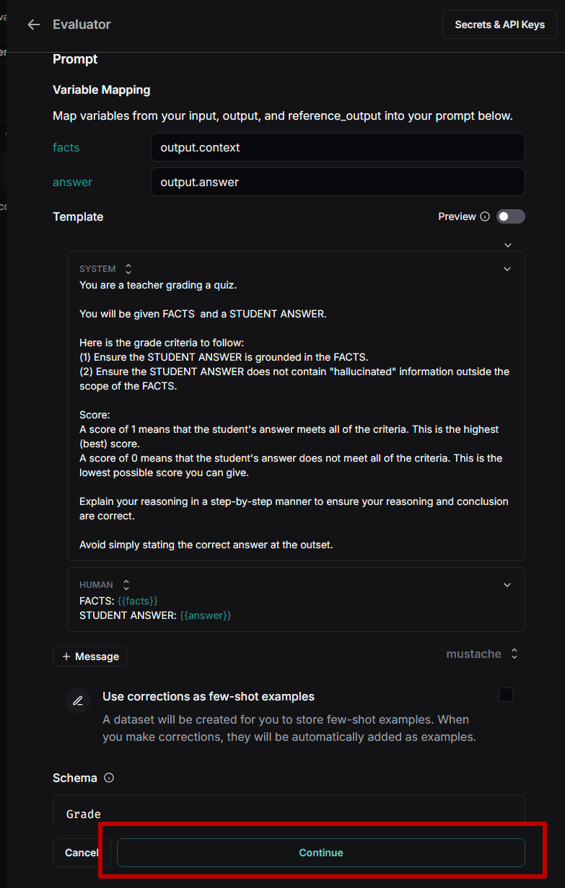
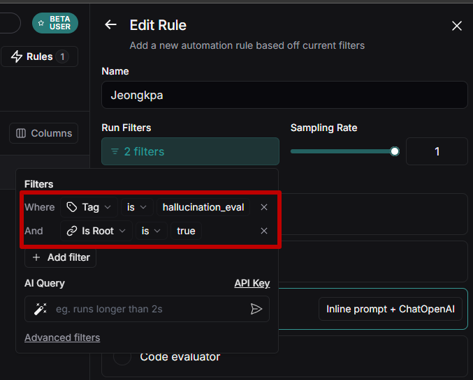

<style>
.custom {
    background-color: #008d8d;
    color: white;
    padding: 0.25em 0.5em 0.25em 0.5em;
    white-space: pre-wrap;       /* css-3 */
    white-space: -moz-pre-wrap;  /* Mozilla, since 1999 */
    white-space: -pre-wrap;      /* Opera 4-6 */
    white-space: -o-pre-wrap;    /* Opera 7 */
    word-wrap: break-word;
}

pre {
    background-color: #027c7c;
    padding-left: 0.5em;
}

</style>

# LangSmith Online Evaluation

- Author: [JeongGi Park](https://github.com/jeongkpa)
- Design: []()
- Peer Review: 
- This is a part of [LangChain Open Tutorial](https://github.com/LangChain-OpenTutorial/LangChain-OpenTutorial)

[](https://colab.research.google.com/github/LangChain-OpenTutorial/LangChain-OpenTutorial/blob/main/01-Basic/07-LCEL-Interface.ipynb) [](https://github.com/LangChain-OpenTutorial/LangChain-OpenTutorial/blob/main/01-Basic/07-LCEL-Interface.ipynb)

## Overview
This module provides tools to evaluate and track the performance of language models using **LangSmith's** online evaluation capabilities.


By setting up chains and using custom configurations, users can assess model outputs, including **hallucination** detection and context recall, ensuring robust performance in various scenarios.


### Table of Contents

- [Overview](#overview)
- [Environment Setup](#environment-setup)
- [Build a Pipeline for Online Evaluations](#Build-a-Pipeline-for-Online-Evaluations)
- [Set Up the RAG System with PDFRAG](#Set-Up-the-RAG-System-with-PDFRAG)
- [Create a Parallel Evaluation Runnable](#Create-a-Parallel-Evaluation-Runnable)
- [Make Online LLM-as-judge](#Make-Online-LLM-as-judge)
- [Run Evaluations](#Run-Evaluations)

### References

- [Langsmith DOC](https://docs.smith.langchain.com/)
---

## Environment Setup

Set up the environment. You may refer to [Environment Setup](https://wikidocs.net/257836) for more details.

**[Note]**
- `langchain-opentutorial` is a package that provides a set of easy-to-use environment setup, useful functions and utilities for tutorials. 
- You can checkout the [`langchain-opentutorial`](https://github.com/LangChain-OpenTutorial/langchain-opentutorial-pypi) for more details.

```python
%%capture --no-stderr
%pip install langchain-opentutorial
```

```python
# Install required packages
from langchain_opentutorial import package

package.install(
    [
        "langsmith",
        "langchain-openai",
        "langchain_community",
        "pymupdf",
        "faiss-cpu"
    ],
    verbose=False,
    upgrade=False,
)
```

```python
# Set environment variables
from langchain_opentutorial import set_env

set_env(
    {
        "OPENAI_API_KEY": "",
        "LANGCHAIN_API_KEY": "",
        "LANGCHAIN_TRACING_V2": "true",
        "LANGCHAIN_ENDPOINT": "https://api.smith.langchain.com",
        "LANGCHAIN_PROJECT": "LangSmith-Online-Evaluation",
    },
)
```

<pre class="custom">Environment variables have been set successfully.
</pre>

[Note] If you are using a `.env` file, proceed as follows.

```python
from dotenv import load_dotenv

load_dotenv(override=True)
```


<pre class="custom">True</pre>


## Build a Pipeline for Online Evaluations

The provided Python script defines a class `PDFRAG` and related functionality to set up a retriever-augmented generation (RAG) pipeline for online evaluation of language models.

### Explain for 'PDFRAG'

The `PDFRAG` class is a modular framework for:

1. Document Loading: Ingesting a PDF document.
2. Document Splitting: Dividing the content into manageable chunks for processing.
3. Vectorstore Creation: Converting chunks into vector representations using embeddings.
4. Retriever Setup: Enabling retrieval of the most relevant chunks for a given query.
5. Chain Construction: Creating a question-answering (QA) chain with prompt templates.

```python
from langchain_text_splitters import RecursiveCharacterTextSplitter
from langchain_community.document_loaders import PyMuPDFLoader
from langchain_community.vectorstores import FAISS
from langchain_core.output_parsers import StrOutputParser
from langchain_core.prompts import PromptTemplate
from langchain_openai import OpenAIEmbeddings
from langchain_core.runnables import RunnablePassthrough


class PDFRAG:
    def __init__(self, file_path: str, llm):
        self.file_path = file_path
        self.llm = llm

    def load_documents(self):
        # Load Documents
        loader = PyMuPDFLoader(self.file_path)
        docs = loader.load()
        return docs

    def split_documents(self, docs):
        # Split Documents
        text_splitter = RecursiveCharacterTextSplitter(chunk_size=300, chunk_overlap=50)
        split_documents = text_splitter.split_documents(docs)
        return split_documents

    def create_vectorstore(self, split_documents):
        # Embedding
        embeddings = OpenAIEmbeddings(model="text-embedding-3-small")

        # Create DB
        vectorstore = FAISS.from_documents(
            documents=split_documents, embedding=embeddings
        )
        return vectorstore

    def create_retriever(self):
        vectorstore = self.create_vectorstore(
            self.split_documents(self.load_documents())
        )
        # Retriever
        retriever = vectorstore.as_retriever()
        return retriever

    def create_chain(self, retriever):
        # Create Prompt
        prompt = PromptTemplate.from_template(
            """You are an assistant for question-answering tasks. 
        Use the following pieces of retrieved context to answer the question. 
        If you don't know the answer, just say that you don't know. 

        #Context: 
        {context}

        #Question:
        {question}

        #Answer:"""
        )

        # Chain
        chain = (
            {
                "context": retriever,
                "question": RunnablePassthrough(),
            }
            | prompt
            | self.llm
            | StrOutputParser()
        )
        return chain
```

## Set Up the RAG System with PDFRAG

The following code demonstrates how to instantiate and use the `PDFRAG` class to set up a retriever-augmented generation (RAG) pipeline using a specific PDF document and a GPT-based model.

```python
from langchain_openai import ChatOpenAI

# Create a PDFRAG object
rag = PDFRAG(
    "data/Newwhitepaper_Agents2.pdf",
    ChatOpenAI(model="gpt-4o-mini", temperature=0),
)

# Create a retriever
retriever = rag.create_retriever()

# Create a chain
rag_chain = rag.create_chain(retriever)
```

## Create a Parallel Evaluation Runnable

The following code demonstrates how to create a `RunnableParallel` object to evaluate multiple aspects of the retriever-augmented generation (RAG) pipeline concurrently.

```python
from langchain_core.runnables import RunnableParallel, RunnablePassthrough

# Create a RunnableParallel object.
evaluation_runnable = RunnableParallel(
    {
        "context": retriever,
        "answer": rag_chain,
        "question": RunnablePassthrough(),
    }
)
```

```python
_ = evaluation_runnable.invoke("How do agents differ from standalone language models?")
```

## Make Online LLM-as-judge

### 1. click Add Rule


### 2. Create Evaluator


### 3. Set Secrets & API Keys


### 4. Set Provider, Model, Prompt


### 5. Select Halluciantion


### 6. Set facts for output.context


### 7. Set answer for output.answer


### 8. Check Preview for Data


**Caution**

You must view the preview and then turn off preview mode again before proceeding to the next step. And you have to fill "Name" to continue.




### 9. Save and Continue
\


### 10. Make "Tag"


Instead of evaluating all steps, you can set "Tag" to evaluate only specific tags.


### 11. Set "Tag" that you want


### 12. Run evaluations only for specific tags (hallucination)


## Run Evaluations

The following code demonstrates how to perform evaluations on the retriever-augmented generation (RAG) pipeline, including **hallucination** detection, context recall assessment, and combined evaluations.

```python
from langchain_core.runnables import RunnableConfig

# set a tag
hallucination_config = RunnableConfig(tags=["hallucination_eval"])
context_recall_config = RunnableConfig(tags=["context_recall_eval"])
all_eval_config = RunnableConfig(tags=["hallucination_eval", "context_recall_eval"])
```

```python
# run chain
_ = evaluation_runnable.invoke("How do agents differ from standalone language models?")
```

```python
# Request a Hallucination evaluation
_ = evaluation_runnable.invoke(
    "How do agents differ from standalone language models?", config=hallucination_config)
```

```python
# Request a Context Recall assessment
_ = evaluation_runnable.invoke(
    "How do agents differ from standalone language models?",
    config=context_recall_config,
)
```

```python
# All evaluation requests
_ = evaluation_runnable.invoke(
    "How do agents differ from standalone language models?", config=all_eval_config
)
```
