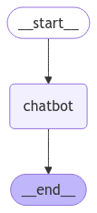

<style>
.custom {
    background-color: #008d8d;
    color: white;
    padding: 0.25em 0.5em 0.25em 0.5em;
    white-space: pre-wrap;       /* css-3 */
    white-space: -moz-pre-wrap;  /* Mozilla, since 1999 */
    white-space: -pre-wrap;      /* Opera 4-6 */
    white-space: -o-pre-wrap;    /* Opera 7 */
    word-wrap: break-word;
}

pre {
    background-color: #027c7c;
    padding-left: 0.5em;
}

</style>

# Building a Basic Chatbot with LangGraph

- Author: [r14minji](https://github.com/r14minji)
- Design: 
- Peer Review: 
- This is a part of [LangChain Open Tutorial](https://github.com/LangChain-OpenTutorial/LangChain-OpenTutorial)

[](https://colab.research.google.com/github/LangChain-OpenTutorial/LangChain-OpenTutorial/blob/main/99-TEMPLATE/00-BASE-TEMPLATE-EXAMPLE.ipynb) [](https://github.com/LangChain-OpenTutorial/LangChain-OpenTutorial/blob/main/99-TEMPLATE/00-BASE-TEMPLATE-EXAMPLE.ipynb)

## Overview

In this document, we explore how to build a simple chatbot using LangGraph, a framework that allows the creation of state machine-based chatbots. 
The process is broken down into manageable steps, covering key concepts like defining states, creating nodes, adding edges, compiling the graph, visualizing the chatbot structure, and finally executing the chatbot.

### Table of Contents

- [Overview](#overview)
- [Environment Setup](#environment-setup)
- [Step-by-Step: Understanding the Concepts](#step-by-step-understanding-the-concepts)
- [Complete Code](#complete-code)


### References

- [LangChain](https://blog.langchain.dev/)
- [LangGraph](https://www.langchain.com/langgraph)
----

## Environment Setup

Setting up your environment is the first step. See the [Environment Setup](https://wikidocs.net/257836) guide for more details.


**[Note]**

The langchain-opentutorial is a package of easy-to-use environment setup guidance, useful functions and utilities for tutorials.
Check out the  [`langchain-opentutorial`](https://github.com/LangChain-OpenTutorial/langchain-opentutorial-pypi) for more details.

```python
%%capture --no-stderr
%pip install langchain-opentutorial
```

```python
# Install required packages
from langchain_opentutorial import package

package.install(
    [
        "langsmith",
        "langgraph",
        "langchain_core",
        "langchain_openai",
    ],
    verbose=False,
    upgrade=False,
)
```

```python
from dotenv import load_dotenv
from langchain_opentutorial import set_env

# Attempt to load environment variables from a .env file; if unsuccessful, set them manually.
if not load_dotenv():
    set_env(
        {
            "OPENAI_API_KEY": "",
            "LANGCHAIN_API_KEY": "",
            "LANGCHAIN_TRACING_V2": "true",
            "LANGCHAIN_ENDPOINT": "https://api.smith.langchain.com",
            "LANGCHAIN_PROJECT": "",  # set the project name same as the title
        }
    )
```

You can set API keys in a `.env` file or set them manually.

[Note] If you’re not using the `.env` file, no worries! Just enter the keys directly in the cell below, and you’re good to go.

```python
# Load API keys from .env file
from dotenv import load_dotenv

load_dotenv(override=True)
```


<pre class="custom">True</pre>


## Step-by-Step: Understanding the Concepts

By following these steps, you will have a functional and clearly structured chatbot built with LangGraph!

### STEP 1. Defining the State

- We start by defining the state of the chatbot using Python's `TypedDict` . The state keeps track of messages, which are updated as the conversation progresses.

```python
from typing import Annotated, TypedDict
from langgraph.graph import StateGraph, START, END
from langgraph.graph.message import add_messages


class State(TypedDict):
    # Define messages (a list type, with the add_messages function used to append messages)
    messages: Annotated[list, add_messages]

```

### STEP 2. Defining the Nodes

- Add a "chatbot" node.
- Nodes represent individual units of work and are typically implemented as regular Python functions.

```python
from langchain_openai import ChatOpenAI

# Define the LLM
llm = ChatOpenAI(model="gpt-4o-mini", temperature=0)


# Define the chatbot function
def chatbot(state: State):
    # Invoke messages and return the result
    return {"messages": [llm.invoke(state["messages"])]}

```

### STEP 3. Defining the Graph and Add Nodes
- Create a graph and include the defined nodes.
- The "chatbot" node function takes the current State as input and returns a dictionary (`TypedDict` ) containing the updated list of messages under the key "messages".
- The `add_messages` function in the State appends the LLM's response to the existing messages in the state.

```python
# Create the graph
graph_builder = StateGraph(State)

# Add a node by specifying its name and the associated function or callable object
graph_builder.add_node("chatbot", chatbot)
```


<pre class="custom"><langgraph.graph.state.StateGraph at 0x1193a8150></pre>


### STEP 4. Adding Graph Edges
- Define the flow of the graph by adding edges:
    - START: Specifies the entry point where the graph execution begins.
    - END: Marks the termination point of the graph's flow.

```python
# Add an edge from the start node to the chatbot node
graph_builder.add_edge(START, "chatbot")
```


<pre class="custom"><langgraph.graph.state.StateGraph at 0x1193a8150></pre>


```python
# Add an edge from the chatbot node to the end node
graph_builder.add_edge("chatbot", END)
```


<pre class="custom"><langgraph.graph.state.StateGraph at 0x1193a8150></pre>


### STEP 5. Compiling the Graph
- To execute the graph, call the `compile()` method using the graph builder.
- This generates a `CompiledGraph` , which can be invoked during runtime to process states.

```python
# Compile the graph
graph = graph_builder.compile()
```

### STEP 6. Visualizing the Graph
- Visualizing the graph helps you understand its structure and how different nodes and edges are connected.

```python
from IPython.display import Image, display
from langchain_core.runnables.graph import MermaidDrawMethod

# Visualize the graph
display(
    Image(
        graph.get_graph().draw_mermaid_png(
            draw_method=MermaidDrawMethod.API,
        )
    )
)
```


    

    


### STEP 7. Running the Graph
- Let's run the chatbot with a sample question!

```python
question = "Recommend the top 10 famous restaurants in New York"

# Stream the graph events
for event in graph.stream({"messages": [("user", question)]}):
    # Print the event values
    for value in event.values():
        print("Assistant:", value["messages"][-1].content)
```

<pre class="custom">Assistant: New York City is home to a diverse and vibrant culinary scene, featuring a wide range of cuisines and dining experiences. Here are ten famous restaurants that are highly regarded and have made a significant impact on the city's dining landscape:
    
    1. **Eleven Madison Park** - Known for its innovative plant-based tasting menu and exceptional service, this Michelin-starred restaurant offers a unique fine dining experience in a stunning Art Deco setting.
    
    2. **Le Bernardin** - A celebrated French seafood restaurant, Le Bernardin is renowned for its elegant dishes and impeccable service. It has consistently received high accolades, including multiple Michelin stars.
    
    3. **Peter Luger Steak House** - A Brooklyn institution since 1887, Peter Luger is famous for its no-frills approach to steak, serving some of the best dry-aged beef in the city.
    
    4. **Katz's Delicatessen** - An iconic deli on the Lower East Side, Katz's is famous for its pastrami sandwiches and has been a beloved New York institution since 1888.
    
    5. **Momofuku Noodle Bar** - Founded by chef David Chang, this casual eatery is known for its delicious ramen and innovative Asian-inspired dishes, making it a must-visit for food lovers.
    
    6. **The Spotted Pig** - A gastropub in the West Village, The Spotted Pig is known for its cozy atmosphere and delicious British-inspired comfort food, including its famous burger.
    
    7. **Carbone** - This Italian-American restaurant in Greenwich Village is known for its classic dishes and vibrant atmosphere, making it a popular spot for both locals and tourists.
    
    8. **Blue Hill** - Located in Greenwich Village, Blue Hill focuses on farm-to-table dining, featuring seasonal ingredients sourced from local farms. The menu changes frequently to reflect the freshest produce.
    
    9. **Balthazar** - A bustling French brasserie in SoHo, Balthazar is known for its classic French dishes, bakery items, and lively atmosphere, making it a favorite for brunch and dinner.
    
    10. **Shake Shack** - While it started as a food cart in Madison Square Park, Shake Shack has become a global phenomenon known for its delicious burgers, crinkle-cut fries, and shakes.
    
    These restaurants represent a mix of fine dining, casual eateries, and iconic spots that showcase the culinary diversity of New York City. Reservations are often recommended, especially for the more popular establishments.
</pre>

## Complete Code

This code provides the full process of creating a simple chatbot using LangGraph, including defining the state, nodes, edges, compiling the graph, visualizing it, and running it with a user query.

```python
from typing import Annotated, TypedDict
from langgraph.graph import StateGraph, START, END
from langgraph.graph.message import add_messages
from langchain_openai import ChatOpenAI
from IPython.display import Image, display
from langchain_core.runnables.graph import MermaidDrawMethod

# STEP 1: Define the State
class State(TypedDict):
    # Define messages (a list type, with the add_messages function used to append messages)
    messages: Annotated[list, add_messages]

# STEP 2: Define the LLM
llm = ChatOpenAI(model="gpt-4o-mini", temperature=0)

# STEP 3: Define the chatbot function
def chatbot(state: State):
    # Invoke messages and return the result
    return {"messages": [llm.invoke(state["messages"])]}

# STEP 4: Create the graph
graph_builder = StateGraph(State)

# STEP 5: Add nodes
graph_builder.add_node("chatbot", chatbot)

# STEP 6: Add edges
graph_builder.add_edge(START, "chatbot")
graph_builder.add_edge("chatbot", END)

# STEP 7: Compile the graph
graph = graph_builder.compile()

# STEP 8: Visualize the graph
display(
    Image(
        graph.get_graph().draw_mermaid_png(
            draw_method=MermaidDrawMethod.API,
        )
    )
)

# STEP 9: Run the graph with a sample question
question = "Recommend the top 10 famous restaurants in New York"

# Stream the graph events
for event in graph.stream({"messages": [("user", question)]}):
    # Print the event values
    for value in event.values():
        print("Assistant:", value["messages"][-1].content)
```


    

    


    Assistant: New York City is home to a diverse and vibrant culinary scene, featuring a wide range of cuisines and dining experiences. Here are ten famous restaurants that are highly regarded and have made a significant impact on the city's food culture:
    
    1. **Eleven Madison Park** - Known for its innovative plant-based tasting menu and exceptional service, this Michelin-starred restaurant offers a unique fine dining experience in a stunning Art Deco setting.
    
    2. **Le Bernardin** - A celebrated French seafood restaurant, Le Bernardin is renowned for its elegant dishes and impeccable service. It has consistently received high accolades, including multiple Michelin stars.
    
    3. **Katz's Delicatessen** - An iconic deli famous for its pastrami sandwiches, Katz's has been a staple of New York's culinary scene since 1888. It's a must-visit for a classic New York experience.
    
    4. **Peter Luger Steak House** - Established in 1887, this legendary steakhouse in Williamsburg is famous for its no-frills atmosphere and top-quality steaks, particularly the porterhouse.
    
    5. **Momofuku Noodle Bar** - Founded by chef David Chang, this casual eatery is known for its delicious ramen and innovative Asian-inspired dishes, making it a favorite among locals and visitors alike.
    
    6. **The Spotted Pig** - A gastropub in the West Village, The Spotted Pig is known for its cozy atmosphere and delicious British-inspired fare, including its famous burger and shepherd's pie.
    
    7. **Carbone** - This Italian-American restaurant in Greenwich Village is celebrated for its classic dishes and retro ambiance. Reservations are highly sought after, and the spicy rigatoni vodka is a standout.
    
    8. **Blue Hill** - Located in Greenwich Village, Blue Hill focuses on farm-to-table dining, featuring seasonal ingredients sourced from local farms. The tasting menu highlights the best of what the region has to offer.
    
    9. **Shake Shack** - Starting as a food cart in Madison Square Park, Shake Shack has become a beloved fast-casual chain known for its burgers, crinkle-cut fries, and shakes. It's a quintessential New York experience.
    
    10. **Balthazar** - A bustling French brasserie in SoHo, Balthazar is famous for its classic French dishes, bakery items, and vibrant atmosphere. It's a popular spot for brunch and dinner alike.
    
    These restaurants represent just a fraction of the incredible dining options available in New York City, each offering a unique taste of the city's culinary landscape. Reservations are often recommended, especially for the more popular spots!
    
