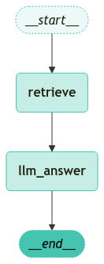

<style>
.custom {
    background-color: #008d8d;
    color: white;
    padding: 0.25em 0.5em 0.25em 0.5em;
    white-space: pre-wrap;       /* css-3 */
    white-space: -moz-pre-wrap;  /* Mozilla, since 1999 */
    white-space: -pre-wrap;      /* Opera 4-6 */
    white-space: -o-pre-wrap;    /* Opera 7 */
    word-wrap: break-word;
}

pre {
    background-color: #027c7c;
    padding-left: 0.5em;
}

</style>

# Naive RAG

- Author: [Youngjun cho](https://github.com/choincnp)
- Design: [LeeYuChul](https://github.com/LeeYuChul)
- Peer Review: 
- This is a part of [LangChain Open Tutorial](https://github.com/LangChain-OpenTutorial/LangChain-OpenTutorial)

[](https://colab.research.google.com/github/LangChain-OpenTutorial/LangChain-OpenTutorial/blob/main/99-TEMPLATE/00-BASE-TEMPLATE-EXAMPLE.ipynb) [](https://github.com/LangChain-OpenTutorial/LangChain-OpenTutorial/blob/main/99-TEMPLATE/00-BASE-TEMPLATE-EXAMPLE.ipynb)

## Overview

In this chapter, Section 02(Naive-RAG) through Section 05(Add-Query-Rewrite) is not an independent section, but cover one topic.

We'll make a basic RAG on this section, and make more complicated RAG as sections goes by.

### Table of Contents

- [Overview](#overview)
- [Environment Setup](#environment-setup)
- [Procedure](#procedure)
- [Creating a Basic PDF-Based Retrieval Chain](#creating-a-basic-pdf-based-retrieval-chain)
- [Defining State](#defining-state)
- [Defining Nodes](#defining-nodes)
- [Creating the Graph](#creating-the-graph)
- [Excuting the Graph](#executing-the-graph)

### References

- [LangGraph Streaming](https://python.langchain.com/docs/concepts/streaming/)
----

## Environment Setup

Setting up your environment is the first step. See the [Environment Setup](https://wikidocs.net/257836) guide for more details.


**[Note]**

The langchain-opentutorial is a package of easy-to-use environment setup guidance, useful functions and utilities for tutorials.
Check out the  [`langchain-opentutorial`](https://github.com/LangChain-OpenTutorial/langchain-opentutorial-pypi) for more details.

```python
%%capture --no-stderr
%pip install langchain-opentutorial
```

```python
# Install required packages
from langchain_opentutorial import package

package.install(
    [
        "langsmith",
        "langchain",
        "langchain_core",
        "langchain_community",
        "langgraph",
        "typing",
        "langchain-opentutorial"
    ],
    verbose=False,
    upgrade=False,
)
```

You can set API keys in a `.env` file or set them manually.

[Note] If you’re not using the `.env` file, no worries! Just enter the keys directly in the cell below, and you’re good to go.

```python
from dotenv import load_dotenv
from langchain_opentutorial import set_env

# Attempt to load environment variables from a .env file; if unsuccessful, set them manually.
if not load_dotenv():
    set_env(
        {
            "OPENAI_API_KEY": "",
            "LANGCHAIN_API_KEY": "",
            "LANGCHAIN_TRACING_V2": "true",
            "LANGCHAIN_ENDPOINT": "https://api.smith.langchain.com",
            "LANGCHAIN_PROJECT": "02-LangGraph-Naive-RAG",  # set the project name same as the title
        }
    )
```

## Procedure

Perform `Naive RAG`, the basic RAG system which has 2 progress, **Retrieve** and **Generate** .

You can see the structure in the image below.


## Creating a Basic PDF-Based Retrieval Chain

This section creates a Retrieval Chain based on a **PDF document** . It is the simplest structure of a Retrieval Chain.

In `LangGraph` , Retrievers and Chains are created separately. This allows detailed processing for each node.

```python

```

```python
from rag.pdf import PDFRetrievalChain

# Load the PDF document
pdf = PDFRetrievalChain(["data/A European Approach to Artificial Intelligence - A Policy Perspective.pdf"]).create_chain()

# Create retriever and chain
pdf_retriever = pdf.retriever
pdf_chain = pdf.chain
```

First, use the `pdf_retriever` to fetch search results.

You can control the quantity to retrieve, by changing `self_k` argument in `pdf.py` file.

```python
search_result = pdf_retriever.invoke(
    "Where has the application of AI in healthcare been confined to so far?"
)
search_result
```


<pre class="custom">[Document(id='76d10387-a006-4d7c-8bd1-c316831d6094', metadata={'source': 'data/A European Approach to Artificial Intelligence - A Policy Perspective.pdf', 'file_path': 'data/A European Approach to Artificial Intelligence - A Policy Perspective.pdf', 'page': 14, 'total_pages': 24, 'CreationDate': "D:20200922223534+02'00'", 'Creator': 'Adobe InDesign 15.1 (Macintosh)', 'ModDate': "D:20200922223544+02'00'", 'Producer': 'Adobe PDF Library 15.0', 'Trapped': 'False'}, page_content='activities. So far, however, AI applications in healthcare have been potential. Specific healthcare training should be provided to data\nconfined to administrative tasks (i.e., Natural Language Processing scientists working in hospitals so that they can better understand'),
     Document(id='f4f78deb-c8d9-4c84-a3e4-a91b0477413d', metadata={'source': 'data/A European Approach to Artificial Intelligence - A Policy Perspective.pdf', 'file_path': 'data/A European Approach to Artificial Intelligence - A Policy Perspective.pdf', 'page': 14, 'total_pages': 24, 'CreationDate': "D:20200922223534+02'00'", 'Creator': 'Adobe InDesign 15.1 (Macintosh)', 'ModDate': "D:20200922223544+02'00'", 'Producer': 'Adobe PDF Library 15.0', 'Trapped': 'False'}, page_content='are great, as more use of AI in research and development could\nHealthcare is arguably the sector where AI could make the lead to a more personalised healthcare based on patients’ data.'),
     Document(id='e393ec31-5738-4454-aab0-bf1f33ec1d18', metadata={'source': 'data/A European Approach to Artificial Intelligence - A Policy Perspective.pdf', 'file_path': 'data/A European Approach to Artificial Intelligence - A Policy Perspective.pdf', 'page': 10, 'total_pages': 24, 'CreationDate': "D:20200922223534+02'00'", 'Creator': 'Adobe InDesign 15.1 (Macintosh)', 'ModDate': "D:20200922223544+02'00'", 'Producer': 'Adobe PDF Library 15.0', 'Trapped': 'False'}, page_content='intermediate / professional users (i.e., healthcare professionals). the safety of employees. The key application of AI is certainly in\nThis is a matter of privacy and personal data protection, of building predictive maintenance. Yet, the more radical transformation of'),
     Document(id='693acf63-9fbf-4e71-9128-71b230dcd17f', metadata={'source': 'data/A European Approach to Artificial Intelligence - A Policy Perspective.pdf', 'file_path': 'data/A European Approach to Artificial Intelligence - A Policy Perspective.pdf', 'page': 15, 'total_pages': 24, 'CreationDate': "D:20200922223534+02'00'", 'Creator': 'Adobe InDesign 15.1 (Macintosh)', 'ModDate': "D:20200922223544+02'00'", 'Producer': 'Adobe PDF Library 15.0', 'Trapped': 'False'}, page_content='Remote sible, as AI solutions can increasingly divert patients ning healthcare professionals, starting from the simple\nhealthcare to appropriate solutions for their specific symptoms tasks and diagnostic appointments.\nand underlying conditions.\n16'),
     Document(id='764ba481-f984-47e9-b86b-98250eda7ad1', metadata={'source': 'data/A European Approach to Artificial Intelligence - A Policy Perspective.pdf', 'file_path': 'data/A European Approach to Artificial Intelligence - A Policy Perspective.pdf', 'page': 14, 'total_pages': 24, 'CreationDate': "D:20200922223534+02'00'", 'Creator': 'Adobe InDesign 15.1 (Macintosh)', 'ModDate': "D:20200922223544+02'00'", 'Producer': 'Adobe PDF Library 15.0', 'Trapped': 'False'}, page_content='same. The Covid-19 crisis has shown how strained our National\nHealthcare Systems are, and AI solutions could help meet the cur- AI in the healthcare faces organisational and skill challenges. One'),
     Document(id='c0f68d31-3ebf-45f7-bf6c-cef790cb6f92', metadata={'source': 'data/A European Approach to Artificial Intelligence - A Policy Perspective.pdf', 'file_path': 'data/A European Approach to Artificial Intelligence - A Policy Perspective.pdf', 'page': 3, 'total_pages': 24, 'CreationDate': "D:20200922223534+02'00'", 'Creator': 'Adobe InDesign 15.1 (Macintosh)', 'ModDate': "D:20200922223544+02'00'", 'Producer': 'Adobe PDF Library 15.0', 'Trapped': 'False'}, page_content='advanced robots, autonomous cars, drones or Internet of Things place, a recent EIT Health Report envisages more in healthcare in\napplications)”. Broad AI definitions cover several technologies, in- the near future, such as remote monitoring, AI-powered alerting'),
     Document(id='8594b8a3-aef5-44ae-93aa-7f1d5afeaaa3', metadata={'source': 'data/A European Approach to Artificial Intelligence - A Policy Perspective.pdf', 'file_path': 'data/A European Approach to Artificial Intelligence - A Policy Perspective.pdf', 'page': 21, 'total_pages': 24, 'CreationDate': "D:20200922223534+02'00'", 'Creator': 'Adobe InDesign 15.1 (Macintosh)', 'ModDate': "D:20200922223544+02'00'", 'Producer': 'Adobe PDF Library 15.0', 'Trapped': 'False'}, page_content='EIT Health and McKinsey & Company, (2020), Transforming healthcare with AI. Impact Scherer, M. (2016). Regulating Artificial Intelligence Systems: Risks, Challenges, Compe-'),
     Document(id='98d019bc-1a7e-4273-8eac-eff09d7bf756', metadata={'source': 'data/A European Approach to Artificial Intelligence - A Policy Perspective.pdf', 'file_path': 'data/A European Approach to Artificial Intelligence - A Policy Perspective.pdf', 'page': 15, 'total_pages': 24, 'CreationDate': "D:20200922223534+02'00'", 'Creator': 'Adobe InDesign 15.1 (Macintosh)', 'ModDate': "D:20200922223544+02'00'", 'Producer': 'Adobe PDF Library 15.0', 'Trapped': 'False'}, page_content='very sensitive. An extensive use to feed AI tools can the use of patient’s data in the hospitals that deploy\nHealth data raise many concerns. Data ownership is also an issue AI-powered applications. The patients should be aware'),
     Document(id='b63de5ec-3554-488f-a4c0-1975c0c9e39f', metadata={'source': 'data/A European Approach to Artificial Intelligence - A Policy Perspective.pdf', 'file_path': 'data/A European Approach to Artificial Intelligence - A Policy Perspective.pdf', 'page': 14, 'total_pages': 24, 'CreationDate': "D:20200922223534+02'00'", 'Creator': 'Adobe InDesign 15.1 (Macintosh)', 'ModDate': "D:20200922223544+02'00'", 'Producer': 'Adobe PDF Library 15.0', 'Trapped': 'False'}, page_content='to extract information from clinical notes or predictive scheduling healthcare practitioners needs. In addition, at the regulatory le-\nof the visits) and diagnostic (machine and deep learning applied to vel it is important that new AI regulation is harmonised with other'),
     Document(id='7c4c1675-87ad-47ba-8df1-39e8036cf6c2', metadata={'source': 'data/A European Approach to Artificial Intelligence - A Policy Perspective.pdf', 'file_path': 'data/A European Approach to Artificial Intelligence - A Policy Perspective.pdf', 'page': 14, 'total_pages': 24, 'CreationDate': "D:20200922223534+02'00'", 'Creator': 'Adobe InDesign 15.1 (Macintosh)', 'ModDate': "D:20200922223544+02'00'", 'Producer': 'Adobe PDF Library 15.0', 'Trapped': 'False'}, page_content='greatest impact in addressing societal challenges. Given rising de- A second challenge is that of finding a common language and un-\nmands and costs, AI could help doing more and better with the derstanding between data experts and healthcare professionals.')]</pre>


Pass the search result as context to the chain.

```python
# Generate an answer based on the search results
answer = pdf_chain.invoke(
    {
        "question": "Where has the application of AI in healthcare been confined to so far?",
        "context": search_result,
        "chat_history": [],
    }
)
print(answer)
```

<pre class="custom">The application of AI in healthcare has so far been confined primarily to administrative tasks, such as Natural Language Processing for extracting information from clinical notes and predictive scheduling. There is potential for more extensive use in research and development, but significant applications remain limited.
    
    **Source**
    - data/A European Approach to Artificial Intelligence - A Policy Perspective.pdf (page 14)
</pre>

## Defining State

`State` defines the **shared state** among the nodes and another nodes.

Typically, the `TypedDict` format is used.

```python
from typing import Annotated, TypedDict
from langgraph.graph.message import add_messages

# Define GraphState
class GraphState(TypedDict):
    question: Annotated[str, "Question"]  # Question
    context: Annotated[str, "Context"]  # Search results from the document
    answer: Annotated[str, "Answer"]  # Answer
    messages: Annotated[list, add_messages]  # Messages (accumulated list)
```

## Defining Nodes

`Nodes` : These are nodes that handle each stage, typically implemented as Python functions. Inputs and outputs are the State values.

[ **Note** ]  
- A `State` is taken as input, performs the defined logic, and returns an **updated** `State` .

```python
from rag.utils import format_docs
from langchain_opentutorial.messages import messages_to_history

# Node that retrieve document
def retrieve_document(state: GraphState) -> GraphState:
    # Get the question from the state
    latest_question = state["question"]

    # Search the document to find relevant sections
    retrieved_docs = pdf_retriever.invoke(latest_question)

    # Format the retrieved documents (to input into a prompt)
    retrieved_docs = format_docs(retrieved_docs)
    
    # Save the retrieved documents in the key named context
    return {"context": retrieved_docs}


# Node that generate answer
def llm_answer(state: GraphState) -> GraphState:
    # Get the question from the state
    latest_question = state["question"]

    # Get the retrieved documents from the state
    context = state["context"]

    # Call the chain to generate an answer
    response = pdf_chain.invoke(
        {
            "question": latest_question,
            "context": context,
            "chat_history": messages_to_history(state["messages"]),
        }
    )

    # Save the generated answer and (user question, answer) messages in the state
    return {
        "answer": response,
        "messages": [("user", latest_question), ("assistant", response)],
    }
```

## Creating the Graph

`Edges` : Python functions that determine the next `Node` to execute based on the **current** `State` .

There can be general edges and conditional edges.

```python
from langgraph.graph import END, StateGraph
from langgraph.checkpoint.memory import MemorySaver

# Create a graph
workflow = StateGraph(GraphState)

# Define nodes
workflow.add_node("retrieve", retrieve_document)
workflow.add_node("llm_answer", llm_answer)

# Define edges
workflow.add_edge("retrieve", "llm_answer")  # Retrieval -> Answer generation
workflow.add_edge("llm_answer", END)  # Answer generation -> End

# Set entry point for the graph
workflow.set_entry_point("retrieve")

# Set up a checkpointer
memory = MemorySaver()

# Compile the graph
app = workflow.compile(checkpointer=memory)
```

Visualize the compiled graph.

```python
from langchain_opentutorial.graphs import visualize_graph

visualize_graph(app) 
```


    

    


## Executing the Graph

- The `config` parameter provides configuration informations necessary for graph execution.
- `recursion_limit` : Sets the maximum recursion depth for graph execution.
- `inputs` : Provides the input data for the graph execution.

The `stream_graph` function below streams only specific nodes.

You can easily check the **streaming output** of a **specific node** .

```python
from langchain_core.runnables import RunnableConfig
from langchain_opentutorial.messages import invoke_graph, stream_graph, random_uuid

# Configure settings (recursion limit, thread_id)
config = RunnableConfig(recursion_limit=20, configurable={"thread_id": random_uuid()})

# Question input
inputs = GraphState(
    question="Where has the application of AI in healthcare been confined to so far?"
)

# Execute the graph
invoke_graph(app, inputs, config)
```

<pre class="custom">
    ==================================================
    🔄 Node: retrieve 🔄
    - - - - - - - - - - - - - - - - - - - - - - - - - 
    context:
    <document><content>activities. So far, however, AI applications in healthcare have been potential. Specific healthcare training should be provided to data
    confined to administrative tasks (i.e., Natural Language Processing scientists working in hospitals so that they can better understand</content><source>data/A European Approach to Artificial Intelligence - A Policy Perspective.pdf</source><page>15</page></document>
    <document><content>are great, as more use of AI in research and development could
    Healthcare is arguably the sector where AI could make the lead to a more personalised healthcare based on patients’ data.</content><source>data/A European Approach to Artificial Intelligence - A Policy Perspective.pdf</source><page>15</page></document>
    <document><content>intermediate / professional users (i.e., healthcare professionals). the safety of employees. The key application of AI is certainly in
    This is a matter of privacy and personal data protection, of building predictive maintenance. Yet, the more radical transformation of</content><source>data/A European Approach to Artificial Intelligence - A Policy Perspective.pdf</source><page>11</page></document>
    <document><content>Remote sible, as AI solutions can increasingly divert patients ning healthcare professionals, starting from the simple
    healthcare to appropriate solutions for their specific symptoms tasks and diagnostic appointments.
    and underlying conditions.
    16</content><source>data/A European Approach to Artificial Intelligence - A Policy Perspective.pdf</source><page>16</page></document>
    <document><content>same. The Covid-19 crisis has shown how strained our National
    Healthcare Systems are, and AI solutions could help meet the cur- AI in the healthcare faces organisational and skill challenges. One</content><source>data/A European Approach to Artificial Intelligence - A Policy Perspective.pdf</source><page>15</page></document>
    <document><content>advanced robots, autonomous cars, drones or Internet of Things place, a recent EIT Health Report envisages more in healthcare in
    applications)”. Broad AI definitions cover several technologies, in- the near future, such as remote monitoring, AI-powered alerting</content><source>data/A European Approach to Artificial Intelligence - A Policy Perspective.pdf</source><page>4</page></document>
    <document><content>EIT Health and McKinsey & Company, (2020), Transforming healthcare with AI. Impact Scherer, M. (2016). Regulating Artificial Intelligence Systems: Risks, Challenges, Compe-</content><source>data/A European Approach to Artificial Intelligence - A Policy Perspective.pdf</source><page>22</page></document>
    <document><content>very sensitive. An extensive use to feed AI tools can the use of patient’s data in the hospitals that deploy
    Health data raise many concerns. Data ownership is also an issue AI-powered applications. The patients should be aware</content><source>data/A European Approach to Artificial Intelligence - A Policy Perspective.pdf</source><page>16</page></document>
    <document><content>to extract information from clinical notes or predictive scheduling healthcare practitioners needs. In addition, at the regulatory le-
    of the visits) and diagnostic (machine and deep learning applied to vel it is important that new AI regulation is harmonised with other</content><source>data/A European Approach to Artificial Intelligence - A Policy Perspective.pdf</source><page>15</page></document>
    <document><content>greatest impact in addressing societal challenges. Given rising de- A second challenge is that of finding a common language and un-
    mands and costs, AI could help doing more and better with the derstanding between data experts and healthcare professionals.</content><source>data/A European Approach to Artificial Intelligence - A Policy Perspective.pdf</source><page>15</page></document>
    ==================================================
    
    ==================================================
    🔄 Node: llm_answer 🔄
    - - - - - - - - - - - - - - - - - - - - - - - - - 
    answer:
    The application of AI in healthcare has so far been confined primarily to administrative tasks, such as Natural Language Processing for extracting information from clinical notes and predictive scheduling. 
    
    **Source**
    - data/A European Approach to Artificial Intelligence - A Policy Perspective.pdf (page 15)
    ('user', 'Where has the application of AI in healthcare been confined to so far?')
    ('assistant', 'The application of AI in healthcare has so far been confined primarily to administrative tasks, such as Natural Language Processing for extracting information from clinical notes and predictive scheduling. \n\n**Source**\n- data/A European Approach to Artificial Intelligence - A Policy Perspective.pdf (page 15)')
    ==================================================
</pre>

```python
# Stream the graph outputs
stream_graph(app, inputs, config)
```

<pre class="custom">
    ==================================================
    🔄 Node: llm_answer 🔄
    - - - - - - - - - - - - - - - - - - - - - - - - - 
    The application of AI in healthcare has so far been confined primarily to administrative tasks, such as Natural Language Processing for extracting information from clinical notes and predictive scheduling.
    
    **Source**
    - data/A European Approach to Artificial Intelligence - A Policy Perspective.pdf (page 15)</pre>

```python
outputs = app.get_state(config).values

print(f'Question: {outputs["question"]}')
print("===" * 20)
print(f'Answer:\n{outputs["answer"]}')
```

<pre class="custom">Question: Where has the application of AI in healthcare been confined to so far?
    ============================================================
    Answer:
    The application of AI in healthcare has so far been confined primarily to administrative tasks, such as Natural Language Processing for extracting information from clinical notes and predictive scheduling.
    
    **Source**
    - data/A European Approach to Artificial Intelligence - A Policy Perspective.pdf (page 15)
</pre>
