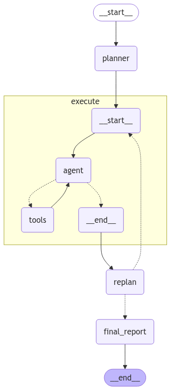

<style>
.custom {
    background-color: #008d8d;
    color: white;
    padding: 0.25em 0.5em 0.25em 0.5em;
    white-space: pre-wrap;       /* css-3 */
    white-space: -moz-pre-wrap;  /* Mozilla, since 1999 */
    white-space: -pre-wrap;      /* Opera 4-6 */
    white-space: -o-pre-wrap;    /* Opera 7 */
    word-wrap: break-word;
}

pre {
    background-color: #027c7c;
    padding-left: 0.5em;
}

</style>

# Plan-and-Execute

- Author: [ranian963](https://github.com/ranian963)
- Peer Review:
- This is a part of [LangChain Open Tutorial](https://github.com/LangChain-OpenTutorial/LangChain-OpenTutorial)

[](https://colab.research.google.com/github/LangChain-OpenTutorial/LangChain-OpenTutorial/blob/main/17-LangGraph/03-Use-Cases/05-langgraph-plan-and-execute.ipynb) [](https://github.com/LangChain-OpenTutorial/LangChain-OpenTutorial/blob/main/17-LangGraph/03-Use-Cases/05-langgraph-plan-and-execute.ipynb)

## Overview
This tutorial introduces how to create a `plan-and-execute` style agent and explains, step by step, how to implement it using [LangGraph](https://langchain-ai.github.io/langgraph/).  
The `plan-and-execute` approach is useful for tackling complex tasks by first establishing a long-term plan, then executing each step of that plan, and revising it as needed.



### Table of Contents

- [Overview](#overview)
- [Environment Setup](#environment-setup)
- [Plan-and-Execute Definition](#plan-and-execute-definition)
- [Defining Tools](#defining-tools)
- [Defining the Execution Agent](#defining-the-execution-agent)
- [State Definition](#state-definition)
- [Plan Step](#plan-step)
- [Re-plan Step](#re-plan-step)
- [Creating the Graph](#creating-the-graph)
- [Graph Visualization](#graph-visualization)
- [Running the Graph](#running-the-graph)
- [Checking the Final Report](#checking-the-final-report)

### References

- [LangChain](https://blog.langchain.dev/)
- [LangGraph](https://langchain-ai.github.io/langgraph/)  
- [Plan-and-Solve Paper](https://arxiv.org/abs/2305.04091)  
- [Baby-AGI Project](https://github.com/yoheinakajima/babyagi)  
- [ReAct Paper](https://arxiv.org/abs/2210.03629)
----

## Environment Setup

Setting up your environment is the first step. See the [Environment Setup](https://wikidocs.net/257836) guide for more details.


**[Note]**

The langchain-opentutorial is a package of easy-to-use environment setup guidance, useful functions and utilities for tutorials.
Check out the  [`langchain-opentutorial`](https://github.com/LangChain-OpenTutorial/langchain-opentutorial-pypi) for more details.

```python
%%capture --no-stderr
%pip install langchain-opentutorial
```

```python
# Install required packages
from langchain_opentutorial import package

package.install(
    [
        "langsmith",
        "langchain",
        "langchain_core",
        "langchain-anthropic",
        "langchain_community",
        "langchain_text_splitters",
        "langchain_openai",
        "langgraph",
    ],
    verbose=False,
    upgrade=False,
)
```

You can set API keys in a `.env` file or set them manually.

[Note] If you’re not using the `.env` file, no worries! Just enter the keys directly in the cell below, and you’re good to go.

```python
from dotenv import load_dotenv
from langchain_opentutorial import set_env

# Attempt to load environment variables from a .env file; if unsuccessful, set them manually.
if not load_dotenv():
    set_env(
        {
            "OPENAI_API_KEY": "",
            "LANGCHAIN_API_KEY": "",
            "LANGCHAIN_TRACING_V2": "true",
            "LANGCHAIN_ENDPOINT": "https://api.smith.langchain.com",
            "LANGCHAIN_PROJECT": "05-LangGraph-Plan-and-Execute",
            "TAVILY_API_KEY": "",
        }
    )
```

## Plan-and-Execute Definition

A `plan-and-execute` approach is characterized by:
- Long-Term Planning: Before performing a complex task, it first establishes a high-level plan.
- Step-by-Step Execution and Replanning: It carries out the plan in stages, checking at each step whether the plan is still valid and updating it if necessary.

This method is inspired by the [Plan-and-Solve Peper](https://arxiv.org/abs/2305.04091) and the [Baby-AGI Project](https://github.com/yoheinakajima/babyagi). Unlike the more traditional [ReAct Style](https://arxiv.org/abs/2210.03629), which focuses on short-term reasoning one step at a time, `plan-and-execute` explicitly emphasizes long-term planning.

Advantages:

1. **Clear Long-Term Structure**: Even powerful LLMs can struggle to handle extended plans in a single pass. By explicitly defining a long-term plan, the process becomes more robust.
2. **Efficient Model Usage**: A larger or more powerful model can be used for the planning phase, while a smaller or lighter model can handle the execution phase, optimizing resource utilization.

The sections below explain how to implement a `plan-and-execute` agent in LangGraph, step by step.

### Defining the Model Name for the Examples

We will define the model name to be used in these demonstrations.

> **Note**  
> 1. Since `MODEL_NAME` appears frequently, we declare it as a separate variable.  
> 2. It is recommended to run this with a model such as `gpt-4o` (or another GPT-4-level model). If you use a smaller model like `gpt-40-mini`, you may encounter frequent replanning.


```python
MODEL_NAME = "gpt-4o"
```

## Defining Tools

We first define the tools to be used.

In this simple example, we will use the built-in search tool provided by `Tavily`. Of course, it is equally straightforward to create your own custom tools as needed.

For more details, refer to the [Tools](https://langchain-opentutorial.gitbook.io/langchain-opentutorial/15-agent/01-tools) documentation.


```python
from langchain_community.tools.tavily_search import TavilySearchResults

# Create an instance of TavilySearchResults with k=3 for retrieving up to 3 search results
tavily_web_search = TavilySearchResults(k=3)

tools = [tavily_web_search]
tools
```

## Defining the Execution Agent

We now create the `execution agent` responsible for performing tasks.

In this example, the same `execution agent` will be used for each task, but that is not mandatory.


```python
from langchain_openai import ChatOpenAI
from langgraph.prebuilt import create_react_agent
from langchain_core.prompts import ChatPromptTemplate

# Define the prompt
prompt = ChatPromptTemplate.from_messages(
    [
        (
            "system",
            "You are a helpful assistant.",
        ),
        ("human", "{messages}"),
    ]
)


# Define the LLM
llm = ChatOpenAI(model_name=MODEL_NAME, temperature=0)

# Create ReAct agent
agent_executor = create_react_agent(llm, tools, state_modifier=prompt)
```

```python
# Agent execution
agent_executor.invoke({"messages": [("user", "Tell me about LangChain")]})
```

## State Definition
- `input`: User’s input  
- `plan`: The current plan  
- `past_steps`: The plan and results of previous executions  
- `response`: The final response

```python
import operator
from typing import Annotated, List, Tuple
from typing_extensions import TypedDict


# State definition
class PlanExecute(TypedDict):
    input: Annotated[str, "User's input"]
    plan: Annotated[List[str], "Current plan"]
    past_steps: Annotated[List[Tuple], operator.add]
    response: Annotated[str, "Final response"]
```

## Plan Step

We will generate a long-term plan using **function calling** . Specifically, we define a `Plan` model and a prompt for the planner that instructs the LLM to produce an itemized plan of steps needed to solve the user's request. We keep each step focused and avoid adding unnecessary detail.


```python
from pydantic import BaseModel, Field
from typing import List


# Define Plan model
class Plan(BaseModel):
    """Sorted steps to execute the plan"""

    steps: Annotated[List[str], "Different steps to follow, should be in sorted order"]
```

```python
from langchain_core.prompts import ChatPromptTemplate
from langchain_openai import ChatOpenAI

# Create a prompt template for planning
planner_prompt = ChatPromptTemplate.from_messages(
    [
        (
            "system",
            """For the given objective, come up with a simple step by step plan. \
This plan should involve individual tasks, that if executed correctly will yield the correct answer. Do not add any superfluous steps. \
The result of the final step should be the final answer. Make sure that each step has all the information needed - do not skip steps.""",
        ),
        ("placeholder", "{messages}"),
    ]
)

planner = planner_prompt | ChatOpenAI(
    model_name=MODEL_NAME, temperature=0
).with_structured_output(Plan)
```

We will run `planner` to verify the plan generation result.

```python
# Run planner
planner.invoke(
    {
        "messages": [
            (
                "user",
                "What are the main pros and cons of LangGraph, and why should we use it?",
            )
        ]
    }
)
```

## Re-plan Step

Based on the results of previous steps, we create a stage that can revise the original plan. If a tool call or execution indicates that additional steps are needed, we update the plan accordingly; otherwise, we finalize the response.


```python
from typing import Union


class Response(BaseModel):
    """Response to user."""

    response: str


class Act(BaseModel):
    """Action to perform."""

    # The action to perform: 'Response' or 'Plan'. If you want to respond to the user, use Response.
    # If you need to use additional tools, use Plan.
    action: Union[Response, Plan] = Field(
        description="Action to perform. If you want to respond to user, use Response."
        "If you need to further use tools to get the answer, use Plan."
    )


# Define the prompt for re-planning
replanner_prompt = ChatPromptTemplate.from_template(
    """For the given objective, come up with a simple step by step plan. \
This plan should involve individual tasks, that if executed correctly will yield the correct answer. Do not add any superfluous steps. \
The result of the final step should be the final answer. Make sure that each step has all the information needed - do not skip steps.

Your objective was this:
{input}

Your original plan was this:
{plan}

You have currently done the follow steps:
{past_steps}

Update your plan accordingly. If no more steps are needed and you can return to the user, then respond with that. Otherwise, fill out the plan. Only add steps to the plan that still NEED to be done. Do not return previously done steps as part of the plan."""
)


# Create the replanner
replanner = replanner_prompt | ChatOpenAI(
    model_name=MODEL_NAME, temperature=0
).with_structured_output(Act)
```

## Creating the Graph

We now build the LangGraph workflow by connecting the defined nodes:

1. **planner** : Generates the plan.  
2. **execute** : Uses the `execution agent` to perform the next step.  
3. **replan** : Decides whether to continue with a new plan or provide the final answer.  
4. **final_report** : Summarizes all steps and provides a polished final response.

After defining the nodes and edges, we compile the graph. You can visualize the workflow to better understand how data moves between these steps.


```python
from langchain_core.output_parsers import StrOutputParser


# Generate and return a plan based on user input
def plan_step(state: PlanExecute):
    plan = planner.invoke({"messages": [("user", state["input"])]})
    # Return the list of steps from the generated plan
    return {"plan": plan.steps}


# Use the agent executor to perform the specified task and return the result
def execute_step(state: PlanExecute):
    plan = state["plan"]
    # Convert the plan to a string, enumerating each step
    plan_str = "\n".join(f"{i+1}. {step}" for i, step in enumerate(plan))
    task = plan[0]
    # Format the current task for the agent
    task_formatted = f"""For the following plan:
{plan_str}\n\nYou are tasked with executing [step 1. {task}]."""
    # Use the agent executor to perform the task and get the result
    agent_response = agent_executor.invoke({"messages": [("user", task_formatted)]})
    # Return a dictionary containing the previous step and its result
    return {
        "past_steps": [(task, agent_response["messages"][-1].content)],
    }


# Update the plan or return the final response based on the results of the previous step
def replan_step(state: PlanExecute):
    output = replanner.invoke(state)
    # If the answer should be returned to the user
    if isinstance(output.action, Response):
        return {"response": output.action.response}
    # If more steps are needed
    else:
        next_plan = output.action.steps
        if len(next_plan) == 0:
            return {"response": "No more steps needed."}
        else:
            return {"plan": next_plan}


# A function that decides whether to end the agent's execution
def should_end(state: PlanExecute):
    if "response" in state and state["response"]:
        return "final_report"
    else:
        return "execute"


final_report_prompt = ChatPromptTemplate.from_template(
    """You are given the objective and the previously done steps. Your task is to generate a final report in markdown format.
Final report should be written in professional tone.

Your objective was this:

{input}

Your previously done steps(question and answer pairs):

{past_steps}

Generate a final report in markdown format."""
)

final_report = (
    final_report_prompt
    | ChatOpenAI(model_name=MODEL_NAME, temperature=0)
    | StrOutputParser()
)


def generate_final_report(state: PlanExecute):
    past_steps = "\n\n".join(
        [
            f"Question: {past_step[0]}\n\nAnswer: {past_step[1]}\n\n####"
            for past_step in state["past_steps"]
        ]
    )
    response = final_report.invoke({"input": state["input"], "past_steps": past_steps})
    return {"response": response}
```

```python
from langgraph.graph import StateGraph, START, END
from langgraph.checkpoint.memory import MemorySaver


# Create the workflow graph
workflow = StateGraph(PlanExecute)

# Define nodes
workflow.add_node("planner", plan_step)
workflow.add_node("execute", execute_step)
workflow.add_node("replan", replan_step)
workflow.add_node("final_report", generate_final_report)

# Define edges
workflow.add_edge(START, "planner")
workflow.add_edge("planner", "execute")
workflow.add_edge("execute", "replan")
workflow.add_edge("final_report", END)

# Conditional edges: use should_end function to decide whether to stop
workflow.add_conditional_edges(
    "replan",
    should_end,
    {"execute": "execute", "final_report": "final_report"},
)

# Compile the graph
app = workflow.compile(checkpointer=MemorySaver())
```

## Graph Visualization

```python
from IPython.display import Image, display

display(Image(app.get_graph(xray=True).draw_mermaid_png()))

# Image(app.get_graph(xray=True).draw_mermaid_png(output_file_path="05-langgraph-plan-and-execute.png"))
```

## Running the Graph

Finally, we run the entire workflow by providing user input. The workflow proceeds as follows:

1. The **Planner** step creates an initial plan.  
2. The **Execute** step executes the first item in the plan and returns results.  
3. The **Re-plan** step checks if more actions are needed. If so, it updates the plan and goes back to **Execute** ; otherwise, it proceeds to **Final Report** .  
4. The **Final Report** step generates a comprehensive markdown summary of all executed steps and the final answer.

By following these steps, you can build a `plan-and-execute` agent in LangGraph, enabling structured, multi-step problem-solving with explicit long-term planning and flexible re-planning capabilities.


```python
from langchain_core.runnables import RunnableConfig

config = RunnableConfig(recursion_limit=50, configurable={"thread_id": "1"})
inputs = {"input": "Please explain about AI Agents."}

async for event in app.astream(inputs, config=config):
    for k, v in event.items():
        if k != "__end__":
            print(v)
```

## Checking the Final Report

```python
snapshot = app.get_state(config).values
print(snapshot["response"])
```

```python
from IPython.display import Markdown

Markdown(snapshot["response"])
```
