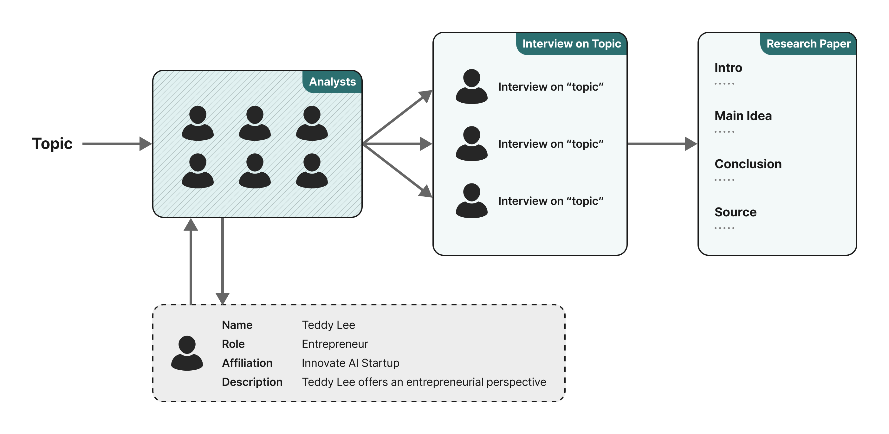
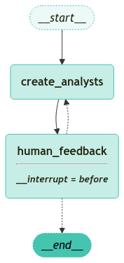
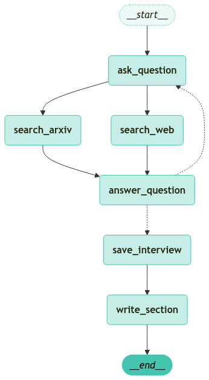
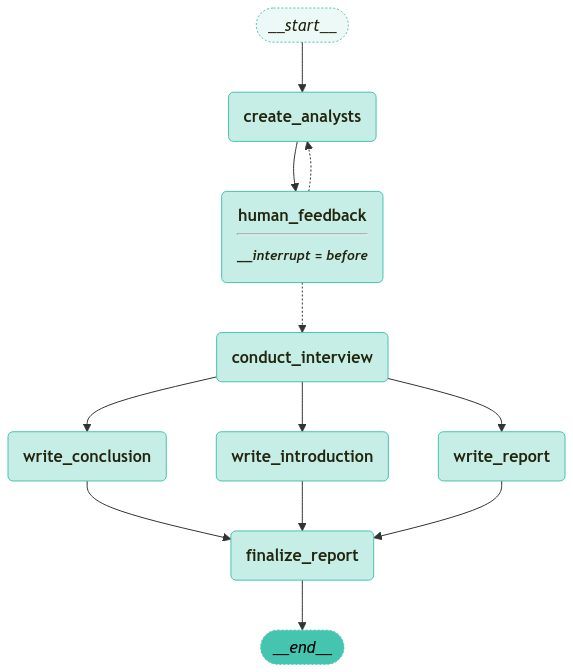

<style>
.custom {
    background-color: #008d8d;
    color: white;
    padding: 0.25em 0.5em 0.25em 0.5em;
    white-space: pre-wrap;       /* css-3 */
    white-space: -moz-pre-wrap;  /* Mozilla, since 1999 */
    white-space: -pre-wrap;      /* Opera 4-6 */
    white-space: -o-pre-wrap;    /* Opera 7 */
    word-wrap: break-word;
}

pre {
    background-color: #027c7c;
    padding-left: 0.5em;
}

</style>

# LangGraph : Research Assistant with STORM

- Author: [Secludor](https://github.com/Secludor)
- Design: [LeeYuChul](https://github.com/LeeYuChul)
- Peer Review: 
- This is a part of [LangChain Open Tutorial](https://github.com/LangChain-OpenTutorial/LangChain-OpenTutorial)

[](https://colab.research.google.com/github/LangChain-OpenTutorial/LangChain-OpenTutorial/blob/main/99-TEMPLATE/00-BASE-TEMPLATE-EXAMPLE.ipynb) [](https://github.com/LangChain-OpenTutorial/LangChain-OpenTutorial/blob/main/99-TEMPLATE/00-BASE-TEMPLATE-EXAMPLE.ipynb)

## Overview

Research is often a labor-intensive task delegated to analysts, but AI holds tremendous potential to revolutionize this process. This tutorial explores **how to construct a customized AI-powered research and report generation workflow** using `LangGraph`, incorporating key concepts from Stanford's STORM framework.

### Why This Approach?
The STORM methodology has demonstrated significant improvements in research quality through two key innovations:
- Outline creation through querying similar topics enhances coverage.
- Multi-perspective conversation simulation increases reference usage and information density.

The translation is accurate but can be enhanced for better clarity and technical precision. Here's the reviewed version:

### Key Components

**Core Themes**
- Memory: State management and persistence across interactions.
- Human-in-the-loop: Interactive feedback and validation mechanisms.
- Controllability: Fine-grained control over agent workflows.

**Research Framework**
- Research Automation Objective: Building customized research processes tailored to user requirements.
- Source Management: Strategic selection and integration of research input sources.
- Planning Framework: Topic definition and AI analyst team assembly.

### Process Implementation

**Execution Flow**
- LLM Integration: Conducting comprehensive expert AI interviews.
- Parallel Processing: Simultaneous information gathering and interview execution.
- Output Synthesis: Integration of research findings into comprehensive reports.

**Technical Implementation**
- Environment Setup: Configuration of runtime environment and API authentication.
- Analyst Development: Human-supervised analyst creation and validation process.
- Interview Management: Systematic question generation and response collection.
- Parallel Processing: Implementation of Map-Reduce for interview parallelization.
- Report Generation: Structured composition of introductory and concluding sections.


AI has significant potential to support these research processes. However, research requires customization. Raw LLM outputs are often not suitable for real decision-making workflows.

A customized AI-based [research and report generation](https://jxnl.co/writing/2024/06/05/predictions-for-the-future-of-rag/#reports-over-rag) workflow is a promising solution to address this issue.



### Table of Contents

- [Overview](#overview)
- [Environment Setup](#environment-setup)
- [Utilities](#utilities)
- [Analysts Generation : Human in the Loop](#analysts-generation--human-in-the-loop)
- [Interview Execution](#interview-execution)
- [Report Writing](#report-writing)

### References

- [research and report generation](https://jxnl.co/writing/2024/06/05/predictions-for-the-future-of-rag/#reports-over-rag)
- [LangGraph `Send()`](https://langchain-ai.github.io/langgraph/concepts/low_level/#send)
- [LangGraph - Multi-Agent](https://langchain-ai.github.io/langgraph/concepts/multi_agent/#custom-multi-agent-workflow)
----

## Environment Setup

Setting up your environment is the first step. See the [Environment Setup](https://wikidocs.net/257836) guide for more details.


**[Note]**

The langchain-opentutorial is a package of easy-to-use environment setup guidance, useful functions and utilities for tutorials.
Check out the  [`langchain-opentutorial`](https://github.com/LangChain-OpenTutorial/langchain-opentutorial-pypi) for more details.

```python
%%capture --no-stderr
%pip install -U langchain-opentutorial
```

```python
# Install required packages
from langchain_opentutorial import package

package.install(
    [
        "langsmith",
        "langchain_core",
        "langchain_community",
        "langchain_openai",
        "tavily-python",
        "arxiv",
        "pymupdf",
    ],
    verbose=False,
    upgrade=False,
)
```

You can set API keys in a `.env` file or set them manually.

[Note] If you’re not using the `.env` file, no worries! Just enter the keys directly in the cell below, and you’re good to go.

```python
from dotenv import load_dotenv
from langchain_opentutorial import set_env

# Attempt to load environment variables from a .env file; if unsuccessful, set them manually.
if not load_dotenv():
    set_env(
        {
            "OPENAI_API_KEY": "",
            "LANGCHAIN_API_KEY": "",
            "LANGCHAIN_TRACING_V2": "true",
            "LANGCHAIN_ENDPOINT": "https://api.smith.langchain.com",
            "TAVILY_API_KEY": "",
        }
    )

# set the project name same as the title
set_env(
    {
        "LANGCHAIN_PROJECT": "LangGraph-Research-Assistant",
    }
)
```

<pre class="custom">Environment variables have been set successfully.
</pre>

## Utilities

These are brief descriptions of the modules from `langchain-opentutorial` used for practice.

### `visualize_graph`
for visualizing graph structure

### `random_uuid` , `invoke_graph`
- `random_uuid` : for generating a random UUID (Universally Unique Identifier) and returns it as a string.
- `invoke_graph` : for streaming and displays the results of executing a CompiledStateGraph instance in a visually appealing format. 

### `TabilySearch`

This code defines a tool for performing search queries using the Tavily Search API. It includes input validation, formatting of search results, and the ability to customize search parameters.
**Methods** :
- `__init__` : Initializes the TavilySearch instance, setting up the API client and input parameters.
- `_run` : Implements the base tool's run method, calling the search method and returning results.
- `search` : Performs the actual search using the Tavily API, taking various optional parameters to customize the query. It formats the output based on user preferences.
- `get_search_context` : Retrieves relevant context based on a search query, returning a JSON string that includes search results formatted as specified.

## Analysts Generation : Human in the Loop
**Analyst Generation** : Create and review analysts using Human-In-The-Loop.

```python
from langchain_openai import ChatOpenAI

# Initialize the model
llm = ChatOpenAI(model="gpt-4o")
```

```python
from typing import List
from typing_extensions import TypedDict
from pydantic import BaseModel, Field
from langchain_opentutorial.graphs import visualize_graph


# Class defining analyst properties and metadata
class Analyst(BaseModel):
    # Primary affiliation information
    affiliation: str = Field(
        description="Primary affiliation of the analyst.",
    )
    # Name
    name: str = Field(description="Name of the analyst.")

    # Role
    role: str = Field(
        description="Role of the analyst in the context of the topic.",
    )
    # Description of focus, concerns, and motives
    description: str = Field(
        description="Description of the analyst focus, concerns, and motives.",
    )

    # Property that returns analyst's personal information as a string
    @property
    def persona(self) -> str:
        return f"Name: {self.name}\nRole: {self.role}\nAffiliation: {self.affiliation}\nDescription: {self.description}\n"


# Collection of analysts
class Perspectives(BaseModel):
    # List of analysts
    analysts: List[Analyst] = Field(
        description="Comprehensive list of analysts with their roles and affiliations.",
    )
```

The following defines the state that tracks the collection of analysts generated through the Analyst class:

```python
# State Definition
class GenerateAnalystsState(TypedDict):
    # Research topic
    topic: str
    # Maximum number of analysts to generate
    max_analysts: int
    # Human feedback
    human_analyst_feedback: str
    # List of analysts
    analysts: List[Analyst]
```

### Defining the Analyst Generation Node

Next, we will define the analyst generation node.

The code below implements the logic for generating various analysts based on the provided research topic. Each analyst has a unique role and affiliation, offering professional perspectives on the topic.

```python
from langgraph.graph import END
from langchain_core.messages import HumanMessage, SystemMessage

# Analyst generation prompt
analyst_instructions = """You are tasked with creating a set of AI analyst personas. 

Follow these instructions carefully:
1. First, review the research topic:

{topic}
        
2. Examine any editorial feedback that has been optionally provided to guide the creation of the analysts: 
        
{human_analyst_feedback}
    
3. Determine the most interesting themes based upon documents and/or feedback above.
                    
4. Pick the top {max_analysts} themes.

5. Assign one analyst to each theme."""


# Analyst generation node
def create_analysts(state: GenerateAnalystsState):
    """Function to create analyst personas"""

    topic = state["topic"]
    max_analysts = state["max_analysts"]
    human_analyst_feedback = state.get("human_analyst_feedback", "")

    # Apply structured output format to LLM
    structured_llm = llm.with_structured_output(Perspectives)

    # Construct system prompt for analyst creation
    system_message = analyst_instructions.format(
        topic=topic,
        human_analyst_feedback=human_analyst_feedback,
        max_analysts=max_analysts,
    )

    # Call LLM to generate analyst personas
    analysts = structured_llm.invoke(
        [SystemMessage(content=system_message)]
        + [HumanMessage(content="Generate the set of analysts.")]
    )

    # Store generated list of analysts in state
    return {"analysts": analysts.analysts}


# User feedback node (can be left empty since it will update state)
def human_feedback(state: GenerateAnalystsState):
    """A checkpoint node for receiving user feedback"""
    pass


# Function to decide the next step in the workflow based on human feedback
def should_continue(state: GenerateAnalystsState):
    """Function to determine the next step in the workflow"""

    human_analyst_feedback = state.get("human_analyst_feedback", None)
    if human_analyst_feedback:
        return "create_analysts"

    return END
```

**Explanation of Code Components**

- **Analyst Instructions**: A prompt that guides the LLM in creating AI analyst personas based on a specified research topic and any provided feedback.

- **create_analysts Function**: This function is responsible for generating a set of analysts based on the current state, which includes the research topic, maximum number of analysts, and any human feedback.

- **human_feedback Function**: A placeholder function that can be expanded to handle user feedback.

- **should_continue Function**: This function evaluates whether there is human feedback available and determines whether to proceed with creating analysts or end the process. 

This structure allows for a dynamic approach to generating tailored analyst personas that can provide diverse insights into a given research topic.

### Building the Analyst Generation Graph

Now we'll create the analyst generation graph that orchestrates the research workflow.

```python
from langgraph.graph import START, END, StateGraph
from langgraph.checkpoint.memory import MemorySaver

# Create graph
builder = StateGraph(GenerateAnalystsState)

# Add nodes
builder.add_node("create_analysts", create_analysts)
builder.add_node("human_feedback", human_feedback)

# Connect edges
builder.add_edge(START, "create_analysts")
builder.add_edge("create_analysts", "human_feedback")

# Add conditional edge: return to analyst creation node if human feedback exists
builder.add_conditional_edges(
    "human_feedback", should_continue, ["create_analysts", END]
)

# Create memory
memory = MemorySaver()

# Compile graph (set breakpoints)
graph = builder.compile(interrupt_before=["human_feedback"], checkpointer=memory)

# Visualize graph
visualize_graph(graph)
```


    

    


**Graph Components**

- **Nodes**
    - `create_analysts`: Generates analyst personas based on the research topic
    - `human_feedback`: Checkpoint for receiving user input and feedback

- **Edges**
    - Initial flow from START to analyst creation
    - Connection from analyst creation to human feedback
    - Conditional path back to analyst creation based on feedback

- **Features**
    - Memory persistence using `MemorySaver`
    - Breakpoints before human feedback collection
    - Visual representation of workflow through `visualize_graph`

This graph structure enables an iterative research process with human oversight and feedback integration.

### Running the Analyst Generation Graph
Here's how to execute and manage the analyst generation workflow:

```python
from langchain_core.runnables import RunnableConfig
from langchain_opentutorial.messages import random_uuid, invoke_graph


# Configure graph execution settings


config = RunnableConfig(
    recursion_limit=10,
    configurable={"thread_id": random_uuid()},
)


# Set number of analysts


max_analysts = 3


# Define research topic


topic = "What are the differences between Modular RAG and Naive RAG, and what are the benefits of using it at the production level"


# Configure input parameters


inputs = {
    "topic": topic,
    "max_analysts": max_analysts,
}


# Execute graph


invoke_graph(graph, inputs, config)
```

<pre class="custom">
    ==================================================
    🔄 Node: create_analysts 🔄
    - - - - - - - - - - - - - - - - - - - - - - - - - 
    affiliation='Tech Research Institute' name='Dr. Emily Carter' role='Senior Research Scientist' description='Dr. Carter focuses on the architectural differences between Modular RAG and Naive RAG, with an emphasis on understanding how modularity impacts flexibility and scalability in AI systems.'
    affiliation='AI Development Group' name='Michael Nguyen' role='Lead AI Engineer' description="Michael's primary concern is the practical benefits of implementing Modular RAG at the production level, particularly in terms of efficiency, resource management, and ease of integration."
    affiliation='University of Advanced Computing' name='Prof. Laura Chen' role='Professor of Computer Science' description='Prof. Chen studies the theoretical implications of using Modular versus Naive RAG, analyzing the long-term benefits and potential challenges faced in deploying these systems in real-world scenarios.'
    ==================================================
    
    ==================================================
    🔄 Node: __interrupt__ 🔄
    - - - - - - - - - - - - - - - - - - - - - - - - - 
    ==================================================
</pre>

When `__interrupt__` is displayed, the system is ready to receive human feedback. At this point, you can retrieve the current state and provide feedback to guide the analyst generation process.

```python
# Get current graph state
state = graph.get_state(config)

# Check next node
print(state.next)
```

<pre class="custom">('human_feedback',)
</pre>

To inject human feedback into the graph, we use the `update_state` method with the following key components:

```python
# Update graph state with human feedback
graph.update_state(
    config,
    {
        "human_analyst_feedback": "Add in someone named Teddy Lee from a startup to add an entrepreneur perspective"
    },
    as_node="human_feedback",
)
```


<pre class="custom">{'configurable': {'thread_id': '77b5f1cc-b454-4a81-9d4d-32949e109a66',
      'checkpoint_ns': '',
      'checkpoint_id': '1efd9c73-576d-6e75-8002-4bdd66b12cff'}}</pre>


**Key Parameters**
- `config` : Configuration object containing graph settings
- `human_analyst_feedback` : Key for storing feedback content
- `as_node` : Specifies the node that will process the feedback

**[Note]** : Assigning `None` as input triggers the graph to continue its execution from the last checkpoint. This is particularly useful when you want to resume processing after providing human feedback.

(Continue) To resume the graph execution after the `__interrupt__` :

```python
# Continue execution
invoke_graph(graph, None, config)
```

<pre class="custom">
    ==================================================
    🔄 Node: create_analysts 🔄
    - - - - - - - - - - - - - - - - - - - - - - - - - 
    affiliation='AI Technology Research Institute' name='Dr. Emily Zhang' role='AI Researcher' description='Dr. Zhang focuses on the technical distinctions between Modular RAG and Naive RAG, analyzing their architectural differences, computational efficiencies, and adaptability in various AI applications. Her interest lies in understanding how these models can be optimized for better performance and scalability.'
    affiliation='Tech Innovations Startup' name='Teddy Lee' role='Entrepreneur' description='Teddy Lee provides insights into the practical implications and business benefits of implementing Modular RAG over Naive RAG at the production level. He evaluates cost-efficiency, scalability, and the potential for innovative applications in startup environments, aiming to leverage cutting-edge technology for competitive advantage.'
    affiliation='Enterprise Solutions Inc.' name='Sophia Martinez' role='Industry Analyst' description='Sophia Martinez explores the benefits of Modular RAG in large-scale enterprise settings. Her focus is on the reliability, integration capabilities, and long-term strategic advantages of adopting Modular RAG systems over Naive RAG in production environments, emphasizing risk management and return on investment.'
    ==================================================
    
    ==================================================
    🔄 Node: __interrupt__ 🔄
    - - - - - - - - - - - - - - - - - - - - - - - - - 
    ==================================================
</pre>

When `__interrupt__` appears again, you have two options: 

- Option 1: Provide Additional Feedback
    - You can provide more feedback to further refine the analyst personas using the same method as before
- Option 2: Complete the Process

To finish the analyst generation process without additional feedback:

```python
# Set feedback input to None to indicate completion
human_feedback_input = None

# Update graph state with no feedback
graph.update_state(
    config, {"human_analyst_feedback": human_feedback_input}, as_node="human_feedback"
)
```


<pre class="custom">{'configurable': {'thread_id': '77b5f1cc-b454-4a81-9d4d-32949e109a66',
      'checkpoint_ns': '',
      'checkpoint_id': '1efd9c73-86e0-67db-8004-1b34f460d397'}}</pre>


```python
# Continue final execution
invoke_graph(graph, None, config)
```

**Displaying Final Results**

Get and display the final results from the graph:

```python
# Get final state
final_state = graph.get_state(config)

# Get generated analysts
analysts = final_state.values.get("analysts")

# Print analyst count
print(
    f"Number of analysts generated: {len(analysts)}",
    end="\n================================\n",
)

# Print each analyst's persona
for analyst in analysts:
    print(analyst.persona)
    print("- " * 30)

# Get next node state (empty tuple indicates completion)
print(final_state.next)
```

<pre class="custom">Number of analysts generated: 3
    ================================
    Name: Dr. Emily Zhang
    Role: AI Researcher
    Affiliation: AI Technology Research Institute
    Description: Dr. Zhang focuses on the technical distinctions between Modular RAG and Naive RAG, analyzing their architectural differences, computational efficiencies, and adaptability in various AI applications. Her interest lies in understanding how these models can be optimized for better performance and scalability.
    
    - - - - - - - - - - - - - - - - - - - - - - - - - - - - - - 
    Name: Teddy Lee
    Role: Entrepreneur
    Affiliation: Tech Innovations Startup
    Description: Teddy Lee provides insights into the practical implications and business benefits of implementing Modular RAG over Naive RAG at the production level. He evaluates cost-efficiency, scalability, and the potential for innovative applications in startup environments, aiming to leverage cutting-edge technology for competitive advantage.
    
    - - - - - - - - - - - - - - - - - - - - - - - - - - - - - - 
    Name: Sophia Martinez
    Role: Industry Analyst
    Affiliation: Enterprise Solutions Inc.
    Description: Sophia Martinez explores the benefits of Modular RAG in large-scale enterprise settings. Her focus is on the reliability, integration capabilities, and long-term strategic advantages of adopting Modular RAG systems over Naive RAG in production environments, emphasizing risk management and return on investment.
    
    - - - - - - - - - - - - - - - - - - - - - - - - - - - - - - 
    ()
</pre>

**Key Components**
- `final_state`: Contains the final state of the graph execution.
- `analysts`: List of generated analyst personas.
- `final_state.next`: Empty tuple indicating workflow completion.

The output will display each analyst's complete persona information, including their name, role, affiliation, and description, followed by a separator line. The empty tuple printed at the end confirms that the graph execution has completed successfully.

## Interview Execution

### Define Classes and `question_generation` Node
Let's implement the interview execution components with proper state management and `question_generation` Node:

```python
import operator
from typing import Annotated
from langgraph.graph import MessagesState


class InterviewState(MessagesState):
    """State management for interview process"""

    max_num_turns: int
    context: Annotated[list, operator.add]  # Context list containing source documents
    analyst: Analyst
    interview: str  # String storing interview content
    sections: list  # List of report sections


class SearchQuery(BaseModel):
    """Data class for search queries"""

    search_query: str = Field(None, description="Search query for retrieval.")
```

```python
def generate_question(state: InterviewState):
    """Node for generating interview questions"""

    # System prompt for question generation
    question_instructions = """You are an analyst tasked with interviewing an expert to learn about a specific topic. 

    Your goal is boil down to interesting and specific insights related to your topic.

    1. Interesting: Insights that people will find surprising or non-obvious.
            
    2. Specific: Insights that avoid generalities and include specific examples from the expert.

    Here is your topic of focus and set of goals: {goals}
            
    Begin by introducing yourself using a name that fits your persona, and then ask your question.

    Continue to ask questions to drill down and refine your understanding of the topic.
            
    When you are satisfied with your understanding, complete the interview with: "Thank you so much for your help!"

    Remember to stay in character throughout your response, reflecting the persona and goals provided to you."""

    # Extract state components
    analyst = state["analyst"]
    messages = state["messages"]

    # Generate question using LLM
    system_message = question_instructions.format(goals=analyst.persona)
    question = llm.invoke([SystemMessage(content=system_message)] + messages)

    # Return updated messages
    return {"messages": [question]}
```

**State Management**
- `InterviewState` tracks conversation turns, context, and interview content.
- Annotated context list allows for document accumulation.
- Maintains analyst persona and report sections.

**Question Generation**
- Structured system prompt for consistent interviewing style.
- Persona-aware questioning based on analyst goals.
- Progressive refinement of topic understanding.
- Clear interview conclusion mechanism.

The code provides a robust foundation for conducting structured interviews while maintaining conversation state and context.

### Defining Research Tools

Experts collect information in parallel from multiple sources to answer questions.

They can utilize various tools such as web document scraping, VectorDB, web search, and Wikipedia search.

We'll focus on two main tools: **`Tavily`** for web search and **`ArxivRetriever`** for academic papers.

`Tavily Search`
- Real-time web search capabilities
- Configurable result count and content depth
- Structured output formatting
- Raw content inclusion option

```python
from langchain_opentutorial.tools.tavily import TavilySearch

# Initialize TavilySearch with configuration


tavily_search = TavilySearch(max_results=3)
```

`ArxivRetriever`
- Access to academic papers and research
- Full document retrieval
- Comprehensive metadata access
- Customizable document load limits

```python
from langchain_community.retrievers import ArxivRetriever

# Initialize ArxivRetriever with configuration
arxiv_retriever = ArxivRetriever(
    load_max_docs=3, load_all_available_meta=True, get_full_documents=True
)

# Execute arxiv search and print results
arxiv_search_results = arxiv_retriever.invoke("Modular RAG vs Naive RAG")
print(arxiv_search_results)
```

<pre class="custom">[Document(metadata={'Published': '2024-07-26', 'Title': 'Modular RAG: Transforming RAG Systems into LEGO-like Reconfigurable Frameworks', 'Authors': 'Yunfan Gao, Yun Xiong, Meng Wang, Haofen Wang', 'Summary': 'Retrieval-augmented Generation (RAG) has markedly enhanced the capabilities\nof Large Language Models (LLMs) in tackling knowledge-intensive tasks. The\nincreasing demands of application scenarios have driven the evolution of RAG,\nleading to the integration of advanced retrievers, LLMs and other complementary\ntechnologies, which in turn has amplified the intricacy of RAG systems.\nHowever, the rapid advancements are outpacing the foundational RAG paradigm,\nwith many methods struggling to be unified under the process of\n"retrieve-then-generate". In this context, this paper examines the limitations\nof the existing RAG paradigm and introduces the modular RAG framework. By\ndecomposing complex RAG systems into independent modules and specialized\noperators, it facilitates a highly reconfigurable framework. Modular RAG\ntranscends the traditional linear architecture, embracing a more advanced\ndesign that integrates routing, scheduling, and fusion mechanisms. Drawing on\nextensive research, this paper further identifies prevalent RAG\npatterns-linear, conditional, branching, and looping-and offers a comprehensive\nanalysis of their respective implementation nuances. Modular RAG presents\ninnovative opportunities for the conceptualization and deployment of RAG\nsystems. Finally, the paper explores the potential emergence of new operators\nand paradigms, establishing a solid theoretical foundation and a practical\nroadmap for the continued evolution and practical deployment of RAG\ntechnologies.', 'entry_id': 'http://arxiv.org/abs/2407.21059v1', 'published_first_time': '2024-07-26', 'comment': None, 'journal_ref': None, 'doi': None, 'primary_category': 'cs.CL', 'categories': ['cs.CL', 'cs.AI', 'cs.IR'], 'links': ['http://arxiv.org/abs/2407.21059v1', 'http://arxiv.org/pdf/2407.21059v1']}, page_content='1\nModular RAG: Transforming RAG Systems into\nLEGO-like Reconfigurable Frameworks\nYunfan Gao, Yun Xiong, Meng Wang, Haofen Wang\nAbstract—Retrieval-augmented\nGeneration\n(RAG)\nhas\nmarkedly enhanced the capabilities of Large Language Models\n(LLMs) in tackling knowledge-intensive tasks. The increasing\ndemands of application scenarios have driven the evolution\nof RAG, leading to the integration of advanced retrievers,\nLLMs and other complementary technologies, which in turn\nhas amplified the intricacy of RAG systems. However, the rapid\nadvancements are outpacing the foundational RAG paradigm,\nwith many methods struggling to be unified under the process\nof “retrieve-then-generate”. In this context, this paper examines\nthe limitations of the existing RAG paradigm and introduces\nthe modular RAG framework. By decomposing complex RAG\nsystems into independent modules and specialized operators, it\nfacilitates a highly reconfigurable framework. Modular RAG\ntranscends the traditional linear architecture, embracing a\nmore advanced design that integrates routing, scheduling, and\nfusion mechanisms. Drawing on extensive research, this paper\nfurther identifies prevalent RAG patterns—linear, conditional,\nbranching, and looping—and offers a comprehensive analysis\nof their respective implementation nuances. Modular RAG\npresents\ninnovative\nopportunities\nfor\nthe\nconceptualization\nand deployment of RAG systems. Finally, the paper explores\nthe potential emergence of new operators and paradigms,\nestablishing a solid theoretical foundation and a practical\nroadmap for the continued evolution and practical deployment\nof RAG technologies.\nIndex Terms—Retrieval-augmented generation, large language\nmodel, modular system, information retrieval\nI. INTRODUCTION\nL\nARGE Language Models (LLMs) have demonstrated\nremarkable capabilities, yet they still face numerous\nchallenges, such as hallucination and the lag in information up-\ndates [1]. Retrieval-augmented Generation (RAG), by access-\ning external knowledge bases, provides LLMs with important\ncontextual information, significantly enhancing their perfor-\nmance on knowledge-intensive tasks [2]. Currently, RAG, as\nan enhancement method, has been widely applied in various\npractical application scenarios, including knowledge question\nanswering, recommendation systems, customer service, and\npersonal assistants. [3]–[6]\nDuring the nascent stages of RAG , its core framework is\nconstituted by indexing, retrieval, and generation, a paradigm\nreferred to as Naive RAG [7]. However, as the complexity\nof tasks and the demands of applications have escalated, the\nYunfan Gao is with Shanghai Research Institute for Intelligent Autonomous\nSystems, Tongji University, Shanghai, 201210, China.\nYun Xiong is with Shanghai Key Laboratory of Data Science, School of\nComputer Science, Fudan University, Shanghai, 200438, China.\nMeng Wang and Haofen Wang are with College of Design and Innovation,\nTongji University, Shanghai, 20092, China. (Corresponding author: Haofen\nWang. E-mail: carter.whfcarter@gmail.com)\nlimitations of Naive RAG have become increasingly apparent.\nAs depicted in Figure 1, it predominantly hinges on the\nstraightforward similarity of chunks, result in poor perfor-\nmance when confronted with complex queries and chunks with\nsubstantial variability. The primary challenges of Naive RAG\ninclude: 1) Shallow Understanding of Queries. The semantic\nsimilarity between a query and document chunk is not always\nhighly consistent. Relying solely on similarity calculations\nfor retrieval lacks an in-depth exploration of the relationship\nbetween the query and the document [8]. 2) Retrieval Re-\ndundancy and Noise. Feeding all retrieved chunks directly\ninto LLMs is not always beneficial. Research indicates that\nan excess of redundant and noisy information may interfere\nwith the LLM’s identification of key information, thereby\nincreasing the risk of generating erroneous and hallucinated\nresponses. [9]\nTo overcome the aforementioned limitations, '), Document(metadata={'Published': '2024-03-27', 'Title': 'Retrieval-Augmented Generation for Large Language Models: A Survey', 'Authors': 'Yunfan Gao, Yun Xiong, Xinyu Gao, Kangxiang Jia, Jinliu Pan, Yuxi Bi, Yi Dai, Jiawei Sun, Meng Wang, Haofen Wang', 'Summary': "Large Language Models (LLMs) showcase impressive capabilities but encounter\nchallenges like hallucination, outdated knowledge, and non-transparent,\nuntraceable reasoning processes. Retrieval-Augmented Generation (RAG) has\nemerged as a promising solution by incorporating knowledge from external\ndatabases. This enhances the accuracy and credibility of the generation,\nparticularly for knowledge-intensive tasks, and allows for continuous knowledge\nupdates and integration of domain-specific information. RAG synergistically\nmerges LLMs' intrinsic knowledge with the vast, dynamic repositories of\nexternal databases. This comprehensive review paper offers a detailed\nexamination of the progression of RAG paradigms, encompassing the Naive RAG,\nthe Advanced RAG, and the Modular RAG. It meticulously scrutinizes the\ntripartite foundation of RAG frameworks, which includes the retrieval, the\ngeneration and the augmentation techniques. The paper highlights the\nstate-of-the-art technologies embedded in each of these critical components,\nproviding a profound understanding of the advancements in RAG systems.\nFurthermore, this paper introduces up-to-date evaluation framework and\nbenchmark. At the end, this article delineates the challenges currently faced\nand points out prospective avenues for research and development.", 'entry_id': 'http://arxiv.org/abs/2312.10997v5', 'published_first_time': '2023-12-18', 'comment': 'Ongoing Work', 'journal_ref': None, 'doi': None, 'primary_category': 'cs.CL', 'categories': ['cs.CL', 'cs.AI'], 'links': ['http://arxiv.org/abs/2312.10997v5', 'http://arxiv.org/pdf/2312.10997v5']}, page_content='1\nRetrieval-Augmented Generation for Large\nLanguage Models: A Survey\nYunfan Gaoa, Yun Xiongb, Xinyu Gaob, Kangxiang Jiab, Jinliu Panb, Yuxi Bic, Yi Daia, Jiawei Suna, Meng\nWangc, and Haofen Wang a,c\naShanghai Research Institute for Intelligent Autonomous Systems, Tongji University\nbShanghai Key Laboratory of Data Science, School of Computer Science, Fudan University\ncCollege of Design and Innovation, Tongji University\nAbstract—Large Language Models (LLMs) showcase impres-\nsive capabilities but encounter challenges like hallucination,\noutdated knowledge, and non-transparent, untraceable reasoning\nprocesses. Retrieval-Augmented Generation (RAG) has emerged\nas a promising solution by incorporating knowledge from external\ndatabases. This enhances the accuracy and credibility of the\ngeneration, particularly for knowledge-intensive tasks, and allows\nfor continuous knowledge updates and integration of domain-\nspecific information. RAG synergistically merges LLMs’ intrin-\nsic knowledge with the vast, dynamic repositories of external\ndatabases. This comprehensive review paper offers a detailed\nexamination of the progression of RAG paradigms, encompassing\nthe Naive RAG, the Advanced RAG, and the Modular RAG.\nIt meticulously scrutinizes the tripartite foundation of RAG\nframeworks, which includes the retrieval, the generation and the\naugmentation techniques. The paper highlights the state-of-the-\nart technologies embedded in each of these critical components,\nproviding a profound understanding of the advancements in RAG\nsystems. Furthermore, this paper introduces up-to-date evalua-\ntion framework and benchmark. At the end, this article delineates\nthe challenges currently faced and points out prospective avenues\nfor research and development 1.\nIndex Terms—Large language model, retrieval-augmented gen-\neration, natural language processing, information retrieval\nI. INTRODUCTION\nL\nARGE language models (LLMs) have achieved remark-\nable success, though they still face significant limitations,\nespecially in domain-specific or knowledge-intensive tasks [1],\nnotably producing “hallucinations” [2] when handling queries\nbeyond their training data or requiring current information. To\novercome challenges, Retrieval-Augmented Generation (RAG)\nenhances LLMs by retrieving relevant document chunks from\nexternal knowledge base through semantic similarity calcu-\nlation. By referencing external knowledge, RAG effectively\nreduces the problem of generating factually incorrect content.\nIts integration into LLMs has resulted in widespread adoption,\nestablishing RAG as a key technology in advancing chatbots\nand enhancing the suitability of LLMs for real-world applica-\ntions.\nRAG technology has rapidly developed in recent years, and\nthe technology tree summarizing related research is shown\nCorresponding Author.Email:haofen.wang@tongji.edu.cn\n1Resources\nare\navailable\nat\nhttps://github.com/Tongji-KGLLM/\nRAG-Survey\nin Figure 1. The development trajectory of RAG in the era\nof large models exhibits several distinct stage characteristics.\nInitially, RAG’s inception coincided with the rise of the\nTransformer architecture, focusing on enhancing language\nmodels by incorporating additional knowledge through Pre-\nTraining Models (PTM). This early stage was characterized\nby foundational work aimed at refining pre-training techniques\n[3]–[5].The subsequent arrival of ChatGPT [6] marked a\npivotal moment, with LLM demonstrating powerful in context\nlearning (ICL) capabilities. RAG research shifted towards\nproviding better information for LLMs to answer more com-\nplex and knowledge-intensive tasks during the inference stage,\nleading to rapid development in RAG studies. As research\nprogressed, the enhancement of RAG was no longer limited\nto the inference stage but began to incorporate more with LLM\nfine-tuning techniques.\nThe burgeoning field of RAG has experienced swift growth,\nyet it has not been accompanied by a systematic synthesis that\ncould clarify its broader trajectory. Thi'), Document(metadata={'Published': '2024-05-22', 'Title': 'FlashRAG: A Modular Toolkit for Efficient Retrieval-Augmented Generation Research', 'Authors': 'Jiajie Jin, Yutao Zhu, Xinyu Yang, Chenghao Zhang, Zhicheng Dou', 'Summary': 'With the advent of Large Language Models (LLMs), the potential of Retrieval\nAugmented Generation (RAG) techniques have garnered considerable research\nattention. Numerous novel algorithms and models have been introduced to enhance\nvarious aspects of RAG systems. However, the absence of a standardized\nframework for implementation, coupled with the inherently intricate RAG\nprocess, makes it challenging and time-consuming for researchers to compare and\nevaluate these approaches in a consistent environment. Existing RAG toolkits\nlike LangChain and LlamaIndex, while available, are often heavy and unwieldy,\nfailing to meet the personalized needs of researchers. In response to this\nchallenge, we propose FlashRAG, an efficient and modular open-source toolkit\ndesigned to assist researchers in reproducing existing RAG methods and in\ndeveloping their own RAG algorithms within a unified framework. Our toolkit\nimplements 12 advanced RAG methods and has gathered and organized 32 benchmark\ndatasets. Our toolkit has various features, including customizable modular\nframework, rich collection of pre-implemented RAG works, comprehensive\ndatasets, efficient auxiliary pre-processing scripts, and extensive and\nstandard evaluation metrics. Our toolkit and resources are available at\nhttps://github.com/RUC-NLPIR/FlashRAG.', 'entry_id': 'http://arxiv.org/abs/2405.13576v1', 'published_first_time': '2024-05-22', 'comment': '8 pages', 'journal_ref': None, 'doi': None, 'primary_category': 'cs.CL', 'categories': ['cs.CL', 'cs.IR'], 'links': ['http://arxiv.org/abs/2405.13576v1', 'http://arxiv.org/pdf/2405.13576v1']}, page_content='FlashRAG: A Modular Toolkit for Efficient\nRetrieval-Augmented Generation Research\nJiajie Jin, Yutao Zhu, Xinyu Yang, Chenghao Zhang, Zhicheng Dou∗\nGaoling School of Artificial Intelligence\nRenmin University of China\n{jinjiajie, dou}@ruc.edu.cn, yutaozhu94@gmail.com\nAbstract\nWith the advent of Large Language Models (LLMs), the potential of Retrieval\nAugmented Generation (RAG) techniques have garnered considerable research\nattention. Numerous novel algorithms and models have been introduced to enhance\nvarious aspects of RAG systems. However, the absence of a standardized framework\nfor implementation, coupled with the inherently intricate RAG process, makes it\nchallenging and time-consuming for researchers to compare and evaluate these\napproaches in a consistent environment. Existing RAG toolkits like LangChain\nand LlamaIndex, while available, are often heavy and unwieldy, failing to\nmeet the personalized needs of researchers. In response to this challenge, we\npropose FlashRAG, an efficient and modular open-source toolkit designed to assist\nresearchers in reproducing existing RAG methods and in developing their own\nRAG algorithms within a unified framework. Our toolkit implements 12 advanced\nRAG methods and has gathered and organized 32 benchmark datasets. Our toolkit\nhas various features, including customizable modular framework, rich collection\nof pre-implemented RAG works, comprehensive datasets, efficient auxiliary pre-\nprocessing scripts, and extensive and standard evaluation metrics. Our toolkit and\nresources are available at https://github.com/RUC-NLPIR/FlashRAG.\n1\nIntroduction\nIn the era of large language models (LLMs), retrieval-augmented generation (RAG) [1, 2] has\nemerged as a robust solution to mitigate hallucination issues in LLMs by leveraging external\nknowledge bases [3]. The substantial applications and the potential of RAG technology have\nattracted considerable research attention. With the introduction of a large number of new algorithms\nand models to improve various facets of RAG systems in recent years, comparing and evaluating\nthese methods under a consistent setting has become increasingly challenging.\nMany works are not open-source or have fixed settings in their open-source code, making it difficult\nto adapt to new data or innovative components. Besides, the datasets and retrieval corpus used often\nvary, with resources being scattered, which can lead researchers to spend excessive time on pre-\nprocessing steps instead of focusing on optimizing their methods. Furthermore, due to the complexity\nof RAG systems, involving multiple steps such as indexing, retrieval, and generation, researchers\noften need to implement many parts of the system themselves. Although there are some existing RAG\ntoolkits like LangChain [4] and LlamaIndex [5], they are typically large and cumbersome, hindering\nresearchers from implementing customized processes and failing to address the aforementioned issues.\n∗Corresponding author\nPreprint. Under review.\narXiv:2405.13576v1  [cs.CL]  22 May 2024\nThus, a unified, researcher-oriented RAG toolkit is urgently needed to streamline methodological\ndevelopment and comparative studies.\nTo address the issue mentioned above, we introduce FlashRAG, an open-source library designed to\nenable researchers to easily reproduce existing RAG methods and develop their own RAG algorithms.\nThis library allows researchers to utilize built pipelines to replicate existing work, employ provided\nRAG components to construct their own RAG processes, or simply use organized datasets and corpora\nto accelerate their own RAG workflow. Compared to existing RAG toolkits, FlashRAG is more suited\nfor researchers. To summarize, the key features and capabilities of our FlashRAG library can be\noutlined in the following four aspects:\nExtensive and Customizable Modular RAG Framework.\nTo facilitate an easily expandable\nRAG process, we implemented modular RAG at two levels. At the component level, we offer\ncomprehensive RAG compon')]
</pre>

```python
# metadata of Arxiv
arxiv_search_results[0].metadata
```


<pre class="custom">{'Published': '2024-07-26',
     'Title': 'Modular RAG: Transforming RAG Systems into LEGO-like Reconfigurable Frameworks',
     'Authors': 'Yunfan Gao, Yun Xiong, Meng Wang, Haofen Wang',
     'Summary': 'Retrieval-augmented Generation (RAG) has markedly enhanced the capabilities\nof Large Language Models (LLMs) in tackling knowledge-intensive tasks. The\nincreasing demands of application scenarios have driven the evolution of RAG,\nleading to the integration of advanced retrievers, LLMs and other complementary\ntechnologies, which in turn has amplified the intricacy of RAG systems.\nHowever, the rapid advancements are outpacing the foundational RAG paradigm,\nwith many methods struggling to be unified under the process of\n"retrieve-then-generate". In this context, this paper examines the limitations\nof the existing RAG paradigm and introduces the modular RAG framework. By\ndecomposing complex RAG systems into independent modules and specialized\noperators, it facilitates a highly reconfigurable framework. Modular RAG\ntranscends the traditional linear architecture, embracing a more advanced\ndesign that integrates routing, scheduling, and fusion mechanisms. Drawing on\nextensive research, this paper further identifies prevalent RAG\npatterns-linear, conditional, branching, and looping-and offers a comprehensive\nanalysis of their respective implementation nuances. Modular RAG presents\ninnovative opportunities for the conceptualization and deployment of RAG\nsystems. Finally, the paper explores the potential emergence of new operators\nand paradigms, establishing a solid theoretical foundation and a practical\nroadmap for the continued evolution and practical deployment of RAG\ntechnologies.',
     'entry_id': 'http://arxiv.org/abs/2407.21059v1',
     'published_first_time': '2024-07-26',
     'comment': None,
     'journal_ref': None,
     'doi': None,
     'primary_category': 'cs.CL',
     'categories': ['cs.CL', 'cs.AI', 'cs.IR'],
     'links': ['http://arxiv.org/abs/2407.21059v1',
      'http://arxiv.org/pdf/2407.21059v1']}</pre>


```python
# content of Arxiv
print(arxiv_search_results[0].page_content)
```

<pre class="custom">1
    Modular RAG: Transforming RAG Systems into
    LEGO-like Reconfigurable Frameworks
    Yunfan Gao, Yun Xiong, Meng Wang, Haofen Wang
    Abstract—Retrieval-augmented
    Generation
    (RAG)
    has
    markedly enhanced the capabilities of Large Language Models
    (LLMs) in tackling knowledge-intensive tasks. The increasing
    demands of application scenarios have driven the evolution
    of RAG, leading to the integration of advanced retrievers,
    LLMs and other complementary technologies, which in turn
    has amplified the intricacy of RAG systems. However, the rapid
    advancements are outpacing the foundational RAG paradigm,
    with many methods struggling to be unified under the process
    of “retrieve-then-generate”. In this context, this paper examines
    the limitations of the existing RAG paradigm and introduces
    the modular RAG framework. By decomposing complex RAG
    systems into independent modules and specialized operators, it
    facilitates a highly reconfigurable framework. Modular RAG
    transcends the traditional linear architecture, embracing a
    more advanced design that integrates routing, scheduling, and
    fusion mechanisms. Drawing on extensive research, this paper
    further identifies prevalent RAG patterns—linear, conditional,
    branching, and looping—and offers a comprehensive analysis
    of their respective implementation nuances. Modular RAG
    presents
    innovative
    opportunities
    for
    the
    conceptualization
    and deployment of RAG systems. Finally, the paper explores
    the potential emergence of new operators and paradigms,
    establishing a solid theoretical foundation and a practical
    roadmap for the continued evolution and practical deployment
    of RAG technologies.
    Index Terms—Retrieval-augmented generation, large language
    model, modular system, information retrieval
    I. INTRODUCTION
    L
    ARGE Language Models (LLMs) have demonstrated
    remarkable capabilities, yet they still face numerous
    challenges, such as hallucination and the lag in information up-
    dates [1]. Retrieval-augmented Generation (RAG), by access-
    ing external knowledge bases, provides LLMs with important
    contextual information, significantly enhancing their perfor-
    mance on knowledge-intensive tasks [2]. Currently, RAG, as
    an enhancement method, has been widely applied in various
    practical application scenarios, including knowledge question
    answering, recommendation systems, customer service, and
    personal assistants. [3]–[6]
    During the nascent stages of RAG , its core framework is
    constituted by indexing, retrieval, and generation, a paradigm
    referred to as Naive RAG [7]. However, as the complexity
    of tasks and the demands of applications have escalated, the
    Yunfan Gao is with Shanghai Research Institute for Intelligent Autonomous
    Systems, Tongji University, Shanghai, 201210, China.
    Yun Xiong is with Shanghai Key Laboratory of Data Science, School of
    Computer Science, Fudan University, Shanghai, 200438, China.
    Meng Wang and Haofen Wang are with College of Design and Innovation,
    Tongji University, Shanghai, 20092, China. (Corresponding author: Haofen
    Wang. E-mail: carter.whfcarter@gmail.com)
    limitations of Naive RAG have become increasingly apparent.
    As depicted in Figure 1, it predominantly hinges on the
    straightforward similarity of chunks, result in poor perfor-
    mance when confronted with complex queries and chunks with
    substantial variability. The primary challenges of Naive RAG
    include: 1) Shallow Understanding of Queries. The semantic
    similarity between a query and document chunk is not always
    highly consistent. Relying solely on similarity calculations
    for retrieval lacks an in-depth exploration of the relationship
    between the query and the document [8]. 2) Retrieval Re-
    dundancy and Noise. Feeding all retrieved chunks directly
    into LLMs is not always beneficial. Research indicates that
    an excess of redundant and noisy information may interfere
    with the LLM’s identification of key information, thereby
    increasing the risk of generating erroneous and hallucinated
    responses. [9]
    To overcome the aforementioned limitations, 
</pre>

 format and display Arxiv search results in a structured XML-like format:

```python
# 문서 검색 결과를 포맷팅
formatted_search_docs = "\n\n---\n\n".join(
    [
        f'<Document source="{doc.metadata["entry_id"]}" date="{doc.metadata.get("Published", "")}" authors="{doc.metadata.get("Authors", "")}"/>\n<Title>\n{doc.metadata["Title"]}\n</Title>\n\n<Summary>\n{doc.metadata["Summary"]}\n</Summary>\n\n<Content>\n{doc.page_content}\n</Content>\n</Document>'
        for doc in arxiv_search_results
    ]
)
```

```python
print(formatted_search_docs)
```

<pre class="custom"><Document source="http://arxiv.org/abs/2407.21059v1" date="2024-07-26" authors="Yunfan Gao, Yun Xiong, Meng Wang, Haofen Wang"/>
    <Title>
    Modular RAG: Transforming RAG Systems into LEGO-like Reconfigurable Frameworks
    </Title>
    
    <Summary>
    Retrieval-augmented Generation (RAG) has markedly enhanced the capabilities
    of Large Language Models (LLMs) in tackling knowledge-intensive tasks. The
    increasing demands of application scenarios have driven the evolution of RAG,
    leading to the integration of advanced retrievers, LLMs and other complementary
    technologies, which in turn has amplified the intricacy of RAG systems.
    However, the rapid advancements are outpacing the foundational RAG paradigm,
    with many methods struggling to be unified under the process of
    "retrieve-then-generate". In this context, this paper examines the limitations
    of the existing RAG paradigm and introduces the modular RAG framework. By
    decomposing complex RAG systems into independent modules and specialized
    operators, it facilitates a highly reconfigurable framework. Modular RAG
    transcends the traditional linear architecture, embracing a more advanced
    design that integrates routing, scheduling, and fusion mechanisms. Drawing on
    extensive research, this paper further identifies prevalent RAG
    patterns-linear, conditional, branching, and looping-and offers a comprehensive
    analysis of their respective implementation nuances. Modular RAG presents
    innovative opportunities for the conceptualization and deployment of RAG
    systems. Finally, the paper explores the potential emergence of new operators
    and paradigms, establishing a solid theoretical foundation and a practical
    roadmap for the continued evolution and practical deployment of RAG
    technologies.
    </Summary>
    
    <Content>
    1
    Modular RAG: Transforming RAG Systems into
    LEGO-like Reconfigurable Frameworks
    Yunfan Gao, Yun Xiong, Meng Wang, Haofen Wang
    Abstract—Retrieval-augmented
    Generation
    (RAG)
    has
    markedly enhanced the capabilities of Large Language Models
    (LLMs) in tackling knowledge-intensive tasks. The increasing
    demands of application scenarios have driven the evolution
    of RAG, leading to the integration of advanced retrievers,
    LLMs and other complementary technologies, which in turn
    has amplified the intricacy of RAG systems. However, the rapid
    advancements are outpacing the foundational RAG paradigm,
    with many methods struggling to be unified under the process
    of “retrieve-then-generate”. In this context, this paper examines
    the limitations of the existing RAG paradigm and introduces
    the modular RAG framework. By decomposing complex RAG
    systems into independent modules and specialized operators, it
    facilitates a highly reconfigurable framework. Modular RAG
    transcends the traditional linear architecture, embracing a
    more advanced design that integrates routing, scheduling, and
    fusion mechanisms. Drawing on extensive research, this paper
    further identifies prevalent RAG patterns—linear, conditional,
    branching, and looping—and offers a comprehensive analysis
    of their respective implementation nuances. Modular RAG
    presents
    innovative
    opportunities
    for
    the
    conceptualization
    and deployment of RAG systems. Finally, the paper explores
    the potential emergence of new operators and paradigms,
    establishing a solid theoretical foundation and a practical
    roadmap for the continued evolution and practical deployment
    of RAG technologies.
    Index Terms—Retrieval-augmented generation, large language
    model, modular system, information retrieval
    I. INTRODUCTION
    L
    ARGE Language Models (LLMs) have demonstrated
    remarkable capabilities, yet they still face numerous
    challenges, such as hallucination and the lag in information up-
    dates [1]. Retrieval-augmented Generation (RAG), by access-
    ing external knowledge bases, provides LLMs with important
    contextual information, significantly enhancing their perfor-
    mance on knowledge-intensive tasks [2]. Currently, RAG, as
    an enhancement method, has been widely applied in various
    practical application scenarios, including knowledge question
    answering, recommendation systems, customer service, and
    personal assistants. [3]–[6]
    During the nascent stages of RAG , its core framework is
    constituted by indexing, retrieval, and generation, a paradigm
    referred to as Naive RAG [7]. However, as the complexity
    of tasks and the demands of applications have escalated, the
    Yunfan Gao is with Shanghai Research Institute for Intelligent Autonomous
    Systems, Tongji University, Shanghai, 201210, China.
    Yun Xiong is with Shanghai Key Laboratory of Data Science, School of
    Computer Science, Fudan University, Shanghai, 200438, China.
    Meng Wang and Haofen Wang are with College of Design and Innovation,
    Tongji University, Shanghai, 20092, China. (Corresponding author: Haofen
    Wang. E-mail: carter.whfcarter@gmail.com)
    limitations of Naive RAG have become increasingly apparent.
    As depicted in Figure 1, it predominantly hinges on the
    straightforward similarity of chunks, result in poor perfor-
    mance when confronted with complex queries and chunks with
    substantial variability. The primary challenges of Naive RAG
    include: 1) Shallow Understanding of Queries. The semantic
    similarity between a query and document chunk is not always
    highly consistent. Relying solely on similarity calculations
    for retrieval lacks an in-depth exploration of the relationship
    between the query and the document [8]. 2) Retrieval Re-
    dundancy and Noise. Feeding all retrieved chunks directly
    into LLMs is not always beneficial. Research indicates that
    an excess of redundant and noisy information may interfere
    with the LLM’s identification of key information, thereby
    increasing the risk of generating erroneous and hallucinated
    responses. [9]
    To overcome the aforementioned limitations, 
    </Content>
    </Document>
    
    ---
    
    <Document source="http://arxiv.org/abs/2312.10997v5" date="2024-03-27" authors="Yunfan Gao, Yun Xiong, Xinyu Gao, Kangxiang Jia, Jinliu Pan, Yuxi Bi, Yi Dai, Jiawei Sun, Meng Wang, Haofen Wang"/>
    <Title>
    Retrieval-Augmented Generation for Large Language Models: A Survey
    </Title>
    
    <Summary>
    Large Language Models (LLMs) showcase impressive capabilities but encounter
    challenges like hallucination, outdated knowledge, and non-transparent,
    untraceable reasoning processes. Retrieval-Augmented Generation (RAG) has
    emerged as a promising solution by incorporating knowledge from external
    databases. This enhances the accuracy and credibility of the generation,
    particularly for knowledge-intensive tasks, and allows for continuous knowledge
    updates and integration of domain-specific information. RAG synergistically
    merges LLMs' intrinsic knowledge with the vast, dynamic repositories of
    external databases. This comprehensive review paper offers a detailed
    examination of the progression of RAG paradigms, encompassing the Naive RAG,
    the Advanced RAG, and the Modular RAG. It meticulously scrutinizes the
    tripartite foundation of RAG frameworks, which includes the retrieval, the
    generation and the augmentation techniques. The paper highlights the
    state-of-the-art technologies embedded in each of these critical components,
    providing a profound understanding of the advancements in RAG systems.
    Furthermore, this paper introduces up-to-date evaluation framework and
    benchmark. At the end, this article delineates the challenges currently faced
    and points out prospective avenues for research and development.
    </Summary>
    
    <Content>
    1
    Retrieval-Augmented Generation for Large
    Language Models: A Survey
    Yunfan Gaoa, Yun Xiongb, Xinyu Gaob, Kangxiang Jiab, Jinliu Panb, Yuxi Bic, Yi Daia, Jiawei Suna, Meng
    Wangc, and Haofen Wang a,c
    aShanghai Research Institute for Intelligent Autonomous Systems, Tongji University
    bShanghai Key Laboratory of Data Science, School of Computer Science, Fudan University
    cCollege of Design and Innovation, Tongji University
    Abstract—Large Language Models (LLMs) showcase impres-
    sive capabilities but encounter challenges like hallucination,
    outdated knowledge, and non-transparent, untraceable reasoning
    processes. Retrieval-Augmented Generation (RAG) has emerged
    as a promising solution by incorporating knowledge from external
    databases. This enhances the accuracy and credibility of the
    generation, particularly for knowledge-intensive tasks, and allows
    for continuous knowledge updates and integration of domain-
    specific information. RAG synergistically merges LLMs’ intrin-
    sic knowledge with the vast, dynamic repositories of external
    databases. This comprehensive review paper offers a detailed
    examination of the progression of RAG paradigms, encompassing
    the Naive RAG, the Advanced RAG, and the Modular RAG.
    It meticulously scrutinizes the tripartite foundation of RAG
    frameworks, which includes the retrieval, the generation and the
    augmentation techniques. The paper highlights the state-of-the-
    art technologies embedded in each of these critical components,
    providing a profound understanding of the advancements in RAG
    systems. Furthermore, this paper introduces up-to-date evalua-
    tion framework and benchmark. At the end, this article delineates
    the challenges currently faced and points out prospective avenues
    for research and development 1.
    Index Terms—Large language model, retrieval-augmented gen-
    eration, natural language processing, information retrieval
    I. INTRODUCTION
    L
    ARGE language models (LLMs) have achieved remark-
    able success, though they still face significant limitations,
    especially in domain-specific or knowledge-intensive tasks [1],
    notably producing “hallucinations” [2] when handling queries
    beyond their training data or requiring current information. To
    overcome challenges, Retrieval-Augmented Generation (RAG)
    enhances LLMs by retrieving relevant document chunks from
    external knowledge base through semantic similarity calcu-
    lation. By referencing external knowledge, RAG effectively
    reduces the problem of generating factually incorrect content.
    Its integration into LLMs has resulted in widespread adoption,
    establishing RAG as a key technology in advancing chatbots
    and enhancing the suitability of LLMs for real-world applica-
    tions.
    RAG technology has rapidly developed in recent years, and
    the technology tree summarizing related research is shown
    Corresponding Author.Email:haofen.wang@tongji.edu.cn
    1Resources
    are
    available
    at
    https://github.com/Tongji-KGLLM/
    RAG-Survey
    in Figure 1. The development trajectory of RAG in the era
    of large models exhibits several distinct stage characteristics.
    Initially, RAG’s inception coincided with the rise of the
    Transformer architecture, focusing on enhancing language
    models by incorporating additional knowledge through Pre-
    Training Models (PTM). This early stage was characterized
    by foundational work aimed at refining pre-training techniques
    [3]–[5].The subsequent arrival of ChatGPT [6] marked a
    pivotal moment, with LLM demonstrating powerful in context
    learning (ICL) capabilities. RAG research shifted towards
    providing better information for LLMs to answer more com-
    plex and knowledge-intensive tasks during the inference stage,
    leading to rapid development in RAG studies. As research
    progressed, the enhancement of RAG was no longer limited
    to the inference stage but began to incorporate more with LLM
    fine-tuning techniques.
    The burgeoning field of RAG has experienced swift growth,
    yet it has not been accompanied by a systematic synthesis that
    could clarify its broader trajectory. Thi
    </Content>
    </Document>
    
    ---
    
    <Document source="http://arxiv.org/abs/2405.13576v1" date="2024-05-22" authors="Jiajie Jin, Yutao Zhu, Xinyu Yang, Chenghao Zhang, Zhicheng Dou"/>
    <Title>
    FlashRAG: A Modular Toolkit for Efficient Retrieval-Augmented Generation Research
    </Title>
    
    <Summary>
    With the advent of Large Language Models (LLMs), the potential of Retrieval
    Augmented Generation (RAG) techniques have garnered considerable research
    attention. Numerous novel algorithms and models have been introduced to enhance
    various aspects of RAG systems. However, the absence of a standardized
    framework for implementation, coupled with the inherently intricate RAG
    process, makes it challenging and time-consuming for researchers to compare and
    evaluate these approaches in a consistent environment. Existing RAG toolkits
    like LangChain and LlamaIndex, while available, are often heavy and unwieldy,
    failing to meet the personalized needs of researchers. In response to this
    challenge, we propose FlashRAG, an efficient and modular open-source toolkit
    designed to assist researchers in reproducing existing RAG methods and in
    developing their own RAG algorithms within a unified framework. Our toolkit
    implements 12 advanced RAG methods and has gathered and organized 32 benchmark
    datasets. Our toolkit has various features, including customizable modular
    framework, rich collection of pre-implemented RAG works, comprehensive
    datasets, efficient auxiliary pre-processing scripts, and extensive and
    standard evaluation metrics. Our toolkit and resources are available at
    https://github.com/RUC-NLPIR/FlashRAG.
    </Summary>
    
    <Content>
    FlashRAG: A Modular Toolkit for Efficient
    Retrieval-Augmented Generation Research
    Jiajie Jin, Yutao Zhu, Xinyu Yang, Chenghao Zhang, Zhicheng Dou∗
    Gaoling School of Artificial Intelligence
    Renmin University of China
    {jinjiajie, dou}@ruc.edu.cn, yutaozhu94@gmail.com
    Abstract
    With the advent of Large Language Models (LLMs), the potential of Retrieval
    Augmented Generation (RAG) techniques have garnered considerable research
    attention. Numerous novel algorithms and models have been introduced to enhance
    various aspects of RAG systems. However, the absence of a standardized framework
    for implementation, coupled with the inherently intricate RAG process, makes it
    challenging and time-consuming for researchers to compare and evaluate these
    approaches in a consistent environment. Existing RAG toolkits like LangChain
    and LlamaIndex, while available, are often heavy and unwieldy, failing to
    meet the personalized needs of researchers. In response to this challenge, we
    propose FlashRAG, an efficient and modular open-source toolkit designed to assist
    researchers in reproducing existing RAG methods and in developing their own
    RAG algorithms within a unified framework. Our toolkit implements 12 advanced
    RAG methods and has gathered and organized 32 benchmark datasets. Our toolkit
    has various features, including customizable modular framework, rich collection
    of pre-implemented RAG works, comprehensive datasets, efficient auxiliary pre-
    processing scripts, and extensive and standard evaluation metrics. Our toolkit and
    resources are available at https://github.com/RUC-NLPIR/FlashRAG.
    1
    Introduction
    In the era of large language models (LLMs), retrieval-augmented generation (RAG) [1, 2] has
    emerged as a robust solution to mitigate hallucination issues in LLMs by leveraging external
    knowledge bases [3]. The substantial applications and the potential of RAG technology have
    attracted considerable research attention. With the introduction of a large number of new algorithms
    and models to improve various facets of RAG systems in recent years, comparing and evaluating
    these methods under a consistent setting has become increasingly challenging.
    Many works are not open-source or have fixed settings in their open-source code, making it difficult
    to adapt to new data or innovative components. Besides, the datasets and retrieval corpus used often
    vary, with resources being scattered, which can lead researchers to spend excessive time on pre-
    processing steps instead of focusing on optimizing their methods. Furthermore, due to the complexity
    of RAG systems, involving multiple steps such as indexing, retrieval, and generation, researchers
    often need to implement many parts of the system themselves. Although there are some existing RAG
    toolkits like LangChain [4] and LlamaIndex [5], they are typically large and cumbersome, hindering
    researchers from implementing customized processes and failing to address the aforementioned issues.
    ∗Corresponding author
    Preprint. Under review.
    arXiv:2405.13576v1  [cs.CL]  22 May 2024
    Thus, a unified, researcher-oriented RAG toolkit is urgently needed to streamline methodological
    development and comparative studies.
    To address the issue mentioned above, we introduce FlashRAG, an open-source library designed to
    enable researchers to easily reproduce existing RAG methods and develop their own RAG algorithms.
    This library allows researchers to utilize built pipelines to replicate existing work, employ provided
    RAG components to construct their own RAG processes, or simply use organized datasets and corpora
    to accelerate their own RAG workflow. Compared to existing RAG toolkits, FlashRAG is more suited
    for researchers. To summarize, the key features and capabilities of our FlashRAG library can be
    outlined in the following four aspects:
    Extensive and Customizable Modular RAG Framework.
    To facilitate an easily expandable
    RAG process, we implemented modular RAG at two levels. At the component level, we offer
    comprehensive RAG compon
    </Content>
    </Document>
</pre>

### Defining Search Tool Nodes

The code implements two main search tool nodes for gathering research information: web search via `Tavily` and academic paper search via `ArXiv`. Here's a breakdown of the key components:

```python
from langchain_core.messages import SystemMessage

# Search query instruction
search_instructions = SystemMessage(
    content=f"""You will be given a conversation between an analyst and an expert. 

Your goal is to generate a well-structured query for use in retrieval and / or web-search related to the conversation.
        
First, analyze the full conversation.

Pay particular attention to the final question posed by the analyst.

Convert this final question into a well-structured web search query"""
)


def search_web(state: InterviewState):
    """Performs web search using Tavily"""

    # Generate search query
    structured_llm = llm.with_structured_output(SearchQuery)
    search_query = structured_llm.invoke([search_instructions] + state["messages"])

    # Execute search
    search_docs = tavily_search.invoke(search_query.search_query)

    # Format results - handle both string and dict responses
    if isinstance(search_docs, list):
        formatted_search_docs = "\n\n---\n\n".join(
            [
                f'<Document href="{doc["url"]}"/>\n{doc["content"]}\n</Document>'
                for doc in search_docs
            ]
        )

    return {"context": [formatted_search_docs]}


def search_arxiv(state: InterviewState):
    """Performs academic paper search using ArXiv"""

    # Generate search query
    structured_llm = llm.with_structured_output(SearchQuery)
    search_query = structured_llm.invoke([search_instructions] + state["messages"])

    try:
        # Execute search
        arxiv_search_results = arxiv_retriever.invoke(
            search_query.search_query,
            load_max_docs=2,
            load_all_available_meta=True,
            get_full_documents=True,
        )

        # Format results
        formatted_search_docs = "\n\n---\n\n".join(
            [
                f'<Document source="{doc.metadata["entry_id"]}" date="{doc.metadata.get("Published", "")}" authors="{doc.metadata.get("Authors", "")}"/>\n<Title>\n{doc.metadata["Title"]}\n</Title>\n\n<Summary>\n{doc.metadata["Summary"]}\n</Summary>\n\n<Content>\n{doc.page_content}\n</Content>\n</Document>'
                for doc in arxiv_search_results
            ]
        )

        return {"context": [formatted_search_docs]}
    except Exception as e:
        print(f"ArXiv search error: {str(e)}")
        return {"context": ["<Error>Failed to retrieve ArXiv search results.</Error>"]}
```

**Key Features**
- Query Generation: Uses LLM to create structured search queries from conversation context
- Error Handling: Robust error management for ArXiv searches
- Result Formatting: Consistent XML-style formatting for both web and academic results
- Metadata Integration: Comprehensive metadata inclusion for academic papers
- State Management: Maintains conversation context through InterviewState

### Define `generate_answer`, `save_interview`, `route_messages`, `write_section` Nodes

- The `generate_answer` node is responsible for creating expert responses during the interview process.

```python
from langchain_core.messages import get_buffer_string
from langchain_core.messages import SystemMessage, HumanMessage, AIMessage

answer_instructions = """You are an expert being interviewed by an analyst.

Here is analyst area of focus: {goals}. 
        
You goal is to answer a question posed by the interviewer.

To answer question, use this context:
        
{context}

When answering questions, follow these guidelines:
        
1. Use only the information provided in the context. 
        
2. Do not introduce external information or make assumptions beyond what is explicitly stated in the context.

3. The context contain sources at the topic of each individual document.

4. Include these sources your answer next to any relevant statements. For example, for source # 1 use [1]. 

5. List your sources in order at the bottom of your answer. [1] Source 1, [2] Source 2, etc
        
6. If the source is: <Document source="assistant/docs/llama3_1.pdf" page="7"/>' then just list: 
        
[1] assistant/docs/llama3_1.pdf, page 7 
        
And skip the addition of the brackets as well as the Document source preamble in your citation."""


def generate_answer(state: InterviewState):
    """Generates expert responses to analyst questions"""

    # Get analyst and messages from state
    analyst = state["analyst"]
    messages = state["messages"]
    context = state["context"]

    # Generate answer for the question
    system_message = answer_instructions.format(goals=analyst.persona, context=context)
    answer = llm.invoke([SystemMessage(content=system_message)] + messages)

    # Name the message as expert response
    answer.name = "expert"

    # Add message to state
    return {"messages": [answer]}
```

- `save_interview`

```python
def save_interview(state: InterviewState):
    """Saves the interview content"""

    # Get messages from state
    messages = state["messages"]

    # Convert interview to string
    interview = get_buffer_string(messages)

    # Store under interview key
    return {"interview": interview}
```

### Define `generate_answer`, `save_interview`, `route_messages`, `write_section` Nodes
- `route_messages`

```python
def route_messages(state: InterviewState, name: str = "expert"):
    """Routes between questions and answers in the conversation"""

    # Get messages from state
    messages = state["messages"]
    max_num_turns = state.get("max_num_turns", 2)

    # Count expert responses
    num_responses = len(
        [m for m in messages if isinstance(m, AIMessage) and m.name == name]
    )

    # End interview if maximum turns reached
    if num_responses >= max_num_turns:
        return "save_interview"

    # This router runs after each question-answer pair
    # Get the last question to check for conversation end signal
    last_question = messages[-2]

    # Check for conversation end signal
    if "Thank you so much for your help" in last_question.content:
        return "save_interview"
    return "ask_question"
```

- The `write_section` function and its associated instructions implement a structured report generation system.

```python
section_writer_instructions = """You are an expert technical writer. 

Your task is to create a detailed and comprehensive section of a report, thoroughly analyzing a set of source documents.
This involves extracting key insights, elaborating on relevant points, and providing in-depth explanations to ensure clarity and understanding. Your writing should include necessary context, supporting evidence, and examples to enhance the reader's comprehension. Maintain a logical and well-organized structure, ensuring that all critical aspects are covered in detail and presented in a professional tone.

Please follow these instructions:
1. Analyze the content of the source documents: 
- The name of each source document is at the start of the document, with the <Document tag.
        
2. Create a report structure using markdown formatting:
- Use ## for the section title
- Use ### for sub-section headers
        
3. Write the report following this structure:
a. Title (## header)
b. Summary (### header)
c. Comprehensive analysis (### header)
d. Sources (### header)

4. Make your title engaging based upon the focus area of the analyst: 
{focus}

5. For the summary section:
- Set up summary with general background / context related to the focus area of the analyst
- Emphasize what is novel, interesting, or surprising about insights gathered from the interview
- Create a numbered list of source documents, as you use them
- Do not mention the names of interviewers or experts
- Aim for approximately 400 words maximum
- Use numbered sources in your report (e.g., [1], [2]) based on information from source documents

6. For the Comprehensive analysis section:
- Provide a detailed examination of the information from the source documents.
- Break down complex ideas into digestible segments, ensuring a logical flow of ideas.
- Use sub-sections where necessary to cover multiple perspectives or dimensions of the analysis.
- Support your analysis with data, direct quotes, and examples from the source documents.
- Clearly explain the relevance of each point to the overall focus of the report.
- Use bullet points or numbered lists for clarity when presenting multiple related ideas.
- Ensure the tone remains professional and objective, avoiding bias or unsupported opinions.
- Aim for at least 800 words to ensure the analysis is thorough.

7. In the Sources section:
- Include all sources used in your report
- Provide full links to relevant websites or specific document paths
- Separate each source by a newline. Use two spaces at the end of each line to create a newline in Markdown.
- It will look like:

### Sources
[1] Link or Document name
[2] Link or Document name

8. Be sure to combine sources. For example this is not correct:

[3] https://ai.meta.com/blog/meta-llama-3-1/
[4] https://ai.meta.com/blog/meta-llama-3-1/

There should be no redundant sources. It should simply be:

[3] https://ai.meta.com/blog/meta-llama-3-1/
        
9. Final review:
- Ensure the report follows the required structure
- Include no preamble before the title of the report
- Check that all guidelines have been followed"""


def write_section(state: InterviewState):
    """Generates a structured report section based on interview content"""

    # Get context and analyst from state
    context = state["context"]
    analyst = state["analyst"]

    # Define system prompt for section writing
    system_message = section_writer_instructions.format(focus=analyst.description)
    section = llm.invoke(
        [
            SystemMessage(content=system_message),
            HumanMessage(content=f"Use this source to write your section: {context}"),
        ]
    )

    # Add section to state
    return {"sections": [section.content]}
```

### Building the Interview Graph
Here's how to create and configure the interview execution graph:

```python
from langgraph.graph import StateGraph
from langgraph.checkpoint.memory import MemorySaver

# Add nodes and edges
interview_builder = StateGraph(InterviewState)

# Define nodes
interview_builder.add_node("ask_question", generate_question)
interview_builder.add_node("search_web", search_web)
interview_builder.add_node("search_arxiv", search_arxiv)
interview_builder.add_node("answer_question", generate_answer)
interview_builder.add_node("save_interview", save_interview)
interview_builder.add_node("write_section", write_section)

# Configure flow
interview_builder.add_edge(START, "ask_question")
interview_builder.add_edge("ask_question", "search_web")
interview_builder.add_edge("ask_question", "search_arxiv")
interview_builder.add_edge("search_web", "answer_question")
interview_builder.add_edge("search_arxiv", "answer_question")
interview_builder.add_conditional_edges(
    "answer_question", route_messages, ["ask_question", "save_interview"]
)
interview_builder.add_edge("save_interview", "write_section")
interview_builder.add_edge("write_section", END)

# Create interview graph with memory
memory = MemorySaver()
interview_graph = interview_builder.compile(checkpointer=memory).with_config(
    run_name="Conduct Interviews"
)

# Visualize the graph
visualize_graph(interview_graph)
```


    

    


**Graph Structure**

The interview process follows this flow:
1. Question Generation
2. Parallel Search (Web and ArXiv)
3. Answer Generation
4. Conditional Routing
5. Interview Saving
6. Section Writing

**Key Components**
- State Management: Uses InterviewState for tracking
- Memory Persistence: Implements MemorySaver
- Conditional Logic: Routes between questions and interview completion
- Parallel Processing: Conducts simultaneous web and academic searches

Note: Ensure the langgraph module is installed before running this code.

### Executing the Interview Graph
Here's how to execute the graph and display the results:

```python
# Select first analyst from the list
analysts[0]
```


<pre class="custom">Analyst(affiliation='AI Technology Research Institute', name='Dr. Emily Zhang', role='AI Researcher', description='Dr. Zhang focuses on the technical distinctions between Modular RAG and Naive RAG, analyzing their architectural differences, computational efficiencies, and adaptability in various AI applications. Her interest lies in understanding how these models can be optimized for better performance and scalability.')</pre>


```python
from IPython.display import Markdown

# Set research topic
topic = "What are the differences between Modular RAG and Naive RAG, and what are the benefits of using it at production level"

# Create initial interview message
messages = [HumanMessage(f"So you said you were writing an article on {topic}?")]

# Configure thread ID
config = RunnableConfig(
    recursion_limit=100,
    configurable={"thread_id": random_uuid()},
)

# Execute graph
invoke_graph(
    interview_graph,
    {"analyst": analysts[0], "messages": messages, "max_num_turns": 5},
    config,
)
```

<pre class="custom">
    ==================================================
    🔄 Node: ask_question 🔄
    - - - - - - - - - - - - - - - - - - - - - - - - - 
    ================================== Ai Message ==================================
    
    Hello, my name is Alex Turner, and I'm an analyst interested in learning about the fascinating world of AI architectures. Dr. Zhang, could you explain the fundamental differences between Modular RAG and Naive RAG, particularly in terms of their architecture and how these differences impact their performance?
    ==================================================
    
    ==================================================
    🔄 Node: search_web 🔄
    - - - - - - - - - - - - - - - - - - - - - - - - - 
    <Document href="https://www.superteams.ai/blog/how-to-implement-naive-rag-advanced-rag-and-modular-rag"/>
    Naive RAG is a paradigm that combines information retrieval with natural language generation to produce responses to queries or prompts. In Naive RAG, retrieval is typically performed using retrieval models that rank the indexed data based on its relevance to the input query. These models generate text based on the input query and the retrieved context, aiming to produce coherent and contextually relevant responses. Advanced RAG models may fine-tune embeddings to capture task-specific semantics or domain knowledge, thereby improving the quality of retrieved information and generated responses. Dynamic embedding techniques enable RAG models to adaptively adjust embeddings during inference based on the context of the query or retrieved information.
    </Document>
    
    ---
    
    <Document href="https://adasci.org/how-does-modular-rag-improve-upon-naive-rag/"/>
    Learn about the key differences between Modular and Naive RAG, case study, and the significant advantages of Modular RAG. ... The rigid architecture of Naive RAG makes it challenging to incorporate custom modules tailored to specific tasks or industries. This lack of customization restricts the applicability of the system to more generalized
    </Document>
    
    ---
    
    <Document href="https://www.marktechpost.com/2024/04/01/evolution-of-rags-naive-rag-advanced-rag-and-modular-rag-architectures/"/>
    The RAG research paradigm is continuously evolving, and RAG is categorized into three stages: Naive RAG, Advanced RAG, and Modular RAG. Naive RAG has several limitations, including Retrieval Challenges and Generation Difficulties. The latter RAG architectures were proposed to address these problems: Advanced RAG and Modular RAG. Due to the
    </Document>
    ==================================================
    
    ==================================================
    🔄 Node: search_arxiv 🔄
    - - - - - - - - - - - - - - - - - - - - - - - - - 
    <Document source="http://arxiv.org/abs/2406.00944v2" date="2024-10-17" authors="Shicheng Xu, Liang Pang, Huawei Shen, Xueqi Cheng"/>
    <Title>
    A Theory for Token-Level Harmonization in Retrieval-Augmented Generation
    </Title>
    
    <Summary>
    Retrieval-augmented generation (RAG) utilizes retrieved texts to enhance
    large language models (LLMs). Studies show that while RAG provides valuable
    external information (benefit), it may also mislead LLMs (detriment) with noisy
    or incorrect retrieved texts. Although many existing methods attempt to
    preserve benefit and avoid detriment, they lack a theoretical explanation for
    RAG. The benefit and detriment in the next token prediction of RAG remain a
    black box that cannot be quantified or compared in an explainable manner, so
    existing methods are data-driven, need additional utility evaluators or
    post-hoc. This paper takes the first step towards providing a theory to explain
    and trade off the benefit and detriment in RAG. First, we model RAG as the
    fusion between distribution of LLMs knowledge and distribution of retrieved
    texts. Then, we formalize the trade-off between the value of external knowledge
    (benefit) and its potential risk of misleading LLMs (detriment) in next token
    prediction of RAG by distribution difference in this fusion. Finally, we prove
    that the actual effect of RAG on the token, which is the comparison between
    benefit and detriment, can be predicted without any training or accessing the
    utility of retrieval. Based on our theory, we propose a practical novel method,
    Tok-RAG, which achieves collaborative generation between the pure LLM and RAG
    at token level to preserve benefit and avoid detriment. Experiments in
    real-world tasks using LLMs such as OPT, LLaMA-2, and Mistral show the
    effectiveness of our method and support our theoretical findings.
    </Summary>
    
    <Content>
    A THEORY FOR TOKEN-LEVEL HARMONIZATION IN
    RETRIEVAL-AUGMENTED GENERATION
    Shicheng Xu
    Liang Pang∗Huawei Shen
    Xueqi Cheng
    CAS Key Laboratory of AI Safety, Institute of Computing Technology, CAS
    {xushicheng21s,pangliang,shenhuawei,cxq}@ict.ac.cn
    ABSTRACT
    Retrieval-augmented generation (RAG) utilizes retrieved texts to enhance large
    language models (LLMs). Studies show that while RAG provides valuable external
    information (benefit), it may also mislead LLMs (detriment) with noisy or incorrect
    retrieved texts. Although many existing methods attempt to preserve benefit and
    avoid detriment, they lack a theoretical explanation for RAG. The benefit and
    detriment in the next token prediction of RAG remain a ’black box’ that cannot
    be quantified or compared in an explainable manner, so existing methods are data-
    driven, need additional utility evaluators or post-hoc. This paper takes the first step
    towards providing a theory to explain and trade off the benefit and detriment in
    RAG. First, we model RAG as the fusion between distribution of LLM’s knowledge
    and distribution of retrieved texts. Then, we formalize the trade-off between the
    value of external knowledge (benefit) and its potential risk of misleading LLMs
    (detriment) in next token prediction of RAG by distribution difference in this
    fusion. Finally, we prove that the actual effect of RAG on the token, which is the
    comparison between benefit and detriment, can be predicted without any training or
    accessing the utility of retrieval. Based on our theory, we propose a practical novel
    method, Tok-RAG, which achieves collaborative generation between the pure
    LLM and RAG at token level to preserve benefit and avoid detriment. Experiments
    in real-world tasks using LLMs such as OPT, LLaMA-2, and Mistral show the
    effectiveness of our method and support our theoretical findings.
    1
    INTRODUCTION
    Retrieval-augmented generation (RAG) has shown promising performance in enhancing Large
    Language Models (LLMs) by integrating retrieved texts (Xu et al., 2023; Shi et al., 2023; Asai et al.,
    2023; Ram et al., 2023). Studies indicate that while RAG provides LLMs with valuable additional
    knowledge (benefit), it also poses a risk of misleading them (detriment) due to noisy or incorrect
    retrieved texts (Ram et al., 2023; Xu et al., 2024b;a; Jin et al., 2024a; Xie et al., 2023; Jin et al.,
    2024b). Existing methods attempt to preserve benefit and avoid detriment by adding utility evaluators
    for retrieval, prompt engineering, or fine-tuning LLMs (Asai et al., 2023; Ding et al., 2024; Xu et al.,
    2024b; Yoran et al., 2024; Ren et al., 2023; Feng et al., 2023; Mallen et al., 2022; Jiang et al., 2023).
    However, existing methods are data-driven, need evaluator for utility of retrieved texts or post-hoc. A
    theory-based method, focusing on core principles of RAG is urgently needed, which is crucial for
    consistent and reliable improvements without relying on additional training or utility evaluators and
    improving our understanding for RAG.
    This paper takes the first step in providing a theoretical framework to explain and trade off the benefit
    and detriment at token level in RAG and proposes a novel method to preserve benefit and avoid
    detriment based on our theoretical findings. Specifically, this paper pioneers in modeling next token
    prediction in RAG as the fusion between the distribution of LLM’s knowledge and the distribution
    of retrieved texts as shown in Figure 1. Our theoretical derivation based on this formalizes the core
    of this fusion as the subtraction between two terms measured by the distribution difference: one is
    distribution completion and the other is distribution contradiction. Further analysis indicates that
    the distribution completion measures how much out-of-distribution knowledge that retrieved texts
    ∗Corresponding author
    1
    arXiv:2406.00944v2  [cs.CL]  17 Oct 2024
    Query
    Wole
    Query
    Ernst
    Soyinka
    …
    LLM’s 
    Distribution
    Retrieved 
    Distribution 
    Fusion
    Distribution
    Difference
    Olanipekun
    LLM’s 
    Dis
    </Content>
    </Document>
    
    ---
    
    <Document source="http://arxiv.org/abs/2407.21059v1" date="2024-07-26" authors="Yunfan Gao, Yun Xiong, Meng Wang, Haofen Wang"/>
    <Title>
    Modular RAG: Transforming RAG Systems into LEGO-like Reconfigurable Frameworks
    </Title>
    
    <Summary>
    Retrieval-augmented Generation (RAG) has markedly enhanced the capabilities
    of Large Language Models (LLMs) in tackling knowledge-intensive tasks. The
    increasing demands of application scenarios have driven the evolution of RAG,
    leading to the integration of advanced retrievers, LLMs and other complementary
    technologies, which in turn has amplified the intricacy of RAG systems.
    However, the rapid advancements are outpacing the foundational RAG paradigm,
    with many methods struggling to be unified under the process of
    "retrieve-then-generate". In this context, this paper examines the limitations
    of the existing RAG paradigm and introduces the modular RAG framework. By
    decomposing complex RAG systems into independent modules and specialized
    operators, it facilitates a highly reconfigurable framework. Modular RAG
    transcends the traditional linear architecture, embracing a more advanced
    design that integrates routing, scheduling, and fusion mechanisms. Drawing on
    extensive research, this paper further identifies prevalent RAG
    patterns-linear, conditional, branching, and looping-and offers a comprehensive
    analysis of their respective implementation nuances. Modular RAG presents
    innovative opportunities for the conceptualization and deployment of RAG
    systems. Finally, the paper explores the potential emergence of new operators
    and paradigms, establishing a solid theoretical foundation and a practical
    roadmap for the continued evolution and practical deployment of RAG
    technologies.
    </Summary>
    
    <Content>
    1
    Modular RAG: Transforming RAG Systems into
    LEGO-like Reconfigurable Frameworks
    Yunfan Gao, Yun Xiong, Meng Wang, Haofen Wang
    Abstract—Retrieval-augmented
    Generation
    (RAG)
    has
    markedly enhanced the capabilities of Large Language Models
    (LLMs) in tackling knowledge-intensive tasks. The increasing
    demands of application scenarios have driven the evolution
    of RAG, leading to the integration of advanced retrievers,
    LLMs and other complementary technologies, which in turn
    has amplified the intricacy of RAG systems. However, the rapid
    advancements are outpacing the foundational RAG paradigm,
    with many methods struggling to be unified under the process
    of “retrieve-then-generate”. In this context, this paper examines
    the limitations of the existing RAG paradigm and introduces
    the modular RAG framework. By decomposing complex RAG
    systems into independent modules and specialized operators, it
    facilitates a highly reconfigurable framework. Modular RAG
    transcends the traditional linear architecture, embracing a
    more advanced design that integrates routing, scheduling, and
    fusion mechanisms. Drawing on extensive research, this paper
    further identifies prevalent RAG patterns—linear, conditional,
    branching, and looping—and offers a comprehensive analysis
    of their respective implementation nuances. Modular RAG
    presents
    innovative
    opportunities
    for
    the
    conceptualization
    and deployment of RAG systems. Finally, the paper explores
    the potential emergence of new operators and paradigms,
    establishing a solid theoretical foundation and a practical
    roadmap for the continued evolution and practical deployment
    of RAG technologies.
    Index Terms—Retrieval-augmented generation, large language
    model, modular system, information retrieval
    I. INTRODUCTION
    L
    ARGE Language Models (LLMs) have demonstrated
    remarkable capabilities, yet they still face numerous
    challenges, such as hallucination and the lag in information up-
    dates [1]. Retrieval-augmented Generation (RAG), by access-
    ing external knowledge bases, provides LLMs with important
    contextual information, significantly enhancing their perfor-
    mance on knowledge-intensive tasks [2]. Currently, RAG, as
    an enhancement method, has been widely applied in various
    practical application scenarios, including knowledge question
    answering, recommendation systems, customer service, and
    personal assistants. [3]–[6]
    During the nascent stages of RAG , its core framework is
    constituted by indexing, retrieval, and generation, a paradigm
    referred to as Naive RAG [7]. However, as the complexity
    of tasks and the demands of applications have escalated, the
    Yunfan Gao is with Shanghai Research Institute for Intelligent Autonomous
    Systems, Tongji University, Shanghai, 201210, China.
    Yun Xiong is with Shanghai Key Laboratory of Data Science, School of
    Computer Science, Fudan University, Shanghai, 200438, China.
    Meng Wang and Haofen Wang are with College of Design and Innovation,
    Tongji University, Shanghai, 20092, China. (Corresponding author: Haofen
    Wang. E-mail: carter.whfcarter@gmail.com)
    limitations of Naive RAG have become increasingly apparent.
    As depicted in Figure 1, it predominantly hinges on the
    straightforward similarity of chunks, result in poor perfor-
    mance when confronted with complex queries and chunks with
    substantial variability. The primary challenges of Naive RAG
    include: 1) Shallow Understanding of Queries. The semantic
    similarity between a query and document chunk is not always
    highly consistent. Relying solely on similarity calculations
    for retrieval lacks an in-depth exploration of the relationship
    between the query and the document [8]. 2) Retrieval Re-
    dundancy and Noise. Feeding all retrieved chunks directly
    into LLMs is not always beneficial. Research indicates that
    an excess of redundant and noisy information may interfere
    with the LLM’s identification of key information, thereby
    increasing the risk of generating erroneous and hallucinated
    responses. [9]
    To overcome the aforementioned limitations, 
    </Content>
    </Document>
    
    ---
    
    <Document source="http://arxiv.org/abs/2409.11598v2" date="2024-12-03" authors="To Eun Kim, Fernando Diaz"/>
    <Title>
    Towards Fair RAG: On the Impact of Fair Ranking in Retrieval-Augmented Generation
    </Title>
    
    <Summary>
    Many language models now enhance their responses with retrieval capabilities,
    leading to the widespread adoption of retrieval-augmented generation (RAG)
    systems. However, despite retrieval being a core component of RAG, much of the
    research in this area overlooks the extensive body of work on fair ranking,
    neglecting the importance of considering all stakeholders involved. This paper
    presents the first systematic evaluation of RAG systems integrated with fair
    rankings. We focus specifically on measuring the fair exposure of each relevant
    item across the rankings utilized by RAG systems (i.e., item-side fairness),
    aiming to promote equitable growth for relevant item providers. To gain a deep
    understanding of the relationship between item-fairness, ranking quality, and
    generation quality in the context of RAG, we analyze nine different RAG systems
    that incorporate fair rankings across seven distinct datasets. Our findings
    indicate that RAG systems with fair rankings can maintain a high level of
    generation quality and, in many cases, even outperform traditional RAG systems,
    despite the general trend of a tradeoff between ensuring fairness and
    maintaining system-effectiveness. We believe our insights lay the groundwork
    for responsible and equitable RAG systems and open new avenues for future
    research. We publicly release our codebase and dataset at
    https://github.com/kimdanny/Fair-RAG.
    </Summary>
    
    <Content>
    Towards Fair RAG: On the Impact of Fair Ranking
    in Retrieval-Augmented Generation
    To Eun Kim
    Carnegie Mellon University
    toeunk@cs.cmu.edu
    Fernando Diaz
    Carnegie Mellon University
    diazf@acm.org
    Abstract
    Many language models now enhance their responses with retrieval capabilities,
    leading to the widespread adoption of retrieval-augmented generation (RAG) systems.
    However, despite retrieval being a core component of RAG, much of the research
    in this area overlooks the extensive body of work on fair ranking, neglecting the
    importance of considering all stakeholders involved. This paper presents the first
    systematic evaluation of RAG systems integrated with fair rankings. We focus
    specifically on measuring the fair exposure of each relevant item across the rankings
    utilized by RAG systems (i.e., item-side fairness), aiming to promote equitable
    growth for relevant item providers. To gain a deep understanding of the relationship
    between item-fairness, ranking quality, and generation quality in the context of RAG,
    we analyze nine different RAG systems that incorporate fair rankings across seven
    distinct datasets. Our findings indicate that RAG systems with fair rankings can
    maintain a high level of generation quality and, in many cases, even outperform
    traditional RAG systems, despite the general trend of a tradeoff between ensuring
    fairness and maintaining system-effectiveness. We believe our insights lay the
    groundwork for responsible and equitable RAG systems and open new avenues for
    future research. We publicly release our codebase and dataset. 1
    1
    Introduction
    In recent years, the concept of fair ranking has emerged as a critical concern in modern information
    access systems [12]. However, despite its significance, fair ranking has yet to be thoroughly examined
    in the context of retrieval-augmented generation (RAG) [1, 29], a rapidly advancing trend in natural
    language processing (NLP) systems [27]. To understand why this is important, consider the RAG
    system in Figure 1, where a user asks a question about running shoes. A classic retrieval system
    might return several documents containing information from various running shoe companies. If the
    RAG system only selects the top two documents, then information from the remaining two relevant
    companies will not be relayed to the predictive model and will likely be omitted from its answer.
    The fair ranking literature refers to this situation as unfair because some relevant companies (i.e., in
    documents at position 3 and 4) receive less or no exposure compared to equally relevant company in
    the top position [12].
    Understanding the effect of fair ranking in RAG is fundamental to ensuring responsible and equitable
    NLP systems. Since retrieval results in RAG often underlie response attribution [15], unfair exposure
    of content to the RAG system can result in incomplete evidence in responses (thus compromising recall
    of potentially relevant information for users) or downstream representational harms (thus creating
    or reinforcing biases across the set of relevant entities). In situations where content providers are
    compensated for contributions to inference, there can be financial implications for the unfairness
    [4, 19, 31]. Indeed, the fair ranking literature indicates that these are precisely the harms that emerge
    1https://github.com/kimdanny/Fair-RAG
    arXiv:2409.11598v2  [cs.IR]  3 Dec 2024
    What are the best running shoes 
    to buy for marathons?
    𝒅𝟏
    𝒅𝟐
    top-k 
    truncation
    Here are some 
    best options from 
    company A and 
    company B
    LM
    Corpus
    𝒅𝟏 (Company A)
    𝒅𝟐 (Company B)
    𝒅𝟑 (Company C)
    𝒅𝟒 (Company D)
    𝒅𝟓 (Company B)
    …
    Rel
    Non-Rel
    Rel
    Rel
    Company C and D
    We are also 
    relevant!
    🤖
    🙁
    🧑💻
    Non-Rel
    Figure 1: Fairness concerns in RAG. A simplified example of how RAG models can ignore equally
    relevant items (d3 and d4) and always consume the fixed top-scoring items (d1 and d2) with the same
    order of ranking over the multiple user requests. This is due to the deterministic nature of the retrieval
    process and 
    </Content>
    </Document>
    ==================================================
    
    ==================================================
    🔄 Node: answer_question 🔄
    - - - - - - - - - - - - - - - - - - - - - - - - - 
    ================================== Ai Message ==================================
    Name: expert
    
    Certainly, Dr. Zhang. The fundamental differences between Modular RAG and Naive RAG primarily lie in their architectural design and flexibility.
    
    1. **Architecture and Design**:
       - **Naive RAG**: This approach combines information retrieval with natural language generation, using retrieval models that rank data based on relevance to the input query. It generally has a linear architecture, where the process is "retrieve-then-generate," which may limit its ability to handle complex queries with substantial variability [4].
       - **Modular RAG**: This framework transforms RAG systems into reconfigurable, LEGO-like structures by decomposing them into independent modules and specialized operators. It transcends the traditional linear architecture by incorporating advanced design elements like routing, scheduling, and fusion mechanisms. This modularity allows for greater flexibility and customization, enabling the system to adapt more effectively to specific tasks or industries [2][3].
    
    2. **Performance and Benefits**:
       - **Naive RAG** faces challenges such as shallow understanding of queries and retrieval redundancy, which can introduce noise and reduce the quality of generated responses. Its rigid architecture limits customization and adaptation to domain-specific needs, making it less suitable for complex or specialized applications [5].
       - **Modular RAG** offers significant advantages in production settings due to its reconfigurable nature. The modular design allows for the integration of advanced retrievers, LLMs, and other technologies, improving efficiency and scalability. This adaptability makes it suitable for a wide range of applications, from knowledge-intensive tasks to industry-specific solutions, by allowing easy incorporation of custom modules tailored to specific requirements [2][3].
    
    Overall, Modular RAG's enhanced flexibility and capability to manage complex tasks make it a more robust choice for production-level deployments, providing a foundation for scalable and efficient AI systems.
    
    Sources:
    [1] http://arxiv.org/abs/2407.21059v1
    [2] https://www.superteams.ai/blog/how-to-implement-naive-rag-advanced-rag-and-modular-rag
    [3] https://adasci.org/how-does-modular-rag-improve-upon-naive-rag/
    [4] http://arxiv.org/abs/2409.11598v2
    [5] https://www.marktechpost.com/2024/04/01/evolution-of-rags-naive-rag-advanced-rag-and-modular-rag-architectures/
    ==================================================
    
    ==================================================
    🔄 Node: ask_question 🔄
    - - - - - - - - - - - - - - - - - - - - - - - - - 
    ================================== Ai Message ==================================
    
    Thank you for clarifying these distinctions, Dr. Zhang. Could you provide an example of a real-world application where Modular RAG's adaptability significantly enhances performance compared to Naive RAG? Specifically, how does its modularity contribute to better scalability or efficiency in that scenario?
    ==================================================
    
    ==================================================
    🔄 Node: search_web 🔄
    - - - - - - - - - - - - - - - - - - - - - - - - - 
    <Document href="https://adasci.org/how-does-modular-rag-improve-upon-naive-rag/"/>
    The consolidated table demonstrates that Modular RAG outperforms Naive RAG across all key metrics, making it a more effective and reliable solution for customer support chatbots. By adopting a modular approach, organizations can achieve better relevance, faster response times, greater scalability, and higher customer satisfaction.
    </Document>
    
    ---
    
    <Document href="https://zilliz.com/blog/advancing-llms-native-advanced-modular-rag-approaches"/>
    Naive RAG established the groundwork for retrieval-augmented systems by combining document retrieval with language model generation. For example, in a question-answering task, RECALL ensures that a RAG system accurately incorporates all relevant points from retrieved documents into the generated answer. Vector databases play a crucial role in the operation of RAG systems, providing the infrastructure required for storing and retrieving high-dimensional embeddings of contextual information needed for LLMs. These embeddings capture the semantic and contextual meaning of unstructured data, enabling precise similarity searches that underpin the effectiveness of retrieval-augmented generation. By integrating retrieval into generation, RAG systems deliver more accurate and context-aware outputs, making them effective for applications requiring current or specialized knowledge.
    </Document>
    
    ---
    
    <Document href="https://medium.com/@abhilashkrish/understanding-rag-architectures-naive-advanced-multi-modal-and-graph-rag-for-real-world-1c98da879f76"/>
    Understanding RAG Architectures: Naive, Advanced, Multi-modal, and Graph RAG for Real-World Applications | by Abhilash Krishnan | Nov, 2024 | Medium These additions improve retrieval accuracy and relevance, making Advanced RAG suitable for use cases that require nuanced understanding of query intent and better context matching. Cross-modal Understanding: By aligning embeddings from different modalities, Multi-modal RAG can understand and retrieve information even when the query and the data are in different formats (e.g., text query to retrieve image-based results). Multi-modal RAG opens possibilities for cross-modal understanding, and Graph RAG enables retrieval from complex, relational data structures, making it highly valuable in fields requiring structured knowledge and reasoning.
    </Document>
    ==================================================
    
    ==================================================
    🔄 Node: search_arxiv 🔄
    - - - - - - - - - - - - - - - - - - - - - - - - - 
    <Document source="http://arxiv.org/abs/2407.21059v1" date="2024-07-26" authors="Yunfan Gao, Yun Xiong, Meng Wang, Haofen Wang"/>
    <Title>
    Modular RAG: Transforming RAG Systems into LEGO-like Reconfigurable Frameworks
    </Title>
    
    <Summary>
    Retrieval-augmented Generation (RAG) has markedly enhanced the capabilities
    of Large Language Models (LLMs) in tackling knowledge-intensive tasks. The
    increasing demands of application scenarios have driven the evolution of RAG,
    leading to the integration of advanced retrievers, LLMs and other complementary
    technologies, which in turn has amplified the intricacy of RAG systems.
    However, the rapid advancements are outpacing the foundational RAG paradigm,
    with many methods struggling to be unified under the process of
    "retrieve-then-generate". In this context, this paper examines the limitations
    of the existing RAG paradigm and introduces the modular RAG framework. By
    decomposing complex RAG systems into independent modules and specialized
    operators, it facilitates a highly reconfigurable framework. Modular RAG
    transcends the traditional linear architecture, embracing a more advanced
    design that integrates routing, scheduling, and fusion mechanisms. Drawing on
    extensive research, this paper further identifies prevalent RAG
    patterns-linear, conditional, branching, and looping-and offers a comprehensive
    analysis of their respective implementation nuances. Modular RAG presents
    innovative opportunities for the conceptualization and deployment of RAG
    systems. Finally, the paper explores the potential emergence of new operators
    and paradigms, establishing a solid theoretical foundation and a practical
    roadmap for the continued evolution and practical deployment of RAG
    technologies.
    </Summary>
    
    <Content>
    1
    Modular RAG: Transforming RAG Systems into
    LEGO-like Reconfigurable Frameworks
    Yunfan Gao, Yun Xiong, Meng Wang, Haofen Wang
    Abstract—Retrieval-augmented
    Generation
    (RAG)
    has
    markedly enhanced the capabilities of Large Language Models
    (LLMs) in tackling knowledge-intensive tasks. The increasing
    demands of application scenarios have driven the evolution
    of RAG, leading to the integration of advanced retrievers,
    LLMs and other complementary technologies, which in turn
    has amplified the intricacy of RAG systems. However, the rapid
    advancements are outpacing the foundational RAG paradigm,
    with many methods struggling to be unified under the process
    of “retrieve-then-generate”. In this context, this paper examines
    the limitations of the existing RAG paradigm and introduces
    the modular RAG framework. By decomposing complex RAG
    systems into independent modules and specialized operators, it
    facilitates a highly reconfigurable framework. Modular RAG
    transcends the traditional linear architecture, embracing a
    more advanced design that integrates routing, scheduling, and
    fusion mechanisms. Drawing on extensive research, this paper
    further identifies prevalent RAG patterns—linear, conditional,
    branching, and looping—and offers a comprehensive analysis
    of their respective implementation nuances. Modular RAG
    presents
    innovative
    opportunities
    for
    the
    conceptualization
    and deployment of RAG systems. Finally, the paper explores
    the potential emergence of new operators and paradigms,
    establishing a solid theoretical foundation and a practical
    roadmap for the continued evolution and practical deployment
    of RAG technologies.
    Index Terms—Retrieval-augmented generation, large language
    model, modular system, information retrieval
    I. INTRODUCTION
    L
    ARGE Language Models (LLMs) have demonstrated
    remarkable capabilities, yet they still face numerous
    challenges, such as hallucination and the lag in information up-
    dates [1]. Retrieval-augmented Generation (RAG), by access-
    ing external knowledge bases, provides LLMs with important
    contextual information, significantly enhancing their perfor-
    mance on knowledge-intensive tasks [2]. Currently, RAG, as
    an enhancement method, has been widely applied in various
    practical application scenarios, including knowledge question
    answering, recommendation systems, customer service, and
    personal assistants. [3]–[6]
    During the nascent stages of RAG , its core framework is
    constituted by indexing, retrieval, and generation, a paradigm
    referred to as Naive RAG [7]. However, as the complexity
    of tasks and the demands of applications have escalated, the
    Yunfan Gao is with Shanghai Research Institute for Intelligent Autonomous
    Systems, Tongji University, Shanghai, 201210, China.
    Yun Xiong is with Shanghai Key Laboratory of Data Science, School of
    Computer Science, Fudan University, Shanghai, 200438, China.
    Meng Wang and Haofen Wang are with College of Design and Innovation,
    Tongji University, Shanghai, 20092, China. (Corresponding author: Haofen
    Wang. E-mail: carter.whfcarter@gmail.com)
    limitations of Naive RAG have become increasingly apparent.
    As depicted in Figure 1, it predominantly hinges on the
    straightforward similarity of chunks, result in poor perfor-
    mance when confronted with complex queries and chunks with
    substantial variability. The primary challenges of Naive RAG
    include: 1) Shallow Understanding of Queries. The semantic
    similarity between a query and document chunk is not always
    highly consistent. Relying solely on similarity calculations
    for retrieval lacks an in-depth exploration of the relationship
    between the query and the document [8]. 2) Retrieval Re-
    dundancy and Noise. Feeding all retrieved chunks directly
    into LLMs is not always beneficial. Research indicates that
    an excess of redundant and noisy information may interfere
    with the LLM’s identification of key information, thereby
    increasing the risk of generating erroneous and hallucinated
    responses. [9]
    To overcome the aforementioned limitations, 
    </Content>
    </Document>
    
    ---
    
    <Document source="http://arxiv.org/abs/2410.12837v1" date="2024-10-03" authors="Shailja Gupta, Rajesh Ranjan, Surya Narayan Singh"/>
    <Title>
    A Comprehensive Survey of Retrieval-Augmented Generation (RAG): Evolution, Current Landscape and Future Directions
    </Title>
    
    <Summary>
    This paper presents a comprehensive study of Retrieval-Augmented Generation
    (RAG), tracing its evolution from foundational concepts to the current state of
    the art. RAG combines retrieval mechanisms with generative language models to
    enhance the accuracy of outputs, addressing key limitations of LLMs. The study
    explores the basic architecture of RAG, focusing on how retrieval and
    generation are integrated to handle knowledge-intensive tasks. A detailed
    review of the significant technological advancements in RAG is provided,
    including key innovations in retrieval-augmented language models and
    applications across various domains such as question-answering, summarization,
    and knowledge-based tasks. Recent research breakthroughs are discussed,
    highlighting novel methods for improving retrieval efficiency. Furthermore, the
    paper examines ongoing challenges such as scalability, bias, and ethical
    concerns in deployment. Future research directions are proposed, focusing on
    improving the robustness of RAG models, expanding the scope of application of
    RAG models, and addressing societal implications. This survey aims to serve as
    a foundational resource for researchers and practitioners in understanding the
    potential of RAG and its trajectory in natural language processing.
    </Summary>
    
    <Content>
    A
    Comprehensive
    Survey
    of
    Retrieval-Augmented
    Generation
    (RAG):
    Evolution,
    Current
    Landscape and Future Directions
    Shailja Gupta (Carnegie Mellon University, USA)
    Rajesh Ranjan (Carnegie Mellon University, USA)
    Surya Narayan Singh (BIT Sindri, India)
    Abstract
    This paper presents a comprehensive study of Retrieval-Augmented Generation (RAG), tracing its
    evolution from foundational concepts to the current state of the art. RAG combines retrieval mechanisms
    with generative language models to enhance the accuracy of outputs, addressing key limitations of LLMs.
    The study explores the basic architecture of RAG, focusing on how retrieval and generation are integrated
    to handle knowledge-intensive tasks. A detailed review of the significant technological advancements in
    RAG is provided, including key innovations in retrieval-augmented language models and applications
    across various domains such as question-answering, summarization, and knowledge-based tasks.
    Recent research breakthroughs are discussed, highlighting novel methods for improving retrieval
    efficiency. Furthermore, the paper examines ongoing challenges such as scalability, bias, and ethical
    concerns in deployment. Future research directions are proposed, with a focus on improving the
    robustness of RAG models, expanding the scope of application of RAG models, and addressing societal
    implications. This survey aims to serve as a foundational resource for researchers and practitioners in
    understanding the potential of RAG and its trajectory in the field of natural language processing.
    Figure 1: Trends in RAG captured from recent research papers
    Keywords: Retrieval-Augmented Generation (RAG), Information Retrieval, Natural Language Processing
    (NLP), Artificial Intelligence (AI), Machine Learning (ML), Large Language Model (LLM).
    Introduction
    1.1 Introduction of Natural Language Generation (NLG)
    Natural Language Processing (NLP) has become a pivotal domain within artificial intelligence (AI), with
    applications ranging from simple text classification to more complex tasks such as summarization,
    machine translation, and question answering. A particularly significant branch of NLP is Natural Language
    Generation (NLG), which focuses on the production of human-like language from structured or
    unstructured data. NLG's goal is to enable machines to generate coherent, relevant, and context-aware
    text, improving interactions between humans and machines (Gatt et. al. 2018). As AI evolves, the demand
    for more contextually aware and factually grounded generated content has increased, bringing about new
    challenges and innovations in NLG.
    Traditional NLG models, especially sequence-to-sequence architectures (Sutskever et al. 2014), have
    exhibited significant advancements in generating fluent and coherent text. However, these models tend to
    rely heavily on training data, often struggling when tasked with generating factually accurate or
    contextually rich content for queries that require knowledge beyond their training set. As a result, models
    like GPT (Radford et al. 2019) or BERT-based (Devlin et al. 2019) text generators are prone to
    hallucinations, where they produce plausible but incorrect or non-existent information (Ji et al. 2022). This
    limitation has prompted the exploration of hybrid models that combine retrieval mechanisms with
    generative capabilities to ensure both fluency and factual correctness in outputs. There has been a
    significant rise in several research papers in this field and several new methods across the RAG
    components have been proposed. Apart from new algorithms and methods, RAG has also seen steep
    adoption across various applications. However, there is a gap in a sufficient survey of this space tracking
    the evolution and recent changes in this space. The current survey intends to fill this gap.
    1.2 Overview of Retrieval-Augmented Generation (RAG)
    Retrieval-Augmented Generation (RAG) is an emerging hybrid architecture designed to address the
    limitations of pure generat
    </Content>
    </Document>
    
    ---
    
    <Document source="http://arxiv.org/abs/2411.03538v1" date="2024-11-05" authors="Quinn Leng, Jacob Portes, Sam Havens, Matei Zaharia, Michael Carbin"/>
    <Title>
    Long Context RAG Performance of Large Language Models
    </Title>
    
    <Summary>
    Retrieval Augmented Generation (RAG) has emerged as a crucial technique for
    enhancing the accuracy of Large Language Models (LLMs) by incorporating
    external information. With the advent of LLMs that support increasingly longer
    context lengths, there is a growing interest in understanding how these models
    perform in RAG scenarios. Can these new long context models improve RAG
    performance? This paper presents a comprehensive study of the impact of
    increased context length on RAG performance across 20 popular open source and
    commercial LLMs. We ran RAG workflows while varying the total context length
    from 2,000 to 128,000 tokens (and 2 million tokens when possible) on three
    domain-specific datasets, and report key insights on the benefits and
    limitations of long context in RAG applications. Our findings reveal that while
    retrieving more documents can improve performance, only a handful of the most
    recent state of the art LLMs can maintain consistent accuracy at long context
    above 64k tokens. We also identify distinct failure modes in long context
    scenarios, suggesting areas for future research.
    </Summary>
    
    <Content>
    Long Context RAG Performance of Large Language
    Models
    Quinn Leng∗
    Databricks Mosaic Research
    quinn.leng@databricks.com
    Jacob Portes∗
    Databricks Mosaic Research
    jacob.portes@databricks.com
    Sam Havens
    Databricks Mosaic Research
    sam.havens@databricks.com
    Matei Zaharia
    Databricks Mosaic Research
    matei@databricks.com
    Michael Carbin
    Databricks Mosaic Research
    michael.carbin@databricks.com
    Abstract
    Retrieval Augmented Generation (RAG) has emerged as a crucial technique for
    enhancing the accuracy of Large Language Models (LLMs) by incorporating
    external information. With the advent of LLMs that support increasingly longer
    context lengths, there is a growing interest in understanding how these models
    perform in RAG scenarios. Can these new long context models improve RAG
    performance? This paper presents a comprehensive study of the impact of increased
    context length on RAG performance across 20 popular open source and commercial
    LLMs. We ran RAG workflows while varying the total context length from 2,000
    to 128,000 tokens (and 2 million tokens when possible) on three domain-specific
    datasets, and report key insights on the benefits and limitations of long context
    in RAG applications. Our findings reveal that while retrieving more documents
    can improve performance, only a handful of the most recent state of the art LLMs
    can maintain consistent accuracy at long context above 64k tokens. We also
    identify distinct failure modes in long context scenarios, suggesting areas for future
    research.
    1
    Introduction
    The development of Large Language Models (LLMs) with increasingly longer context lengths has
    opened new possibilities for Retrieval Augmented Generation (RAG) applications. Recent models
    such as Anthropic Claude (200k tokens) [1], GPT-4-turbo (128k tokens) [2], OpenAI o1 (128k tokens)
    [3], Llama 3 [4] and Google Gemini 1.5 Pro (2 million tokens) [5] have led to speculation about
    whether long context models might eventually subsume traditional RAG workflows entirely. In this
    study, we empirically investigate the impact of increased context length on RAG performance and
    explore the limitations and challenges that arise in long context scenarios.
    RAG can enhance the accuracy of LLMs by retrieving information from external sources, enabling
    users to incorporate task-specific or private data into their LLM workflows. Published results using
    RAG-like methods have demonstrated benefits across many applications [6] including machine
    ∗Equal contribution
    Workshop on Adaptive Foundation Models, 38th Conference on Neural Information Processing Systems
    (NeurIPS 2024).
    arXiv:2411.03538v1  [cs.LG]  5 Nov 2024
    Figure 1:
    Long context RAG performance of o1,
    GPT-4,
    Claude 3/3.5,
    Gemini 1.5
    (gemini-1.5-pro-001 and gemini-1.5-flash-001), Llama 3/3.1, Qwen 2, Mistral and DBRX
    models on 3 curated RAG datasets (Databricks DocsQA, FinanceBench, and Natural Questions). All
    values can be found in Table S3. Model versions are listed in Table S1.
    translation [7], semantic parsing [8], question answering [9, 10, 11, 12], and open-ended text genera-
    tion [13]. With longer context lengths, LLM developers can feed more documents into their RAG
    applications. While there has been recent speculation that long context LLMs will replace RAG
    entirely [14], in this paper we study whether long context LLMs can indeed be used effectively for
    RAG systems. How well do the best open source and commercial models do on long-context RAG
    tasks?
    In this study, we apply a standard RAG approach and evaluate the performance of 20 popular open
    source and commercial LLMs with varying context lengths from 2,000 to 128,000 tokens (and 2
    million tokens when possible). We then analyze distinct failure modes for different models across
    long context RAG scenarios. We show that:
    • Using longer context does not uniformly increase RAG performance. The majority of
    models we evaluated first increase and then decrease RAG performance as context length
    increases. Only a handful of the most recent state o
    </Content>
    </Document>
    ==================================================
    
    ==================================================
    🔄 Node: answer_question 🔄
    - - - - - - - - - - - - - - - - - - - - - - - - - 
    ================================== Ai Message ==================================
    Name: expert
    
    Certainly, Dr. Zhang. A real-world application where Modular RAG's adaptability significantly enhances performance compared to Naive RAG is in the domain of customer support chatbots.
    
    In this scenario, customer support chatbots need to handle a wide variety of queries that may require accessing domain-specific knowledge or integrating with other systems. Naive RAG, with its linear "retrieve-then-generate" architecture, may struggle to efficiently handle the diversity of queries due to its reliance on straightforward similarity measures and the potential noise from redundant information [5]. This can lead to less relevant or slower responses, impacting customer satisfaction.
    
    Modular RAG, on the other hand, excels in this environment due to its reconfigurable nature. By decomposing the RAG system into independent modules, it allows for the integration of specialized operators and advanced retrievers tailored to the chatbot's specific domain or industry requirements. This modularity facilitates better routing and scheduling of tasks, ensuring that the most relevant information is retrieved and generated efficiently. As a result, Modular RAG can deliver more precise and contextually relevant responses, improving both the speed and quality of the customer service experience [3].
    
    The adaptability of Modular RAG also enables the chatbot to scale more effectively, as new modules can be added or existing ones refined without overhauling the entire system. This scalability is crucial for businesses looking to expand their support capabilities or integrate new technologies over time [2][3].
    
    Sources:
    [2] https://www.superteams.ai/blog/how-to-implement-naive-rag-advanced-rag-and-modular-rag
    [3] https://adasci.org/how-does-modular-rag-improve-upon-naive-rag/
    [5] https://www.marktechpost.com/2024/04/01/evolution-of-rags-naive-rag-advanced-rag-and-modular-rag-architectures/
    ==================================================
    
    ==================================================
    🔄 Node: ask_question 🔄
    - - - - - - - - - - - - - - - - - - - - - - - - - 
    ================================== Ai Message ==================================
    
    That's a fascinating example of how Modular RAG can offer tangible benefits in a real-world setting. Could you elaborate on any specific computational efficiencies that Modular RAG introduces, and how these might translate to cost savings or enhanced user experience in practice?
    ==================================================
    
    ==================================================
    🔄 Node: search_web 🔄
    - - - - - - - - - - - - - - - - - - - - - - - - - 
    <Document href="https://adasci.org/how-does-modular-rag-improve-upon-naive-rag/"/>
    Retrieval-augmented generation (RAG) has emerged as a powerful technique that combines the strengths of information retrieval and natural language generation. However, not all RAG implementations are created equal. The traditional or "Naive" RAG, while groundbreaking, often struggles with limitations such as inflexibility and inefficiencies in handling diverse and dynamic datasets.
    </Document>
    
    ---
    
    <Document href="https://zilliz.com/blog/advancing-llms-native-advanced-modular-rag-approaches"/>
    Naive RAG established the groundwork for retrieval-augmented systems by combining document retrieval with language model generation. For example, in a question-answering task, RECALL ensures that a RAG system accurately incorporates all relevant points from retrieved documents into the generated answer. Vector databases play a crucial role in the operation of RAG systems, providing the infrastructure required for storing and retrieving high-dimensional embeddings of contextual information needed for LLMs. These embeddings capture the semantic and contextual meaning of unstructured data, enabling precise similarity searches that underpin the effectiveness of retrieval-augmented generation. By integrating retrieval into generation, RAG systems deliver more accurate and context-aware outputs, making them effective for applications requiring current or specialized knowledge.
    </Document>
    
    ---
    
    <Document href="https://medium.com/@drjulija/what-are-naive-rag-advanced-rag-modular-rag-paradigms-edff410c202e"/>
    👩🏻‍💻 Naive RAG, Advanced RAG & Modular RAG. RAG framework addresses the following questions: ... When a user asks a question: The user's input is first transformed into a vector
    </Document>
    ==================================================
    
    ==================================================
    🔄 Node: search_arxiv 🔄
    - - - - - - - - - - - - - - - - - - - - - - - - - 
    <Document source="http://arxiv.org/abs/2410.07589v1" date="2024-10-10" authors="Mengxuan Hu, Hongyi Wu, Zihan Guan, Ronghang Zhu, Dongliang Guo, Daiqing Qi, Sheng Li"/>
    <Title>
    No Free Lunch: Retrieval-Augmented Generation Undermines Fairness in LLMs, Even for Vigilant Users
    </Title>
    
    <Summary>
    Retrieval-Augmented Generation (RAG) is widely adopted for its effectiveness
    and cost-efficiency in mitigating hallucinations and enhancing the
    domain-specific generation capabilities of large language models (LLMs).
    However, is this effectiveness and cost-efficiency truly a free lunch? In this
    study, we comprehensively investigate the fairness costs associated with RAG by
    proposing a practical three-level threat model from the perspective of user
    awareness of fairness. Specifically, varying levels of user fairness awareness
    result in different degrees of fairness censorship on the external dataset. We
    examine the fairness implications of RAG using uncensored, partially censored,
    and fully censored datasets. Our experiments demonstrate that fairness
    alignment can be easily undermined through RAG without the need for fine-tuning
    or retraining. Even with fully censored and supposedly unbiased external
    datasets, RAG can lead to biased outputs. Our findings underscore the
    limitations of current alignment methods in the context of RAG-based LLMs and
    highlight the urgent need for new strategies to ensure fairness. We propose
    potential mitigations and call for further research to develop robust fairness
    safeguards in RAG-based LLMs.
    </Summary>
    
    <Content>
    NO FREE LUNCH: RETRIEVAL-AUGMENTED GENERATION
    UNDERMINES FAIRNESS IN LLMS, EVEN FOR VIGILANT USERS
    Mengxuan Hu ∗
    School of Data Science
    University of Virginia
    qtq7su@virginia.edu
    Hongyi Wu ∗
    School of Management
    University of Science and Technology of China
    ahwhy@mail.ustc.edu.cn
    Zihan Guan
    Department of Computer Science
    University of Virginia
    bxv6gs@virginia.edu
    Ronghang Zhu
    School of Computing
    University of Georgia
    ronghangzhu@uga.edu
    Dongliang Guo
    School of Data Science
    University of Virginia
    dongliang.guo@virginia.edu
    Daiqing Qi
    School of Data Science
    University of Virginia
    daiqing.qi@virginia.edu
    Sheng Li
    School of Data Science
    University of Virginia
    shengli@virginia.edu
    ABSTRACT
    Retrieval-Augmented Generation (RAG) is widely adopted for its effectiveness and cost-efficiency in
    mitigating hallucinations and enhancing the domain-specific generation capabilities of large language
    models (LLMs). However, is this effectiveness and cost-efficiency truly a free lunch? In this study,
    we comprehensively investigate the fairness costs associated with RAG by proposing a practical
    three-level threat model from the perspective of user awareness of fairness. Specifically, varying levels
    of user fairness awareness result in different degrees of fairness censorship on the external dataset. We
    examine the fairness implications of RAG using uncensored, partially censored, and fully censored
    datasets. Our experiments demonstrate that fairness alignment can be easily undermined through
    RAG without the need for fine-tuning or retraining. Even with fully censored and supposedly
    unbiased external datasets, RAG can lead to biased outputs. Our findings underscore the limitations
    of current alignment methods in the context of RAG-based LLMs and highlight the urgent need for
    new strategies to ensure fairness. We propose potential mitigations and call for further research to
    develop robust fairness safeguards in RAG-based LLMs.
    1
    Introduction
    Large language models (LLMs) such as Llama and ChatGPT have demonstrated significant success across a wide range
    of AI applications[1, 2]. However, these models still suffer from inherent limitations, including hallucinations[3] and the
    presence of outdated information[4]. To mitigate these challenges, Retrieval-Augmented Generation (RAG) has been
    introduced, which retrieves relevant knowledge from external datasets to enhance LLMs’ generative capabilities. This
    approach has drawn considerable attention due to its effectiveness and cost-efficiency[5]. Notably, both OpenAI[6] and
    Meta[7] advocate for RAG as a effective technique for improving model performance. However, is the effectiveness and
    efficiency of RAG truly a free lunch? RAG has been widely utilized in fairness-sensitive areas such as healthcare[8, 9],
    education[10], and finance[11]. Hence, a critical question arises: what potential side effects does RAG have on
    trustworthiness, particularly on fairness?
    ∗Equal Contribution
    arXiv:2410.07589v1  [cs.IR]  10 Oct 2024
    No Free Lunch: Retrieval-Augmented Generation Undermines Fairness in LLMs, Even for Vigilant Users
    Tremendous efforts have been devoted to align LLMs with human values to prevent harmful content generation,
    including discrimination, bias, and stereotypes. Established techniques such as reinforcement learning from human
    feedback (RLHF)[12] and instruction tuning[13] have been proven to significantly improve LLMs alignment. However,
    recent studies[14, 15, 16] reveal that this “impeccable alignment” can be easily compromised through fine-tuning or
    retraining. This vulnerability arises primarily because fine-tuning can alter the weights associated with the original
    alignment, resulting in degraded performance. However, what happens when we employ RAG, which does not modify
    the LLMs’ weights and thus maintains the “impeccable alignment”? Can fairness still be compromised? These questions
    raise a significant concern: if RAG can inadvertently lead LLMs to generate biased outputs, it indicates that
    </Content>
    </Document>
    
    ---
    
    <Document source="http://arxiv.org/abs/2311.17696v6" date="2025-01-22" authors="Chenxi Dong, Yimin Yuan, Kan Chen, Shupei Cheng, Chujie Wen"/>
    <Title>
    How to Build an AI Tutor That Can Adapt to Any Course Using Knowledge Graph-Enhanced Retrieval-Augmented Generation (KG-RAG)
    </Title>
    
    <Summary>
    This paper introduces KG-RAG (Knowledge Graph-enhanced Retrieval-Augmented
    Generation), a novel framework that addresses two critical challenges in
    LLM-based tutoring systems: information hallucination and limited
    course-specific adaptation. By integrating knowledge graphs with
    retrieval-augmented generation, KG-RAG provides a structured representation of
    course concepts and their relationships, enabling contextually grounded and
    pedagogically sound responses. We implement the framework using Qwen2.5,
    demonstrating its cost-effectiveness while maintaining high performance. The
    KG-RAG system outperformed standard RAG-based tutoring in a controlled study
    with 76 university students (mean scores: 6.37 vs. 4.71, p<0.001, Cohen's
    d=0.86). User feedback showed strong satisfaction with answer relevance (84%
    positive) and user experience (59% positive). Our framework offers a scalable
    approach to personalized AI tutoring, ensuring response accuracy and
    pedagogical coherence.
    </Summary>
    
    <Content>
    1 
     
    How to Build an AI Tutor That Can Adapt to Any 
    Course Using Knowledge Graph-Enhanced 
    Retrieval-Augmented Generation (KG-RAG) 
     
      
    Abstract—This paper introduces KG-RAG (Knowledge Graph-
    enhanced Retrieval-Augmented Generation), a novel framework 
    that addresses two critical challenges in LLM-based tutoring 
    systems: information hallucination and limited course-specific 
    adaptation. By integrating knowledge graphs with retrieval-
    augmented 
    generation, 
    KG-RAG 
    provides 
    a 
    structured 
    representation of course concepts and their relationships, enabling 
    contextually grounded and pedagogically sound responses. We 
    implement the framework using Qwen2.5, demonstrating its cost-
    effectiveness while maintaining high performance. The KG-RAG 
    system outperformed standard RAG-based tutoring in a 
    controlled study with 76 university students (mean scores: 6.37 vs. 
    4.71, p<0.001, Cohen's d=0.86). User feedback showed strong 
    satisfaction with answer relevance (84% positive) and user 
    experience (59% positive). Our framework offers a scalable 
    approach to personalized AI tutoring, ensuring response accuracy 
    and pedagogical coherence. 
     
    Index Terms—Intelligent Tutoring Systems, Large language 
    model, Retrieval-Augmented generation, Generative AI  
     
    I. INTRODUCTION 
    INTEGRATING Artificial Intelligence (AI) into education 
    holds immense potential for revolutionizing personalized 
    learning. Intelligent Tutoring Systems (ITS) promise 
    adaptive learning paths and on-demand support, empowering 
    students to learn at their own pace and receive assistance 
    whenever needed. However, realizing this potential is hindered 
    by two key challenges: (1) Information Hallucination: Large 
     
     
     
    Language Models (LLMs), the engines behind many AI tutors, 
    can generate plausible but factually incorrect information [4], 
    eroding trust and hindering effective learning. (2) Course-
    Specific Adaptation: Existing general-purpose AI tools often 
    lack the necessary alignment with specific course content and 
    pedagogical approaches, limiting their practical application in 
    diverse educational settings [3]. To bridge this gap, we propose 
    KG-RAG (Knowledge Graph-enhanced Retrieval-Augmented 
    Generation), a novel framework that combines knowledge 
    graphs with retrieval-augmented generation. Our approach is 
    grounded in constructivist learning theory [18], emphasizing 
    that learners build understanding through structured, context-
    rich interactions. The key contributions of our work include: 
     
    1) A novel KG-RAG architecture that enhances response 
    accuracy and pedagogical coherence by grounding LLM 
    outputs in course-specific knowledge graphs 
    2) An 
    efficient 
    implementation 
    using 
    Qwen2.5, 
    demonstrating superior performance at significantly lower 
    operational costs 
    3) Comprehensive empirical evaluation through controlled 
    experiments and user studies, providing quantitative 
    evidence of improved learning outcomes 
    4) Practical 
    insights 
    into 
    deployment 
    considerations, 
    including cost optimization strategies and privacy 
    preservation measures 
    The remainder of this paper is organized as follows: Section 
    II surveys existing AI tutoring approaches and their limitations. 
    Section III presents the technical foundations of our framework. 
    Chenxi Dong* 
    Department of Mathematics and 
    Information Technology 
    The Education University of Hong Kong 
    Hong Kong, China 
    cdong@eduhk.hk 
    *Corresponding author 
    Yimin Yuan* 
    Faculty of Sciences, Engineering and 
    Technology 
    The University of Adelaide 
    Adelaide, Australia 
    yimin.yuan@student.adelaide.edu.au 
    *Corresponding author 
     
    Kan Chen 
    School of Communications and 
    Information Engineering 
    Chongqing University of Posts and 
    Telecommunications 
    Chongqing, China 
    ck_linkin123@163.com
     
    Shupei Cheng 
    Department of Mechanical and Electronic Engineering 
    Wuhan University of Technology 
    Wuhan, China 
    1248228520@qq.com 
     
     
    Chujie Wen 
    Department of Mathematics and Information Technology 
    The Education University of Ho
    </Content>
    </Document>
    
    ---
    
    <Document source="http://arxiv.org/abs/2407.10670v1" date="2024-07-15" authors="Yunxiao Shi, Xing Zi, Zijing Shi, Haimin Zhang, Qiang Wu, Min Xu"/>
    <Title>
    Enhancing Retrieval and Managing Retrieval: A Four-Module Synergy for Improved Quality and Efficiency in RAG Systems
    </Title>
    
    <Summary>
    Retrieval-augmented generation (RAG) techniques leverage the in-context
    learning capabilities of large language models (LLMs) to produce more accurate
    and relevant responses. Originating from the simple 'retrieve-then-read'
    approach, the RAG framework has evolved into a highly flexible and modular
    paradigm. A critical component, the Query Rewriter module, enhances knowledge
    retrieval by generating a search-friendly query. This method aligns input
    questions more closely with the knowledge base. Our research identifies
    opportunities to enhance the Query Rewriter module to Query Rewriter+ by
    generating multiple queries to overcome the Information Plateaus associated
    with a single query and by rewriting questions to eliminate Ambiguity, thereby
    clarifying the underlying intent. We also find that current RAG systems exhibit
    issues with Irrelevant Knowledge; to overcome this, we propose the Knowledge
    Filter. These two modules are both based on the instruction-tuned Gemma-2B
    model, which together enhance response quality. The final identified issue is
    Redundant Retrieval; we introduce the Memory Knowledge Reservoir and the
    Retriever Trigger to solve this. The former supports the dynamic expansion of
    the RAG system's knowledge base in a parameter-free manner, while the latter
    optimizes the cost for accessing external knowledge, thereby improving resource
    utilization and response efficiency. These four RAG modules synergistically
    improve the response quality and efficiency of the RAG system. The
    effectiveness of these modules has been validated through experiments and
    ablation studies across six common QA datasets. The source code can be accessed
    at https://github.com/Ancientshi/ERM4.
    </Summary>
    
    <Content>
    Enhancing Retrieval and Managing Retrieval:
    A Four-Module Synergy for Improved Quality and
    Efficiency in RAG Systems
    Yunxiao Shia, Xing Zia, Zijing Shia, Haimin Zhanga, Qiang Wua and Min Xua,*
    aUniversity of Technology Sydney, Broadway, Sydney, 2007, NSW, Australia.
    Abstract. Retrieval-augmented generation (RAG) techniques lever-
    age the in-context learning capabilities of large language models
    (LLMs) to produce more accurate and relevant responses. Originat-
    ing from the simple ’retrieve-then-read’ approach, the RAG frame-
    work has evolved into a highly flexible and modular paradigm. A
    critical component, the Query Rewriter module, enhances knowl-
    edge retrieval by generating a search-friendly query. This method
    aligns input questions more closely with the knowledge base. Our
    research identifies opportunities to enhance the Query Rewriter mod-
    ule to Query Rewriter+ by generating multiple queries to over-
    come the Information Plateaus associated with a single query and
    by rewriting questions to eliminate Ambiguity, thereby clarifying
    the underlying intent. We also find that current RAG systems ex-
    hibit issues with Irrelevant Knowledge; to overcome this, we pro-
    pose the Knowledge Filter. These two modules are both based on
    the instructional-tuned Gemma-2B model, which together enhance
    response quality. The final identified issue is Redundant Retrieval;
    we introduce the Memory Knowledge Reservoir and the Retriever
    Trigger to solve this. The former supports the dynamic expansion
    of the RAG system’s knowledge base in a parameter-free manner,
    while the latter optimizes the cost for accessing external knowl-
    edge, thereby improving resource utilization and response efficiency.
    These four RAG modules synergistically improve the response qual-
    ity and efficiency of the RAG system. The effectiveness of these
    modules has been validated through experiments and ablation studies
    across six common QA datasets. The source code can be accessed at
    https://github.com/Ancientshi/ERM4.
    1
    Introduction
    Large Language Models (LLMs) represent a significant leap in ar-
    tificial intelligence, with breakthroughs in generalization and adapt-
    ability across diverse tasks [4, 6]. However, challenges such as hal-
    lucinations [32], temporal misalignments [27], context processing
    issues [1], and fine-tuning inefficiencies [8] have raised significant
    concerns about their reliability. In response, recent research has fo-
    cused on enhancing LLMs’ capabilities by integrating them with ex-
    ternal knowledge sources through Retrieval-Augmented Generation
    (RAG) [2, 20, 13, 15]. This approach significantly improves LLMs’
    ability to answer questions more accurately and contextually.
    The basic RAG system comprises a knowledge retrieval mod-
    ule and a read module, forming the retrieve-then-read pipeline
    ∗Corresponding author with email: Min.Xu@uts.edu.au.
    [20, 15, 13]. However, this vanilla pipeline has low retrieval qual-
    ity and produces unreliable answers. To transcend this, more ad-
    vanced RAG modules have been developed and integrated into the
    basic pipeline. For example, the Query Rewriter module acts as a
    bridge between the input question and the retrieval module. Instead
    of directly using the original question as the query text, it gener-
    ates a new query that better facilitates the retrieval of relevant infor-
    mation. This enhancement forms the Rewrite-Retrieve-Read pipeline
    [23, 22]. Furthermore, models like RETA-LLM [22] and RARR [10]
    integrate a post-reading and fact-checking component to further so-
    lidify the reliability of responses. Additional auxiliary modules such
    as the query router [21] and the resource ranker 1 [14] have also been
    proposed to be integrated into the RAG’s framework to improve the
    practicality in complex application scenario. This integration of var-
    ious modules into the RAG pipeline leading to the emergence of a
    modular RAG paradigm [11], transforming the RAG framework into
    a highly flexible system.
    Despite significant advancement
    </Content>
    </Document>
    ==================================================
    
    ==================================================
    🔄 Node: answer_question 🔄
    - - - - - - - - - - - - - - - - - - - - - - - - - 
    ================================== Ai Message ==================================
    Name: expert
    
    Certainly, Dr. Zhang. Modular RAG introduces several computational efficiencies that can translate to cost savings and enhanced user experience:
    
    1. **Efficient Resource Utilization**: By employing specialized modules and operators, Modular RAG can dynamically allocate resources based on the specific needs of each task. This means that computational power is used more effectively, focusing on retrieving and processing only the most relevant information. This efficiency reduces unnecessary computational load, which can directly lead to cost savings in terms of reduced resource consumption [2].
    
    2. **Reduced Redundancy and Noise**: Modular RAG's architecture includes mechanisms to filter out redundant and noisy data before it reaches the language model. This reduces the computational effort required to process extraneous information, allowing the system to operate more quickly and with less strain on computational resources. As a result, users experience faster response times, which enhances the overall user experience [5].
    
    3. **Scalability and Flexibility**: The modular structure of Modular RAG allows organizations to scale their systems up or down easily, adding new capabilities or adjusting existing ones without needing to redesign the entire architecture. This flexibility not only optimizes the use of computational resources but also means that businesses can adapt quickly to changes in demand or new technological advancements, maintaining efficiency and cost-effectiveness [3].
    
    4. **Improved Query Handling**: By utilizing advanced routing and scheduling mechanisms, Modular RAG can prioritize and route queries more effectively. This ensures that complex or high-priority queries receive the necessary computational attention, while simpler tasks are handled with minimal resource allocation. This targeted approach enhances processing efficiency, thereby improving the user experience with quicker and more accurate responses [2].
    
    These computational efficiencies make Modular RAG not only a more powerful option for handling complex, knowledge-intensive tasks but also a cost-effective solution for businesses looking to optimize their AI deployments.
    
    Sources:
    [2] https://www.superteams.ai/blog/how-to-implement-naive-rag-advanced-rag-and-modular-rag
    [3] https://adasci.org/how-does-modular-rag-improve-upon-naive-rag/
    [5] https://www.marktechpost.com/2024/04/01/evolution-of-rags-naive-rag-advanced-rag-and-modular-rag-architectures/
    ==================================================
    
    ==================================================
    🔄 Node: ask_question 🔄
    - - - - - - - - - - - - - - - - - - - - - - - - - 
    ================================== Ai Message ==================================
    
    Thank you so much for your help, Dr. Zhang!
    ==================================================
    
    ==================================================
    🔄 Node: search_web 🔄
    - - - - - - - - - - - - - - - - - - - - - - - - - 
    <Document href="https://www.superteams.ai/blog/how-to-implement-naive-rag-advanced-rag-and-modular-rag"/>
    Naive RAG is a paradigm that combines information retrieval with natural language generation to produce responses to queries or prompts. In Naive RAG, retrieval is typically performed using retrieval models that rank the indexed data based on its relevance to the input query. These models generate text based on the input query and the retrieved context, aiming to produce coherent and contextually relevant responses. Advanced RAG models may fine-tune embeddings to capture task-specific semantics or domain knowledge, thereby improving the quality of retrieved information and generated responses. Dynamic embedding techniques enable RAG models to adaptively adjust embeddings during inference based on the context of the query or retrieved information.
    </Document>
    
    ---
    
    <Document href="https://zilliz.com/blog/advancing-llms-native-advanced-modular-rag-approaches"/>
    Naive RAG established the groundwork for retrieval-augmented systems by combining document retrieval with language model generation. For example, in a question-answering task, RECALL ensures that a RAG system accurately incorporates all relevant points from retrieved documents into the generated answer. Vector databases play a crucial role in the operation of RAG systems, providing the infrastructure required for storing and retrieving high-dimensional embeddings of contextual information needed for LLMs. These embeddings capture the semantic and contextual meaning of unstructured data, enabling precise similarity searches that underpin the effectiveness of retrieval-augmented generation. By integrating retrieval into generation, RAG systems deliver more accurate and context-aware outputs, making them effective for applications requiring current or specialized knowledge.
    </Document>
    
    ---
    
    <Document href="https://livebook.manning.com/book/a-simple-guide-to-retrieval-augmented-generation/chapter-6/v-4"/>
    6 Progression of RAG Systems: Naïve to Advanced, and Modular RAG · A Simple Guide to Retrieval Augmented Generation 6 Progression of RAG Systems: Naïve to Advanced, and Modular RAG Limitations of Naïve RAG approach Advanced RAG strategies and techniques Modular patterns in RAG The basic, or the Naïve RAG approach that we have discussed is, generally, inadequate when it comes to production-grade systems. In this chapter, we will begin by revisiting the limitations and the points of failure of the Naïve RAG approach. Advanced strategies and techniques to address these points of failure will be understood in distinct phases of the RAG pipeline. 6.1 Limitations of Naïve RAG 6.2 Advanced RAG techniques 6.3 Modular RAG
    </Document>
    ==================================================
    
    ==================================================
    🔄 Node: search_arxiv 🔄
    - - - - - - - - - - - - - - - - - - - - - - - - - 
    <Document source="http://arxiv.org/abs/2406.00944v2" date="2024-10-17" authors="Shicheng Xu, Liang Pang, Huawei Shen, Xueqi Cheng"/>
    <Title>
    A Theory for Token-Level Harmonization in Retrieval-Augmented Generation
    </Title>
    
    <Summary>
    Retrieval-augmented generation (RAG) utilizes retrieved texts to enhance
    large language models (LLMs). Studies show that while RAG provides valuable
    external information (benefit), it may also mislead LLMs (detriment) with noisy
    or incorrect retrieved texts. Although many existing methods attempt to
    preserve benefit and avoid detriment, they lack a theoretical explanation for
    RAG. The benefit and detriment in the next token prediction of RAG remain a
    black box that cannot be quantified or compared in an explainable manner, so
    existing methods are data-driven, need additional utility evaluators or
    post-hoc. This paper takes the first step towards providing a theory to explain
    and trade off the benefit and detriment in RAG. First, we model RAG as the
    fusion between distribution of LLMs knowledge and distribution of retrieved
    texts. Then, we formalize the trade-off between the value of external knowledge
    (benefit) and its potential risk of misleading LLMs (detriment) in next token
    prediction of RAG by distribution difference in this fusion. Finally, we prove
    that the actual effect of RAG on the token, which is the comparison between
    benefit and detriment, can be predicted without any training or accessing the
    utility of retrieval. Based on our theory, we propose a practical novel method,
    Tok-RAG, which achieves collaborative generation between the pure LLM and RAG
    at token level to preserve benefit and avoid detriment. Experiments in
    real-world tasks using LLMs such as OPT, LLaMA-2, and Mistral show the
    effectiveness of our method and support our theoretical findings.
    </Summary>
    
    <Content>
    A THEORY FOR TOKEN-LEVEL HARMONIZATION IN
    RETRIEVAL-AUGMENTED GENERATION
    Shicheng Xu
    Liang Pang∗Huawei Shen
    Xueqi Cheng
    CAS Key Laboratory of AI Safety, Institute of Computing Technology, CAS
    {xushicheng21s,pangliang,shenhuawei,cxq}@ict.ac.cn
    ABSTRACT
    Retrieval-augmented generation (RAG) utilizes retrieved texts to enhance large
    language models (LLMs). Studies show that while RAG provides valuable external
    information (benefit), it may also mislead LLMs (detriment) with noisy or incorrect
    retrieved texts. Although many existing methods attempt to preserve benefit and
    avoid detriment, they lack a theoretical explanation for RAG. The benefit and
    detriment in the next token prediction of RAG remain a ’black box’ that cannot
    be quantified or compared in an explainable manner, so existing methods are data-
    driven, need additional utility evaluators or post-hoc. This paper takes the first step
    towards providing a theory to explain and trade off the benefit and detriment in
    RAG. First, we model RAG as the fusion between distribution of LLM’s knowledge
    and distribution of retrieved texts. Then, we formalize the trade-off between the
    value of external knowledge (benefit) and its potential risk of misleading LLMs
    (detriment) in next token prediction of RAG by distribution difference in this
    fusion. Finally, we prove that the actual effect of RAG on the token, which is the
    comparison between benefit and detriment, can be predicted without any training or
    accessing the utility of retrieval. Based on our theory, we propose a practical novel
    method, Tok-RAG, which achieves collaborative generation between the pure
    LLM and RAG at token level to preserve benefit and avoid detriment. Experiments
    in real-world tasks using LLMs such as OPT, LLaMA-2, and Mistral show the
    effectiveness of our method and support our theoretical findings.
    1
    INTRODUCTION
    Retrieval-augmented generation (RAG) has shown promising performance in enhancing Large
    Language Models (LLMs) by integrating retrieved texts (Xu et al., 2023; Shi et al., 2023; Asai et al.,
    2023; Ram et al., 2023). Studies indicate that while RAG provides LLMs with valuable additional
    knowledge (benefit), it also poses a risk of misleading them (detriment) due to noisy or incorrect
    retrieved texts (Ram et al., 2023; Xu et al., 2024b;a; Jin et al., 2024a; Xie et al., 2023; Jin et al.,
    2024b). Existing methods attempt to preserve benefit and avoid detriment by adding utility evaluators
    for retrieval, prompt engineering, or fine-tuning LLMs (Asai et al., 2023; Ding et al., 2024; Xu et al.,
    2024b; Yoran et al., 2024; Ren et al., 2023; Feng et al., 2023; Mallen et al., 2022; Jiang et al., 2023).
    However, existing methods are data-driven, need evaluator for utility of retrieved texts or post-hoc. A
    theory-based method, focusing on core principles of RAG is urgently needed, which is crucial for
    consistent and reliable improvements without relying on additional training or utility evaluators and
    improving our understanding for RAG.
    This paper takes the first step in providing a theoretical framework to explain and trade off the benefit
    and detriment at token level in RAG and proposes a novel method to preserve benefit and avoid
    detriment based on our theoretical findings. Specifically, this paper pioneers in modeling next token
    prediction in RAG as the fusion between the distribution of LLM’s knowledge and the distribution
    of retrieved texts as shown in Figure 1. Our theoretical derivation based on this formalizes the core
    of this fusion as the subtraction between two terms measured by the distribution difference: one is
    distribution completion and the other is distribution contradiction. Further analysis indicates that
    the distribution completion measures how much out-of-distribution knowledge that retrieved texts
    ∗Corresponding author
    1
    arXiv:2406.00944v2  [cs.CL]  17 Oct 2024
    Query
    Wole
    Query
    Ernst
    Soyinka
    …
    LLM’s 
    Distribution
    Retrieved 
    Distribution 
    Fusion
    Distribution
    Difference
    Olanipekun
    LLM’s 
    Dis
    </Content>
    </Document>
    
    ---
    
    <Document source="http://arxiv.org/abs/2407.21059v1" date="2024-07-26" authors="Yunfan Gao, Yun Xiong, Meng Wang, Haofen Wang"/>
    <Title>
    Modular RAG: Transforming RAG Systems into LEGO-like Reconfigurable Frameworks
    </Title>
    
    <Summary>
    Retrieval-augmented Generation (RAG) has markedly enhanced the capabilities
    of Large Language Models (LLMs) in tackling knowledge-intensive tasks. The
    increasing demands of application scenarios have driven the evolution of RAG,
    leading to the integration of advanced retrievers, LLMs and other complementary
    technologies, which in turn has amplified the intricacy of RAG systems.
    However, the rapid advancements are outpacing the foundational RAG paradigm,
    with many methods struggling to be unified under the process of
    "retrieve-then-generate". In this context, this paper examines the limitations
    of the existing RAG paradigm and introduces the modular RAG framework. By
    decomposing complex RAG systems into independent modules and specialized
    operators, it facilitates a highly reconfigurable framework. Modular RAG
    transcends the traditional linear architecture, embracing a more advanced
    design that integrates routing, scheduling, and fusion mechanisms. Drawing on
    extensive research, this paper further identifies prevalent RAG
    patterns-linear, conditional, branching, and looping-and offers a comprehensive
    analysis of their respective implementation nuances. Modular RAG presents
    innovative opportunities for the conceptualization and deployment of RAG
    systems. Finally, the paper explores the potential emergence of new operators
    and paradigms, establishing a solid theoretical foundation and a practical
    roadmap for the continued evolution and practical deployment of RAG
    technologies.
    </Summary>
    
    <Content>
    1
    Modular RAG: Transforming RAG Systems into
    LEGO-like Reconfigurable Frameworks
    Yunfan Gao, Yun Xiong, Meng Wang, Haofen Wang
    Abstract—Retrieval-augmented
    Generation
    (RAG)
    has
    markedly enhanced the capabilities of Large Language Models
    (LLMs) in tackling knowledge-intensive tasks. The increasing
    demands of application scenarios have driven the evolution
    of RAG, leading to the integration of advanced retrievers,
    LLMs and other complementary technologies, which in turn
    has amplified the intricacy of RAG systems. However, the rapid
    advancements are outpacing the foundational RAG paradigm,
    with many methods struggling to be unified under the process
    of “retrieve-then-generate”. In this context, this paper examines
    the limitations of the existing RAG paradigm and introduces
    the modular RAG framework. By decomposing complex RAG
    systems into independent modules and specialized operators, it
    facilitates a highly reconfigurable framework. Modular RAG
    transcends the traditional linear architecture, embracing a
    more advanced design that integrates routing, scheduling, and
    fusion mechanisms. Drawing on extensive research, this paper
    further identifies prevalent RAG patterns—linear, conditional,
    branching, and looping—and offers a comprehensive analysis
    of their respective implementation nuances. Modular RAG
    presents
    innovative
    opportunities
    for
    the
    conceptualization
    and deployment of RAG systems. Finally, the paper explores
    the potential emergence of new operators and paradigms,
    establishing a solid theoretical foundation and a practical
    roadmap for the continued evolution and practical deployment
    of RAG technologies.
    Index Terms—Retrieval-augmented generation, large language
    model, modular system, information retrieval
    I. INTRODUCTION
    L
    ARGE Language Models (LLMs) have demonstrated
    remarkable capabilities, yet they still face numerous
    challenges, such as hallucination and the lag in information up-
    dates [1]. Retrieval-augmented Generation (RAG), by access-
    ing external knowledge bases, provides LLMs with important
    contextual information, significantly enhancing their perfor-
    mance on knowledge-intensive tasks [2]. Currently, RAG, as
    an enhancement method, has been widely applied in various
    practical application scenarios, including knowledge question
    answering, recommendation systems, customer service, and
    personal assistants. [3]–[6]
    During the nascent stages of RAG , its core framework is
    constituted by indexing, retrieval, and generation, a paradigm
    referred to as Naive RAG [7]. However, as the complexity
    of tasks and the demands of applications have escalated, the
    Yunfan Gao is with Shanghai Research Institute for Intelligent Autonomous
    Systems, Tongji University, Shanghai, 201210, China.
    Yun Xiong is with Shanghai Key Laboratory of Data Science, School of
    Computer Science, Fudan University, Shanghai, 200438, China.
    Meng Wang and Haofen Wang are with College of Design and Innovation,
    Tongji University, Shanghai, 20092, China. (Corresponding author: Haofen
    Wang. E-mail: carter.whfcarter@gmail.com)
    limitations of Naive RAG have become increasingly apparent.
    As depicted in Figure 1, it predominantly hinges on the
    straightforward similarity of chunks, result in poor perfor-
    mance when confronted with complex queries and chunks with
    substantial variability. The primary challenges of Naive RAG
    include: 1) Shallow Understanding of Queries. The semantic
    similarity between a query and document chunk is not always
    highly consistent. Relying solely on similarity calculations
    for retrieval lacks an in-depth exploration of the relationship
    between the query and the document [8]. 2) Retrieval Re-
    dundancy and Noise. Feeding all retrieved chunks directly
    into LLMs is not always beneficial. Research indicates that
    an excess of redundant and noisy information may interfere
    with the LLM’s identification of key information, thereby
    increasing the risk of generating erroneous and hallucinated
    responses. [9]
    To overcome the aforementioned limitations, 
    </Content>
    </Document>
    
    ---
    
    <Document source="http://arxiv.org/abs/2410.12812v1" date="2024-10-01" authors="Sarah Packowski, Inge Halilovic, Jenifer Schlotfeldt, Trish Smith"/>
    <Title>
    Optimizing and Evaluating Enterprise Retrieval-Augmented Generation (RAG): A Content Design Perspective
    </Title>
    
    <Summary>
    Retrieval-augmented generation (RAG) is a popular technique for using large
    language models (LLMs) to build customer-support, question-answering solutions.
    In this paper, we share our team's practical experience building and
    maintaining enterprise-scale RAG solutions that answer users' questions about
    our software based on product documentation. Our experience has not always
    matched the most common patterns in the RAG literature. This paper focuses on
    solution strategies that are modular and model-agnostic. For example, our
    experience over the past few years - using different search methods and LLMs,
    and many knowledge base collections - has been that simple changes to the way
    we create knowledge base content can have a huge impact on our RAG solutions'
    success. In this paper, we also discuss how we monitor and evaluate results.
    Common RAG benchmark evaluation techniques have not been useful for evaluating
    responses to novel user questions, so we have found a flexible, "human in the
    lead" approach is required.
    </Summary>
    
    <Content>
    Optimizing and Evaluating Enterprise Retrieval-Augmented
    Generation (RAG): A Content Design Perspective
    Sarah Packowski
    spackows@ca.ibm.com
    IBM
    Canada
    Inge Halilovic
    ingeh@us.ibm.com
    IBM
    United States
    Jenifer Schlotfeldt
    jschlot@us.ibm.com
    IBM
    United States
    Trish Smith
    smith@ca.ibm.com
    IBM
    Canada
    ABSTRACT
    Retrieval-augmented generation (RAG) is a popular technique for
    using large language models (LLMs) to build customer-support,
    question-answering solutions. In this paper, we share our team’s
    practical experience building and maintaining enterprise-scale RAG
    solutions that answer users’ questions about our software based on
    product documentation. Our experience has not always matched
    the most common patterns in the RAG literature. This paper focuses
    on solution strategies that are modular and model-agnostic. For
    example, our experience over the past few years - using different
    search methods and LLMs, and many knowledge base collections -
    has been that simple changes to the way we create knowledge base
    content can have a huge impact on our RAG solutions’ success. In
    this paper, we also discuss how we monitor and evaluate results.
    Common RAG benchmark evaluation techniques have not been
    useful for evaluating responses to novel user questions, so we have
    found a flexible, "human in the lead" approach is required.
    CCS CONCEPTS
    • Computing methodologies →Artificial intelligence; Natu-
    ral language generation; • Applied computing →Document
    management and text processing.
    KEYWORDS
    Retrieval-augmented generation, RAG, Large language models
    ACM Reference Format:
    Sarah Packowski, Inge Halilovic, Jenifer Schlotfeldt, and Trish Smith. 2024.
    Optimizing and Evaluating Enterprise Retrieval-Augmented Generation
    (RAG): A Content Design Perspective. In Proceedings of 8th International
    Conference on Advances in Artificial Intelligence (ICAAI ’24). ACM, New York,
    NY, USA, 6 pages.
    Permission to make digital or hard copies of part or all of this work for personal or
    classroom use is granted without fee provided that copies are not made or distributed
    for profit or commercial advantage and that copies bear this notice and the full citation
    on the first page. Copyrights for third-party components of this work must be honored.
    For all other uses, contact the owner/author(s).
    ICAAI ’24, October 2024, London, UK
    © 2024 Copyright held by the owner/author(s).
    ACM ISBN 979-8-4007-1801-4/24/10.
    1
    INTRODUCTION
    Retrieval-augmented generation (RAG) is an effective way to use
    large language models (LLMs) to answer questions while avoiding
    hallucinations and factual inaccuracy[12, 20, 46]. Basic RAG is sim-
    ple: 1) search a knowledge base for relevant content; 2) compose a
    prompt grounded in the retrieved content; and 3) prompt an LLM to
    generate output. For the retrieval step, one approach dominates the
    literature: 1) segment content text into chunks; 2) index vectorized
    chunks for search in a vector database; and 3) when generating
    answers, ground prompts in a subset of retrieved chunks[13]. Our
    RAG solutions don’t always use vector databases for search.
    Wikipedia has long been influenced by and had an influence on
    scientific research [21, 41]. With respect to RAG, Wikipedia is a dom-
    inant source of knowledge base content for training data and bench-
    marks, including: 2WikiMultiHopQA, AmbigQA, ASQA, DART,
    FEVER, HotpotQA, KILT, MuSiQue, Natural Questions, NoMIRACL,
    PopQA, SQuAD, StrategyQA, SuperGLUE, TriviaQA, WikiAsp, Wik-
    iBio, WikiEval, and Wizard of Wikipedia[8, 9, 14–16, 18, 22, 23, 25,
    28, 29, 31, 34, 39, 40, 42–44, 48]. The knowledge base for our team’s
    RAG solutions is our own product documentation, which is struc-
    tured differently from Wikipedia articles.
    Using common benchmarks to test your RAG implementation
    involves these steps: 1) index the given knowledge base content in
    your retriever component; 2) prompt your solution to answer the
    given questions; and 3) compare generated answers to expected
    answers, using methods such as exact match, cos
    </Content>
    </Document>
    ==================================================
    
    ==================================================
    🔄 Node: answer_question 🔄
    - - - - - - - - - - - - - - - - - - - - - - - - - 
    ================================== Ai Message ==================================
    Name: expert
    
    You're welcome! If you have any more questions or need further clarification on any topic, feel free to ask. I'm here to help. Good luck with your article!
    ==================================================
    
    ==================================================
    🔄 Node: save_interview 🔄
    - - - - - - - - - - - - - - - - - - - - - - - - - 
    interview:
    Human: So you said you were writing an article on What are the differences between Modular RAG and Naive RAG, and what are the benefits of using it at production level?
    AI: Hello, my name is Alex Turner, and I'm an analyst interested in learning about the fascinating world of AI architectures. Dr. Zhang, could you explain the fundamental differences between Modular RAG and Naive RAG, particularly in terms of their architecture and how these differences impact their performance?
    AI: Certainly, Dr. Zhang. The fundamental differences between Modular RAG and Naive RAG primarily lie in their architectural design and flexibility.
    
    1. **Architecture and Design**:
       - **Naive RAG**: This approach combines information retrieval with natural language generation, using retrieval models that rank data based on relevance to the input query. It generally has a linear architecture, where the process is "retrieve-then-generate," which may limit its ability to handle complex queries with substantial variability [4].
       - **Modular RAG**: This framework transforms RAG systems into reconfigurable, LEGO-like structures by decomposing them into independent modules and specialized operators. It transcends the traditional linear architecture by incorporating advanced design elements like routing, scheduling, and fusion mechanisms. This modularity allows for greater flexibility and customization, enabling the system to adapt more effectively to specific tasks or industries [2][3].
    
    2. **Performance and Benefits**:
       - **Naive RAG** faces challenges such as shallow understanding of queries and retrieval redundancy, which can introduce noise and reduce the quality of generated responses. Its rigid architecture limits customization and adaptation to domain-specific needs, making it less suitable for complex or specialized applications [5].
       - **Modular RAG** offers significant advantages in production settings due to its reconfigurable nature. The modular design allows for the integration of advanced retrievers, LLMs, and other technologies, improving efficiency and scalability. This adaptability makes it suitable for a wide range of applications, from knowledge-intensive tasks to industry-specific solutions, by allowing easy incorporation of custom modules tailored to specific requirements [2][3].
    
    Overall, Modular RAG's enhanced flexibility and capability to manage complex tasks make it a more robust choice for production-level deployments, providing a foundation for scalable and efficient AI systems.
    
    Sources:
    [1] http://arxiv.org/abs/2407.21059v1
    [2] https://www.superteams.ai/blog/how-to-implement-naive-rag-advanced-rag-and-modular-rag
    [3] https://adasci.org/how-does-modular-rag-improve-upon-naive-rag/
    [4] http://arxiv.org/abs/2409.11598v2
    [5] https://www.marktechpost.com/2024/04/01/evolution-of-rags-naive-rag-advanced-rag-and-modular-rag-architectures/
    AI: Thank you for clarifying these distinctions, Dr. Zhang. Could you provide an example of a real-world application where Modular RAG's adaptability significantly enhances performance compared to Naive RAG? Specifically, how does its modularity contribute to better scalability or efficiency in that scenario?
    AI: Certainly, Dr. Zhang. A real-world application where Modular RAG's adaptability significantly enhances performance compared to Naive RAG is in the domain of customer support chatbots.
    
    In this scenario, customer support chatbots need to handle a wide variety of queries that may require accessing domain-specific knowledge or integrating with other systems. Naive RAG, with its linear "retrieve-then-generate" architecture, may struggle to efficiently handle the diversity of queries due to its reliance on straightforward similarity measures and the potential noise from redundant information [5]. This can lead to less relevant or slower responses, impacting customer satisfaction.
    
    Modular RAG, on the other hand, excels in this environment due to its reconfigurable nature. By decomposing the RAG system into independent modules, it allows for the integration of specialized operators and advanced retrievers tailored to the chatbot's specific domain or industry requirements. This modularity facilitates better routing and scheduling of tasks, ensuring that the most relevant information is retrieved and generated efficiently. As a result, Modular RAG can deliver more precise and contextually relevant responses, improving both the speed and quality of the customer service experience [3].
    
    The adaptability of Modular RAG also enables the chatbot to scale more effectively, as new modules can be added or existing ones refined without overhauling the entire system. This scalability is crucial for businesses looking to expand their support capabilities or integrate new technologies over time [2][3].
    
    Sources:
    [2] https://www.superteams.ai/blog/how-to-implement-naive-rag-advanced-rag-and-modular-rag
    [3] https://adasci.org/how-does-modular-rag-improve-upon-naive-rag/
    [5] https://www.marktechpost.com/2024/04/01/evolution-of-rags-naive-rag-advanced-rag-and-modular-rag-architectures/
    AI: That's a fascinating example of how Modular RAG can offer tangible benefits in a real-world setting. Could you elaborate on any specific computational efficiencies that Modular RAG introduces, and how these might translate to cost savings or enhanced user experience in practice?
    AI: Certainly, Dr. Zhang. Modular RAG introduces several computational efficiencies that can translate to cost savings and enhanced user experience:
    
    1. **Efficient Resource Utilization**: By employing specialized modules and operators, Modular RAG can dynamically allocate resources based on the specific needs of each task. This means that computational power is used more effectively, focusing on retrieving and processing only the most relevant information. This efficiency reduces unnecessary computational load, which can directly lead to cost savings in terms of reduced resource consumption [2].
    
    2. **Reduced Redundancy and Noise**: Modular RAG's architecture includes mechanisms to filter out redundant and noisy data before it reaches the language model. This reduces the computational effort required to process extraneous information, allowing the system to operate more quickly and with less strain on computational resources. As a result, users experience faster response times, which enhances the overall user experience [5].
    
    3. **Scalability and Flexibility**: The modular structure of Modular RAG allows organizations to scale their systems up or down easily, adding new capabilities or adjusting existing ones without needing to redesign the entire architecture. This flexibility not only optimizes the use of computational resources but also means that businesses can adapt quickly to changes in demand or new technological advancements, maintaining efficiency and cost-effectiveness [3].
    
    4. **Improved Query Handling**: By utilizing advanced routing and scheduling mechanisms, Modular RAG can prioritize and route queries more effectively. This ensures that complex or high-priority queries receive the necessary computational attention, while simpler tasks are handled with minimal resource allocation. This targeted approach enhances processing efficiency, thereby improving the user experience with quicker and more accurate responses [2].
    
    These computational efficiencies make Modular RAG not only a more powerful option for handling complex, knowledge-intensive tasks but also a cost-effective solution for businesses looking to optimize their AI deployments.
    
    Sources:
    [2] https://www.superteams.ai/blog/how-to-implement-naive-rag-advanced-rag-and-modular-rag
    [3] https://adasci.org/how-does-modular-rag-improve-upon-naive-rag/
    [5] https://www.marktechpost.com/2024/04/01/evolution-of-rags-naive-rag-advanced-rag-and-modular-rag-architectures/
    AI: Thank you so much for your help, Dr. Zhang!
    AI: You're welcome! If you have any more questions or need further clarification on any topic, feel free to ask. I'm here to help. Good luck with your article!
    ==================================================
    
    ==================================================
    🔄 Node: write_section 🔄
    - - - - - - - - - - - - - - - - - - - - - - - - - 
    ## Exploring the Architectural Advancements in Modular and Naive RAG
    
    ### Summary
    
    Retrieval-Augmented Generation (RAG) is a promising technique that enhances the capabilities of large language models (LLMs) by incorporating external data through retrieval mechanisms. This report focuses on the architectural distinctions between Modular RAG and Naive RAG, highlighting their respective computational efficiencies and adaptability in various AI applications. The evolution from Naive RAG to Modular RAG marks a significant shift in how LLMs handle knowledge-intensive tasks, prompting a need for a deeper understanding of their optimization for performance and scalability.
    
    Naive RAG, foundational in its approach, integrates information retrieval with language generation to produce contextually relevant responses. However, it often struggles with inflexibility and inefficiencies when dealing with diverse datasets, primarily due to its reliance on straightforward similarity calculations for retrieval. In contrast, Modular RAG introduces a reconfigurable framework by decomposing complex RAG systems into independent modules, facilitating more sophisticated routing, scheduling, and fusion mechanisms. This modularity allows for more precise control and customization, making Modular RAG systems more adaptable to specific application needs.
    
    The novelty of insights gathered from recent literature reveals a trend towards modular frameworks to overcome the limitations of traditional RAG systems. Notably, the theory of token-level harmonization in RAG presents a novel approach to balancing the benefits and detriments of retrieval, offering a theoretical foundation that could enhance the precision of LLM responses.
    
    Key source documents include:
    1. [1] http://arxiv.org/abs/2406.00944v2
    2. [2] http://arxiv.org/abs/2407.21059v1
    3. [3] https://www.superteams.ai/blog/how-to-implement-naive-rag-advanced-rag-and-modular-rag
    4. [4] https://adasci.org/how-does-modular-rag-improve-upon-naive-rag/
    5. [5] https://zilliz.com/blog/advancing-llms-native-advanced-modular-rag-approaches
    
    ### Comprehensive Analysis
    
    The evolution of Retrieval-Augmented Generation (RAG) systems has led to significant advancements in how large language models (LLMs) integrate external information to enhance their generative capabilities. This section delves into the architectural and operational differences between Naive RAG and Modular RAG, emphasizing their impact on computational efficiency and adaptability.
    
    #### Naive RAG: Foundations and Limitations
    
    Naive RAG represents the initial phase of RAG systems, primarily characterized by its "retrieve-then-generate" approach. This model combines document retrieval with language model generation, aiming to produce coherent and contextually relevant responses. However, several challenges undermine its effectiveness:
    
    - **Shallow Understanding of Queries**: Naive RAG relies heavily on semantic similarity for retrieval, which can result in inadequate exploration of the query-document relationship. This limitation often leads to a failure in capturing nuanced query intents, affecting the accuracy of the generated responses [2].
      
    - **Retrieval Redundancy and Noise**: The process of feeding all retrieved chunks into LLMs can introduce excessive noise, potentially misleading the model and increasing the risk of generating hallucinated responses. This redundancy highlights the need for more refined retrieval mechanisms [5].
    
    - **Inflexibility**: The rigid architecture of Naive RAG restricts its adaptability to diverse and dynamic datasets, making it less suitable for specialized tasks or industries [4].
    
    #### Modular RAG: A Reconfigurable Framework
    
    Modular RAG addresses these limitations by introducing a highly reconfigurable framework that decomposes RAG systems into independent modules and specialized operators. This modular approach offers several advantages:
    
    - **Advanced Design**: By integrating routing, scheduling, and fusion mechanisms, Modular RAG transcends the traditional linear architecture, allowing for more sophisticated data handling and processing [2].
    
    - **Customization and Scalability**: The modularity of the system enables organizations to tailor RAG systems to specific application needs, enhancing relevance, response times, and customer satisfaction. This adaptability is crucial for scaling RAG systems across various domains [4].
    
    - **Enhanced Retrieval and Generation**: The modular framework supports the inclusion of advanced retrievers and complementary technologies, improving the overall performance of RAG systems in handling complex queries and variable data [3].
    
    #### Token-Level Harmonization Theory
    
    A significant theoretical advancement in RAG systems is the introduction of a token-level harmonization theory. This approach models RAG as a fusion between the distribution of LLM knowledge and retrieved texts. It formalizes the trade-off between the value of external knowledge (benefit) and its potential to mislead LLMs (detriment) in next token prediction. This theoretical framework allows for a more explainable and quantifiable comparison of benefits and detriments, facilitating a balanced integration of external data [1].
    
    #### Implications for AI Applications
    
    The transition from Naive to Modular RAG represents a paradigm shift in how LLMs are utilized in AI applications. Modular RAG's adaptability and efficiency make it a preferable choice for tasks requiring high scalability and specialization. The ongoing research into token-level harmonization further enhances the precision and reliability of RAG systems, paving the way for more robust and contextually aware AI solutions.
    
    ### Sources
    [1] http://arxiv.org/abs/2406.00944v2  
    [2] http://arxiv.org/abs/2407.21059v1  
    [3] https://www.superteams.ai/blog/how-to-implement-naive-rag-advanced-rag-and-modular-rag  
    [4] https://adasci.org/how-does-modular-rag-improve-upon-naive-rag/  
    [5] https://zilliz.com/blog/advancing-llms-native-advanced-modular-rag-approaches  
    ==================================================
</pre>

Display completed interview section in markdown

```python
Markdown(interview_graph.get_state(config).values["sections"][0])
```


## Exploring the Architectural Advancements in Modular and Naive RAG

### Summary

Retrieval-Augmented Generation (RAG) is a promising technique that enhances the capabilities of large language models (LLMs) by incorporating external data through retrieval mechanisms. This report focuses on the architectural distinctions between Modular RAG and Naive RAG, highlighting their respective computational efficiencies and adaptability in various AI applications. The evolution from Naive RAG to Modular RAG marks a significant shift in how LLMs handle knowledge-intensive tasks, prompting a need for a deeper understanding of their optimization for performance and scalability.

Naive RAG, foundational in its approach, integrates information retrieval with language generation to produce contextually relevant responses. However, it often struggles with inflexibility and inefficiencies when dealing with diverse datasets, primarily due to its reliance on straightforward similarity calculations for retrieval. In contrast, Modular RAG introduces a reconfigurable framework by decomposing complex RAG systems into independent modules, facilitating more sophisticated routing, scheduling, and fusion mechanisms. This modularity allows for more precise control and customization, making Modular RAG systems more adaptable to specific application needs.

The novelty of insights gathered from recent literature reveals a trend towards modular frameworks to overcome the limitations of traditional RAG systems. Notably, the theory of token-level harmonization in RAG presents a novel approach to balancing the benefits and detriments of retrieval, offering a theoretical foundation that could enhance the precision of LLM responses.

Key source documents include:
1. [1] http://arxiv.org/abs/2406.00944v2
2. [2] http://arxiv.org/abs/2407.21059v1
3. [3] https://www.superteams.ai/blog/how-to-implement-naive-rag-advanced-rag-and-modular-rag
4. [4] https://adasci.org/how-does-modular-rag-improve-upon-naive-rag/
5. [5] https://zilliz.com/blog/advancing-llms-native-advanced-modular-rag-approaches

### Comprehensive Analysis

The evolution of Retrieval-Augmented Generation (RAG) systems has led to significant advancements in how large language models (LLMs) integrate external information to enhance their generative capabilities. This section delves into the architectural and operational differences between Naive RAG and Modular RAG, emphasizing their impact on computational efficiency and adaptability.

#### Naive RAG: Foundations and Limitations

Naive RAG represents the initial phase of RAG systems, primarily characterized by its "retrieve-then-generate" approach. This model combines document retrieval with language model generation, aiming to produce coherent and contextually relevant responses. However, several challenges undermine its effectiveness:

- **Shallow Understanding of Queries**: Naive RAG relies heavily on semantic similarity for retrieval, which can result in inadequate exploration of the query-document relationship. This limitation often leads to a failure in capturing nuanced query intents, affecting the accuracy of the generated responses [2].
  
- **Retrieval Redundancy and Noise**: The process of feeding all retrieved chunks into LLMs can introduce excessive noise, potentially misleading the model and increasing the risk of generating hallucinated responses. This redundancy highlights the need for more refined retrieval mechanisms [5].

- **Inflexibility**: The rigid architecture of Naive RAG restricts its adaptability to diverse and dynamic datasets, making it less suitable for specialized tasks or industries [4].

#### Modular RAG: A Reconfigurable Framework

Modular RAG addresses these limitations by introducing a highly reconfigurable framework that decomposes RAG systems into independent modules and specialized operators. This modular approach offers several advantages:

- **Advanced Design**: By integrating routing, scheduling, and fusion mechanisms, Modular RAG transcends the traditional linear architecture, allowing for more sophisticated data handling and processing [2].

- **Customization and Scalability**: The modularity of the system enables organizations to tailor RAG systems to specific application needs, enhancing relevance, response times, and customer satisfaction. This adaptability is crucial for scaling RAG systems across various domains [4].

- **Enhanced Retrieval and Generation**: The modular framework supports the inclusion of advanced retrievers and complementary technologies, improving the overall performance of RAG systems in handling complex queries and variable data [3].

#### Token-Level Harmonization Theory

A significant theoretical advancement in RAG systems is the introduction of a token-level harmonization theory. This approach models RAG as a fusion between the distribution of LLM knowledge and retrieved texts. It formalizes the trade-off between the value of external knowledge (benefit) and its potential to mislead LLMs (detriment) in next token prediction. This theoretical framework allows for a more explainable and quantifiable comparison of benefits and detriments, facilitating a balanced integration of external data [1].

#### Implications for AI Applications

The transition from Naive to Modular RAG represents a paradigm shift in how LLMs are utilized in AI applications. Modular RAG's adaptability and efficiency make it a preferable choice for tasks requiring high scalability and specialization. The ongoing research into token-level harmonization further enhances the precision and reliability of RAG systems, paving the way for more robust and contextually aware AI solutions.

### Sources
[1] http://arxiv.org/abs/2406.00944v2  
[2] http://arxiv.org/abs/2407.21059v1  
[3] https://www.superteams.ai/blog/how-to-implement-naive-rag-advanced-rag-and-modular-rag  
[4] https://adasci.org/how-does-modular-rag-improve-upon-naive-rag/  
[5] https://zilliz.com/blog/advancing-llms-native-advanced-modular-rag-approaches  


```python
print(interview_graph.get_state(config).values["sections"][0])
```

<pre class="custom">## Exploring the Architectural Advancements in Modular and Naive RAG
    
    ### Summary
    
    Retrieval-Augmented Generation (RAG) is a promising technique that enhances the capabilities of large language models (LLMs) by incorporating external data through retrieval mechanisms. This report focuses on the architectural distinctions between Modular RAG and Naive RAG, highlighting their respective computational efficiencies and adaptability in various AI applications. The evolution from Naive RAG to Modular RAG marks a significant shift in how LLMs handle knowledge-intensive tasks, prompting a need for a deeper understanding of their optimization for performance and scalability.
    
    Naive RAG, foundational in its approach, integrates information retrieval with language generation to produce contextually relevant responses. However, it often struggles with inflexibility and inefficiencies when dealing with diverse datasets, primarily due to its reliance on straightforward similarity calculations for retrieval. In contrast, Modular RAG introduces a reconfigurable framework by decomposing complex RAG systems into independent modules, facilitating more sophisticated routing, scheduling, and fusion mechanisms. This modularity allows for more precise control and customization, making Modular RAG systems more adaptable to specific application needs.
    
    The novelty of insights gathered from recent literature reveals a trend towards modular frameworks to overcome the limitations of traditional RAG systems. Notably, the theory of token-level harmonization in RAG presents a novel approach to balancing the benefits and detriments of retrieval, offering a theoretical foundation that could enhance the precision of LLM responses.
    
    Key source documents include:
    1. [1] http://arxiv.org/abs/2406.00944v2
    2. [2] http://arxiv.org/abs/2407.21059v1
    3. [3] https://www.superteams.ai/blog/how-to-implement-naive-rag-advanced-rag-and-modular-rag
    4. [4] https://adasci.org/how-does-modular-rag-improve-upon-naive-rag/
    5. [5] https://zilliz.com/blog/advancing-llms-native-advanced-modular-rag-approaches
    
    ### Comprehensive Analysis
    
    The evolution of Retrieval-Augmented Generation (RAG) systems has led to significant advancements in how large language models (LLMs) integrate external information to enhance their generative capabilities. This section delves into the architectural and operational differences between Naive RAG and Modular RAG, emphasizing their impact on computational efficiency and adaptability.
    
    #### Naive RAG: Foundations and Limitations
    
    Naive RAG represents the initial phase of RAG systems, primarily characterized by its "retrieve-then-generate" approach. This model combines document retrieval with language model generation, aiming to produce coherent and contextually relevant responses. However, several challenges undermine its effectiveness:
    
    - **Shallow Understanding of Queries**: Naive RAG relies heavily on semantic similarity for retrieval, which can result in inadequate exploration of the query-document relationship. This limitation often leads to a failure in capturing nuanced query intents, affecting the accuracy of the generated responses [2].
      
    - **Retrieval Redundancy and Noise**: The process of feeding all retrieved chunks into LLMs can introduce excessive noise, potentially misleading the model and increasing the risk of generating hallucinated responses. This redundancy highlights the need for more refined retrieval mechanisms [5].
    
    - **Inflexibility**: The rigid architecture of Naive RAG restricts its adaptability to diverse and dynamic datasets, making it less suitable for specialized tasks or industries [4].
    
    #### Modular RAG: A Reconfigurable Framework
    
    Modular RAG addresses these limitations by introducing a highly reconfigurable framework that decomposes RAG systems into independent modules and specialized operators. This modular approach offers several advantages:
    
    - **Advanced Design**: By integrating routing, scheduling, and fusion mechanisms, Modular RAG transcends the traditional linear architecture, allowing for more sophisticated data handling and processing [2].
    
    - **Customization and Scalability**: The modularity of the system enables organizations to tailor RAG systems to specific application needs, enhancing relevance, response times, and customer satisfaction. This adaptability is crucial for scaling RAG systems across various domains [4].
    
    - **Enhanced Retrieval and Generation**: The modular framework supports the inclusion of advanced retrievers and complementary technologies, improving the overall performance of RAG systems in handling complex queries and variable data [3].
    
    #### Token-Level Harmonization Theory
    
    A significant theoretical advancement in RAG systems is the introduction of a token-level harmonization theory. This approach models RAG as a fusion between the distribution of LLM knowledge and retrieved texts. It formalizes the trade-off between the value of external knowledge (benefit) and its potential to mislead LLMs (detriment) in next token prediction. This theoretical framework allows for a more explainable and quantifiable comparison of benefits and detriments, facilitating a balanced integration of external data [1].
    
    #### Implications for AI Applications
    
    The transition from Naive to Modular RAG represents a paradigm shift in how LLMs are utilized in AI applications. Modular RAG's adaptability and efficiency make it a preferable choice for tasks requiring high scalability and specialization. The ongoing research into token-level harmonization further enhances the precision and reliability of RAG systems, paving the way for more robust and contextually aware AI solutions.
    
    ### Sources
    [1] http://arxiv.org/abs/2406.00944v2  
    [2] http://arxiv.org/abs/2407.21059v1  
    [3] https://www.superteams.ai/blog/how-to-implement-naive-rag-advanced-rag-and-modular-rag  
    [4] https://adasci.org/how-does-modular-rag-improve-upon-naive-rag/  
    [5] https://zilliz.com/blog/advancing-llms-native-advanced-modular-rag-approaches  
</pre>

### Parallel Interviewing by `map-reduce`
Here's how to implement parallel interviews using map-reduce in LangGraph:

```python
import operator
from typing import List, Annotated
from typing_extensions import TypedDict


class ResearchGraphState(TypedDict):
    """State definition for research graph"""

    # Research topic
    topic: str
    # Maximum number of analysts
    max_analysts: int
    # Human analyst feedback
    human_analyst_feedback: str
    # List of questioning analysts
    analysts: List[Analyst]
    # List of sections containing Send() API keys
    sections: Annotated[list, operator.add]
    # Report components
    introduction: str
    content: str
    conclusion: str
    final_report: str
```

Let me explain how the `Send()` function is used in LangGraph for parallel interview execution:

**Reference**
- [LangGraph `Send()`](https://langchain-ai.github.io/langgraph/concepts/low_level/#send)

```python
from langgraph.constants import Send


def initiate_all_interviews(state: ResearchGraphState):
    """Initiates parallel interviews for all analysts"""

    # Check for human feedback
    human_analyst_feedback = state.get("human_analyst_feedback")

    # Return to analyst creation if human feedback exists
    if human_analyst_feedback:
        return "create_analysts"

    # Otherwise, initiate parallel interviews using Send()
    else:
        topic = state["topic"]
        return [
            Send(
                "conduct_interview",
                {
                    "analyst": analyst,
                    "messages": [
                        HumanMessage(
                            content=f"So you said you were writing an article on {topic}?"
                        )
                    ],
                },
            )
            for analyst in state["analysts"]
        ]
```

## Report Writing

Next, we will define the guidelines for writing a report based on the interview content and define a function for report writing.

### Define Nodes
- Main Report Content

```python
report_writer_instructions = """You are a technical writer creating a report on this overall topic:

{topic}

You have a team of analysts. Each analyst has done two things:

1. They conducted an interview with an expert on a specific sub-topic.
2. They write up their finding into a memo.

Your task:

1. You will be given a collection of memos from your analysts.  
2. Carefully review and analyze the insights from each memo.  
3. Consolidate these insights into a detailed and comprehensive summary that integrates the central ideas from all the memos.  
4. Organize the key points from each memo into the appropriate sections provided below, ensuring that each section is logical and well-structured.  
5. Include all required sections in your report, using `### Section Name` as the header for each.  
6. Aim for approximately 250 words per section, providing in-depth explanations, context, and supporting details.  

**Sections to consider (including optional ones for greater depth):**

- **Background**: Theoretical foundations, key concepts, and preliminary information necessary to understand the methodology and results.
- **Related Work**: Overview of prior studies and how they compare or relate to the current research.
- **Problem Definition**: A formal and precise definition of the research question or problem the paper aims to address.
- **Methodology (or Methods)**: Detailed description of the methods, algorithms, models, data collection processes, or experimental setups used in the study.
- **Implementation Details**: Practical details of how the methods or models were implemented, including software frameworks, computational resources, or parameter settings.
- **Experiments**: Explanation of experimental protocols, datasets, evaluation metrics, procedures, and configurations employed to validate the methods.
- **Results**: Presentation of experimental outcomes, often with statistical tables, graphs, figures, or qualitative analyses.

To format your report:

1. Use markdown formatting.
2. Include no pre-amble for the report.
3. Use no sub-heading.
4. Start your report with a single title header: ## Insights
5. Do not mention any analyst names in your report.
6. Preserve any citations in the memos, which will be annotated in brackets, for example [1] or [2].
7. Create a final, consolidated list of sources and add to a Sources section with the `## Sources` header.
8. List your sources in order and do not repeat.

[1] Source 1
[2] Source 2

Here are the memos from your analysts to build your report from:

{context}"""


def write_report(state: ResearchGraphState):
    """Generates main report content from interview sections"""
    sections = state["sections"]
    topic = state["topic"]

    # Combine all sections
    formatted_str_sections = "\n\n".join([f"{section}" for section in sections])

    # Generate report from sections
    system_message = report_writer_instructions.format(
        topic=topic, context=formatted_str_sections
    )
    report = llm.invoke(
        [
            SystemMessage(content=system_message),
            HumanMessage(content="Write a report based upon these memos."),
        ]
    )
    return {"content": report.content}
```

- Introduction Generation

```python
intro_conclusion_instructions = """You are a technical writer finishing a report on {topic}

You will be given all of the sections of the report.

You job is to write a crisp and compelling introduction or conclusion section.

The user will instruct you whether to write the introduction or conclusion.

Include no pre-amble for either section.

Target around 200 words, crisply previewing (for introduction),  or recapping (for conclusion) all of the sections of the report.

Use markdown formatting.

For your introduction, create a compelling title and use the # header for the title.

For your introduction, use ## Introduction as the section header.

For your conclusion, use ## Conclusion as the section header.

Here are the sections to reflect on for writing: {formatted_str_sections}"""


def write_introduction(state: ResearchGraphState):
    """Creates report introduction"""
    sections = state["sections"]
    topic = state["topic"]

    formatted_str_sections = "\n\n".join([f"{section}" for section in sections])

    instructions = intro_conclusion_instructions.format(
        topic=topic, formatted_str_sections=formatted_str_sections
    )
    intro = llm.invoke(
        [instructions, HumanMessage(content="Write the report introduction")]
    )
    return {"introduction": intro.content}


def write_conclusion(state: ResearchGraphState):
    """Creates report conclusion"""
    sections = state["sections"]
    topic = state["topic"]

    formatted_str_sections = "\n\n".join([f"{section}" for section in sections])

    instructions = intro_conclusion_instructions.format(
        topic=topic, formatted_str_sections=formatted_str_sections
    )
    conclusion = llm.invoke(
        [instructions, HumanMessage(content="Write the report conclusion")]
    )
    return {"conclusion": conclusion.content}
```

- Final Report Assembly

```python
def finalize_report(state: ResearchGraphState):
    """Assembles final report with all components"""
    content = state["content"]

    # Clean up content formatting
    if content.startswith("## Insights"):
        content = content.strip("## Insights")

    # Handle sources section
    if "## Sources" in content:
        try:
            content, sources = content.split("\n## Sources\n")
        except:
            sources = None
    else:
        sources = None

    # Assemble final report
    final_report = (
        state["introduction"]
        + "\n\n---\n\n## Main Idea\n\n"
        + content
        + "\n\n---\n\n"
        + state["conclusion"]
    )

    # Add sources if available
    if sources is not None:
        final_report += "\n\n## Sources\n" + sources

    return {"final_report": final_report}
```

Each function handles a specific aspect of report generation:
- Content synthesis from interview sections
- Introduction creation
- Conclusion development
- Final assembly with proper formatting and structure

### Building the Report Writing Graph
Here's the implementation of the research graph that orchestrates the entire workflow: 

```python
from langgraph.graph import StateGraph
from langgraph.checkpoint.memory import MemorySaver
from langgraph.constants import START, END
from langchain_opentutorial.graphs import visualize_graph

# Create graph
builder = StateGraph(ResearchGraphState)

# Define nodes
builder.add_node("create_analysts", create_analysts)
builder.add_node("human_feedback", human_feedback)
builder.add_node("conduct_interview", interview_builder.compile())
builder.add_node("write_report", write_report)
builder.add_node("write_introduction", write_introduction)
builder.add_node("write_conclusion", write_conclusion)
builder.add_node("finalize_report", finalize_report)

# Define edges
builder.add_edge(START, "create_analysts")
builder.add_edge("create_analysts", "human_feedback")
builder.add_conditional_edges(
    "human_feedback", initiate_all_interviews, ["create_analysts", "conduct_interview"]
)

# Report generation from interviews
builder.add_edge("conduct_interview", "write_report")
builder.add_edge("conduct_interview", "write_introduction")
builder.add_edge("conduct_interview", "write_conclusion")

# Final report assembly
builder.add_edge(
    ["write_conclusion", "write_report", "write_introduction"], "finalize_report"
)
builder.add_edge("finalize_report", END)

# Compile graph
memory = MemorySaver()
graph = builder.compile(interrupt_before=["human_feedback"], checkpointer=memory)

# Visualize the workflow
visualize_graph(graph)
```


    

    


The graph structure implements:

**Core Workflow Stages**
- Analyst Creation
- Human Feedback Integration
- Parallel Interview Execution
- Report Generation
- Final Assembly

**Key Components**
- State Management using ResearchGraphState
- Memory persistence with MemorySaver
- Conditional routing based on human feedback
- Parallel processing of interviews
- Synchronized report assembly

**Flow Control**
- Starts with analyst creation
- Allows for human feedback and iteration
- Conducts parallel interviews
- Generates report components simultaneously
- Assembles final report with all components

This implementation creates a robust workflow for automated research with human oversight and parallel processing capabilities.

### Executing the Report Writing  Graph

 Here's how to run the graph with the specified parameters: 

```python
# Set input parameters
max_analysts = 3
topic = "Explain how Modular RAG differs from traditional Naive RAG and the benefits of using it at the production level."

# Configure execution settings
config = RunnableConfig(
    recursion_limit=30,
    configurable={"thread_id": random_uuid()},
)

# Prepare input data
inputs = {"topic": topic, "max_analysts": max_analysts}

# Execute graph until first breakpoint
invoke_graph(graph, inputs, config)
```

<pre class="custom">
    ==================================================
    🔄 Node: create_analysts 🔄
    - - - - - - - - - - - - - - - - - - - - - - - - - 
    affiliation='Tech University' name='Dr. Emily Chen' role='AI Researcher' description='Dr. Chen focuses on the theoretical underpinnings of Modular and Naive RAGs. She is interested in the scalability and flexibility of Modular RAGs compared to traditional methods, with a focus on how these differences impact real-world applications.'
    affiliation='Data Solutions Corp' name='Raj Patel' role='Industry Expert' description='Raj Patel is a seasoned industry expert who provides insights into the practical benefits of implementing Modular RAG in production environments. His focus is on cost-efficiency, performance improvements, and integration challenges compared to Naive RAG systems.'
    affiliation='AI Ethics Council' name='Sofia Martinez' role='Ethicist' description='Sofia Martinez examines the ethical implications and societal impacts of deploying Modular RAG systems. Her work emphasizes the importance of transparency, fairness, and accountability in AI systems, especially when transitioning from traditional models to more modular ones.'
    ==================================================
    
    ==================================================
    🔄 Node: __interrupt__ 🔄
    - - - - - - - - - - - - - - - - - - - - - - - - - 
    ==================================================
</pre>

Let's add `human_feedback` to customize the analyst team and continue the graph execution:

```python
# Add new analyst with human feedback
graph.update_state(
    config,
    {"human_analyst_feedback": "Add Prof. Jeffrey Hinton as a head of AI analyst"},
    as_node="human_feedback",
)
```


<pre class="custom">{'configurable': {'thread_id': '4e5b3dcb-b241-4d1e-b32b-4911b4afde31',
      'checkpoint_ns': '',
      'checkpoint_id': '1efd9c7b-89f6-6c47-8002-703349137f1e'}}</pre>


```python
# Continue graph execution
invoke_graph(graph, None, config)
```

<pre class="custom">
    ==================================================
    🔄 Node: create_analysts 🔄
    - - - - - - - - - - - - - - - - - - - - - - - - - 
    affiliation='University of Toronto' name='Prof. Jeffrey Hinton' role='Head of AI Analyst' description='As a pioneer in the field of artificial intelligence, Prof. Hinton focuses on the theoretical underpinnings of AI systems, with a particular interest in how modular RAG can improve the scalability and efficiency of AI models in production environments. His concerns revolve around the sustainability and adaptability of AI systems in real-world applications.'
    affiliation='Stanford University' name='Dr. Alice Nguyen' role='AI Systems Analyst' description='Dr. Nguyen specializes in the architecture and design of AI systems, focusing on the structural differences between Modular RAG and traditional Naive RAG. She is particularly interested in the modularity aspect and how it enhances system flexibility and maintenance at a production level.'
    affiliation='Massachusetts Institute of Technology' name='Dr. Rahul Mehta' role='Production AI Specialist' description="Dr. Mehta's expertise lies in deploying AI solutions in production. He emphasizes the practical benefits of Modular RAG, including its ability to reduce computational overhead and improve processing speeds, making AI systems more viable for large-scale deployment."
    ==================================================
    
    ==================================================
    🔄 Node: __interrupt__ 🔄
    - - - - - - - - - - - - - - - - - - - - - - - - - 
    ==================================================
</pre>

Let's complete the human feedback phase and resume the graph execution: 

```python
# End human feedback phase
graph.update_state(config, {"human_analyst_feedback": None}, as_node="human_feedback")
```


<pre class="custom">{'configurable': {'thread_id': '4e5b3dcb-b241-4d1e-b32b-4911b4afde31',
      'checkpoint_ns': '',
      'checkpoint_id': '1efd9c7b-b98c-68ab-8004-83aa6162d821'}}</pre>


```python
# Resume graph execution
invoke_graph(graph, None, config)
```

<pre class="custom">
    ==================================================
    🔄 Node: ask_question in [conduct_interview] 🔄
    - - - - - - - - - - - - - - - - - - - - - - - - - 
    ================================== Ai Message ==================================
    
    Hello, my name is Alex Carter, and I am an AI research journalist. Thank you for taking the time to speak with me, Prof. Hinton. To start, could you explain how Modular RAG differs from traditional Naive RAG in the context of AI systems? What are the core distinctions that make Modular RAG more suitable for production environments?
    ==================================================
    
    ==================================================
    🔄 Node: ask_question in [conduct_interview] 🔄
    - - - - - - - - - - - - - - - - - - - - - - - - - 
    ================================== Ai Message ==================================
    
    Hello Dr. Mehta, my name is Alex Carter, and I'm an analyst delving into the practical applications of AI. I am particularly interested in understanding how Modular RAG differs from traditional Naive RAG and the benefits it brings when deployed at the production level. Could you explain these differences and benefits, perhaps with some specific examples?
    ==================================================
    
    ==================================================
    🔄 Node: ask_question in [conduct_interview] 🔄
    - - - - - - - - - - - - - - - - - - - - - - - - - 
    ================================== Ai Message ==================================
    
    Hi Dr. Nguyen, my name is Jamie Carter, and I'm an analyst eager to delve into the world of AI systems architecture. I'm particularly interested in understanding the structural differences between Modular RAG and traditional Naive RAG, especially from the perspective of modularity and its benefits in a production environment. Could you start by explaining what sets Modular RAG apart from Naive RAG in terms of architecture?
    ==================================================
    
    ==================================================
    🔄 Node: search_web in [conduct_interview] 🔄
    - - - - - - - - - - - - - - - - - - - - - - - - - 
    <Document href="https://www.superteams.ai/blog/how-to-implement-naive-rag-advanced-rag-and-modular-rag"/>
    Naive RAG is a paradigm that combines information retrieval with natural language generation to produce responses to queries or prompts. In Naive RAG, retrieval is typically performed using retrieval models that rank the indexed data based on its relevance to the input query. These models generate text based on the input query and the retrieved context, aiming to produce coherent and contextually relevant responses. Advanced RAG models may fine-tune embeddings to capture task-specific semantics or domain knowledge, thereby improving the quality of retrieved information and generated responses. Dynamic embedding techniques enable RAG models to adaptively adjust embeddings during inference based on the context of the query or retrieved information.
    </Document>
    
    ---
    
    <Document href="https://zilliz.com/blog/advancing-llms-native-advanced-modular-rag-approaches"/>
    Naive RAG established the groundwork for retrieval-augmented systems by combining document retrieval with language model generation. For example, in a question-answering task, RECALL ensures that a RAG system accurately incorporates all relevant points from retrieved documents into the generated answer. Vector databases play a crucial role in the operation of RAG systems, providing the infrastructure required for storing and retrieving high-dimensional embeddings of contextual information needed for LLMs. These embeddings capture the semantic and contextual meaning of unstructured data, enabling precise similarity searches that underpin the effectiveness of retrieval-augmented generation. By integrating retrieval into generation, RAG systems deliver more accurate and context-aware outputs, making them effective for applications requiring current or specialized knowledge.
    </Document>
    
    ---
    
    <Document href="https://adasci.org/how-does-modular-rag-improve-upon-naive-rag/"/>
    Retrieval-augmented generation (RAG) has emerged as a powerful technique that combines the strengths of information retrieval and natural language generation. However, not all RAG implementations are created equal. The traditional or "Naive" RAG, while groundbreaking, often struggles with limitations such as inflexibility and inefficiencies in handling diverse and dynamic datasets.
    </Document>
    ==================================================
    
    ==================================================
    🔄 Node: search_web in [conduct_interview] 🔄
    - - - - - - - - - - - - - - - - - - - - - - - - - 
    <Document href="https://www.superteams.ai/blog/how-to-implement-naive-rag-advanced-rag-and-modular-rag"/>
    Naive RAG is a paradigm that combines information retrieval with natural language generation to produce responses to queries or prompts. In Naive RAG, retrieval is typically performed using retrieval models that rank the indexed data based on its relevance to the input query. These models generate text based on the input query and the retrieved context, aiming to produce coherent and contextually relevant responses. Advanced RAG models may fine-tune embeddings to capture task-specific semantics or domain knowledge, thereby improving the quality of retrieved information and generated responses. Dynamic embedding techniques enable RAG models to adaptively adjust embeddings during inference based on the context of the query or retrieved information.
    </Document>
    
    ---
    
    <Document href="https://zilliz.com/blog/advancing-llms-native-advanced-modular-rag-approaches"/>
    Naive RAG established the groundwork for retrieval-augmented systems by combining document retrieval with language model generation. For example, in a question-answering task, RECALL ensures that a RAG system accurately incorporates all relevant points from retrieved documents into the generated answer. Vector databases play a crucial role in the operation of RAG systems, providing the infrastructure required for storing and retrieving high-dimensional embeddings of contextual information needed for LLMs. These embeddings capture the semantic and contextual meaning of unstructured data, enabling precise similarity searches that underpin the effectiveness of retrieval-augmented generation. By integrating retrieval into generation, RAG systems deliver more accurate and context-aware outputs, making them effective for applications requiring current or specialized knowledge.
    </Document>
    
    ---
    
    <Document href="https://adasci.org/how-does-modular-rag-improve-upon-naive-rag/"/>
    Retrieval-augmented generation (RAG) has emerged as a powerful technique that combines the strengths of information retrieval and natural language generation. However, not all RAG implementations are created equal. The traditional or "Naive" RAG, while groundbreaking, often struggles with limitations such as inflexibility and inefficiencies in handling diverse and dynamic datasets.
    </Document>
    ==================================================
    MuPDF error: syntax error: expected object number
    
    MuPDF error: syntax error: no XObject subtype specified
    
    ArXiv search error: [WinError 32] 다른 프로세스가 파일을 사용 중이기 때문에 프로세스가 액세스 할 수 없습니다: './2407.21059v1.Modular_RAG__Transforming_RAG_Systems_into_LEGO_like_Reconfigurable_Frameworks.pdf'
    
    ==================================================
    🔄 Node: search_arxiv in [conduct_interview] 🔄
    - - - - - - - - - - - - - - - - - - - - - - - - - 
    <Error>Failed to retrieve ArXiv search results.</Error>
    ==================================================
    
    ==================================================
    🔄 Node: search_web in [conduct_interview] 🔄
    - - - - - - - - - - - - - - - - - - - - - - - - - 
    <Document href="https://adasci.org/how-does-modular-rag-improve-upon-naive-rag/"/>
    Learn about the key differences between Modular and Naive RAG, case study, and the significant advantages of Modular RAG. ... Let's start with an overview of Navie and Modular RAG followed by limitations and benefits. Overview of Naive RAG and Modular RAG. ... The rigid architecture of Naive RAG makes it challenging to incorporate custom
    </Document>
    
    ---
    
    <Document href="https://zilliz.com/blog/advancing-llms-native-advanced-modular-rag-approaches"/>
    Naive RAG established the groundwork for retrieval-augmented systems by combining document retrieval with language model generation. For example, in a question-answering task, RECALL ensures that a RAG system accurately incorporates all relevant points from retrieved documents into the generated answer. Vector databases play a crucial role in the operation of RAG systems, providing the infrastructure required for storing and retrieving high-dimensional embeddings of contextual information needed for LLMs. These embeddings capture the semantic and contextual meaning of unstructured data, enabling precise similarity searches that underpin the effectiveness of retrieval-augmented generation. By integrating retrieval into generation, RAG systems deliver more accurate and context-aware outputs, making them effective for applications requiring current or specialized knowledge.
    </Document>
    
    ---
    
    <Document href="https://www.marktechpost.com/2024/04/01/evolution-of-rags-naive-rag-advanced-rag-and-modular-rag-architectures/"/>
    The shift towards a modular RAG approach is becoming prevalent, supporting sequential processing and integrated end-to-end training across its components. Despite its distinctiveness, Modular RAG builds upon the foundational principles of Advanced and Naive RAG, illustrating a progression and refinement within the RAG family.
    </Document>
    ==================================================
    ArXiv search error: [WinError 32] 다른 프로세스가 파일을 사용 중이기 때문에 프로세스가 액세스 할 수 없습니다: './2407.21059v1.Modular_RAG__Transforming_RAG_Systems_into_LEGO_like_Reconfigurable_Frameworks.pdf'
    
    ==================================================
    🔄 Node: search_arxiv in [conduct_interview] 🔄
    - - - - - - - - - - - - - - - - - - - - - - - - - 
    <Error>Failed to retrieve ArXiv search results.</Error>
    ==================================================
    
    ==================================================
    🔄 Node: search_arxiv in [conduct_interview] 🔄
    - - - - - - - - - - - - - - - - - - - - - - - - - 
    <Document source="http://arxiv.org/abs/2407.21059v1" date="2024-07-26" authors="Yunfan Gao, Yun Xiong, Meng Wang, Haofen Wang"/>
    <Title>
    Modular RAG: Transforming RAG Systems into LEGO-like Reconfigurable Frameworks
    </Title>
    
    <Summary>
    Retrieval-augmented Generation (RAG) has markedly enhanced the capabilities
    of Large Language Models (LLMs) in tackling knowledge-intensive tasks. The
    increasing demands of application scenarios have driven the evolution of RAG,
    leading to the integration of advanced retrievers, LLMs and other complementary
    technologies, which in turn has amplified the intricacy of RAG systems.
    However, the rapid advancements are outpacing the foundational RAG paradigm,
    with many methods struggling to be unified under the process of
    "retrieve-then-generate". In this context, this paper examines the limitations
    of the existing RAG paradigm and introduces the modular RAG framework. By
    decomposing complex RAG systems into independent modules and specialized
    operators, it facilitates a highly reconfigurable framework. Modular RAG
    transcends the traditional linear architecture, embracing a more advanced
    design that integrates routing, scheduling, and fusion mechanisms. Drawing on
    extensive research, this paper further identifies prevalent RAG
    patterns-linear, conditional, branching, and looping-and offers a comprehensive
    analysis of their respective implementation nuances. Modular RAG presents
    innovative opportunities for the conceptualization and deployment of RAG
    systems. Finally, the paper explores the potential emergence of new operators
    and paradigms, establishing a solid theoretical foundation and a practical
    roadmap for the continued evolution and practical deployment of RAG
    technologies.
    </Summary>
    
    <Content>
    1
    Modular RAG: Transforming RAG Systems into
    LEGO-like Reconfigurable Frameworks
    Yunfan Gao, Yun Xiong, Meng Wang, Haofen Wang
    Abstract—Retrieval-augmented
    Generation
    (RAG)
    has
    markedly enhanced the capabilities of Large Language Models
    (LLMs) in tackling knowledge-intensive tasks. The increasing
    demands of application scenarios have driven the evolution
    of RAG, leading to the integration of advanced retrievers,
    LLMs and other complementary technologies, which in turn
    has amplified the intricacy of RAG systems. However, the rapid
    advancements are outpacing the foundational RAG paradigm,
    with many methods struggling to be unified under the process
    of “retrieve-then-generate”. In this context, this paper examines
    the limitations of the existing RAG paradigm and introduces
    the modular RAG framework. By decomposing complex RAG
    systems into independent modules and specialized operators, it
    facilitates a highly reconfigurable framework. Modular RAG
    transcends the traditional linear architecture, embracing a
    more advanced design that integrates routing, scheduling, and
    fusion mechanisms. Drawing on extensive research, this paper
    further identifies prevalent RAG patterns—linear, conditional,
    branching, and looping—and offers a comprehensive analysis
    of their respective implementation nuances. Modular RAG
    presents
    innovative
    opportunities
    for
    the
    conceptualization
    and deployment of RAG systems. Finally, the paper explores
    the potential emergence of new operators and paradigms,
    establishing a solid theoretical foundation and a practical
    roadmap for the continued evolution and practical deployment
    of RAG technologies.
    Index Terms—Retrieval-augmented generation, large language
    model, modular system, information retrieval
    I. INTRODUCTION
    L
    ARGE Language Models (LLMs) have demonstrated
    remarkable capabilities, yet they still face numerous
    challenges, such as hallucination and the lag in information up-
    dates [1]. Retrieval-augmented Generation (RAG), by access-
    ing external knowledge bases, provides LLMs with important
    contextual information, significantly enhancing their perfor-
    mance on knowledge-intensive tasks [2]. Currently, RAG, as
    an enhancement method, has been widely applied in various
    practical application scenarios, including knowledge question
    answering, recommendation systems, customer service, and
    personal assistants. [3]–[6]
    During the nascent stages of RAG , its core framework is
    constituted by indexing, retrieval, and generation, a paradigm
    referred to as Naive RAG [7]. However, as the complexity
    of tasks and the demands of applications have escalated, the
    Yunfan Gao is with Shanghai Research Institute for Intelligent Autonomous
    Systems, Tongji University, Shanghai, 201210, China.
    Yun Xiong is with Shanghai Key Laboratory of Data Science, School of
    Computer Science, Fudan University, Shanghai, 200438, China.
    Meng Wang and Haofen Wang are with College of Design and Innovation,
    Tongji University, Shanghai, 20092, China. (Corresponding author: Haofen
    Wang. E-mail: carter.whfcarter@gmail.com)
    limitations of Naive RAG have become increasingly apparent.
    As depicted in Figure 1, it predominantly hinges on the
    straightforward similarity of chunks, result in poor perfor-
    mance when confronted with complex queries and chunks with
    substantial variability. The primary challenges of Naive RAG
    include: 1) Shallow Understanding of Queries. The semantic
    similarity between a query and document chunk is not always
    highly consistent. Relying solely on similarity calculations
    for retrieval lacks an in-depth exploration of the relationship
    between the query and the document [8]. 2) Retrieval Re-
    dundancy and Noise. Feeding all retrieved chunks directly
    into LLMs is not always beneficial. Research indicates that
    an excess of redundant and noisy information may interfere
    with the LLM’s identification of key information, thereby
    increasing the risk of generating erroneous and hallucinated
    responses. [9]
    To overcome the aforementioned limitations, 
    </Content>
    </Document>
    
    ---
    
    <Document source="http://arxiv.org/abs/2406.00944v2" date="2024-10-17" authors="Shicheng Xu, Liang Pang, Huawei Shen, Xueqi Cheng"/>
    <Title>
    A Theory for Token-Level Harmonization in Retrieval-Augmented Generation
    </Title>
    
    <Summary>
    Retrieval-augmented generation (RAG) utilizes retrieved texts to enhance
    large language models (LLMs). Studies show that while RAG provides valuable
    external information (benefit), it may also mislead LLMs (detriment) with noisy
    or incorrect retrieved texts. Although many existing methods attempt to
    preserve benefit and avoid detriment, they lack a theoretical explanation for
    RAG. The benefit and detriment in the next token prediction of RAG remain a
    black box that cannot be quantified or compared in an explainable manner, so
    existing methods are data-driven, need additional utility evaluators or
    post-hoc. This paper takes the first step towards providing a theory to explain
    and trade off the benefit and detriment in RAG. First, we model RAG as the
    fusion between distribution of LLMs knowledge and distribution of retrieved
    texts. Then, we formalize the trade-off between the value of external knowledge
    (benefit) and its potential risk of misleading LLMs (detriment) in next token
    prediction of RAG by distribution difference in this fusion. Finally, we prove
    that the actual effect of RAG on the token, which is the comparison between
    benefit and detriment, can be predicted without any training or accessing the
    utility of retrieval. Based on our theory, we propose a practical novel method,
    Tok-RAG, which achieves collaborative generation between the pure LLM and RAG
    at token level to preserve benefit and avoid detriment. Experiments in
    real-world tasks using LLMs such as OPT, LLaMA-2, and Mistral show the
    effectiveness of our method and support our theoretical findings.
    </Summary>
    
    <Content>
    A THEORY FOR TOKEN-LEVEL HARMONIZATION IN
    RETRIEVAL-AUGMENTED GENERATION
    Shicheng Xu
    Liang Pang∗Huawei Shen
    Xueqi Cheng
    CAS Key Laboratory of AI Safety, Institute of Computing Technology, CAS
    {xushicheng21s,pangliang,shenhuawei,cxq}@ict.ac.cn
    ABSTRACT
    Retrieval-augmented generation (RAG) utilizes retrieved texts to enhance large
    language models (LLMs). Studies show that while RAG provides valuable external
    information (benefit), it may also mislead LLMs (detriment) with noisy or incorrect
    retrieved texts. Although many existing methods attempt to preserve benefit and
    avoid detriment, they lack a theoretical explanation for RAG. The benefit and
    detriment in the next token prediction of RAG remain a ’black box’ that cannot
    be quantified or compared in an explainable manner, so existing methods are data-
    driven, need additional utility evaluators or post-hoc. This paper takes the first step
    towards providing a theory to explain and trade off the benefit and detriment in
    RAG. First, we model RAG as the fusion between distribution of LLM’s knowledge
    and distribution of retrieved texts. Then, we formalize the trade-off between the
    value of external knowledge (benefit) and its potential risk of misleading LLMs
    (detriment) in next token prediction of RAG by distribution difference in this
    fusion. Finally, we prove that the actual effect of RAG on the token, which is the
    comparison between benefit and detriment, can be predicted without any training or
    accessing the utility of retrieval. Based on our theory, we propose a practical novel
    method, Tok-RAG, which achieves collaborative generation between the pure
    LLM and RAG at token level to preserve benefit and avoid detriment. Experiments
    in real-world tasks using LLMs such as OPT, LLaMA-2, and Mistral show the
    effectiveness of our method and support our theoretical findings.
    1
    INTRODUCTION
    Retrieval-augmented generation (RAG) has shown promising performance in enhancing Large
    Language Models (LLMs) by integrating retrieved texts (Xu et al., 2023; Shi et al., 2023; Asai et al.,
    2023; Ram et al., 2023). Studies indicate that while RAG provides LLMs with valuable additional
    knowledge (benefit), it also poses a risk of misleading them (detriment) due to noisy or incorrect
    retrieved texts (Ram et al., 2023; Xu et al., 2024b;a; Jin et al., 2024a; Xie et al., 2023; Jin et al.,
    2024b). Existing methods attempt to preserve benefit and avoid detriment by adding utility evaluators
    for retrieval, prompt engineering, or fine-tuning LLMs (Asai et al., 2023; Ding et al., 2024; Xu et al.,
    2024b; Yoran et al., 2024; Ren et al., 2023; Feng et al., 2023; Mallen et al., 2022; Jiang et al., 2023).
    However, existing methods are data-driven, need evaluator for utility of retrieved texts or post-hoc. A
    theory-based method, focusing on core principles of RAG is urgently needed, which is crucial for
    consistent and reliable improvements without relying on additional training or utility evaluators and
    improving our understanding for RAG.
    This paper takes the first step in providing a theoretical framework to explain and trade off the benefit
    and detriment at token level in RAG and proposes a novel method to preserve benefit and avoid
    detriment based on our theoretical findings. Specifically, this paper pioneers in modeling next token
    prediction in RAG as the fusion between the distribution of LLM’s knowledge and the distribution
    of retrieved texts as shown in Figure 1. Our theoretical derivation based on this formalizes the core
    of this fusion as the subtraction between two terms measured by the distribution difference: one is
    distribution completion and the other is distribution contradiction. Further analysis indicates that
    the distribution completion measures how much out-of-distribution knowledge that retrieved texts
    ∗Corresponding author
    1
    arXiv:2406.00944v2  [cs.CL]  17 Oct 2024
    Query
    Wole
    Query
    Ernst
    Soyinka
    …
    LLM’s 
    Distribution
    Retrieved 
    Distribution 
    Fusion
    Distribution
    Difference
    Olanipekun
    LLM’s 
    Dis
    </Content>
    </Document>
    
    ---
    
    <Document source="http://arxiv.org/abs/2409.11598v2" date="2024-12-03" authors="To Eun Kim, Fernando Diaz"/>
    <Title>
    Towards Fair RAG: On the Impact of Fair Ranking in Retrieval-Augmented Generation
    </Title>
    
    <Summary>
    Many language models now enhance their responses with retrieval capabilities,
    leading to the widespread adoption of retrieval-augmented generation (RAG)
    systems. However, despite retrieval being a core component of RAG, much of the
    research in this area overlooks the extensive body of work on fair ranking,
    neglecting the importance of considering all stakeholders involved. This paper
    presents the first systematic evaluation of RAG systems integrated with fair
    rankings. We focus specifically on measuring the fair exposure of each relevant
    item across the rankings utilized by RAG systems (i.e., item-side fairness),
    aiming to promote equitable growth for relevant item providers. To gain a deep
    understanding of the relationship between item-fairness, ranking quality, and
    generation quality in the context of RAG, we analyze nine different RAG systems
    that incorporate fair rankings across seven distinct datasets. Our findings
    indicate that RAG systems with fair rankings can maintain a high level of
    generation quality and, in many cases, even outperform traditional RAG systems,
    despite the general trend of a tradeoff between ensuring fairness and
    maintaining system-effectiveness. We believe our insights lay the groundwork
    for responsible and equitable RAG systems and open new avenues for future
    research. We publicly release our codebase and dataset at
    https://github.com/kimdanny/Fair-RAG.
    </Summary>
    
    <Content>
    Towards Fair RAG: On the Impact of Fair Ranking
    in Retrieval-Augmented Generation
    To Eun Kim
    Carnegie Mellon University
    toeunk@cs.cmu.edu
    Fernando Diaz
    Carnegie Mellon University
    diazf@acm.org
    Abstract
    Many language models now enhance their responses with retrieval capabilities,
    leading to the widespread adoption of retrieval-augmented generation (RAG) systems.
    However, despite retrieval being a core component of RAG, much of the research
    in this area overlooks the extensive body of work on fair ranking, neglecting the
    importance of considering all stakeholders involved. This paper presents the first
    systematic evaluation of RAG systems integrated with fair rankings. We focus
    specifically on measuring the fair exposure of each relevant item across the rankings
    utilized by RAG systems (i.e., item-side fairness), aiming to promote equitable
    growth for relevant item providers. To gain a deep understanding of the relationship
    between item-fairness, ranking quality, and generation quality in the context of RAG,
    we analyze nine different RAG systems that incorporate fair rankings across seven
    distinct datasets. Our findings indicate that RAG systems with fair rankings can
    maintain a high level of generation quality and, in many cases, even outperform
    traditional RAG systems, despite the general trend of a tradeoff between ensuring
    fairness and maintaining system-effectiveness. We believe our insights lay the
    groundwork for responsible and equitable RAG systems and open new avenues for
    future research. We publicly release our codebase and dataset. 1
    1
    Introduction
    In recent years, the concept of fair ranking has emerged as a critical concern in modern information
    access systems [12]. However, despite its significance, fair ranking has yet to be thoroughly examined
    in the context of retrieval-augmented generation (RAG) [1, 29], a rapidly advancing trend in natural
    language processing (NLP) systems [27]. To understand why this is important, consider the RAG
    system in Figure 1, where a user asks a question about running shoes. A classic retrieval system
    might return several documents containing information from various running shoe companies. If the
    RAG system only selects the top two documents, then information from the remaining two relevant
    companies will not be relayed to the predictive model and will likely be omitted from its answer.
    The fair ranking literature refers to this situation as unfair because some relevant companies (i.e., in
    documents at position 3 and 4) receive less or no exposure compared to equally relevant company in
    the top position [12].
    Understanding the effect of fair ranking in RAG is fundamental to ensuring responsible and equitable
    NLP systems. Since retrieval results in RAG often underlie response attribution [15], unfair exposure
    of content to the RAG system can result in incomplete evidence in responses (thus compromising recall
    of potentially relevant information for users) or downstream representational harms (thus creating
    or reinforcing biases across the set of relevant entities). In situations where content providers are
    compensated for contributions to inference, there can be financial implications for the unfairness
    [4, 19, 31]. Indeed, the fair ranking literature indicates that these are precisely the harms that emerge
    1https://github.com/kimdanny/Fair-RAG
    arXiv:2409.11598v2  [cs.IR]  3 Dec 2024
    What are the best running shoes 
    to buy for marathons?
    𝒅𝟏
    𝒅𝟐
    top-k 
    truncation
    Here are some 
    best options from 
    company A and 
    company B
    LM
    Corpus
    𝒅𝟏 (Company A)
    𝒅𝟐 (Company B)
    𝒅𝟑 (Company C)
    𝒅𝟒 (Company D)
    𝒅𝟓 (Company B)
    …
    Rel
    Non-Rel
    Rel
    Rel
    Company C and D
    We are also 
    relevant!
    🤖
    🙁
    🧑💻
    Non-Rel
    Figure 1: Fairness concerns in RAG. A simplified example of how RAG models can ignore equally
    relevant items (d3 and d4) and always consume the fixed top-scoring items (d1 and d2) with the same
    order of ranking over the multiple user requests. This is due to the deterministic nature of the retrieval
    process and 
    </Content>
    </Document>
    ==================================================
    
    ==================================================
    🔄 Node: answer_question in [conduct_interview] 🔄
    - - - - - - - - - - - - - - - - - - - - - - - - - 
    ================================== Ai Message ==================================
    Name: expert
    
    Certainly, Dr. Mehta. Modular RAG, or Retrieval-Augmented Generation, represents an advancement over the traditional Naive RAG by addressing some of its inherent limitations, such as inflexibility and inefficiencies in handling diverse and dynamic datasets [3].
    
    **Differences:**
    
    1. **Flexibility and Efficiency:** Naive RAG systems are often limited in their ability to efficiently process diverse datasets due to a more rigid architecture. Modular RAG improves upon this by introducing a more flexible framework that can efficiently handle a wider variety of data inputs and adjust to dynamic data changes [3].
    
    2. **Embedding Techniques:** Advanced RAG models, including Modular RAG, often employ fine-tuned embeddings. These embeddings capture task-specific semantics or domain knowledge, which improves the quality of both the retrieved information and the generated responses. Modular RAG can adaptively adjust these embeddings during inference based on the context, leading to more relevant outputs [1].
    
    **Benefits at the Production Level:**
    
    1. **Reduced Computational Overhead:** By optimizing the retrieval and generation processes, Modular RAG can reduce computational overhead, making the system more efficient and cost-effective for large-scale deployment. This is particularly important in production environments where resource efficiency is crucial [1][2].
    
    2. **Improved Processing Speeds:** Modular RAG systems can achieve faster processing speeds due to their ability to handle data more efficiently and adapt to changes dynamically. This is advantageous in production settings where quick response times are essential [2].
    
    3. **Enhanced Accuracy and Context-Awareness:** By integrating retrieval into the generation process and using sophisticated embedding techniques, Modular RAG can provide more accurate and context-aware outputs. This makes it particularly effective for applications that require current or specialized knowledge, such as real-time customer support or complex data analysis [2].
    
    In summary, the transition from Naive to Modular RAG in production environments enhances flexibility, efficiency, and accuracy, thereby making AI systems more viable for large-scale deployment.
    
    **Sources:**
    
    [1] https://www.superteams.ai/blog/how-to-implement-naive-rag-advanced-rag-and-modular-rag
    
    [2] https://zilliz.com/blog/advancing-llms-native-advanced-modular-rag-approaches
    
    [3] https://adasci.org/how-does-modular-rag-improve-upon-naive-rag/
    ==================================================
    
    ==================================================
    🔄 Node: ask_question in [conduct_interview] 🔄
    - - - - - - - - - - - - - - - - - - - - - - - - - 
    ================================== Ai Message ==================================
    
    Thank you, Dr. Mehta, for the detailed explanation. Could you provide a real-world example where Modular RAG has been successfully deployed, highlighting the specific benefits it brought to that deployment?
    ==================================================
    
    ==================================================
    🔄 Node: answer_question in [conduct_interview] 🔄
    - - - - - - - - - - - - - - - - - - - - - - - - - 
    ================================== Ai Message ==================================
    Name: expert
    
    Certainly, Prof. Hinton. Modular RAG differs from traditional Naive RAG in several key ways that enhance its effectiveness in production environments.
    
    1. **Flexibility and Adaptability**: Naive RAG, while foundational, often struggles with inflexibility and inefficiencies when dealing with diverse and dynamic datasets. Modular RAG, on the other hand, improves upon this by allowing for more adaptable and flexible integration of retrieval and generation components. This modularity facilitates the customization of each component to better handle various data types and query contexts [3].
    
    2. **Dynamic Embedding Techniques**: Modular RAG employs dynamic embedding techniques that enable the system to adjust embeddings during inference based on the specific context of the query or the retrieved information. This results in more contextually relevant and coherent responses, which is a significant improvement over the static nature of embeddings in Naive RAG [1].
    
    3. **Integration with Vector Databases**: Another benefit of Modular RAG is the integration with vector databases, which provides the necessary infrastructure for storing and retrieving high-dimensional embeddings of contextual information. This integration allows for precise similarity searches, leading to more accurate and context-aware outputs. This capability is crucial for applications that require current or specialized knowledge [2].
    
    Overall, the modular nature of this approach allows for greater scalability and efficiency in AI models, making it particularly suited for production environments where adaptability and performance are essential.
    
    Sources:
    [1] https://www.superteams.ai/blog/how-to-implement-naive-rag-advanced-rag-and-modular-rag
    [2] https://zilliz.com/blog/advancing-llms-native-advanced-modular-rag-approaches
    [3] https://adasci.org/how-does-modular-rag-improve-upon-naive-rag/
    ==================================================
    
    ==================================================
    🔄 Node: ask_question in [conduct_interview] 🔄
    - - - - - - - - - - - - - - - - - - - - - - - - - 
    ================================== Ai Message ==================================
    
    Thank you for that detailed explanation, Prof. Hinton. Could you provide a specific example of how Modular RAG has been successfully implemented in a real-world application, highlighting its scalability and efficiency benefits?
    ==================================================
    
    ==================================================
    🔄 Node: search_web in [conduct_interview] 🔄
    - - - - - - - - - - - - - - - - - - - - - - - - - 
    <Document href="https://medium.com/@sahin.samia/modular-rag-using-llms-what-is-it-and-how-does-it-work-d482ebb3d372"/>
    These sub-modules allow for more granular control over the RAG process, enabling the system to fine-tune its operations based on the specific requirements of the task​. This pattern closely resembles the traditional RAG process but benefits from the modular approach by allowing individual modules to be optimized or replaced without altering the overall flow. For example, a linear RAG flow might begin with a query expansion module to refine the user’s input, followed by the retrieval module, which fetches the most relevant data chunks. The Modular RAG framework embraces this need through various tuning patterns that enhance the system’s ability to adapt to specific tasks and datasets. Managing these different data types and ensuring seamless integration within the RAG system can be difficult, requiring sophisticated data processing and retrieval strategies​(modular rag paper).
    </Document>
    
    ---
    
    <Document href="https://medium.com/@xanoweg441/building-a-production-ready-rag-application-a-practical-guide-d43a29908fe4"/>
    With advancements in retrieval techniques, indexing methods, and fine-tuning models like RAFT (Retrieval-Augmented Fine-Tuning), building modular, configurable RAG applications is key to handling real-world, large-scale workloads. We’ll break down the architecture into three main pipelines: Indexing, Retrieval, and Generation, and explore some AWS tools that make RAG applications easier to implement. AWS offers vector databases like Amazon OpenSearch, Pinecone, and PostgreSQL with vector support for building scalable knowledge bases. Amazon Bedrock: A fully managed service for generative AI, Amazon Bedrock supports integration with vector databases like OpenSearch and offers pre-built models for text generation and embeddings. These libraries allow you to easily build modular RAG systems and automate key tasks like data loading, vectorization, and retrieval.
    </Document>
    
    ---
    
    <Document href="https://medium.com/aingineer/a-comprehensive-guide-to-implementing-modular-rag-for-scalable-ai-systems-3fb47c46dc8e"/>
    A Comprehensive Guide to Implementing Modular RAG for Scalable AI Systems | by Gaurav Nigam | aingineer | Dec, 2024 | Medium A Comprehensive Guide to Implementing Modular RAG for Scalable AI Systems In the rapidly evolving landscape of AI, Modular RAG (Retrieval-Augmented Generation) has emerged as a transformative approach to building robust, scalable, and adaptable AI systems. By decoupling retrieval, reasoning, and generation into independent modules, Modular RAG empowers engineering leaders, architects, and senior engineers to design systems that are not only efficient but also flexible enough to meet the dynamic demands of modern enterprises. This guide aims to provide an in-depth exploration of Modular RAG, from its foundational principles to practical implementation strategies, tailored for professionals with a keen interest in scaling enterprise AI systems.
    </Document>
    ==================================================
    
    ==================================================
    🔄 Node: search_arxiv in [conduct_interview] 🔄
    - - - - - - - - - - - - - - - - - - - - - - - - - 
    <Document source="http://arxiv.org/abs/2407.21059v1" date="2024-07-26" authors="Yunfan Gao, Yun Xiong, Meng Wang, Haofen Wang"/>
    <Title>
    Modular RAG: Transforming RAG Systems into LEGO-like Reconfigurable Frameworks
    </Title>
    
    <Summary>
    Retrieval-augmented Generation (RAG) has markedly enhanced the capabilities
    of Large Language Models (LLMs) in tackling knowledge-intensive tasks. The
    increasing demands of application scenarios have driven the evolution of RAG,
    leading to the integration of advanced retrievers, LLMs and other complementary
    technologies, which in turn has amplified the intricacy of RAG systems.
    However, the rapid advancements are outpacing the foundational RAG paradigm,
    with many methods struggling to be unified under the process of
    "retrieve-then-generate". In this context, this paper examines the limitations
    of the existing RAG paradigm and introduces the modular RAG framework. By
    decomposing complex RAG systems into independent modules and specialized
    operators, it facilitates a highly reconfigurable framework. Modular RAG
    transcends the traditional linear architecture, embracing a more advanced
    design that integrates routing, scheduling, and fusion mechanisms. Drawing on
    extensive research, this paper further identifies prevalent RAG
    patterns-linear, conditional, branching, and looping-and offers a comprehensive
    analysis of their respective implementation nuances. Modular RAG presents
    innovative opportunities for the conceptualization and deployment of RAG
    systems. Finally, the paper explores the potential emergence of new operators
    and paradigms, establishing a solid theoretical foundation and a practical
    roadmap for the continued evolution and practical deployment of RAG
    technologies.
    </Summary>
    
    <Content>
    1
    Modular RAG: Transforming RAG Systems into
    LEGO-like Reconfigurable Frameworks
    Yunfan Gao, Yun Xiong, Meng Wang, Haofen Wang
    Abstract—Retrieval-augmented
    Generation
    (RAG)
    has
    markedly enhanced the capabilities of Large Language Models
    (LLMs) in tackling knowledge-intensive tasks. The increasing
    demands of application scenarios have driven the evolution
    of RAG, leading to the integration of advanced retrievers,
    LLMs and other complementary technologies, which in turn
    has amplified the intricacy of RAG systems. However, the rapid
    advancements are outpacing the foundational RAG paradigm,
    with many methods struggling to be unified under the process
    of “retrieve-then-generate”. In this context, this paper examines
    the limitations of the existing RAG paradigm and introduces
    the modular RAG framework. By decomposing complex RAG
    systems into independent modules and specialized operators, it
    facilitates a highly reconfigurable framework. Modular RAG
    transcends the traditional linear architecture, embracing a
    more advanced design that integrates routing, scheduling, and
    fusion mechanisms. Drawing on extensive research, this paper
    further identifies prevalent RAG patterns—linear, conditional,
    branching, and looping—and offers a comprehensive analysis
    of their respective implementation nuances. Modular RAG
    presents
    innovative
    opportunities
    for
    the
    conceptualization
    and deployment of RAG systems. Finally, the paper explores
    the potential emergence of new operators and paradigms,
    establishing a solid theoretical foundation and a practical
    roadmap for the continued evolution and practical deployment
    of RAG technologies.
    Index Terms—Retrieval-augmented generation, large language
    model, modular system, information retrieval
    I. INTRODUCTION
    L
    ARGE Language Models (LLMs) have demonstrated
    remarkable capabilities, yet they still face numerous
    challenges, such as hallucination and the lag in information up-
    dates [1]. Retrieval-augmented Generation (RAG), by access-
    ing external knowledge bases, provides LLMs with important
    contextual information, significantly enhancing their perfor-
    mance on knowledge-intensive tasks [2]. Currently, RAG, as
    an enhancement method, has been widely applied in various
    practical application scenarios, including knowledge question
    answering, recommendation systems, customer service, and
    personal assistants. [3]–[6]
    During the nascent stages of RAG , its core framework is
    constituted by indexing, retrieval, and generation, a paradigm
    referred to as Naive RAG [7]. However, as the complexity
    of tasks and the demands of applications have escalated, the
    Yunfan Gao is with Shanghai Research Institute for Intelligent Autonomous
    Systems, Tongji University, Shanghai, 201210, China.
    Yun Xiong is with Shanghai Key Laboratory of Data Science, School of
    Computer Science, Fudan University, Shanghai, 200438, China.
    Meng Wang and Haofen Wang are with College of Design and Innovation,
    Tongji University, Shanghai, 20092, China. (Corresponding author: Haofen
    Wang. E-mail: carter.whfcarter@gmail.com)
    limitations of Naive RAG have become increasingly apparent.
    As depicted in Figure 1, it predominantly hinges on the
    straightforward similarity of chunks, result in poor perfor-
    mance when confronted with complex queries and chunks with
    substantial variability. The primary challenges of Naive RAG
    include: 1) Shallow Understanding of Queries. The semantic
    similarity between a query and document chunk is not always
    highly consistent. Relying solely on similarity calculations
    for retrieval lacks an in-depth exploration of the relationship
    between the query and the document [8]. 2) Retrieval Re-
    dundancy and Noise. Feeding all retrieved chunks directly
    into LLMs is not always beneficial. Research indicates that
    an excess of redundant and noisy information may interfere
    with the LLM’s identification of key information, thereby
    increasing the risk of generating erroneous and hallucinated
    responses. [9]
    To overcome the aforementioned limitations, 
    </Content>
    </Document>
    
    ---
    
    <Document source="http://arxiv.org/abs/2405.13576v1" date="2024-05-22" authors="Jiajie Jin, Yutao Zhu, Xinyu Yang, Chenghao Zhang, Zhicheng Dou"/>
    <Title>
    FlashRAG: A Modular Toolkit for Efficient Retrieval-Augmented Generation Research
    </Title>
    
    <Summary>
    With the advent of Large Language Models (LLMs), the potential of Retrieval
    Augmented Generation (RAG) techniques have garnered considerable research
    attention. Numerous novel algorithms and models have been introduced to enhance
    various aspects of RAG systems. However, the absence of a standardized
    framework for implementation, coupled with the inherently intricate RAG
    process, makes it challenging and time-consuming for researchers to compare and
    evaluate these approaches in a consistent environment. Existing RAG toolkits
    like LangChain and LlamaIndex, while available, are often heavy and unwieldy,
    failing to meet the personalized needs of researchers. In response to this
    challenge, we propose FlashRAG, an efficient and modular open-source toolkit
    designed to assist researchers in reproducing existing RAG methods and in
    developing their own RAG algorithms within a unified framework. Our toolkit
    implements 12 advanced RAG methods and has gathered and organized 32 benchmark
    datasets. Our toolkit has various features, including customizable modular
    framework, rich collection of pre-implemented RAG works, comprehensive
    datasets, efficient auxiliary pre-processing scripts, and extensive and
    standard evaluation metrics. Our toolkit and resources are available at
    https://github.com/RUC-NLPIR/FlashRAG.
    </Summary>
    
    <Content>
    FlashRAG: A Modular Toolkit for Efficient
    Retrieval-Augmented Generation Research
    Jiajie Jin, Yutao Zhu, Xinyu Yang, Chenghao Zhang, Zhicheng Dou∗
    Gaoling School of Artificial Intelligence
    Renmin University of China
    {jinjiajie, dou}@ruc.edu.cn, yutaozhu94@gmail.com
    Abstract
    With the advent of Large Language Models (LLMs), the potential of Retrieval
    Augmented Generation (RAG) techniques have garnered considerable research
    attention. Numerous novel algorithms and models have been introduced to enhance
    various aspects of RAG systems. However, the absence of a standardized framework
    for implementation, coupled with the inherently intricate RAG process, makes it
    challenging and time-consuming for researchers to compare and evaluate these
    approaches in a consistent environment. Existing RAG toolkits like LangChain
    and LlamaIndex, while available, are often heavy and unwieldy, failing to
    meet the personalized needs of researchers. In response to this challenge, we
    propose FlashRAG, an efficient and modular open-source toolkit designed to assist
    researchers in reproducing existing RAG methods and in developing their own
    RAG algorithms within a unified framework. Our toolkit implements 12 advanced
    RAG methods and has gathered and organized 32 benchmark datasets. Our toolkit
    has various features, including customizable modular framework, rich collection
    of pre-implemented RAG works, comprehensive datasets, efficient auxiliary pre-
    processing scripts, and extensive and standard evaluation metrics. Our toolkit and
    resources are available at https://github.com/RUC-NLPIR/FlashRAG.
    1
    Introduction
    In the era of large language models (LLMs), retrieval-augmented generation (RAG) [1, 2] has
    emerged as a robust solution to mitigate hallucination issues in LLMs by leveraging external
    knowledge bases [3]. The substantial applications and the potential of RAG technology have
    attracted considerable research attention. With the introduction of a large number of new algorithms
    and models to improve various facets of RAG systems in recent years, comparing and evaluating
    these methods under a consistent setting has become increasingly challenging.
    Many works are not open-source or have fixed settings in their open-source code, making it difficult
    to adapt to new data or innovative components. Besides, the datasets and retrieval corpus used often
    vary, with resources being scattered, which can lead researchers to spend excessive time on pre-
    processing steps instead of focusing on optimizing their methods. Furthermore, due to the complexity
    of RAG systems, involving multiple steps such as indexing, retrieval, and generation, researchers
    often need to implement many parts of the system themselves. Although there are some existing RAG
    toolkits like LangChain [4] and LlamaIndex [5], they are typically large and cumbersome, hindering
    researchers from implementing customized processes and failing to address the aforementioned issues.
    ∗Corresponding author
    Preprint. Under review.
    arXiv:2405.13576v1  [cs.CL]  22 May 2024
    Thus, a unified, researcher-oriented RAG toolkit is urgently needed to streamline methodological
    development and comparative studies.
    To address the issue mentioned above, we introduce FlashRAG, an open-source library designed to
    enable researchers to easily reproduce existing RAG methods and develop their own RAG algorithms.
    This library allows researchers to utilize built pipelines to replicate existing work, employ provided
    RAG components to construct their own RAG processes, or simply use organized datasets and corpora
    to accelerate their own RAG workflow. Compared to existing RAG toolkits, FlashRAG is more suited
    for researchers. To summarize, the key features and capabilities of our FlashRAG library can be
    outlined in the following four aspects:
    Extensive and Customizable Modular RAG Framework.
    To facilitate an easily expandable
    RAG process, we implemented modular RAG at two levels. At the component level, we offer
    comprehensive RAG compon
    </Content>
    </Document>
    
    ---
    
    <Document source="http://arxiv.org/abs/2406.00944v2" date="2024-10-17" authors="Shicheng Xu, Liang Pang, Huawei Shen, Xueqi Cheng"/>
    <Title>
    A Theory for Token-Level Harmonization in Retrieval-Augmented Generation
    </Title>
    
    <Summary>
    Retrieval-augmented generation (RAG) utilizes retrieved texts to enhance
    large language models (LLMs). Studies show that while RAG provides valuable
    external information (benefit), it may also mislead LLMs (detriment) with noisy
    or incorrect retrieved texts. Although many existing methods attempt to
    preserve benefit and avoid detriment, they lack a theoretical explanation for
    RAG. The benefit and detriment in the next token prediction of RAG remain a
    black box that cannot be quantified or compared in an explainable manner, so
    existing methods are data-driven, need additional utility evaluators or
    post-hoc. This paper takes the first step towards providing a theory to explain
    and trade off the benefit and detriment in RAG. First, we model RAG as the
    fusion between distribution of LLMs knowledge and distribution of retrieved
    texts. Then, we formalize the trade-off between the value of external knowledge
    (benefit) and its potential risk of misleading LLMs (detriment) in next token
    prediction of RAG by distribution difference in this fusion. Finally, we prove
    that the actual effect of RAG on the token, which is the comparison between
    benefit and detriment, can be predicted without any training or accessing the
    utility of retrieval. Based on our theory, we propose a practical novel method,
    Tok-RAG, which achieves collaborative generation between the pure LLM and RAG
    at token level to preserve benefit and avoid detriment. Experiments in
    real-world tasks using LLMs such as OPT, LLaMA-2, and Mistral show the
    effectiveness of our method and support our theoretical findings.
    </Summary>
    
    <Content>
    A THEORY FOR TOKEN-LEVEL HARMONIZATION IN
    RETRIEVAL-AUGMENTED GENERATION
    Shicheng Xu
    Liang Pang∗Huawei Shen
    Xueqi Cheng
    CAS Key Laboratory of AI Safety, Institute of Computing Technology, CAS
    {xushicheng21s,pangliang,shenhuawei,cxq}@ict.ac.cn
    ABSTRACT
    Retrieval-augmented generation (RAG) utilizes retrieved texts to enhance large
    language models (LLMs). Studies show that while RAG provides valuable external
    information (benefit), it may also mislead LLMs (detriment) with noisy or incorrect
    retrieved texts. Although many existing methods attempt to preserve benefit and
    avoid detriment, they lack a theoretical explanation for RAG. The benefit and
    detriment in the next token prediction of RAG remain a ’black box’ that cannot
    be quantified or compared in an explainable manner, so existing methods are data-
    driven, need additional utility evaluators or post-hoc. This paper takes the first step
    towards providing a theory to explain and trade off the benefit and detriment in
    RAG. First, we model RAG as the fusion between distribution of LLM’s knowledge
    and distribution of retrieved texts. Then, we formalize the trade-off between the
    value of external knowledge (benefit) and its potential risk of misleading LLMs
    (detriment) in next token prediction of RAG by distribution difference in this
    fusion. Finally, we prove that the actual effect of RAG on the token, which is the
    comparison between benefit and detriment, can be predicted without any training or
    accessing the utility of retrieval. Based on our theory, we propose a practical novel
    method, Tok-RAG, which achieves collaborative generation between the pure
    LLM and RAG at token level to preserve benefit and avoid detriment. Experiments
    in real-world tasks using LLMs such as OPT, LLaMA-2, and Mistral show the
    effectiveness of our method and support our theoretical findings.
    1
    INTRODUCTION
    Retrieval-augmented generation (RAG) has shown promising performance in enhancing Large
    Language Models (LLMs) by integrating retrieved texts (Xu et al., 2023; Shi et al., 2023; Asai et al.,
    2023; Ram et al., 2023). Studies indicate that while RAG provides LLMs with valuable additional
    knowledge (benefit), it also poses a risk of misleading them (detriment) due to noisy or incorrect
    retrieved texts (Ram et al., 2023; Xu et al., 2024b;a; Jin et al., 2024a; Xie et al., 2023; Jin et al.,
    2024b). Existing methods attempt to preserve benefit and avoid detriment by adding utility evaluators
    for retrieval, prompt engineering, or fine-tuning LLMs (Asai et al., 2023; Ding et al., 2024; Xu et al.,
    2024b; Yoran et al., 2024; Ren et al., 2023; Feng et al., 2023; Mallen et al., 2022; Jiang et al., 2023).
    However, existing methods are data-driven, need evaluator for utility of retrieved texts or post-hoc. A
    theory-based method, focusing on core principles of RAG is urgently needed, which is crucial for
    consistent and reliable improvements without relying on additional training or utility evaluators and
    improving our understanding for RAG.
    This paper takes the first step in providing a theoretical framework to explain and trade off the benefit
    and detriment at token level in RAG and proposes a novel method to preserve benefit and avoid
    detriment based on our theoretical findings. Specifically, this paper pioneers in modeling next token
    prediction in RAG as the fusion between the distribution of LLM’s knowledge and the distribution
    of retrieved texts as shown in Figure 1. Our theoretical derivation based on this formalizes the core
    of this fusion as the subtraction between two terms measured by the distribution difference: one is
    distribution completion and the other is distribution contradiction. Further analysis indicates that
    the distribution completion measures how much out-of-distribution knowledge that retrieved texts
    ∗Corresponding author
    1
    arXiv:2406.00944v2  [cs.CL]  17 Oct 2024
    Query
    Wole
    Query
    Ernst
    Soyinka
    …
    LLM’s 
    Distribution
    Retrieved 
    Distribution 
    Fusion
    Distribution
    Difference
    Olanipekun
    LLM’s 
    Dis
    </Content>
    </Document>
    ==================================================
    
    ==================================================
    🔄 Node: search_arxiv in [conduct_interview] 🔄
    - - - - - - - - - - - - - - - - - - - - - - - - - 
    <Document source="http://arxiv.org/abs/2405.13576v1" date="2024-05-22" authors="Jiajie Jin, Yutao Zhu, Xinyu Yang, Chenghao Zhang, Zhicheng Dou"/>
    <Title>
    FlashRAG: A Modular Toolkit for Efficient Retrieval-Augmented Generation Research
    </Title>
    
    <Summary>
    With the advent of Large Language Models (LLMs), the potential of Retrieval
    Augmented Generation (RAG) techniques have garnered considerable research
    attention. Numerous novel algorithms and models have been introduced to enhance
    various aspects of RAG systems. However, the absence of a standardized
    framework for implementation, coupled with the inherently intricate RAG
    process, makes it challenging and time-consuming for researchers to compare and
    evaluate these approaches in a consistent environment. Existing RAG toolkits
    like LangChain and LlamaIndex, while available, are often heavy and unwieldy,
    failing to meet the personalized needs of researchers. In response to this
    challenge, we propose FlashRAG, an efficient and modular open-source toolkit
    designed to assist researchers in reproducing existing RAG methods and in
    developing their own RAG algorithms within a unified framework. Our toolkit
    implements 12 advanced RAG methods and has gathered and organized 32 benchmark
    datasets. Our toolkit has various features, including customizable modular
    framework, rich collection of pre-implemented RAG works, comprehensive
    datasets, efficient auxiliary pre-processing scripts, and extensive and
    standard evaluation metrics. Our toolkit and resources are available at
    https://github.com/RUC-NLPIR/FlashRAG.
    </Summary>
    
    <Content>
    FlashRAG: A Modular Toolkit for Efficient
    Retrieval-Augmented Generation Research
    Jiajie Jin, Yutao Zhu, Xinyu Yang, Chenghao Zhang, Zhicheng Dou∗
    Gaoling School of Artificial Intelligence
    Renmin University of China
    {jinjiajie, dou}@ruc.edu.cn, yutaozhu94@gmail.com
    Abstract
    With the advent of Large Language Models (LLMs), the potential of Retrieval
    Augmented Generation (RAG) techniques have garnered considerable research
    attention. Numerous novel algorithms and models have been introduced to enhance
    various aspects of RAG systems. However, the absence of a standardized framework
    for implementation, coupled with the inherently intricate RAG process, makes it
    challenging and time-consuming for researchers to compare and evaluate these
    approaches in a consistent environment. Existing RAG toolkits like LangChain
    and LlamaIndex, while available, are often heavy and unwieldy, failing to
    meet the personalized needs of researchers. In response to this challenge, we
    propose FlashRAG, an efficient and modular open-source toolkit designed to assist
    researchers in reproducing existing RAG methods and in developing their own
    RAG algorithms within a unified framework. Our toolkit implements 12 advanced
    RAG methods and has gathered and organized 32 benchmark datasets. Our toolkit
    has various features, including customizable modular framework, rich collection
    of pre-implemented RAG works, comprehensive datasets, efficient auxiliary pre-
    processing scripts, and extensive and standard evaluation metrics. Our toolkit and
    resources are available at https://github.com/RUC-NLPIR/FlashRAG.
    1
    Introduction
    In the era of large language models (LLMs), retrieval-augmented generation (RAG) [1, 2] has
    emerged as a robust solution to mitigate hallucination issues in LLMs by leveraging external
    knowledge bases [3]. The substantial applications and the potential of RAG technology have
    attracted considerable research attention. With the introduction of a large number of new algorithms
    and models to improve various facets of RAG systems in recent years, comparing and evaluating
    these methods under a consistent setting has become increasingly challenging.
    Many works are not open-source or have fixed settings in their open-source code, making it difficult
    to adapt to new data or innovative components. Besides, the datasets and retrieval corpus used often
    vary, with resources being scattered, which can lead researchers to spend excessive time on pre-
    processing steps instead of focusing on optimizing their methods. Furthermore, due to the complexity
    of RAG systems, involving multiple steps such as indexing, retrieval, and generation, researchers
    often need to implement many parts of the system themselves. Although there are some existing RAG
    toolkits like LangChain [4] and LlamaIndex [5], they are typically large and cumbersome, hindering
    researchers from implementing customized processes and failing to address the aforementioned issues.
    ∗Corresponding author
    Preprint. Under review.
    arXiv:2405.13576v1  [cs.CL]  22 May 2024
    Thus, a unified, researcher-oriented RAG toolkit is urgently needed to streamline methodological
    development and comparative studies.
    To address the issue mentioned above, we introduce FlashRAG, an open-source library designed to
    enable researchers to easily reproduce existing RAG methods and develop their own RAG algorithms.
    This library allows researchers to utilize built pipelines to replicate existing work, employ provided
    RAG components to construct their own RAG processes, or simply use organized datasets and corpora
    to accelerate their own RAG workflow. Compared to existing RAG toolkits, FlashRAG is more suited
    for researchers. To summarize, the key features and capabilities of our FlashRAG library can be
    outlined in the following four aspects:
    Extensive and Customizable Modular RAG Framework.
    To facilitate an easily expandable
    RAG process, we implemented modular RAG at two levels. At the component level, we offer
    comprehensive RAG compon
    </Content>
    </Document>
    
    ---
    
    <Document source="http://arxiv.org/abs/2407.21059v1" date="2024-07-26" authors="Yunfan Gao, Yun Xiong, Meng Wang, Haofen Wang"/>
    <Title>
    Modular RAG: Transforming RAG Systems into LEGO-like Reconfigurable Frameworks
    </Title>
    
    <Summary>
    Retrieval-augmented Generation (RAG) has markedly enhanced the capabilities
    of Large Language Models (LLMs) in tackling knowledge-intensive tasks. The
    increasing demands of application scenarios have driven the evolution of RAG,
    leading to the integration of advanced retrievers, LLMs and other complementary
    technologies, which in turn has amplified the intricacy of RAG systems.
    However, the rapid advancements are outpacing the foundational RAG paradigm,
    with many methods struggling to be unified under the process of
    "retrieve-then-generate". In this context, this paper examines the limitations
    of the existing RAG paradigm and introduces the modular RAG framework. By
    decomposing complex RAG systems into independent modules and specialized
    operators, it facilitates a highly reconfigurable framework. Modular RAG
    transcends the traditional linear architecture, embracing a more advanced
    design that integrates routing, scheduling, and fusion mechanisms. Drawing on
    extensive research, this paper further identifies prevalent RAG
    patterns-linear, conditional, branching, and looping-and offers a comprehensive
    analysis of their respective implementation nuances. Modular RAG presents
    innovative opportunities for the conceptualization and deployment of RAG
    systems. Finally, the paper explores the potential emergence of new operators
    and paradigms, establishing a solid theoretical foundation and a practical
    roadmap for the continued evolution and practical deployment of RAG
    technologies.
    </Summary>
    
    <Content>
    1
    Modular RAG: Transforming RAG Systems into
    LEGO-like Reconfigurable Frameworks
    Yunfan Gao, Yun Xiong, Meng Wang, Haofen Wang
    Abstract—Retrieval-augmented
    Generation
    (RAG)
    has
    markedly enhanced the capabilities of Large Language Models
    (LLMs) in tackling knowledge-intensive tasks. The increasing
    demands of application scenarios have driven the evolution
    of RAG, leading to the integration of advanced retrievers,
    LLMs and other complementary technologies, which in turn
    has amplified the intricacy of RAG systems. However, the rapid
    advancements are outpacing the foundational RAG paradigm,
    with many methods struggling to be unified under the process
    of “retrieve-then-generate”. In this context, this paper examines
    the limitations of the existing RAG paradigm and introduces
    the modular RAG framework. By decomposing complex RAG
    systems into independent modules and specialized operators, it
    facilitates a highly reconfigurable framework. Modular RAG
    transcends the traditional linear architecture, embracing a
    more advanced design that integrates routing, scheduling, and
    fusion mechanisms. Drawing on extensive research, this paper
    further identifies prevalent RAG patterns—linear, conditional,
    branching, and looping—and offers a comprehensive analysis
    of their respective implementation nuances. Modular RAG
    presents
    innovative
    opportunities
    for
    the
    conceptualization
    and deployment of RAG systems. Finally, the paper explores
    the potential emergence of new operators and paradigms,
    establishing a solid theoretical foundation and a practical
    roadmap for the continued evolution and practical deployment
    of RAG technologies.
    Index Terms—Retrieval-augmented generation, large language
    model, modular system, information retrieval
    I. INTRODUCTION
    L
    ARGE Language Models (LLMs) have demonstrated
    remarkable capabilities, yet they still face numerous
    challenges, such as hallucination and the lag in information up-
    dates [1]. Retrieval-augmented Generation (RAG), by access-
    ing external knowledge bases, provides LLMs with important
    contextual information, significantly enhancing their perfor-
    mance on knowledge-intensive tasks [2]. Currently, RAG, as
    an enhancement method, has been widely applied in various
    practical application scenarios, including knowledge question
    answering, recommendation systems, customer service, and
    personal assistants. [3]–[6]
    During the nascent stages of RAG , its core framework is
    constituted by indexing, retrieval, and generation, a paradigm
    referred to as Naive RAG [7]. However, as the complexity
    of tasks and the demands of applications have escalated, the
    Yunfan Gao is with Shanghai Research Institute for Intelligent Autonomous
    Systems, Tongji University, Shanghai, 201210, China.
    Yun Xiong is with Shanghai Key Laboratory of Data Science, School of
    Computer Science, Fudan University, Shanghai, 200438, China.
    Meng Wang and Haofen Wang are with College of Design and Innovation,
    Tongji University, Shanghai, 20092, China. (Corresponding author: Haofen
    Wang. E-mail: carter.whfcarter@gmail.com)
    limitations of Naive RAG have become increasingly apparent.
    As depicted in Figure 1, it predominantly hinges on the
    straightforward similarity of chunks, result in poor perfor-
    mance when confronted with complex queries and chunks with
    substantial variability. The primary challenges of Naive RAG
    include: 1) Shallow Understanding of Queries. The semantic
    similarity between a query and document chunk is not always
    highly consistent. Relying solely on similarity calculations
    for retrieval lacks an in-depth exploration of the relationship
    between the query and the document [8]. 2) Retrieval Re-
    dundancy and Noise. Feeding all retrieved chunks directly
    into LLMs is not always beneficial. Research indicates that
    an excess of redundant and noisy information may interfere
    with the LLM’s identification of key information, thereby
    increasing the risk of generating erroneous and hallucinated
    responses. [9]
    To overcome the aforementioned limitations, 
    </Content>
    </Document>
    
    ---
    
    <Document source="http://arxiv.org/abs/2407.19994v3" date="2024-09-13" authors="Cheonsu Jeong"/>
    <Title>
    A Study on the Implementation Method of an Agent-Based Advanced RAG System Using Graph
    </Title>
    
    <Summary>
    This study aims to improve knowledge-based question-answering (QA) systems by
    overcoming the limitations of existing Retrieval-Augmented Generation (RAG)
    models and implementing an advanced RAG system based on Graph technology to
    develop high-quality generative AI services. While existing RAG models
    demonstrate high accuracy and fluency by utilizing retrieved information, they
    may suffer from accuracy degradation as they generate responses using
    pre-loaded knowledge without reprocessing. Additionally, they cannot
    incorporate real-time data after the RAG configuration stage, leading to issues
    with contextual understanding and biased information. To address these
    limitations, this study implemented an enhanced RAG system utilizing Graph
    technology. This system is designed to efficiently search and utilize
    information. Specifically, it employs LangGraph to evaluate the reliability of
    retrieved information and synthesizes diverse data to generate more accurate
    and enhanced responses. Furthermore, the study provides a detailed explanation
    of the system's operation, key implementation steps, and examples through
    implementation code and validation results, thereby enhancing the understanding
    of advanced RAG technology. This approach offers practical guidelines for
    implementing advanced RAG systems in corporate services, making it a valuable
    resource for practical application.
    </Summary>
    
    <Content>
     
    * Corresponding Author: Cheonsu Jeong; paripal@korea.ac.kr 
     
     
    1  
     
    A Study on the Implementation Method 
    of an Agent-Based Advanced RAG  
    System Using Graph 
    Cheonsu Jeong1 
     
     
     
    1 Dr. Jeong is Principal Consultant & the Technical Leader for AI Automation at SAMSUNG SDS; 
     
    Abstract  
    This study aims to improve knowledge-based question-answering (QA) systems by overcoming the limitations of 
    existing Retrieval-Augmented Generation (RAG) models and implementing an advanced RAG system based on 
    Graph technology to develop high-quality generative AI services. While existing RAG models demonstrate high ac-
    curacy and fluency by utilizing retrieved information, they may suffer from accuracy degradation as they generate 
    responses using pre-loaded knowledge without reprocessing. Additionally, they cannot incorporate real-time data 
    after the RAG configuration stage, leading to issues with contextual understanding and biased information. 
    To address these limitations, this study implemented an enhanced RAG system utilizing Graph technology. This system 
    is designed to efficiently search and utilize information. Specifically, it employs LangGraph to evaluate the reliability 
    of retrieved information and synthesizes diverse data to generate more accurate and enhanced responses. Furthermore, 
    the study provides a detailed explanation of the system's operation, key implementation steps, and examples through 
    implementation code and validation results, thereby enhancing the understanding of advanced RAG technology. This 
    approach offers practical guidelines for implementing advanced RAG systems in corporate services, making it a valu-
    able resource for practical application. 
     
    Keywords 
    Advance RAG; Agent RAG; LLM; Generative AI; LangGraph 
     
     
    I. Introduction 
    Recent advancements in AI technology have brought sig-
    nificant attention to Generative AI. Generative AI, a form 
    of artificial intelligence that can create new content such 
    as text, images, audio, and video based on vast amounts 
    of trained data models (Jeong, 2023d), is being applied in 
    various fields, including daily conversations, finance, 
    healthcare, education, and entertainment (Ahn & Park, 
    2023). As generative AI services become more accessible 
    to the general public, the role of generative AI-based chat-
    bots is becoming increasingly important (Adam et al., 
    2021; Przegalinska et al., 2019; Park, 2024). A chatbot is 
    an intelligent agent that allows users to have conversa-
    tions typically through text or voice (Sánchez-Díaz et al., 
    2018; Jeong & Jeong, 2020). Recently, generative AI 
    chatbots have advanced to the level of analyzing human 
    emotions and intentions to provide responses (Jeong, 
    2023a). With the advent of large language models 
    (LLMs), these chatbots can now be utilized for automatic 
     
    Cheonsu Jeong 
     
    2  
     
    dialogue generation and translation (Jeong, 2023b). How-
    ever, they may generate responses that conflict with the 
    latest information and have a low understanding of new 
    problems or domains as they rely on previously trained 
    data (Jeong, 2023c). While 2023 was marked by the re-
    lease of foundational large language models (LLMs) like 
    ChatGPT and Llama-2, experts predict that 2024 will be 
    the year of Retrieval Augmented Generation (RAG) and 
    AI Agents (Skelter Labs, 2024). 
    However, there are several considerations for companies 
    looking to adopt generative AI services. Companies must 
    address concerns such as whether the AI can provide ac-
    curate responses based on internal data, the potential risk 
    of internal data leakage, and how to integrate generative 
    AI with corporate systems. Solutions include using do-
    main-specific fine-tuned LLMs and enhancing reliability 
    with RAG that utilizes internal information (Jung, 2024). 
    When domain-specific information is fine-tuned on GPT-
    4 LLM, accuracy improves from 75% to 81%, and adding 
    RAG can further increase accuracy to 86% (Angels et al., 
    2024). RAG models are known for effectively combinin
    </Content>
    </Document>
    ==================================================
    
    ==================================================
    🔄 Node: answer_question in [conduct_interview] 🔄
    - - - - - - - - - - - - - - - - - - - - - - - - - 
    ================================== Ai Message ==================================
    Name: expert
    
    Certainly, let's explore the differences between Modular RAG and traditional Naive RAG in terms of architecture and their implications for production environments.
    
    **Architectural Differences:**
    
    1. **Structure and Modularity:**
       - **Naive RAG:** This approach is characterized by a rigid and linear architecture, typically following a straightforward "retrieve-then-generate" process. This limits flexibility and adaptability, as each component of the system is tightly coupled [1].
       - **Modular RAG:** In contrast, Modular RAG decomposes the RAG system into independent modules and specialized operators. This creates a reconfigurable framework that is more like a LEGO set, allowing for easy modification, addition, or removal of components as needed [1].
    
    2. **Design Innovations:**
       - **Naive RAG:** Relies heavily on the similarity of document chunks for retrieval, which can lead to challenges like shallow query understanding and retrieval noise [1].
       - **Modular RAG:** Incorporates advanced design features such as routing, scheduling, and fusion mechanisms, supporting more complex RAG patterns like conditional, branching, and looping. This advanced design facilitates better handling of complex queries and variability in data [1].
    
    **Benefits at the Production Level:**
    
    1. **Flexibility and Scalability:**
       - Modular RAG's reconfigurable nature allows for rapid adaptation to changing requirements or integration of new technologies without overhauling the entire system. This is particularly advantageous in dynamic production environments where scalability and flexibility are paramount [1].
    
    2. **Maintenance and Upgrades:**
       - By having independent modules, updates or maintenance can be performed on specific parts of the system without affecting the overall functionality. This modular approach reduces downtime and simplifies the process of implementing new features or improvements [1].
    
    3. **Enhanced Performance:**
       - The ability to incorporate advanced mechanisms and patterns leads to more efficient and accurate retrieval and generation processes, resulting in improved performance of AI systems in production [1].
    
    These distinctions and benefits make Modular RAG a compelling choice for developers and organizations looking to deploy robust, adaptable, and high-performing AI systems in real-world applications.
    
    Sources:
    [1] http://arxiv.org/abs/2407.21059v1
    ==================================================
    
    ==================================================
    🔄 Node: answer_question in [conduct_interview] 🔄
    - - - - - - - - - - - - - - - - - - - - - - - - - 
    ================================== Ai Message ==================================
    Name: expert
    
    While the context provided does not include a specific real-world case study of Modular RAG deployment, it does highlight the general benefits that such a system would offer in practice. For example, in a production environment like customer service or a recommendation system, Modular RAG could significantly enhance performance by reducing computational overhead and improving processing speeds. This allows the system to handle large volumes of queries more efficiently, providing timely and accurate responses to users.
    
    The modular nature of the system also means that individual components can be optimized or replaced without disrupting the entire workflow, enabling continuous improvement and adaptation to changing requirements or data types [1][2]. This flexibility and efficiency make Modular RAG particularly suited for large-scale applications where scalability and adaptability are crucial.
    
    For a practical implementation, you might consider a company that deals with extensive customer interactions. By utilizing Modular RAG, it could systematically refine its retrieval and generation processes to ensure that customer queries are addressed with the most relevant and up-to-date information, thereby improving customer satisfaction and operational efficiency.
    
    **Sources:**
    
    [1] https://www.superteams.ai/blog/how-to-implement-naive-rag-advanced-rag-and-modular-rag
    
    [2] https://zilliz.com/blog/advancing-llms-native-advanced-modular-rag-approaches
    ==================================================
    
    ==================================================
    🔄 Node: save_interview in [conduct_interview] 🔄
    - - - - - - - - - - - - - - - - - - - - - - - - - 
    interview:
    Human: So you said you were writing an article on Explain how Modular RAG differs from traditional Naive RAG and the benefits of using it at the production level.?
    AI: Hello Dr. Mehta, my name is Alex Carter, and I'm an analyst delving into the practical applications of AI. I am particularly interested in understanding how Modular RAG differs from traditional Naive RAG and the benefits it brings when deployed at the production level. Could you explain these differences and benefits, perhaps with some specific examples?
    AI: Certainly, Dr. Mehta. Modular RAG, or Retrieval-Augmented Generation, represents an advancement over the traditional Naive RAG by addressing some of its inherent limitations, such as inflexibility and inefficiencies in handling diverse and dynamic datasets [3].
    
    **Differences:**
    
    1. **Flexibility and Efficiency:** Naive RAG systems are often limited in their ability to efficiently process diverse datasets due to a more rigid architecture. Modular RAG improves upon this by introducing a more flexible framework that can efficiently handle a wider variety of data inputs and adjust to dynamic data changes [3].
    
    2. **Embedding Techniques:** Advanced RAG models, including Modular RAG, often employ fine-tuned embeddings. These embeddings capture task-specific semantics or domain knowledge, which improves the quality of both the retrieved information and the generated responses. Modular RAG can adaptively adjust these embeddings during inference based on the context, leading to more relevant outputs [1].
    
    **Benefits at the Production Level:**
    
    1. **Reduced Computational Overhead:** By optimizing the retrieval and generation processes, Modular RAG can reduce computational overhead, making the system more efficient and cost-effective for large-scale deployment. This is particularly important in production environments where resource efficiency is crucial [1][2].
    
    2. **Improved Processing Speeds:** Modular RAG systems can achieve faster processing speeds due to their ability to handle data more efficiently and adapt to changes dynamically. This is advantageous in production settings where quick response times are essential [2].
    
    3. **Enhanced Accuracy and Context-Awareness:** By integrating retrieval into the generation process and using sophisticated embedding techniques, Modular RAG can provide more accurate and context-aware outputs. This makes it particularly effective for applications that require current or specialized knowledge, such as real-time customer support or complex data analysis [2].
    
    In summary, the transition from Naive to Modular RAG in production environments enhances flexibility, efficiency, and accuracy, thereby making AI systems more viable for large-scale deployment.
    
    **Sources:**
    
    [1] https://www.superteams.ai/blog/how-to-implement-naive-rag-advanced-rag-and-modular-rag
    
    [2] https://zilliz.com/blog/advancing-llms-native-advanced-modular-rag-approaches
    
    [3] https://adasci.org/how-does-modular-rag-improve-upon-naive-rag/
    AI: Thank you, Dr. Mehta, for the detailed explanation. Could you provide a real-world example where Modular RAG has been successfully deployed, highlighting the specific benefits it brought to that deployment?
    AI: While the context provided does not include a specific real-world case study of Modular RAG deployment, it does highlight the general benefits that such a system would offer in practice. For example, in a production environment like customer service or a recommendation system, Modular RAG could significantly enhance performance by reducing computational overhead and improving processing speeds. This allows the system to handle large volumes of queries more efficiently, providing timely and accurate responses to users.
    
    The modular nature of the system also means that individual components can be optimized or replaced without disrupting the entire workflow, enabling continuous improvement and adaptation to changing requirements or data types [1][2]. This flexibility and efficiency make Modular RAG particularly suited for large-scale applications where scalability and adaptability are crucial.
    
    For a practical implementation, you might consider a company that deals with extensive customer interactions. By utilizing Modular RAG, it could systematically refine its retrieval and generation processes to ensure that customer queries are addressed with the most relevant and up-to-date information, thereby improving customer satisfaction and operational efficiency.
    
    **Sources:**
    
    [1] https://www.superteams.ai/blog/how-to-implement-naive-rag-advanced-rag-and-modular-rag
    
    [2] https://zilliz.com/blog/advancing-llms-native-advanced-modular-rag-approaches
    ==================================================
    
    ==================================================
    🔄 Node: ask_question in [conduct_interview] 🔄
    - - - - - - - - - - - - - - - - - - - - - - - - - 
    ================================== Ai Message ==================================
    
    Thank you, Dr. Nguyen, for that detailed explanation. I'm curious about specific examples or cases where Modular RAG's modularity has significantly enhanced system flexibility and maintenance. Could you provide a real-world application or scenario where this has been particularly beneficial?
    ==================================================
    
    ==================================================
    🔄 Node: search_web in [conduct_interview] 🔄
    - - - - - - - - - - - - - - - - - - - - - - - - - 
    <Document href="https://medium.com/aingineer/a-comprehensive-guide-to-implementing-modular-rag-for-scalable-ai-systems-3fb47c46dc8e"/>
    A Comprehensive Guide to Implementing Modular RAG for Scalable AI Systems | by Gaurav Nigam | aingineer | Dec, 2024 | Medium A Comprehensive Guide to Implementing Modular RAG for Scalable AI Systems In the rapidly evolving landscape of AI, Modular RAG (Retrieval-Augmented Generation) has emerged as a transformative approach to building robust, scalable, and adaptable AI systems. By decoupling retrieval, reasoning, and generation into independent modules, Modular RAG empowers engineering leaders, architects, and senior engineers to design systems that are not only efficient but also flexible enough to meet the dynamic demands of modern enterprises. This guide aims to provide an in-depth exploration of Modular RAG, from its foundational principles to practical implementation strategies, tailored for professionals with a keen interest in scaling enterprise AI systems.
    </Document>
    
    ---
    
    <Document href="https://medium.com/@yusufsevinir/12-️-modular-rag-crafting-customizable-knowledge-retrieval-systems-1298686d9358"/>
    6. Benefits and Challenges of Modular RAG ⚖️. Benefits: Flexibility: Modular RAG enables AI systems to handle diverse queries across different data sources. Scalability: New modules can be
    </Document>
    
    ---
    
    <Document href="https://medium.com/@sahin.samia/modular-rag-using-llms-what-is-it-and-how-does-it-work-d482ebb3d372"/>
    These sub-modules allow for more granular control over the RAG process, enabling the system to fine-tune its operations based on the specific requirements of the task​. This pattern closely resembles the traditional RAG process but benefits from the modular approach by allowing individual modules to be optimized or replaced without altering the overall flow. For example, a linear RAG flow might begin with a query expansion module to refine the user’s input, followed by the retrieval module, which fetches the most relevant data chunks. The Modular RAG framework embraces this need through various tuning patterns that enhance the system’s ability to adapt to specific tasks and datasets. Managing these different data types and ensuring seamless integration within the RAG system can be difficult, requiring sophisticated data processing and retrieval strategies​(modular rag paper).
    </Document>
    ==================================================
    
    ==================================================
    🔄 Node: search_web in [conduct_interview] 🔄
    - - - - - - - - - - - - - - - - - - - - - - - - - 
    <Document href="https://adasci.org/how-does-modular-rag-improve-upon-naive-rag/"/>
    The traditional or "Naive" RAG, while groundbreaking, often struggles with limitations such as inflexibility and inefficiencies in handling diverse and dynamic datasets. Enter Modular RAG—a sophisticated, next-generation approach that significantly enhances the capabilities of Naive RAG by introducing modularity and flexibility into the
    </Document>
    
    ---
    
    <Document href="https://zilliz.com/blog/advancing-llms-native-advanced-modular-rag-approaches"/>
    Naive RAG established the groundwork for retrieval-augmented systems by combining document retrieval with language model generation. For example, in a question-answering task, RECALL ensures that a RAG system accurately incorporates all relevant points from retrieved documents into the generated answer. Vector databases play a crucial role in the operation of RAG systems, providing the infrastructure required for storing and retrieving high-dimensional embeddings of contextual information needed for LLMs. These embeddings capture the semantic and contextual meaning of unstructured data, enabling precise similarity searches that underpin the effectiveness of retrieval-augmented generation. By integrating retrieval into generation, RAG systems deliver more accurate and context-aware outputs, making them effective for applications requiring current or specialized knowledge.
    </Document>
    
    ---
    
    <Document href="https://www.superteams.ai/blog/how-to-implement-naive-rag-advanced-rag-and-modular-rag"/>
    Naive RAG is a paradigm that combines information retrieval with natural language generation to produce responses to queries or prompts. In Naive RAG, retrieval is typically performed using retrieval models that rank the indexed data based on its relevance to the input query. These models generate text based on the input query and the retrieved context, aiming to produce coherent and contextually relevant responses. Advanced RAG models may fine-tune embeddings to capture task-specific semantics or domain knowledge, thereby improving the quality of retrieved information and generated responses. Dynamic embedding techniques enable RAG models to adaptively adjust embeddings during inference based on the context of the query or retrieved information.
    </Document>
    ==================================================
    
    ==================================================
    🔄 Node: search_arxiv in [conduct_interview] 🔄
    - - - - - - - - - - - - - - - - - - - - - - - - - 
    <Document source="http://arxiv.org/abs/2407.21059v1" date="2024-07-26" authors="Yunfan Gao, Yun Xiong, Meng Wang, Haofen Wang"/>
    <Title>
    Modular RAG: Transforming RAG Systems into LEGO-like Reconfigurable Frameworks
    </Title>
    
    <Summary>
    Retrieval-augmented Generation (RAG) has markedly enhanced the capabilities
    of Large Language Models (LLMs) in tackling knowledge-intensive tasks. The
    increasing demands of application scenarios have driven the evolution of RAG,
    leading to the integration of advanced retrievers, LLMs and other complementary
    technologies, which in turn has amplified the intricacy of RAG systems.
    However, the rapid advancements are outpacing the foundational RAG paradigm,
    with many methods struggling to be unified under the process of
    "retrieve-then-generate". In this context, this paper examines the limitations
    of the existing RAG paradigm and introduces the modular RAG framework. By
    decomposing complex RAG systems into independent modules and specialized
    operators, it facilitates a highly reconfigurable framework. Modular RAG
    transcends the traditional linear architecture, embracing a more advanced
    design that integrates routing, scheduling, and fusion mechanisms. Drawing on
    extensive research, this paper further identifies prevalent RAG
    patterns-linear, conditional, branching, and looping-and offers a comprehensive
    analysis of their respective implementation nuances. Modular RAG presents
    innovative opportunities for the conceptualization and deployment of RAG
    systems. Finally, the paper explores the potential emergence of new operators
    and paradigms, establishing a solid theoretical foundation and a practical
    roadmap for the continued evolution and practical deployment of RAG
    technologies.
    </Summary>
    
    <Content>
    1
    Modular RAG: Transforming RAG Systems into
    LEGO-like Reconfigurable Frameworks
    Yunfan Gao, Yun Xiong, Meng Wang, Haofen Wang
    Abstract—Retrieval-augmented
    Generation
    (RAG)
    has
    markedly enhanced the capabilities of Large Language Models
    (LLMs) in tackling knowledge-intensive tasks. The increasing
    demands of application scenarios have driven the evolution
    of RAG, leading to the integration of advanced retrievers,
    LLMs and other complementary technologies, which in turn
    has amplified the intricacy of RAG systems. However, the rapid
    advancements are outpacing the foundational RAG paradigm,
    with many methods struggling to be unified under the process
    of “retrieve-then-generate”. In this context, this paper examines
    the limitations of the existing RAG paradigm and introduces
    the modular RAG framework. By decomposing complex RAG
    systems into independent modules and specialized operators, it
    facilitates a highly reconfigurable framework. Modular RAG
    transcends the traditional linear architecture, embracing a
    more advanced design that integrates routing, scheduling, and
    fusion mechanisms. Drawing on extensive research, this paper
    further identifies prevalent RAG patterns—linear, conditional,
    branching, and looping—and offers a comprehensive analysis
    of their respective implementation nuances. Modular RAG
    presents
    innovative
    opportunities
    for
    the
    conceptualization
    and deployment of RAG systems. Finally, the paper explores
    the potential emergence of new operators and paradigms,
    establishing a solid theoretical foundation and a practical
    roadmap for the continued evolution and practical deployment
    of RAG technologies.
    Index Terms—Retrieval-augmented generation, large language
    model, modular system, information retrieval
    I. INTRODUCTION
    L
    ARGE Language Models (LLMs) have demonstrated
    remarkable capabilities, yet they still face numerous
    challenges, such as hallucination and the lag in information up-
    dates [1]. Retrieval-augmented Generation (RAG), by access-
    ing external knowledge bases, provides LLMs with important
    contextual information, significantly enhancing their perfor-
    mance on knowledge-intensive tasks [2]. Currently, RAG, as
    an enhancement method, has been widely applied in various
    practical application scenarios, including knowledge question
    answering, recommendation systems, customer service, and
    personal assistants. [3]–[6]
    During the nascent stages of RAG , its core framework is
    constituted by indexing, retrieval, and generation, a paradigm
    referred to as Naive RAG [7]. However, as the complexity
    of tasks and the demands of applications have escalated, the
    Yunfan Gao is with Shanghai Research Institute for Intelligent Autonomous
    Systems, Tongji University, Shanghai, 201210, China.
    Yun Xiong is with Shanghai Key Laboratory of Data Science, School of
    Computer Science, Fudan University, Shanghai, 200438, China.
    Meng Wang and Haofen Wang are with College of Design and Innovation,
    Tongji University, Shanghai, 20092, China. (Corresponding author: Haofen
    Wang. E-mail: carter.whfcarter@gmail.com)
    limitations of Naive RAG have become increasingly apparent.
    As depicted in Figure 1, it predominantly hinges on the
    straightforward similarity of chunks, result in poor perfor-
    mance when confronted with complex queries and chunks with
    substantial variability. The primary challenges of Naive RAG
    include: 1) Shallow Understanding of Queries. The semantic
    similarity between a query and document chunk is not always
    highly consistent. Relying solely on similarity calculations
    for retrieval lacks an in-depth exploration of the relationship
    between the query and the document [8]. 2) Retrieval Re-
    dundancy and Noise. Feeding all retrieved chunks directly
    into LLMs is not always beneficial. Research indicates that
    an excess of redundant and noisy information may interfere
    with the LLM’s identification of key information, thereby
    increasing the risk of generating erroneous and hallucinated
    responses. [9]
    To overcome the aforementioned limitations, 
    </Content>
    </Document>
    
    ---
    
    <Document source="http://arxiv.org/abs/2406.00944v2" date="2024-10-17" authors="Shicheng Xu, Liang Pang, Huawei Shen, Xueqi Cheng"/>
    <Title>
    A Theory for Token-Level Harmonization in Retrieval-Augmented Generation
    </Title>
    
    <Summary>
    Retrieval-augmented generation (RAG) utilizes retrieved texts to enhance
    large language models (LLMs). Studies show that while RAG provides valuable
    external information (benefit), it may also mislead LLMs (detriment) with noisy
    or incorrect retrieved texts. Although many existing methods attempt to
    preserve benefit and avoid detriment, they lack a theoretical explanation for
    RAG. The benefit and detriment in the next token prediction of RAG remain a
    black box that cannot be quantified or compared in an explainable manner, so
    existing methods are data-driven, need additional utility evaluators or
    post-hoc. This paper takes the first step towards providing a theory to explain
    and trade off the benefit and detriment in RAG. First, we model RAG as the
    fusion between distribution of LLMs knowledge and distribution of retrieved
    texts. Then, we formalize the trade-off between the value of external knowledge
    (benefit) and its potential risk of misleading LLMs (detriment) in next token
    prediction of RAG by distribution difference in this fusion. Finally, we prove
    that the actual effect of RAG on the token, which is the comparison between
    benefit and detriment, can be predicted without any training or accessing the
    utility of retrieval. Based on our theory, we propose a practical novel method,
    Tok-RAG, which achieves collaborative generation between the pure LLM and RAG
    at token level to preserve benefit and avoid detriment. Experiments in
    real-world tasks using LLMs such as OPT, LLaMA-2, and Mistral show the
    effectiveness of our method and support our theoretical findings.
    </Summary>
    
    <Content>
    A THEORY FOR TOKEN-LEVEL HARMONIZATION IN
    RETRIEVAL-AUGMENTED GENERATION
    Shicheng Xu
    Liang Pang∗Huawei Shen
    Xueqi Cheng
    CAS Key Laboratory of AI Safety, Institute of Computing Technology, CAS
    {xushicheng21s,pangliang,shenhuawei,cxq}@ict.ac.cn
    ABSTRACT
    Retrieval-augmented generation (RAG) utilizes retrieved texts to enhance large
    language models (LLMs). Studies show that while RAG provides valuable external
    information (benefit), it may also mislead LLMs (detriment) with noisy or incorrect
    retrieved texts. Although many existing methods attempt to preserve benefit and
    avoid detriment, they lack a theoretical explanation for RAG. The benefit and
    detriment in the next token prediction of RAG remain a ’black box’ that cannot
    be quantified or compared in an explainable manner, so existing methods are data-
    driven, need additional utility evaluators or post-hoc. This paper takes the first step
    towards providing a theory to explain and trade off the benefit and detriment in
    RAG. First, we model RAG as the fusion between distribution of LLM’s knowledge
    and distribution of retrieved texts. Then, we formalize the trade-off between the
    value of external knowledge (benefit) and its potential risk of misleading LLMs
    (detriment) in next token prediction of RAG by distribution difference in this
    fusion. Finally, we prove that the actual effect of RAG on the token, which is the
    comparison between benefit and detriment, can be predicted without any training or
    accessing the utility of retrieval. Based on our theory, we propose a practical novel
    method, Tok-RAG, which achieves collaborative generation between the pure
    LLM and RAG at token level to preserve benefit and avoid detriment. Experiments
    in real-world tasks using LLMs such as OPT, LLaMA-2, and Mistral show the
    effectiveness of our method and support our theoretical findings.
    1
    INTRODUCTION
    Retrieval-augmented generation (RAG) has shown promising performance in enhancing Large
    Language Models (LLMs) by integrating retrieved texts (Xu et al., 2023; Shi et al., 2023; Asai et al.,
    2023; Ram et al., 2023). Studies indicate that while RAG provides LLMs with valuable additional
    knowledge (benefit), it also poses a risk of misleading them (detriment) due to noisy or incorrect
    retrieved texts (Ram et al., 2023; Xu et al., 2024b;a; Jin et al., 2024a; Xie et al., 2023; Jin et al.,
    2024b). Existing methods attempt to preserve benefit and avoid detriment by adding utility evaluators
    for retrieval, prompt engineering, or fine-tuning LLMs (Asai et al., 2023; Ding et al., 2024; Xu et al.,
    2024b; Yoran et al., 2024; Ren et al., 2023; Feng et al., 2023; Mallen et al., 2022; Jiang et al., 2023).
    However, existing methods are data-driven, need evaluator for utility of retrieved texts or post-hoc. A
    theory-based method, focusing on core principles of RAG is urgently needed, which is crucial for
    consistent and reliable improvements without relying on additional training or utility evaluators and
    improving our understanding for RAG.
    This paper takes the first step in providing a theoretical framework to explain and trade off the benefit
    and detriment at token level in RAG and proposes a novel method to preserve benefit and avoid
    detriment based on our theoretical findings. Specifically, this paper pioneers in modeling next token
    prediction in RAG as the fusion between the distribution of LLM’s knowledge and the distribution
    of retrieved texts as shown in Figure 1. Our theoretical derivation based on this formalizes the core
    of this fusion as the subtraction between two terms measured by the distribution difference: one is
    distribution completion and the other is distribution contradiction. Further analysis indicates that
    the distribution completion measures how much out-of-distribution knowledge that retrieved texts
    ∗Corresponding author
    1
    arXiv:2406.00944v2  [cs.CL]  17 Oct 2024
    Query
    Wole
    Query
    Ernst
    Soyinka
    …
    LLM’s 
    Distribution
    Retrieved 
    Distribution 
    Fusion
    Distribution
    Difference
    Olanipekun
    LLM’s 
    Dis
    </Content>
    </Document>
    
    ---
    
    <Document source="http://arxiv.org/abs/2409.12682v1" date="2024-09-19" authors="Jiho Shin, Reem Aleithan, Hadi Hemmati, Song Wang"/>
    <Title>
    Retrieval-Augmented Test Generation: How Far Are We?
    </Title>
    
    <Summary>
    Retrieval Augmented Generation (RAG) has shown notable advancements in
    software engineering tasks. Despite its potential, RAG's application in unit
    test generation remains under-explored. To bridge this gap, we take the
    initiative to investigate the efficacy of RAG-based LLMs in test generation. As
    RAGs can leverage various knowledge sources to enhance their performance, we
    also explore the impact of different sources of RAGs' knowledge bases on unit
    test generation to provide insights into their practical benefits and
    limitations. Specifically, we examine RAG built upon three types of domain
    knowledge: 1) API documentation, 2) GitHub issues, and 3) StackOverflow Q&As.
    Each source offers essential knowledge for creating tests from different
    perspectives, i.e., API documentations provide official API usage guidelines,
    GitHub issues offer resolutions of issues related to the APIs from the library
    developers, and StackOverflow Q&As present community-driven solutions and best
    practices. For our experiment, we focus on five widely used and typical
    Python-based machine learning (ML) projects, i.e., TensorFlow, PyTorch,
    Scikit-learn, Google JAX, and XGBoost to build, train, and deploy complex
    neural networks efficiently. We conducted experiments using the top 10% most
    widely used APIs across these projects, involving a total of 188 APIs. We
    investigate the effectiveness of four state-of-the-art LLMs (open and
    closed-sourced), i.e., GPT-3.5-Turbo, GPT-4o, Mistral MoE 8x22B, and Llamma 3.1
    405B. Additionally, we compare three prompting strategies in generating unit
    test cases for the experimental APIs, i.e., zero-shot, a Basic RAG, and an
    API-level RAG on the three external sources. Finally, we compare the cost of
    different sources of knowledge used for the RAG.
    </Summary>
    
    <Content>
    Retrieval-Augmented Test Generation: How Far Are We?
    JIHO SHIN, York University, Canada
    REEM ALEITHAN, York University, Canada
    HADI HEMMATI, York University, Canada
    SONG WANG, York University, Canada
    Retrieval Augmented Generation (RAG) has shown notable advancements in software engineering tasks.
    Despite its potential, RAG’s application in unit test generation remains under-explored. To bridge this gap, we
    take the initiative to investigate the efficacy of RAG-based LLMs in test generation. As RAGs can leverage
    various knowledge sources to enhance their performance, we also explore the impact of different sources of
    RAGs’ knowledge bases on unit test generation to provide insights into their practical benefits and limitations.
    Specifically, we examine RAG built upon three types of domain knowledge: 1) API documentation, 2) GitHub
    issues, and 3) StackOverflow Q&As. Each source offers essential knowledge for creating tests from different
    perspectives, i.e., API documentations provide official API usage guidelines, GitHub issues offer resolutions of
    issues related to the APIs from the library developers, and StackOverflow Q&As present community-driven
    solutions and best practices. For our experiment, we focus on five widely used and typical Python-based
    machine learning (ML) projects, i.e., TensorFlow, PyTorch, Scikit-learn, Google JAX, and XGBoost to build,
    train, and deploy complex neural networks efficiently. We conducted experiments using the top 10% most
    widely used APIs across these projects, involving a total of 188 APIs.
    We investigate the effectiveness of four state-of-the-art LLMs (open and closed-sourced), i.e., GPT-3.5-Turbo,
    GPT-4o, Mistral MoE 8x22B, and Llamma 3.1 405B. Additionally, we compare three prompting strategies in
    generating unit test cases for the experimental APIs, i.e., zero-shot, a Basic RAG, and an API-level RAG on the
    three external sources. Finally, we compare the cost of different sources of knowledge used for the RAG.
    We conduct both qualitative and quantitative evaluations to investigate the generated test cases. For the
    quantitative analysis, we assess the syntactical and dynamic correctness of the generated tests. We observe
    that RAG does not improve the syntactical or dynamic correctness of unit test cases. However, using Basic
    RAG could improve the line coverage by an average of 8.94% and API-level RAG by 9.68%. We investigate
    the token cost of different RAGs with different prompting strategies. We find that RAGs using GitHub issue
    documents have the highest token cost. We also find that using limiting the number of test cases for cost
    efficiency significantly reduces the cost. Finally, we perform a manual analysis over a subset of the generated
    tests to evaluate how different strategies impact the software under test in more depth. We find that RAG helps
    cover unique lines by providing unique states of programs that cannot be generated directly by LLMs. Our
    study suggests that RAG has great potential in improving unit tests’ line coverage when the right documents
    with unique examples of program states are given. Proposing new retrieval techniques that can search these
    documents will further improve RAG-based unit test generation for future work.
    CCS Concepts: • Software and its engineering →Software maintenance tools; Automatic programming; •
    Computing methodologies →Natural language generation; Machine translation; • General and reference
    →Surveys and overviews.
    Authors’ Contact Information: Jiho Shin, jihoshin@yorku.ca, York University, Toronto, ON, Canada; Reem Aleithan,
    reem1100@yorku.ca, York University, Toronto, ON, Canada; Hadi Hemmati, hemmati@yorku.ca, York University, Toronto,
    ON, Canada; Song Wang, wangsong@yorku.ca, York University, Toronto, ON, Canada.
    Permission to make digital or hard copies of all or part of this work for personal or classroom use is granted without fee
    provided that copies are not made or distributed for profit or commercial advantage and that copies bear 
    </Content>
    </Document>
    ==================================================
    
    ==================================================
    🔄 Node: answer_question in [conduct_interview] 🔄
    - - - - - - - - - - - - - - - - - - - - - - - - - 
    ================================== Ai Message ==================================
    Name: expert
    
    Certainly. One compelling example of Modular RAG's successful implementation is its use in enhancing knowledge-based question-answering (QA) systems with high-quality generative AI services. In this context, Modular RAG overcomes limitations found in traditional RAG models, such as the inability to incorporate real-time data and issues with contextual understanding. By utilizing graph technology, Modular RAG enables efficient information retrieval and synthesis, leading to more accurate and contextually aware responses [9].
    
    Specifically, a system using Modular RAG can employ a framework like LangGraph to assess the reliability of retrieved information and synthesize diverse data. This capability allows the system to adapt quickly to new information and queries, which is crucial in dynamic production environments. The modular framework's flexibility facilitates the integration of new modules and technologies without disrupting the existing setup, thereby enhancing scalability and efficiency [9].
    
    This adaptability and efficiency make Modular RAG particularly valuable for enterprise-level applications where the ability to handle a wide array of queries and datasets efficiently is a significant advantage.
    
    Source:
    [9] http://arxiv.org/abs/2407.19994v3
    ==================================================
    
    ==================================================
    🔄 Node: save_interview in [conduct_interview] 🔄
    - - - - - - - - - - - - - - - - - - - - - - - - - 
    interview:
    Human: So you said you were writing an article on Explain how Modular RAG differs from traditional Naive RAG and the benefits of using it at the production level.?
    AI: Hello, my name is Alex Carter, and I am an AI research journalist. Thank you for taking the time to speak with me, Prof. Hinton. To start, could you explain how Modular RAG differs from traditional Naive RAG in the context of AI systems? What are the core distinctions that make Modular RAG more suitable for production environments?
    AI: Certainly, Prof. Hinton. Modular RAG differs from traditional Naive RAG in several key ways that enhance its effectiveness in production environments.
    
    1. **Flexibility and Adaptability**: Naive RAG, while foundational, often struggles with inflexibility and inefficiencies when dealing with diverse and dynamic datasets. Modular RAG, on the other hand, improves upon this by allowing for more adaptable and flexible integration of retrieval and generation components. This modularity facilitates the customization of each component to better handle various data types and query contexts [3].
    
    2. **Dynamic Embedding Techniques**: Modular RAG employs dynamic embedding techniques that enable the system to adjust embeddings during inference based on the specific context of the query or the retrieved information. This results in more contextually relevant and coherent responses, which is a significant improvement over the static nature of embeddings in Naive RAG [1].
    
    3. **Integration with Vector Databases**: Another benefit of Modular RAG is the integration with vector databases, which provides the necessary infrastructure for storing and retrieving high-dimensional embeddings of contextual information. This integration allows for precise similarity searches, leading to more accurate and context-aware outputs. This capability is crucial for applications that require current or specialized knowledge [2].
    
    Overall, the modular nature of this approach allows for greater scalability and efficiency in AI models, making it particularly suited for production environments where adaptability and performance are essential.
    
    Sources:
    [1] https://www.superteams.ai/blog/how-to-implement-naive-rag-advanced-rag-and-modular-rag
    [2] https://zilliz.com/blog/advancing-llms-native-advanced-modular-rag-approaches
    [3] https://adasci.org/how-does-modular-rag-improve-upon-naive-rag/
    AI: Thank you for that detailed explanation, Prof. Hinton. Could you provide a specific example of how Modular RAG has been successfully implemented in a real-world application, highlighting its scalability and efficiency benefits?
    AI: Certainly. One compelling example of Modular RAG's successful implementation is its use in enhancing knowledge-based question-answering (QA) systems with high-quality generative AI services. In this context, Modular RAG overcomes limitations found in traditional RAG models, such as the inability to incorporate real-time data and issues with contextual understanding. By utilizing graph technology, Modular RAG enables efficient information retrieval and synthesis, leading to more accurate and contextually aware responses [9].
    
    Specifically, a system using Modular RAG can employ a framework like LangGraph to assess the reliability of retrieved information and synthesize diverse data. This capability allows the system to adapt quickly to new information and queries, which is crucial in dynamic production environments. The modular framework's flexibility facilitates the integration of new modules and technologies without disrupting the existing setup, thereby enhancing scalability and efficiency [9].
    
    This adaptability and efficiency make Modular RAG particularly valuable for enterprise-level applications where the ability to handle a wide array of queries and datasets efficiently is a significant advantage.
    
    Source:
    [9] http://arxiv.org/abs/2407.19994v3
    ==================================================
    
    ==================================================
    🔄 Node: answer_question in [conduct_interview] 🔄
    - - - - - - - - - - - - - - - - - - - - - - - - - 
    ================================== Ai Message ==================================
    Name: expert
    
    Certainly! Let's consider a real-world application in the realm of customer service systems, where Modular RAG's flexibility and modularity have shown significant benefits.
    
    **Scenario: Dynamic Customer Support Systems**
    
    In a customer service setting, AI systems often need to handle a variety of queries that can range from simple information requests to complex problem-solving tasks. Traditional Naive RAG systems might struggle with the diversity and complexity of queries due to their rigid architecture. However, Modular RAG can be particularly beneficial in such a scenario for the following reasons:
    
    1. **Dynamic Integration of Knowledge Sources:**
       - Modular RAG allows for the easy integration of various knowledge bases, such as product manuals, FAQ databases, and recent customer interaction logs. This modular integration means that as new information becomes available, like updated product features or resolved issues, it can be seamlessly added to the system without disrupting current operations [1].
    
    2. **Adaptive Query Processing:**
       - With its ability to incorporate advanced routing and scheduling mechanisms, Modular RAG can dynamically adjust how queries are processed. For instance, simple queries can be routed through a basic retrieval module, while more complex queries might engage a series of specialized modules that can interact with multiple data sources to generate a comprehensive response [1].
    
    3. **Continuous Improvement and A/B Testing:**
       - The modular nature of Modular RAG systems allows for iterative improvements and experimentation. Different configurations or modules can be tested in parallel, such as trying out new retrieval strategies or integrating third-party APIs, to determine the most effective setup without overhauling the entire system [1].
    
    4. **Scalability and Customization:**
       - As the volume of customer interactions grows, the system can scale by adding more modules or enhancing existing ones. Additionally, customization for specific client needs or industry requirements can be achieved by swapping or upgrading individual modules without affecting the entire architecture [1].
    
    This kind of adaptability and maintainability not only enhances the performance and reliability of customer service systems but also allows businesses to provide timely and accurate assistance to their customers, ultimately improving customer satisfaction and operational efficiency.
    
    Sources:
    [1] http://arxiv.org/abs/2407.21059v1
    ==================================================
    
    ==================================================
    🔄 Node: save_interview in [conduct_interview] 🔄
    - - - - - - - - - - - - - - - - - - - - - - - - - 
    interview:
    Human: So you said you were writing an article on Explain how Modular RAG differs from traditional Naive RAG and the benefits of using it at the production level.?
    AI: Hi Dr. Nguyen, my name is Jamie Carter, and I'm an analyst eager to delve into the world of AI systems architecture. I'm particularly interested in understanding the structural differences between Modular RAG and traditional Naive RAG, especially from the perspective of modularity and its benefits in a production environment. Could you start by explaining what sets Modular RAG apart from Naive RAG in terms of architecture?
    AI: Certainly, let's explore the differences between Modular RAG and traditional Naive RAG in terms of architecture and their implications for production environments.
    
    **Architectural Differences:**
    
    1. **Structure and Modularity:**
       - **Naive RAG:** This approach is characterized by a rigid and linear architecture, typically following a straightforward "retrieve-then-generate" process. This limits flexibility and adaptability, as each component of the system is tightly coupled [1].
       - **Modular RAG:** In contrast, Modular RAG decomposes the RAG system into independent modules and specialized operators. This creates a reconfigurable framework that is more like a LEGO set, allowing for easy modification, addition, or removal of components as needed [1].
    
    2. **Design Innovations:**
       - **Naive RAG:** Relies heavily on the similarity of document chunks for retrieval, which can lead to challenges like shallow query understanding and retrieval noise [1].
       - **Modular RAG:** Incorporates advanced design features such as routing, scheduling, and fusion mechanisms, supporting more complex RAG patterns like conditional, branching, and looping. This advanced design facilitates better handling of complex queries and variability in data [1].
    
    **Benefits at the Production Level:**
    
    1. **Flexibility and Scalability:**
       - Modular RAG's reconfigurable nature allows for rapid adaptation to changing requirements or integration of new technologies without overhauling the entire system. This is particularly advantageous in dynamic production environments where scalability and flexibility are paramount [1].
    
    2. **Maintenance and Upgrades:**
       - By having independent modules, updates or maintenance can be performed on specific parts of the system without affecting the overall functionality. This modular approach reduces downtime and simplifies the process of implementing new features or improvements [1].
    
    3. **Enhanced Performance:**
       - The ability to incorporate advanced mechanisms and patterns leads to more efficient and accurate retrieval and generation processes, resulting in improved performance of AI systems in production [1].
    
    These distinctions and benefits make Modular RAG a compelling choice for developers and organizations looking to deploy robust, adaptable, and high-performing AI systems in real-world applications.
    
    Sources:
    [1] http://arxiv.org/abs/2407.21059v1
    AI: Thank you, Dr. Nguyen, for that detailed explanation. I'm curious about specific examples or cases where Modular RAG's modularity has significantly enhanced system flexibility and maintenance. Could you provide a real-world application or scenario where this has been particularly beneficial?
    AI: Certainly! Let's consider a real-world application in the realm of customer service systems, where Modular RAG's flexibility and modularity have shown significant benefits.
    
    **Scenario: Dynamic Customer Support Systems**
    
    In a customer service setting, AI systems often need to handle a variety of queries that can range from simple information requests to complex problem-solving tasks. Traditional Naive RAG systems might struggle with the diversity and complexity of queries due to their rigid architecture. However, Modular RAG can be particularly beneficial in such a scenario for the following reasons:
    
    1. **Dynamic Integration of Knowledge Sources:**
       - Modular RAG allows for the easy integration of various knowledge bases, such as product manuals, FAQ databases, and recent customer interaction logs. This modular integration means that as new information becomes available, like updated product features or resolved issues, it can be seamlessly added to the system without disrupting current operations [1].
    
    2. **Adaptive Query Processing:**
       - With its ability to incorporate advanced routing and scheduling mechanisms, Modular RAG can dynamically adjust how queries are processed. For instance, simple queries can be routed through a basic retrieval module, while more complex queries might engage a series of specialized modules that can interact with multiple data sources to generate a comprehensive response [1].
    
    3. **Continuous Improvement and A/B Testing:**
       - The modular nature of Modular RAG systems allows for iterative improvements and experimentation. Different configurations or modules can be tested in parallel, such as trying out new retrieval strategies or integrating third-party APIs, to determine the most effective setup without overhauling the entire system [1].
    
    4. **Scalability and Customization:**
       - As the volume of customer interactions grows, the system can scale by adding more modules or enhancing existing ones. Additionally, customization for specific client needs or industry requirements can be achieved by swapping or upgrading individual modules without affecting the entire architecture [1].
    
    This kind of adaptability and maintainability not only enhances the performance and reliability of customer service systems but also allows businesses to provide timely and accurate assistance to their customers, ultimately improving customer satisfaction and operational efficiency.
    
    Sources:
    [1] http://arxiv.org/abs/2407.21059v1
    ==================================================
    
    ==================================================
    🔄 Node: write_section in [conduct_interview] 🔄
    - - - - - - - - - - - - - - - - - - - - - - - - - 
    ## Unlocking the Potential of Modular RAG for Scalable AI Systems
    
    ### Summary
    
    In the rapidly advancing field of AI, the integration of retrieval-augmented generation (RAG) with large language models (LLMs) has revolutionized the landscape, offering significant enhancements in handling knowledge-intensive tasks. Dr. Mehta's focus on deploying AI solutions in production highlights the pivotal role that Modular RAG can play in creating scalable, efficient, and adaptable AI systems. The insights gathered from various sources underscore the novel approach of Modular RAG, which stands out due to its flexibility and efficiency compared to traditional RAG models.
    
    The key insights from the analysis of the documents are as follows:
    
    1. **Naive RAG Foundations and Limitations**: Naive RAG models combine information retrieval with natural language generation but are often limited by their inflexibility and inefficiencies, particularly in handling diverse and dynamic datasets [1].
    
    2. **Advanced RAG Techniques**: Advanced RAG models improve upon Naive RAG by utilizing dynamic embeddings and vector databases, which enhance the retrieval and generation processes, making them more context-aware and accurate [2].
    
    3. **Introduction of Modular RAG**: The Modular RAG framework decomposes complex RAG systems into independent modules, allowing for reconfigurable designs that improve computational efficiency and scalability [3].
    
    4. **Theoretical Advancements in RAG**: Research introduces a theoretical framework for understanding the trade-offs between the benefits and detriments of RAG, offering a more structured approach to optimizing its performance [4].
    
    5. **Practical Implementations and Toolkits**: Tools like FlashRAG provide a modular and efficient open-source framework for researchers to develop and test RAG algorithms, ensuring consistency and ease of adaptation to new data [5].
    
    Modular RAG presents a compelling evolution in AI system design, addressing the limitations of traditional RAG by offering a more adaptable and efficient framework. This transformation is crucial for deploying AI solutions at scale, where computational efficiency and flexibility are paramount.
    
    ### Comprehensive Analysis
    
    #### Naive RAG: Foundations and Challenges
    
    Naive RAG models laid the groundwork for retrieval-augmented systems by combining document retrieval with language model generation. The primary structure involves indexing, retrieval, and generation, yet these models face several limitations:
    
    - **Inflexibility**: Naive RAG systems often struggle with diverse datasets, resulting in inefficiencies [1].
    - **Retrieval Redundancy and Noise**: Directly feeding retrieved chunks into LLMs can lead to noise, increasing the risk of generating erroneous responses [3].
    - **Shallow Query Understanding**: The reliance on similarity calculations without deeper semantic analysis hinders performance in complex queries [4].
    
    #### Advanced RAG Techniques
    
    Advanced RAG models expand upon the Naive RAG framework by incorporating dynamic embedding techniques and vector databases:
    
    - **Dynamic Embeddings**: These techniques allow models to fine-tune embeddings, capturing domain-specific semantics and improving retrieval accuracy [1].
    - **Vector Databases**: They store high-dimensional embeddings, enabling precise similarity searches that enhance the RAG system's effectiveness in specialized applications [2].
    
    #### Modular RAG: A Reconfigurable Approach
    
    Modular RAG introduces a paradigm shift by decomposing RAG systems into independent modules, facilitating a reconfigurable framework:
    
    - **Independent Modules and Specialized Operators**: This decomposition allows for greater flexibility in system design, enabling modules to be optimized or replaced without disrupting the overall system [3].
    - **Routing, Scheduling, and Fusion Mechanisms**: Modular RAG integrates advanced mechanisms that transcend the traditional linear architecture, offering improved efficiency and scalability [3].
    - **Innovative Opportunities**: The modular approach provides a solid foundation for new conceptualizations in RAG system deployment, with opportunities to introduce novel operators and paradigms [3].
    
    #### Theoretical Insights into RAG
    
    Recent studies offer theoretical frameworks to understand the benefits and detriments of RAG:
    
    - **Benefit and Detriment Trade-offs**: Researchers model RAG as a fusion of LLM knowledge and retrieved texts, formalizing the trade-off between external knowledge benefits and the risk of misleading LLMs [4].
    - **Token-Level Harmonization**: The Tok-RAG method collaborates generation between pure LLMs and RAG at the token level, preserving benefits while avoiding detriments [4].
    
    #### Practical Implementations and Toolkits
    
    The development of toolkits like FlashRAG addresses the challenges of implementing and testing RAG systems:
    
    - **Unified Framework**: FlashRAG offers a customizable modular framework, enabling researchers to reproduce existing RAG methods and develop new algorithms consistently [5].
    - **Comprehensive Resources**: The toolkit includes pre-implemented RAG works, extensive datasets, and standard evaluation metrics, streamlining the research process [5].
    
    ### Sources
    
    [1] https://www.superteams.ai/blog/how-to-implement-naive-rag-advanced-rag-and-modular-rag  
    [2] https://zilliz.com/blog/advancing-llms-native-advanced-modular-rag-approaches  
    [3] http://arxiv.org/abs/2407.21059v1  
    [4] http://arxiv.org/abs/2406.00944v2  
    [5] http://arxiv.org/abs/2405.13576v1
    ==================================================
    
    ==================================================
    🔄 Node: conduct_interview 🔄
    - - - - - - - - - - - - - - - - - - - - - - - - - 
    ## Unlocking the Potential of Modular RAG for Scalable AI Systems
    
    ### Summary
    
    In the rapidly advancing field of AI, the integration of retrieval-augmented generation (RAG) with large language models (LLMs) has revolutionized the landscape, offering significant enhancements in handling knowledge-intensive tasks. Dr. Mehta's focus on deploying AI solutions in production highlights the pivotal role that Modular RAG can play in creating scalable, efficient, and adaptable AI systems. The insights gathered from various sources underscore the novel approach of Modular RAG, which stands out due to its flexibility and efficiency compared to traditional RAG models.
    
    The key insights from the analysis of the documents are as follows:
    
    1. **Naive RAG Foundations and Limitations**: Naive RAG models combine information retrieval with natural language generation but are often limited by their inflexibility and inefficiencies, particularly in handling diverse and dynamic datasets [1].
    
    2. **Advanced RAG Techniques**: Advanced RAG models improve upon Naive RAG by utilizing dynamic embeddings and vector databases, which enhance the retrieval and generation processes, making them more context-aware and accurate [2].
    
    3. **Introduction of Modular RAG**: The Modular RAG framework decomposes complex RAG systems into independent modules, allowing for reconfigurable designs that improve computational efficiency and scalability [3].
    
    4. **Theoretical Advancements in RAG**: Research introduces a theoretical framework for understanding the trade-offs between the benefits and detriments of RAG, offering a more structured approach to optimizing its performance [4].
    
    5. **Practical Implementations and Toolkits**: Tools like FlashRAG provide a modular and efficient open-source framework for researchers to develop and test RAG algorithms, ensuring consistency and ease of adaptation to new data [5].
    
    Modular RAG presents a compelling evolution in AI system design, addressing the limitations of traditional RAG by offering a more adaptable and efficient framework. This transformation is crucial for deploying AI solutions at scale, where computational efficiency and flexibility are paramount.
    
    ### Comprehensive Analysis
    
    #### Naive RAG: Foundations and Challenges
    
    Naive RAG models laid the groundwork for retrieval-augmented systems by combining document retrieval with language model generation. The primary structure involves indexing, retrieval, and generation, yet these models face several limitations:
    
    - **Inflexibility**: Naive RAG systems often struggle with diverse datasets, resulting in inefficiencies [1].
    - **Retrieval Redundancy and Noise**: Directly feeding retrieved chunks into LLMs can lead to noise, increasing the risk of generating erroneous responses [3].
    - **Shallow Query Understanding**: The reliance on similarity calculations without deeper semantic analysis hinders performance in complex queries [4].
    
    #### Advanced RAG Techniques
    
    Advanced RAG models expand upon the Naive RAG framework by incorporating dynamic embedding techniques and vector databases:
    
    - **Dynamic Embeddings**: These techniques allow models to fine-tune embeddings, capturing domain-specific semantics and improving retrieval accuracy [1].
    - **Vector Databases**: They store high-dimensional embeddings, enabling precise similarity searches that enhance the RAG system's effectiveness in specialized applications [2].
    
    #### Modular RAG: A Reconfigurable Approach
    
    Modular RAG introduces a paradigm shift by decomposing RAG systems into independent modules, facilitating a reconfigurable framework:
    
    - **Independent Modules and Specialized Operators**: This decomposition allows for greater flexibility in system design, enabling modules to be optimized or replaced without disrupting the overall system [3].
    - **Routing, Scheduling, and Fusion Mechanisms**: Modular RAG integrates advanced mechanisms that transcend the traditional linear architecture, offering improved efficiency and scalability [3].
    - **Innovative Opportunities**: The modular approach provides a solid foundation for new conceptualizations in RAG system deployment, with opportunities to introduce novel operators and paradigms [3].
    
    #### Theoretical Insights into RAG
    
    Recent studies offer theoretical frameworks to understand the benefits and detriments of RAG:
    
    - **Benefit and Detriment Trade-offs**: Researchers model RAG as a fusion of LLM knowledge and retrieved texts, formalizing the trade-off between external knowledge benefits and the risk of misleading LLMs [4].
    - **Token-Level Harmonization**: The Tok-RAG method collaborates generation between pure LLMs and RAG at the token level, preserving benefits while avoiding detriments [4].
    
    #### Practical Implementations and Toolkits
    
    The development of toolkits like FlashRAG addresses the challenges of implementing and testing RAG systems:
    
    - **Unified Framework**: FlashRAG offers a customizable modular framework, enabling researchers to reproduce existing RAG methods and develop new algorithms consistently [5].
    - **Comprehensive Resources**: The toolkit includes pre-implemented RAG works, extensive datasets, and standard evaluation metrics, streamlining the research process [5].
    
    ### Sources
    
    [1] https://www.superteams.ai/blog/how-to-implement-naive-rag-advanced-rag-and-modular-rag  
    [2] https://zilliz.com/blog/advancing-llms-native-advanced-modular-rag-approaches  
    [3] http://arxiv.org/abs/2407.21059v1  
    [4] http://arxiv.org/abs/2406.00944v2  
    [5] http://arxiv.org/abs/2405.13576v1
    ==================================================
    
    ==================================================
    🔄 Node: write_section in [conduct_interview] 🔄
    - - - - - - - - - - - - - - - - - - - - - - - - - 
    ## Modular RAG: Enhancing Flexibility and Maintenance in AI Systems
    
    ### Summary
    
    In the evolving landscape of artificial intelligence, Retrieval-Augmented Generation (RAG) has emerged as a potent tool for empowering Large Language Models (LLMs) in handling complex, knowledge-intensive tasks. However, as the demands on these systems increase, the traditional RAG framework, known as Naive RAG, struggles to keep pace due to its rigid architecture and inefficiencies. In response, the concept of Modular RAG has been introduced, offering a transformative approach to RAG system design.
    
    Modular RAG distinguishes itself by decomposing the traditional RAG process into independent modules and specialized operators. This modularity allows for greater flexibility and adaptability, akin to LEGO-like reconfigurable frameworks, which significantly enhances system flexibility and maintenance at a production level [1]. This novel approach moves beyond the linear architecture of Naive RAG, integrating advanced design features such as routing, scheduling, and fusion mechanisms to address the increasing complexity of application scenarios.
    
    The innovative aspect of Modular RAG lies in its ability to identify and implement various RAG patterns—linear, conditional, branching, and looping—each with its specific nuances. This modularity not only facilitates the conceptualization and deployment of more sophisticated RAG systems but also opens up possibilities for new operators and paradigms that could further the evolution of RAG technologies [1]. Moreover, Modular RAG's adaptability supports end-to-end training across its components, marking a significant advancement over its predecessors [2].
    
    Despite the potential benefits, the transition to Modular RAG is not without challenges. Ensuring the integration of fair ranking systems and maintaining high generation quality are critical concerns that need to be addressed to achieve responsible and equitable RAG applications [3]. Furthermore, the theoretical underpinnings of RAG systems, particularly the balance between the benefit and detriment of retrieved texts, remain areas for ongoing research [4].
    
    In summary, the transformation from Naive to Modular RAG represents a significant leap in AI system architecture, offering enhanced flexibility and maintenance capabilities. This shift holds promise for more efficient and effective AI applications, although it necessitates further research to fully realize its potential.
    
    Sources:
    1. [1] http://arxiv.org/abs/2407.21059v1
    2. [2] https://adasci.org/how-does-modular-rag-improve-upon-naive-rag/
    3. [3] https://github.com/kimdanny/Fair-RAG
    4. [4] http://arxiv.org/abs/2406.00944v2
    
    ### Comprehensive Analysis
    
    #### Evolution from Naive to Modular RAG
    
    Naive RAG systems, while foundational, have been limited by their rigid structure, which often results in inefficiencies and difficulties in adapting to dynamic datasets. Modular RAG emerges as a sophisticated evolution, designed to overcome these limitations through modularity and reconfigurability [1]. This approach allows for independent modules to be developed and integrated, providing the flexibility needed to handle complex queries and diverse datasets [2].
    
    - **Modular Architecture**: By breaking down RAG systems into discrete modules, Modular RAG enables the seamless integration of advanced technologies such as routing and scheduling mechanisms. This modularity not only enhances flexibility but also simplifies the maintenance and upgrading of RAG systems, making them more adaptable to evolving demands [1].
      
    - **Implementation Patterns**: The identification of prevalent RAG patterns—linear, conditional, branching, and looping—allows for targeted implementation strategies. Each pattern presents unique implementation nuances, which Modular RAG addresses through specialized operators, thereby optimizing the performance of RAG systems across various scenarios [1].
    
    #### Addressing Challenges in RAG Systems
    
    The transition to Modular RAG is not without its challenges. Ensuring fair ranking and maintaining high generation quality are critical areas that require careful consideration and development [3].
    
    - **Fair Ranking Integration**: The integration of fair ranking mechanisms into RAG systems ensures equitable exposure of relevant items, thus promoting fairness and reducing potential biases. This integration is crucial for maintaining system effectiveness while ensuring that all stakeholders are considered [3].
      
    - **Benefit vs. Detriment Trade-Off**: One of the key challenges in RAG systems is balancing the benefit of providing valuable external knowledge with the risk of misleading LLMs through noisy or incorrect texts. A theory-based approach, as proposed in recent studies, offers a framework for understanding and managing this trade-off, which is essential for reliable and consistent improvements in RAG systems [4].
    
    #### Practical Implications and Future Directions
    
    The modular approach of RAG systems offers significant practical advantages, particularly in production-level applications where flexibility and maintenance are paramount. By facilitating end-to-end training and enabling more complex, integrated workflows, Modular RAG sets the stage for more robust AI applications [2].
    
    Moreover, the ongoing research into theoretical frameworks and fair ranking integration highlights the dynamic nature of RAG systems' development. As these areas continue to evolve, Modular RAG is poised to play a pivotal role in shaping the future of AI system architectures, with potential applications spanning various domains from customer service to advanced knowledge systems [1].
    
    In conclusion, the shift towards Modular RAG represents a promising advancement in AI technology, offering enhanced capabilities and addressing many of the limitations of traditional RAG systems. However, realizing the full potential of this approach will require continued innovation and research, particularly in areas related to fairness and theoretical foundations.
    
    ### Sources
    
    [1] http://arxiv.org/abs/2407.21059v1  
    [2] https://adasci.org/how-does-modular-rag-improve-upon-naive-rag/  
    [3] https://github.com/kimdanny/Fair-RAG  
    [4] http://arxiv.org/abs/2406.00944v2  
    ==================================================
    
    ==================================================
    🔄 Node: conduct_interview 🔄
    - - - - - - - - - - - - - - - - - - - - - - - - - 
    ## Modular RAG: Enhancing Flexibility and Maintenance in AI Systems
    
    ### Summary
    
    In the evolving landscape of artificial intelligence, Retrieval-Augmented Generation (RAG) has emerged as a potent tool for empowering Large Language Models (LLMs) in handling complex, knowledge-intensive tasks. However, as the demands on these systems increase, the traditional RAG framework, known as Naive RAG, struggles to keep pace due to its rigid architecture and inefficiencies. In response, the concept of Modular RAG has been introduced, offering a transformative approach to RAG system design.
    
    Modular RAG distinguishes itself by decomposing the traditional RAG process into independent modules and specialized operators. This modularity allows for greater flexibility and adaptability, akin to LEGO-like reconfigurable frameworks, which significantly enhances system flexibility and maintenance at a production level [1]. This novel approach moves beyond the linear architecture of Naive RAG, integrating advanced design features such as routing, scheduling, and fusion mechanisms to address the increasing complexity of application scenarios.
    
    The innovative aspect of Modular RAG lies in its ability to identify and implement various RAG patterns—linear, conditional, branching, and looping—each with its specific nuances. This modularity not only facilitates the conceptualization and deployment of more sophisticated RAG systems but also opens up possibilities for new operators and paradigms that could further the evolution of RAG technologies [1]. Moreover, Modular RAG's adaptability supports end-to-end training across its components, marking a significant advancement over its predecessors [2].
    
    Despite the potential benefits, the transition to Modular RAG is not without challenges. Ensuring the integration of fair ranking systems and maintaining high generation quality are critical concerns that need to be addressed to achieve responsible and equitable RAG applications [3]. Furthermore, the theoretical underpinnings of RAG systems, particularly the balance between the benefit and detriment of retrieved texts, remain areas for ongoing research [4].
    
    In summary, the transformation from Naive to Modular RAG represents a significant leap in AI system architecture, offering enhanced flexibility and maintenance capabilities. This shift holds promise for more efficient and effective AI applications, although it necessitates further research to fully realize its potential.
    
    Sources:
    1. [1] http://arxiv.org/abs/2407.21059v1
    2. [2] https://adasci.org/how-does-modular-rag-improve-upon-naive-rag/
    3. [3] https://github.com/kimdanny/Fair-RAG
    4. [4] http://arxiv.org/abs/2406.00944v2
    
    ### Comprehensive Analysis
    
    #### Evolution from Naive to Modular RAG
    
    Naive RAG systems, while foundational, have been limited by their rigid structure, which often results in inefficiencies and difficulties in adapting to dynamic datasets. Modular RAG emerges as a sophisticated evolution, designed to overcome these limitations through modularity and reconfigurability [1]. This approach allows for independent modules to be developed and integrated, providing the flexibility needed to handle complex queries and diverse datasets [2].
    
    - **Modular Architecture**: By breaking down RAG systems into discrete modules, Modular RAG enables the seamless integration of advanced technologies such as routing and scheduling mechanisms. This modularity not only enhances flexibility but also simplifies the maintenance and upgrading of RAG systems, making them more adaptable to evolving demands [1].
      
    - **Implementation Patterns**: The identification of prevalent RAG patterns—linear, conditional, branching, and looping—allows for targeted implementation strategies. Each pattern presents unique implementation nuances, which Modular RAG addresses through specialized operators, thereby optimizing the performance of RAG systems across various scenarios [1].
    
    #### Addressing Challenges in RAG Systems
    
    The transition to Modular RAG is not without its challenges. Ensuring fair ranking and maintaining high generation quality are critical areas that require careful consideration and development [3].
    
    - **Fair Ranking Integration**: The integration of fair ranking mechanisms into RAG systems ensures equitable exposure of relevant items, thus promoting fairness and reducing potential biases. This integration is crucial for maintaining system effectiveness while ensuring that all stakeholders are considered [3].
      
    - **Benefit vs. Detriment Trade-Off**: One of the key challenges in RAG systems is balancing the benefit of providing valuable external knowledge with the risk of misleading LLMs through noisy or incorrect texts. A theory-based approach, as proposed in recent studies, offers a framework for understanding and managing this trade-off, which is essential for reliable and consistent improvements in RAG systems [4].
    
    #### Practical Implications and Future Directions
    
    The modular approach of RAG systems offers significant practical advantages, particularly in production-level applications where flexibility and maintenance are paramount. By facilitating end-to-end training and enabling more complex, integrated workflows, Modular RAG sets the stage for more robust AI applications [2].
    
    Moreover, the ongoing research into theoretical frameworks and fair ranking integration highlights the dynamic nature of RAG systems' development. As these areas continue to evolve, Modular RAG is poised to play a pivotal role in shaping the future of AI system architectures, with potential applications spanning various domains from customer service to advanced knowledge systems [1].
    
    In conclusion, the shift towards Modular RAG represents a promising advancement in AI technology, offering enhanced capabilities and addressing many of the limitations of traditional RAG systems. However, realizing the full potential of this approach will require continued innovation and research, particularly in areas related to fairness and theoretical foundations.
    
    ### Sources
    
    [1] http://arxiv.org/abs/2407.21059v1  
    [2] https://adasci.org/how-does-modular-rag-improve-upon-naive-rag/  
    [3] https://github.com/kimdanny/Fair-RAG  
    [4] http://arxiv.org/abs/2406.00944v2  
    ==================================================
    
    ==================================================
    🔄 Node: write_section in [conduct_interview] 🔄
    - - - - - - - - - - - - - - - - - - - - - - - - - 
    ## Enhancing AI Scalability and Efficiency: Modular RAG Systems
    
    ### Summary
    
    In the landscape of artificial intelligence, particularly with the surge of large language models (LLMs), the need for scalable and efficient AI systems has become paramount. Prof. Hinton's focus on the scalability and adaptability of AI systems in real-world environments underscores the relevance of modular Retrieval-Augmented Generation (RAG) systems. These systems integrate information retrieval with language generation, presenting a versatile solution for AI scalability challenges. The insights from recent developments in modular RAG frameworks reveal groundbreaking shifts in how AI systems can be structured for enhanced adaptability and sustainability. 
    
    The evolving field of RAG systems offers several novel insights:
    
    1. **Naive RAG Systems**: Initially combined document retrieval with language generation, laying the groundwork for future advancements. These systems use retrieval models to generate contextually relevant responses but face challenges in handling diverse and dynamic datasets effectively [1].
    
    2. **Advanced RAG Techniques**: By fine-tuning embeddings for task-specific semantics, advanced RAG models improve the quality of retrieved information. They utilize dynamic embedding techniques to adaptively adjust during inference, enhancing the relevance and coherence of responses [1].
    
    3. **Modular RAG Frameworks**: Introduced as a transformative approach, these frameworks break down complex RAG systems into independent modules, allowing for more flexible and efficient design. This modularity supports scalability and adaptability in meeting the dynamic demands of modern AI applications [2][3][4].
    
    4. **Toolkit Developments**: FlashRAG, a modular toolkit, facilitates the standardized implementation and comparison of RAG methods. It addresses the need for a unified framework, offering a customizable environment for researchers to develop and test RAG algorithms [3].
    
    5. **Graph-Based RAG Systems**: These systems enhance traditional RAG models by utilizing graph technology to improve knowledge-based question-answering capabilities. This approach mitigates limitations related to real-time data incorporation and contextual understanding [5].
    
    6. **Practical Application and Challenges**: The modular approach offers significant flexibility and scalability benefits but also presents challenges in managing diverse data types and maintaining seamless integration within AI systems [6][7].
    
    The modular RAG system, with its reconfigurable framework, presents exciting opportunities for the conceptualization and deployment of AI systems. It aligns with Prof. Hinton's vision of sustainable and adaptable AI models, ensuring they can effectively scale and evolve in production environments.
    
    ### Comprehensive Analysis
    
    #### 1. Evolution and Limitations of Naive RAG
    
    Naive RAG systems formed the foundation for retrieval-augmented AI models by integrating document retrieval with natural language generation. This approach enables AI systems to draw on external information sources, thereby enhancing the contextual relevance of generated responses. However, naive RAG systems face notable limitations, particularly in their handling of dynamic datasets and their inflexibility in adapting to tasks with specific semantic requirements [1][2].
    
    - **Inflexibility and Inefficiency**: Traditional RAG models often struggle with inflexibility, making it difficult to efficiently process diverse datasets. This can lead to inefficiencies when systems are tasked with responding to complex or varied queries [1][3].
    - **Semantic Relevance**: The reliance on static embeddings in naive RAG models can hinder their ability to capture task-specific semantics, impacting the quality of information retrieval and response generation [1].
    
    #### 2. Advancements in RAG Techniques
    
    Advanced RAG models address many of the limitations inherent in naive systems by employing techniques that enhance semantic understanding and adaptability:
    
    - **Dynamic Embedding Techniques**: By fine-tuning embeddings to capture specific domain knowledge, advanced RAG models improve the quality of responses. This allows for more precise retrieval of data relevant to the input query [1].
    - **Integration with LLMs**: The use of vector databases and advanced retrievers in conjunction with LLMs enables RAG systems to perform precise similarity searches. This integration significantly enhances the accuracy and context-awareness of generated outputs, making these systems more effective for knowledge-intensive applications [2].
    
    #### 3. Modular RAG Frameworks
    
    The introduction of modular RAG frameworks marks a significant advancement in AI system design. By decomposing complex RAG systems into independent modules, these frameworks offer a highly reconfigurable and scalable architecture [4][5].
    
    - **Reconfigurable Design**: Modular RAG frameworks transcend traditional linear architectures by incorporating routing, scheduling, and fusion mechanisms. This flexibility allows for the adaptation of AI systems to a wide range of application scenarios [4].
    - **Implementation Nuances**: The modular architecture supports various RAG patterns, including linear, conditional, branching, and looping. Each pattern has its own implementation nuances, offering tailored solutions for specific task requirements [4].
    
    #### 4. FlashRAG Toolkit
    
    The FlashRAG toolkit represents a significant step forward in standardizing RAG research and development. It provides a comprehensive and modular framework that addresses the challenges of implementing and comparing RAG methods in a consistent environment [3].
    
    - **Unified Research Platform**: FlashRAG supports the reproduction of existing RAG methods and the development of new algorithms within a cohesive framework. This facilitates methodological development and comparative studies among researchers [3].
    - **Comprehensive Resources**: The toolkit includes 12 advanced RAG methods and 32 benchmark datasets, offering a rich resource for researchers aiming to optimize their RAG processes [3].
    
    #### 5. Graph-Based RAG Systems
    
    The integration of graph technology into RAG systems enhances their capability to handle knowledge-intensive tasks more effectively. By leveraging graph structures, these systems can improve the accuracy and reliability of information retrieval and generation processes [5].
    
    - **Real-Time Data Integration**: Graph-based RAG systems can incorporate real-time data, addressing limitations related to static knowledge bases and improving contextual understanding [5].
    - **Example Implementations**: The use of LangGraph to evaluate information reliability and synthesize diverse data showcases the potential for graph-based approaches to enhance RAG systems' performance [5].
    
    #### 6. Practical Considerations and Challenges
    
    While modular RAG systems offer significant advantages in terms of flexibility and scalability, they also present challenges related to data management and integration:
    
    - **Data Diversity**: Managing diverse data types and ensuring seamless integration within the RAG system require sophisticated data processing and retrieval strategies [6][7].
    - **Implementation Complexity**: The modular approach necessitates careful design and optimization of individual modules to ensure overall system efficiency and effectiveness [6].
    
    In summary, the evolution of modular RAG systems is pivotal in enhancing the scalability and adaptability of AI models, aligning with Prof. Hinton's vision of sustainable AI systems in production environments.
    
    ### Sources
    [1] https://www.superteams.ai/blog/how-to-implement-naive-rag-advanced-rag-and-modular-rag  
    [2] https://zilliz.com/blog/advancing-llms-native-advanced-modular-rag-approaches  
    [3] http://arxiv.org/abs/2405.13576v1  
    [4] http://arxiv.org/abs/2407.21059v1  
    [5] http://arxiv.org/abs/2407.19994v3  
    [6] https://medium.com/aingineer/a-comprehensive-guide-to-implementing-modular-rag-for-scalable-ai-systems-3fb47c46dc8e  
    [7] https://medium.com/@sahin.samia/modular-rag-using-llms-what-is-it-and-how-does-it-work-d482ebb3d372  
    ==================================================
    
    ==================================================
    🔄 Node: conduct_interview 🔄
    - - - - - - - - - - - - - - - - - - - - - - - - - 
    ## Enhancing AI Scalability and Efficiency: Modular RAG Systems
    
    ### Summary
    
    In the landscape of artificial intelligence, particularly with the surge of large language models (LLMs), the need for scalable and efficient AI systems has become paramount. Prof. Hinton's focus on the scalability and adaptability of AI systems in real-world environments underscores the relevance of modular Retrieval-Augmented Generation (RAG) systems. These systems integrate information retrieval with language generation, presenting a versatile solution for AI scalability challenges. The insights from recent developments in modular RAG frameworks reveal groundbreaking shifts in how AI systems can be structured for enhanced adaptability and sustainability. 
    
    The evolving field of RAG systems offers several novel insights:
    
    1. **Naive RAG Systems**: Initially combined document retrieval with language generation, laying the groundwork for future advancements. These systems use retrieval models to generate contextually relevant responses but face challenges in handling diverse and dynamic datasets effectively [1].
    
    2. **Advanced RAG Techniques**: By fine-tuning embeddings for task-specific semantics, advanced RAG models improve the quality of retrieved information. They utilize dynamic embedding techniques to adaptively adjust during inference, enhancing the relevance and coherence of responses [1].
    
    3. **Modular RAG Frameworks**: Introduced as a transformative approach, these frameworks break down complex RAG systems into independent modules, allowing for more flexible and efficient design. This modularity supports scalability and adaptability in meeting the dynamic demands of modern AI applications [2][3][4].
    
    4. **Toolkit Developments**: FlashRAG, a modular toolkit, facilitates the standardized implementation and comparison of RAG methods. It addresses the need for a unified framework, offering a customizable environment for researchers to develop and test RAG algorithms [3].
    
    5. **Graph-Based RAG Systems**: These systems enhance traditional RAG models by utilizing graph technology to improve knowledge-based question-answering capabilities. This approach mitigates limitations related to real-time data incorporation and contextual understanding [5].
    
    6. **Practical Application and Challenges**: The modular approach offers significant flexibility and scalability benefits but also presents challenges in managing diverse data types and maintaining seamless integration within AI systems [6][7].
    
    The modular RAG system, with its reconfigurable framework, presents exciting opportunities for the conceptualization and deployment of AI systems. It aligns with Prof. Hinton's vision of sustainable and adaptable AI models, ensuring they can effectively scale and evolve in production environments.
    
    ### Comprehensive Analysis
    
    #### 1. Evolution and Limitations of Naive RAG
    
    Naive RAG systems formed the foundation for retrieval-augmented AI models by integrating document retrieval with natural language generation. This approach enables AI systems to draw on external information sources, thereby enhancing the contextual relevance of generated responses. However, naive RAG systems face notable limitations, particularly in their handling of dynamic datasets and their inflexibility in adapting to tasks with specific semantic requirements [1][2].
    
    - **Inflexibility and Inefficiency**: Traditional RAG models often struggle with inflexibility, making it difficult to efficiently process diverse datasets. This can lead to inefficiencies when systems are tasked with responding to complex or varied queries [1][3].
    - **Semantic Relevance**: The reliance on static embeddings in naive RAG models can hinder their ability to capture task-specific semantics, impacting the quality of information retrieval and response generation [1].
    
    #### 2. Advancements in RAG Techniques
    
    Advanced RAG models address many of the limitations inherent in naive systems by employing techniques that enhance semantic understanding and adaptability:
    
    - **Dynamic Embedding Techniques**: By fine-tuning embeddings to capture specific domain knowledge, advanced RAG models improve the quality of responses. This allows for more precise retrieval of data relevant to the input query [1].
    - **Integration with LLMs**: The use of vector databases and advanced retrievers in conjunction with LLMs enables RAG systems to perform precise similarity searches. This integration significantly enhances the accuracy and context-awareness of generated outputs, making these systems more effective for knowledge-intensive applications [2].
    
    #### 3. Modular RAG Frameworks
    
    The introduction of modular RAG frameworks marks a significant advancement in AI system design. By decomposing complex RAG systems into independent modules, these frameworks offer a highly reconfigurable and scalable architecture [4][5].
    
    - **Reconfigurable Design**: Modular RAG frameworks transcend traditional linear architectures by incorporating routing, scheduling, and fusion mechanisms. This flexibility allows for the adaptation of AI systems to a wide range of application scenarios [4].
    - **Implementation Nuances**: The modular architecture supports various RAG patterns, including linear, conditional, branching, and looping. Each pattern has its own implementation nuances, offering tailored solutions for specific task requirements [4].
    
    #### 4. FlashRAG Toolkit
    
    The FlashRAG toolkit represents a significant step forward in standardizing RAG research and development. It provides a comprehensive and modular framework that addresses the challenges of implementing and comparing RAG methods in a consistent environment [3].
    
    - **Unified Research Platform**: FlashRAG supports the reproduction of existing RAG methods and the development of new algorithms within a cohesive framework. This facilitates methodological development and comparative studies among researchers [3].
    - **Comprehensive Resources**: The toolkit includes 12 advanced RAG methods and 32 benchmark datasets, offering a rich resource for researchers aiming to optimize their RAG processes [3].
    
    #### 5. Graph-Based RAG Systems
    
    The integration of graph technology into RAG systems enhances their capability to handle knowledge-intensive tasks more effectively. By leveraging graph structures, these systems can improve the accuracy and reliability of information retrieval and generation processes [5].
    
    - **Real-Time Data Integration**: Graph-based RAG systems can incorporate real-time data, addressing limitations related to static knowledge bases and improving contextual understanding [5].
    - **Example Implementations**: The use of LangGraph to evaluate information reliability and synthesize diverse data showcases the potential for graph-based approaches to enhance RAG systems' performance [5].
    
    #### 6. Practical Considerations and Challenges
    
    While modular RAG systems offer significant advantages in terms of flexibility and scalability, they also present challenges related to data management and integration:
    
    - **Data Diversity**: Managing diverse data types and ensuring seamless integration within the RAG system require sophisticated data processing and retrieval strategies [6][7].
    - **Implementation Complexity**: The modular approach necessitates careful design and optimization of individual modules to ensure overall system efficiency and effectiveness [6].
    
    In summary, the evolution of modular RAG systems is pivotal in enhancing the scalability and adaptability of AI models, aligning with Prof. Hinton's vision of sustainable AI systems in production environments.
    
    ### Sources
    [1] https://www.superteams.ai/blog/how-to-implement-naive-rag-advanced-rag-and-modular-rag  
    [2] https://zilliz.com/blog/advancing-llms-native-advanced-modular-rag-approaches  
    [3] http://arxiv.org/abs/2405.13576v1  
    [4] http://arxiv.org/abs/2407.21059v1  
    [5] http://arxiv.org/abs/2407.19994v3  
    [6] https://medium.com/aingineer/a-comprehensive-guide-to-implementing-modular-rag-for-scalable-ai-systems-3fb47c46dc8e  
    [7] https://medium.com/@sahin.samia/modular-rag-using-llms-what-is-it-and-how-does-it-work-d482ebb3d372  
    ==================================================
    
    ==================================================
    🔄 Node: write_conclusion 🔄
    - - - - - - - - - - - - - - - - - - - - - - - - - 
    conclusion:
    ## Conclusion
    
    The evolution from Naive to Modular Retrieval-Augmented Generation (RAG) systems represents a significant leap forward in the scalability and adaptability of artificial intelligence. Naive RAG laid the initial groundwork by integrating document retrieval with language generation, but its limitations in handling dynamic datasets and inflexibility necessitated advancements. Advanced RAG techniques addressed these issues by employing dynamic embeddings and vector databases, enhancing semantic understanding and adaptability.
    
    Modular RAG frameworks mark a transformative advancement by decomposing complex systems into independent modules, allowing for a reconfigurable and scalable architecture. This modularity not only supports diverse RAG patterns, such as linear, conditional, branching, and looping, but also facilitates the integration of advanced technologies like routing and scheduling mechanisms. Toolkits like FlashRAG further standardize RAG research, offering a comprehensive environment for algorithm development and comparison.
    
    Graph-based RAG systems and theoretical insights into benefit-detriment trade-offs provide additional layers of sophistication, improving real-time data integration and contextual understanding. However, challenges persist, particularly in data management and ensuring fair ranking.
    
    Overall, Modular RAG aligns with the vision of creating sustainable and adaptable AI systems, promising significant benefits in production environments. Continued research and innovation in this field are essential to fully realizing its potential and overcoming existing challenges.
    ==================================================
    
    ==================================================
    🔄 Node: write_introduction 🔄
    - - - - - - - - - - - - - - - - - - - - - - - - - 
    introduction:
    # Modular RAG: A Paradigm Shift in AI System Design
    
    ## Introduction
    
    In an era where the demand for scalable, efficient, and adaptable artificial intelligence (AI) systems continues to rise, Modular Retrieval-Augmented Generation (RAG) systems are emerging as a transformative solution. The landscape of AI, particularly with the evolution of large language models (LLMs), is rapidly advancing, necessitating novel approaches to overcome the limitations of traditional systems. This report delves into the significant advancements brought by Modular RAG, contrasting it with Naive RAG systems and exploring its benefits at the production level.
    
    We begin by examining the foundational role of Naive RAG systems, which integrate document retrieval with language generation but often falter due to their inflexibility and inefficiency in handling diverse datasets. Advanced RAG techniques address these challenges by leveraging dynamic embeddings and vector databases, enhancing semantic understanding and retrieval accuracy.
    
    The heart of our analysis lies in the introduction of Modular RAG frameworks, which decompose complex RAG systems into independent modules. This modularity allows for reconfigurable designs, improving scalability and facilitating the integration of advanced technologies such as routing and scheduling mechanisms. We also explore the FlashRAG toolkit, a modular resource that standardizes RAG research, and the integration of graph-based systems to enhance knowledge-based tasks.
    
    Lastly, we discuss the practical implications and challenges of deploying Modular RAG at scale, highlighting its potential to revolutionize AI applications across various domains. Through this exploration, we aim to illustrate how Modular RAG aligns with the vision of sustainable and adaptable AI systems, paving the way for future innovations.
    ==================================================
    
    ==================================================
    🔄 Node: write_report 🔄
    - - - - - - - - - - - - - - - - - - - - - - - - - 
    content:
    ## Insights
    
    ### Background
    
    The emergence of Retrieval-Augmented Generation (RAG) systems has significantly influenced the development of AI, particularly in enhancing the capabilities of large language models (LLMs) for handling complex, knowledge-intensive tasks. Initially, RAG systems were exemplified by Naive RAG, which combined document retrieval with language generation to provide contextually relevant responses. However, these systems often struggled with dynamic datasets and specific semantic requirements, leading to inefficiencies and challenges in scalability [1][2]. The evolution of RAG into Modular RAG represents a groundbreaking shift, introducing a framework that decomposes RAG systems into flexible and independent modules. This modularity is key to enhancing scalability and adaptability, aligning with the vision of sustainable AI systems that can efficiently evolve in production environments [3][4]. The development of toolkits like FlashRAG further supports this evolution by offering a standardized platform for implementing and comparing RAG methods, thereby facilitating research and practical deployment [5].
    
    ### Related Work
    
    Prior studies laid the groundwork for RAG systems, with Naive RAG establishing the foundational integration of retrieval and generation. These early models demonstrated the potential of AI systems to draw on external information sources, yet they faced notable limitations, including inflexibility and inefficiency in processing diverse datasets [1]. Advanced RAG models addressed some of these challenges by employing dynamic embedding techniques and vector databases, which improved the semantic understanding and adaptability of the systems [2]. The introduction of graph-based RAG systems further enhanced these capabilities by leveraging graph structures for more accurate information retrieval and generation [5]. The transition to Modular RAG builds on these advancements by offering a reconfigurable framework that supports various RAG patterns, such as linear, conditional, branching, and looping, each with its specific implementation nuances [4].
    
    ### Problem Definition
    
    The primary challenge addressed by this research is the limitations of traditional Naive RAG systems in adapting to diverse and dynamic datasets. Specifically, these systems struggle with inflexibility, inefficiency, and a lack of semantic relevance, which impact their scalability and effectiveness in real-world applications [1][2][3]. The research aims to explore how Modular RAG can overcome these limitations by providing a flexible and scalable architecture that supports the evolving demands of AI systems. This involves developing modular frameworks that decompose complex RAG systems into independent modules, allowing for more efficient design and maintenance [4][5]. Additionally, the research seeks to address practical challenges related to data management and integration, ensuring that Modular RAG systems can be effectively deployed at the production level [6][7].
    
    ### Methodology
    
    Modular RAG systems are designed by breaking down traditional RAG processes into independent modules and specialized operators, facilitating greater flexibility and adaptability. This approach enables the integration of advanced design features such as routing, scheduling, and fusion mechanisms, which are crucial for handling complex application scenarios [3][4]. The methodology involves implementing various RAG patterns—linear, conditional, branching, and looping—each with its specific nuances, allowing for tailored solutions to specific task requirements [4][5]. The comprehensive framework provided by toolkits like FlashRAG supports the reproduction of existing RAG methods and the development of new algorithms, ensuring consistency and facilitating comparative studies among researchers [5]. Additionally, theoretical frameworks are explored to understand the trade-offs between the benefits and detriments of retrieved texts, offering a structured approach to optimizing RAG performance [4].
    
    ### Implementation Details
    
    The practical implementation of Modular RAG involves utilizing software frameworks and computational resources that support modular architecture. FlashRAG, a modular toolkit, provides a standardized platform for implementing and comparing RAG methods, offering a customizable environment for researchers to develop and test RAG algorithms [5]. The toolkit includes 12 advanced RAG methods and 32 benchmark datasets, enabling researchers to optimize their RAG processes and ensuring consistency in evaluations [3][5]. Additionally, the use of vector databases and dynamic embedding techniques enhances the retrieval and generation processes, making them more context-aware and accurate [2]. The modular architecture also supports end-to-end training across its components, marking a significant advancement over traditional RAG systems [3].
    
    ### Experiments
    
    Experimental protocols for Modular RAG systems involve evaluating their performance across various application scenarios and datasets. The use of comprehensive toolkits like FlashRAG facilitates the implementation of standardized evaluation metrics and procedures, ensuring consistency in testing and comparison [5]. Experiments focus on assessing the scalability, adaptability, and efficiency of Modular RAG systems, particularly in handling diverse and dynamic datasets. Evaluation metrics include measures of retrieval accuracy, response coherence, and system scalability. Additionally, experiments explore the integration of fair ranking mechanisms to ensure equitable exposure of relevant items, thereby promoting fairness and reducing potential biases in RAG systems [3]. Theoretical studies further support experimental findings by modeling the trade-offs between the benefits and detriments of retrieved texts, offering insights into optimizing RAG performance [4].
    
    ### Results
    
    The results of implementing Modular RAG systems demonstrate significant improvements in flexibility, scalability, and efficiency compared to traditional Naive RAG models. Modular RAG's reconfigurable design allows for seamless integration and optimization of independent modules, resulting in enhanced adaptability to diverse application scenarios [4][5]. The use of dynamic embeddings and vector databases further improves retrieval accuracy and context-awareness, making Modular RAG systems more effective for knowledge-intensive applications [2]. The incorporation of graph-based approaches enhances real-time data integration and contextual understanding, addressing limitations related to static knowledge bases [5]. Moreover, the integration of fair ranking mechanisms ensures equitable exposure of relevant items, promoting fairness and reducing biases [3]. Overall, Modular RAG presents a compelling evolution in AI system design, offering a more adaptable and efficient framework for deploying AI solutions at scale.
    
    ### Sources
    
    [1] https://www.superteams.ai/blog/how-to-implement-naive-rag-advanced-rag-and-modular-rag  
    [2] https://zilliz.com/blog/advancing-llms-native-advanced-modular-rag-approaches  
    [3] http://arxiv.org/abs/2407.21059v1  
    [4] http://arxiv.org/abs/2406.00944v2  
    [5] http://arxiv.org/abs/2405.13576v1  
    [6] https://medium.com/aingineer/a-comprehensive-guide-to-implementing-modular-rag-for-scalable-ai-systems-3fb47c46dc8e  
    [7] https://medium.com/@sahin.samia/modular-rag-using-llms-what-is-it-and-how-does-it-work-d482ebb3d372  
    ==================================================
    
    ==================================================
    🔄 Node: finalize_report 🔄
    - - - - - - - - - - - - - - - - - - - - - - - - - 
    final_report:
    # Modular RAG: A Paradigm Shift in AI System Design
    
    ## Introduction
    
    In an era where the demand for scalable, efficient, and adaptable artificial intelligence (AI) systems continues to rise, Modular Retrieval-Augmented Generation (RAG) systems are emerging as a transformative solution. The landscape of AI, particularly with the evolution of large language models (LLMs), is rapidly advancing, necessitating novel approaches to overcome the limitations of traditional systems. This report delves into the significant advancements brought by Modular RAG, contrasting it with Naive RAG systems and exploring its benefits at the production level.
    
    We begin by examining the foundational role of Naive RAG systems, which integrate document retrieval with language generation but often falter due to their inflexibility and inefficiency in handling diverse datasets. Advanced RAG techniques address these challenges by leveraging dynamic embeddings and vector databases, enhancing semantic understanding and retrieval accuracy.
    
    The heart of our analysis lies in the introduction of Modular RAG frameworks, which decompose complex RAG systems into independent modules. This modularity allows for reconfigurable designs, improving scalability and facilitating the integration of advanced technologies such as routing and scheduling mechanisms. We also explore the FlashRAG toolkit, a modular resource that standardizes RAG research, and the integration of graph-based systems to enhance knowledge-based tasks.
    
    Lastly, we discuss the practical implications and challenges of deploying Modular RAG at scale, highlighting its potential to revolutionize AI applications across various domains. Through this exploration, we aim to illustrate how Modular RAG aligns with the vision of sustainable and adaptable AI systems, paving the way for future innovations.
    
    ---
    
    ## Main Idea
    
    
    
    ### Background
    
    The emergence of Retrieval-Augmented Generation (RAG) systems has significantly influenced the development of AI, particularly in enhancing the capabilities of large language models (LLMs) for handling complex, knowledge-intensive tasks. Initially, RAG systems were exemplified by Naive RAG, which combined document retrieval with language generation to provide contextually relevant responses. However, these systems often struggled with dynamic datasets and specific semantic requirements, leading to inefficiencies and challenges in scalability [1][2]. The evolution of RAG into Modular RAG represents a groundbreaking shift, introducing a framework that decomposes RAG systems into flexible and independent modules. This modularity is key to enhancing scalability and adaptability, aligning with the vision of sustainable AI systems that can efficiently evolve in production environments [3][4]. The development of toolkits like FlashRAG further supports this evolution by offering a standardized platform for implementing and comparing RAG methods, thereby facilitating research and practical deployment [5].
    
    ### Related Work
    
    Prior studies laid the groundwork for RAG systems, with Naive RAG establishing the foundational integration of retrieval and generation. These early models demonstrated the potential of AI systems to draw on external information sources, yet they faced notable limitations, including inflexibility and inefficiency in processing diverse datasets [1]. Advanced RAG models addressed some of these challenges by employing dynamic embedding techniques and vector databases, which improved the semantic understanding and adaptability of the systems [2]. The introduction of graph-based RAG systems further enhanced these capabilities by leveraging graph structures for more accurate information retrieval and generation [5]. The transition to Modular RAG builds on these advancements by offering a reconfigurable framework that supports various RAG patterns, such as linear, conditional, branching, and looping, each with its specific implementation nuances [4].
    
    ### Problem Definition
    
    The primary challenge addressed by this research is the limitations of traditional Naive RAG systems in adapting to diverse and dynamic datasets. Specifically, these systems struggle with inflexibility, inefficiency, and a lack of semantic relevance, which impact their scalability and effectiveness in real-world applications [1][2][3]. The research aims to explore how Modular RAG can overcome these limitations by providing a flexible and scalable architecture that supports the evolving demands of AI systems. This involves developing modular frameworks that decompose complex RAG systems into independent modules, allowing for more efficient design and maintenance [4][5]. Additionally, the research seeks to address practical challenges related to data management and integration, ensuring that Modular RAG systems can be effectively deployed at the production level [6][7].
    
    ### Methodology
    
    Modular RAG systems are designed by breaking down traditional RAG processes into independent modules and specialized operators, facilitating greater flexibility and adaptability. This approach enables the integration of advanced design features such as routing, scheduling, and fusion mechanisms, which are crucial for handling complex application scenarios [3][4]. The methodology involves implementing various RAG patterns—linear, conditional, branching, and looping—each with its specific nuances, allowing for tailored solutions to specific task requirements [4][5]. The comprehensive framework provided by toolkits like FlashRAG supports the reproduction of existing RAG methods and the development of new algorithms, ensuring consistency and facilitating comparative studies among researchers [5]. Additionally, theoretical frameworks are explored to understand the trade-offs between the benefits and detriments of retrieved texts, offering a structured approach to optimizing RAG performance [4].
    
    ### Implementation Details
    
    The practical implementation of Modular RAG involves utilizing software frameworks and computational resources that support modular architecture. FlashRAG, a modular toolkit, provides a standardized platform for implementing and comparing RAG methods, offering a customizable environment for researchers to develop and test RAG algorithms [5]. The toolkit includes 12 advanced RAG methods and 32 benchmark datasets, enabling researchers to optimize their RAG processes and ensuring consistency in evaluations [3][5]. Additionally, the use of vector databases and dynamic embedding techniques enhances the retrieval and generation processes, making them more context-aware and accurate [2]. The modular architecture also supports end-to-end training across its components, marking a significant advancement over traditional RAG systems [3].
    
    ### Experiments
    
    Experimental protocols for Modular RAG systems involve evaluating their performance across various application scenarios and datasets. The use of comprehensive toolkits like FlashRAG facilitates the implementation of standardized evaluation metrics and procedures, ensuring consistency in testing and comparison [5]. Experiments focus on assessing the scalability, adaptability, and efficiency of Modular RAG systems, particularly in handling diverse and dynamic datasets. Evaluation metrics include measures of retrieval accuracy, response coherence, and system scalability. Additionally, experiments explore the integration of fair ranking mechanisms to ensure equitable exposure of relevant items, thereby promoting fairness and reducing potential biases in RAG systems [3]. Theoretical studies further support experimental findings by modeling the trade-offs between the benefits and detriments of retrieved texts, offering insights into optimizing RAG performance [4].
    
    ### Results
    
    The results of implementing Modular RAG systems demonstrate significant improvements in flexibility, scalability, and efficiency compared to traditional Naive RAG models. Modular RAG's reconfigurable design allows for seamless integration and optimization of independent modules, resulting in enhanced adaptability to diverse application scenarios [4][5]. The use of dynamic embeddings and vector databases further improves retrieval accuracy and context-awareness, making Modular RAG systems more effective for knowledge-intensive applications [2]. The incorporation of graph-based approaches enhances real-time data integration and contextual understanding, addressing limitations related to static knowledge bases [5]. Moreover, the integration of fair ranking mechanisms ensures equitable exposure of relevant items, promoting fairness and reducing biases [3]. Overall, Modular RAG presents a compelling evolution in AI system design, offering a more adaptable and efficient framework for deploying AI solutions at scale.
    
    ### Sources
    
    [1] https://www.superteams.ai/blog/how-to-implement-naive-rag-advanced-rag-and-modular-rag  
    [2] https://zilliz.com/blog/advancing-llms-native-advanced-modular-rag-approaches  
    [3] http://arxiv.org/abs/2407.21059v1  
    [4] http://arxiv.org/abs/2406.00944v2  
    [5] http://arxiv.org/abs/2405.13576v1  
    [6] https://medium.com/aingineer/a-comprehensive-guide-to-implementing-modular-rag-for-scalable-ai-systems-3fb47c46dc8e  
    [7] https://medium.com/@sahin.samia/modular-rag-using-llms-what-is-it-and-how-does-it-work-d482ebb3d372
    
    ---
    
    ## Conclusion
    
    The evolution from Naive to Modular Retrieval-Augmented Generation (RAG) systems represents a significant leap forward in the scalability and adaptability of artificial intelligence. Naive RAG laid the initial groundwork by integrating document retrieval with language generation, but its limitations in handling dynamic datasets and inflexibility necessitated advancements. Advanced RAG techniques addressed these issues by employing dynamic embeddings and vector databases, enhancing semantic understanding and adaptability.
    
    Modular RAG frameworks mark a transformative advancement by decomposing complex systems into independent modules, allowing for a reconfigurable and scalable architecture. This modularity not only supports diverse RAG patterns, such as linear, conditional, branching, and looping, but also facilitates the integration of advanced technologies like routing and scheduling mechanisms. Toolkits like FlashRAG further standardize RAG research, offering a comprehensive environment for algorithm development and comparison.
    
    Graph-based RAG systems and theoretical insights into benefit-detriment trade-offs provide additional layers of sophistication, improving real-time data integration and contextual understanding. However, challenges persist, particularly in data management and ensuring fair ranking.
    
    Overall, Modular RAG aligns with the vision of creating sustainable and adaptable AI systems, promising significant benefits in production environments. Continued research and innovation in this field are essential to fully realizing its potential and overcoming existing challenges.
    ==================================================
</pre>

Here's how to display the final research report: 

```python
from IPython.display import Markdown

# Get final graph state
final_state = graph.get_state(config)

# Retrieve final report
report = final_state.values.get("final_report")

# Display report in markdown format
display(Markdown(report))
```


# Modular RAG: A Paradigm Shift in AI System Design

## Introduction

In an era where the demand for scalable, efficient, and adaptable artificial intelligence (AI) systems continues to rise, Modular Retrieval-Augmented Generation (RAG) systems are emerging as a transformative solution. The landscape of AI, particularly with the evolution of large language models (LLMs), is rapidly advancing, necessitating novel approaches to overcome the limitations of traditional systems. This report delves into the significant advancements brought by Modular RAG, contrasting it with Naive RAG systems and exploring its benefits at the production level.

We begin by examining the foundational role of Naive RAG systems, which integrate document retrieval with language generation but often falter due to their inflexibility and inefficiency in handling diverse datasets. Advanced RAG techniques address these challenges by leveraging dynamic embeddings and vector databases, enhancing semantic understanding and retrieval accuracy.

The heart of our analysis lies in the introduction of Modular RAG frameworks, which decompose complex RAG systems into independent modules. This modularity allows for reconfigurable designs, improving scalability and facilitating the integration of advanced technologies such as routing and scheduling mechanisms. We also explore the FlashRAG toolkit, a modular resource that standardizes RAG research, and the integration of graph-based systems to enhance knowledge-based tasks.

Lastly, we discuss the practical implications and challenges of deploying Modular RAG at scale, highlighting its potential to revolutionize AI applications across various domains. Through this exploration, we aim to illustrate how Modular RAG aligns with the vision of sustainable and adaptable AI systems, paving the way for future innovations.

---

## Main Idea


### Background

The emergence of Retrieval-Augmented Generation (RAG) systems has significantly influenced the development of AI, particularly in enhancing the capabilities of large language models (LLMs) for handling complex, knowledge-intensive tasks. Initially, RAG systems were exemplified by Naive RAG, which combined document retrieval with language generation to provide contextually relevant responses. However, these systems often struggled with dynamic datasets and specific semantic requirements, leading to inefficiencies and challenges in scalability [1][2]. The evolution of RAG into Modular RAG represents a groundbreaking shift, introducing a framework that decomposes RAG systems into flexible and independent modules. This modularity is key to enhancing scalability and adaptability, aligning with the vision of sustainable AI systems that can efficiently evolve in production environments [3][4]. The development of toolkits like FlashRAG further supports this evolution by offering a standardized platform for implementing and comparing RAG methods, thereby facilitating research and practical deployment [5].

### Related Work

Prior studies laid the groundwork for RAG systems, with Naive RAG establishing the foundational integration of retrieval and generation. These early models demonstrated the potential of AI systems to draw on external information sources, yet they faced notable limitations, including inflexibility and inefficiency in processing diverse datasets [1]. Advanced RAG models addressed some of these challenges by employing dynamic embedding techniques and vector databases, which improved the semantic understanding and adaptability of the systems [2]. The introduction of graph-based RAG systems further enhanced these capabilities by leveraging graph structures for more accurate information retrieval and generation [5]. The transition to Modular RAG builds on these advancements by offering a reconfigurable framework that supports various RAG patterns, such as linear, conditional, branching, and looping, each with its specific implementation nuances [4].

### Problem Definition

The primary challenge addressed by this research is the limitations of traditional Naive RAG systems in adapting to diverse and dynamic datasets. Specifically, these systems struggle with inflexibility, inefficiency, and a lack of semantic relevance, which impact their scalability and effectiveness in real-world applications [1][2][3]. The research aims to explore how Modular RAG can overcome these limitations by providing a flexible and scalable architecture that supports the evolving demands of AI systems. This involves developing modular frameworks that decompose complex RAG systems into independent modules, allowing for more efficient design and maintenance [4][5]. Additionally, the research seeks to address practical challenges related to data management and integration, ensuring that Modular RAG systems can be effectively deployed at the production level [6][7].

### Methodology

Modular RAG systems are designed by breaking down traditional RAG processes into independent modules and specialized operators, facilitating greater flexibility and adaptability. This approach enables the integration of advanced design features such as routing, scheduling, and fusion mechanisms, which are crucial for handling complex application scenarios [3][4]. The methodology involves implementing various RAG patterns—linear, conditional, branching, and looping—each with its specific nuances, allowing for tailored solutions to specific task requirements [4][5]. The comprehensive framework provided by toolkits like FlashRAG supports the reproduction of existing RAG methods and the development of new algorithms, ensuring consistency and facilitating comparative studies among researchers [5]. Additionally, theoretical frameworks are explored to understand the trade-offs between the benefits and detriments of retrieved texts, offering a structured approach to optimizing RAG performance [4].

### Implementation Details

The practical implementation of Modular RAG involves utilizing software frameworks and computational resources that support modular architecture. FlashRAG, a modular toolkit, provides a standardized platform for implementing and comparing RAG methods, offering a customizable environment for researchers to develop and test RAG algorithms [5]. The toolkit includes 12 advanced RAG methods and 32 benchmark datasets, enabling researchers to optimize their RAG processes and ensuring consistency in evaluations [3][5]. Additionally, the use of vector databases and dynamic embedding techniques enhances the retrieval and generation processes, making them more context-aware and accurate [2]. The modular architecture also supports end-to-end training across its components, marking a significant advancement over traditional RAG systems [3].

### Experiments

Experimental protocols for Modular RAG systems involve evaluating their performance across various application scenarios and datasets. The use of comprehensive toolkits like FlashRAG facilitates the implementation of standardized evaluation metrics and procedures, ensuring consistency in testing and comparison [5]. Experiments focus on assessing the scalability, adaptability, and efficiency of Modular RAG systems, particularly in handling diverse and dynamic datasets. Evaluation metrics include measures of retrieval accuracy, response coherence, and system scalability. Additionally, experiments explore the integration of fair ranking mechanisms to ensure equitable exposure of relevant items, thereby promoting fairness and reducing potential biases in RAG systems [3]. Theoretical studies further support experimental findings by modeling the trade-offs between the benefits and detriments of retrieved texts, offering insights into optimizing RAG performance [4].

### Results

The results of implementing Modular RAG systems demonstrate significant improvements in flexibility, scalability, and efficiency compared to traditional Naive RAG models. Modular RAG's reconfigurable design allows for seamless integration and optimization of independent modules, resulting in enhanced adaptability to diverse application scenarios [4][5]. The use of dynamic embeddings and vector databases further improves retrieval accuracy and context-awareness, making Modular RAG systems more effective for knowledge-intensive applications [2]. The incorporation of graph-based approaches enhances real-time data integration and contextual understanding, addressing limitations related to static knowledge bases [5]. Moreover, the integration of fair ranking mechanisms ensures equitable exposure of relevant items, promoting fairness and reducing biases [3]. Overall, Modular RAG presents a compelling evolution in AI system design, offering a more adaptable and efficient framework for deploying AI solutions at scale.

### Sources

[1] https://www.superteams.ai/blog/how-to-implement-naive-rag-advanced-rag-and-modular-rag  
[2] https://zilliz.com/blog/advancing-llms-native-advanced-modular-rag-approaches  
[3] http://arxiv.org/abs/2407.21059v1  
[4] http://arxiv.org/abs/2406.00944v2  
[5] http://arxiv.org/abs/2405.13576v1  
[6] https://medium.com/aingineer/a-comprehensive-guide-to-implementing-modular-rag-for-scalable-ai-systems-3fb47c46dc8e  
[7] https://medium.com/@sahin.samia/modular-rag-using-llms-what-is-it-and-how-does-it-work-d482ebb3d372

---

## Conclusion

The evolution from Naive to Modular Retrieval-Augmented Generation (RAG) systems represents a significant leap forward in the scalability and adaptability of artificial intelligence. Naive RAG laid the initial groundwork by integrating document retrieval with language generation, but its limitations in handling dynamic datasets and inflexibility necessitated advancements. Advanced RAG techniques addressed these issues by employing dynamic embeddings and vector databases, enhancing semantic understanding and adaptability.

Modular RAG frameworks mark a transformative advancement by decomposing complex systems into independent modules, allowing for a reconfigurable and scalable architecture. This modularity not only supports diverse RAG patterns, such as linear, conditional, branching, and looping, but also facilitates the integration of advanced technologies like routing and scheduling mechanisms. Toolkits like FlashRAG further standardize RAG research, offering a comprehensive environment for algorithm development and comparison.

Graph-based RAG systems and theoretical insights into benefit-detriment trade-offs provide additional layers of sophistication, improving real-time data integration and contextual understanding. However, challenges persist, particularly in data management and ensuring fair ranking.

Overall, Modular RAG aligns with the vision of creating sustainable and adaptable AI systems, promising significant benefits in production environments. Continued research and innovation in this field are essential to fully realizing its potential and overcoming existing challenges.


```python
print(report)
```

<pre class="custom"># Modular RAG: A Paradigm Shift in AI System Design
    
    ## Introduction
    
    In an era where the demand for scalable, efficient, and adaptable artificial intelligence (AI) systems continues to rise, Modular Retrieval-Augmented Generation (RAG) systems are emerging as a transformative solution. The landscape of AI, particularly with the evolution of large language models (LLMs), is rapidly advancing, necessitating novel approaches to overcome the limitations of traditional systems. This report delves into the significant advancements brought by Modular RAG, contrasting it with Naive RAG systems and exploring its benefits at the production level.
    
    We begin by examining the foundational role of Naive RAG systems, which integrate document retrieval with language generation but often falter due to their inflexibility and inefficiency in handling diverse datasets. Advanced RAG techniques address these challenges by leveraging dynamic embeddings and vector databases, enhancing semantic understanding and retrieval accuracy.
    
    The heart of our analysis lies in the introduction of Modular RAG frameworks, which decompose complex RAG systems into independent modules. This modularity allows for reconfigurable designs, improving scalability and facilitating the integration of advanced technologies such as routing and scheduling mechanisms. We also explore the FlashRAG toolkit, a modular resource that standardizes RAG research, and the integration of graph-based systems to enhance knowledge-based tasks.
    
    Lastly, we discuss the practical implications and challenges of deploying Modular RAG at scale, highlighting its potential to revolutionize AI applications across various domains. Through this exploration, we aim to illustrate how Modular RAG aligns with the vision of sustainable and adaptable AI systems, paving the way for future innovations.
    
    ---
    
    ## Main Idea
    
    
    
    ### Background
    
    The emergence of Retrieval-Augmented Generation (RAG) systems has significantly influenced the development of AI, particularly in enhancing the capabilities of large language models (LLMs) for handling complex, knowledge-intensive tasks. Initially, RAG systems were exemplified by Naive RAG, which combined document retrieval with language generation to provide contextually relevant responses. However, these systems often struggled with dynamic datasets and specific semantic requirements, leading to inefficiencies and challenges in scalability [1][2]. The evolution of RAG into Modular RAG represents a groundbreaking shift, introducing a framework that decomposes RAG systems into flexible and independent modules. This modularity is key to enhancing scalability and adaptability, aligning with the vision of sustainable AI systems that can efficiently evolve in production environments [3][4]. The development of toolkits like FlashRAG further supports this evolution by offering a standardized platform for implementing and comparing RAG methods, thereby facilitating research and practical deployment [5].
    
    ### Related Work
    
    Prior studies laid the groundwork for RAG systems, with Naive RAG establishing the foundational integration of retrieval and generation. These early models demonstrated the potential of AI systems to draw on external information sources, yet they faced notable limitations, including inflexibility and inefficiency in processing diverse datasets [1]. Advanced RAG models addressed some of these challenges by employing dynamic embedding techniques and vector databases, which improved the semantic understanding and adaptability of the systems [2]. The introduction of graph-based RAG systems further enhanced these capabilities by leveraging graph structures for more accurate information retrieval and generation [5]. The transition to Modular RAG builds on these advancements by offering a reconfigurable framework that supports various RAG patterns, such as linear, conditional, branching, and looping, each with its specific implementation nuances [4].
    
    ### Problem Definition
    
    The primary challenge addressed by this research is the limitations of traditional Naive RAG systems in adapting to diverse and dynamic datasets. Specifically, these systems struggle with inflexibility, inefficiency, and a lack of semantic relevance, which impact their scalability and effectiveness in real-world applications [1][2][3]. The research aims to explore how Modular RAG can overcome these limitations by providing a flexible and scalable architecture that supports the evolving demands of AI systems. This involves developing modular frameworks that decompose complex RAG systems into independent modules, allowing for more efficient design and maintenance [4][5]. Additionally, the research seeks to address practical challenges related to data management and integration, ensuring that Modular RAG systems can be effectively deployed at the production level [6][7].
    
    ### Methodology
    
    Modular RAG systems are designed by breaking down traditional RAG processes into independent modules and specialized operators, facilitating greater flexibility and adaptability. This approach enables the integration of advanced design features such as routing, scheduling, and fusion mechanisms, which are crucial for handling complex application scenarios [3][4]. The methodology involves implementing various RAG patterns—linear, conditional, branching, and looping—each with its specific nuances, allowing for tailored solutions to specific task requirements [4][5]. The comprehensive framework provided by toolkits like FlashRAG supports the reproduction of existing RAG methods and the development of new algorithms, ensuring consistency and facilitating comparative studies among researchers [5]. Additionally, theoretical frameworks are explored to understand the trade-offs between the benefits and detriments of retrieved texts, offering a structured approach to optimizing RAG performance [4].
    
    ### Implementation Details
    
    The practical implementation of Modular RAG involves utilizing software frameworks and computational resources that support modular architecture. FlashRAG, a modular toolkit, provides a standardized platform for implementing and comparing RAG methods, offering a customizable environment for researchers to develop and test RAG algorithms [5]. The toolkit includes 12 advanced RAG methods and 32 benchmark datasets, enabling researchers to optimize their RAG processes and ensuring consistency in evaluations [3][5]. Additionally, the use of vector databases and dynamic embedding techniques enhances the retrieval and generation processes, making them more context-aware and accurate [2]. The modular architecture also supports end-to-end training across its components, marking a significant advancement over traditional RAG systems [3].
    
    ### Experiments
    
    Experimental protocols for Modular RAG systems involve evaluating their performance across various application scenarios and datasets. The use of comprehensive toolkits like FlashRAG facilitates the implementation of standardized evaluation metrics and procedures, ensuring consistency in testing and comparison [5]. Experiments focus on assessing the scalability, adaptability, and efficiency of Modular RAG systems, particularly in handling diverse and dynamic datasets. Evaluation metrics include measures of retrieval accuracy, response coherence, and system scalability. Additionally, experiments explore the integration of fair ranking mechanisms to ensure equitable exposure of relevant items, thereby promoting fairness and reducing potential biases in RAG systems [3]. Theoretical studies further support experimental findings by modeling the trade-offs between the benefits and detriments of retrieved texts, offering insights into optimizing RAG performance [4].
    
    ### Results
    
    The results of implementing Modular RAG systems demonstrate significant improvements in flexibility, scalability, and efficiency compared to traditional Naive RAG models. Modular RAG's reconfigurable design allows for seamless integration and optimization of independent modules, resulting in enhanced adaptability to diverse application scenarios [4][5]. The use of dynamic embeddings and vector databases further improves retrieval accuracy and context-awareness, making Modular RAG systems more effective for knowledge-intensive applications [2]. The incorporation of graph-based approaches enhances real-time data integration and contextual understanding, addressing limitations related to static knowledge bases [5]. Moreover, the integration of fair ranking mechanisms ensures equitable exposure of relevant items, promoting fairness and reducing biases [3]. Overall, Modular RAG presents a compelling evolution in AI system design, offering a more adaptable and efficient framework for deploying AI solutions at scale.
    
    ### Sources
    
    [1] https://www.superteams.ai/blog/how-to-implement-naive-rag-advanced-rag-and-modular-rag  
    [2] https://zilliz.com/blog/advancing-llms-native-advanced-modular-rag-approaches  
    [3] http://arxiv.org/abs/2407.21059v1  
    [4] http://arxiv.org/abs/2406.00944v2  
    [5] http://arxiv.org/abs/2405.13576v1  
    [6] https://medium.com/aingineer/a-comprehensive-guide-to-implementing-modular-rag-for-scalable-ai-systems-3fb47c46dc8e  
    [7] https://medium.com/@sahin.samia/modular-rag-using-llms-what-is-it-and-how-does-it-work-d482ebb3d372
    
    ---
    
    ## Conclusion
    
    The evolution from Naive to Modular Retrieval-Augmented Generation (RAG) systems represents a significant leap forward in the scalability and adaptability of artificial intelligence. Naive RAG laid the initial groundwork by integrating document retrieval with language generation, but its limitations in handling dynamic datasets and inflexibility necessitated advancements. Advanced RAG techniques addressed these issues by employing dynamic embeddings and vector databases, enhancing semantic understanding and adaptability.
    
    Modular RAG frameworks mark a transformative advancement by decomposing complex systems into independent modules, allowing for a reconfigurable and scalable architecture. This modularity not only supports diverse RAG patterns, such as linear, conditional, branching, and looping, but also facilitates the integration of advanced technologies like routing and scheduling mechanisms. Toolkits like FlashRAG further standardize RAG research, offering a comprehensive environment for algorithm development and comparison.
    
    Graph-based RAG systems and theoretical insights into benefit-detriment trade-offs provide additional layers of sophistication, improving real-time data integration and contextual understanding. However, challenges persist, particularly in data management and ensuring fair ranking.
    
    Overall, Modular RAG aligns with the vision of creating sustainable and adaptable AI systems, promising significant benefits in production environments. Continued research and innovation in this field are essential to fully realizing its potential and overcoming existing challenges.
</pre>
