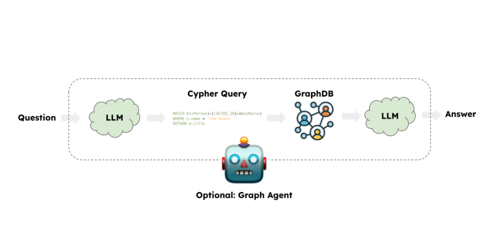
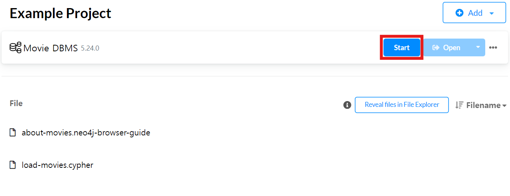
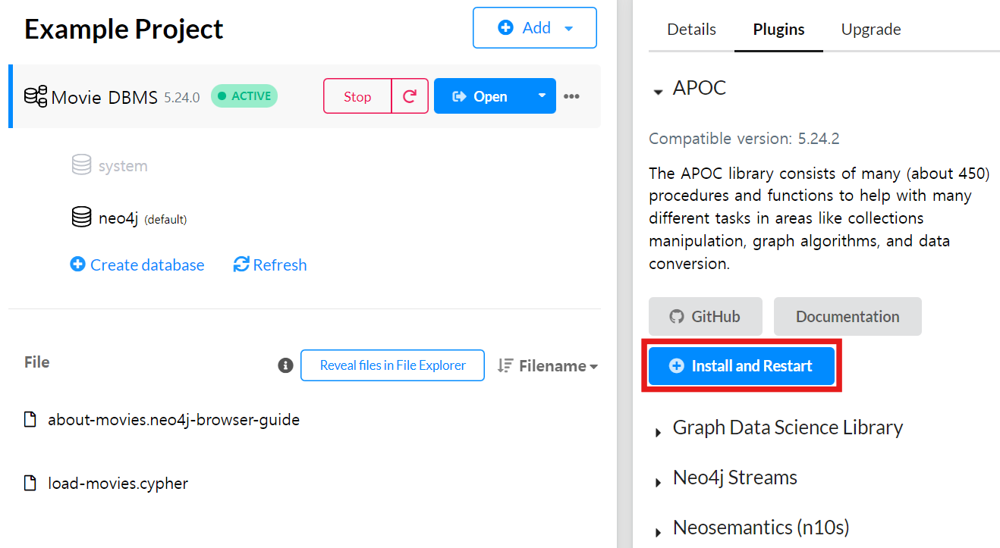
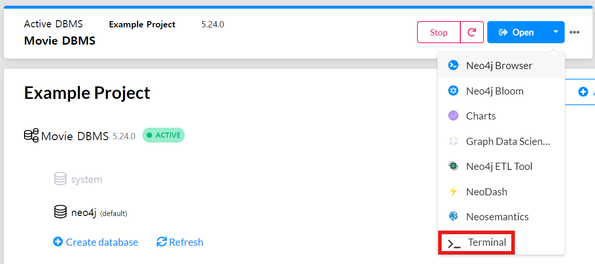
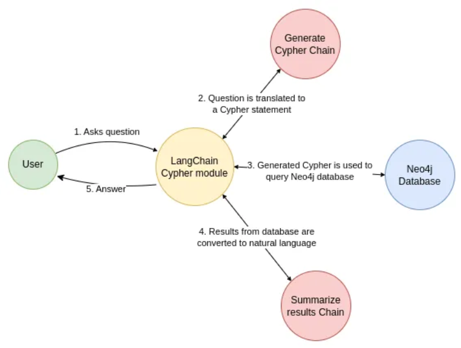
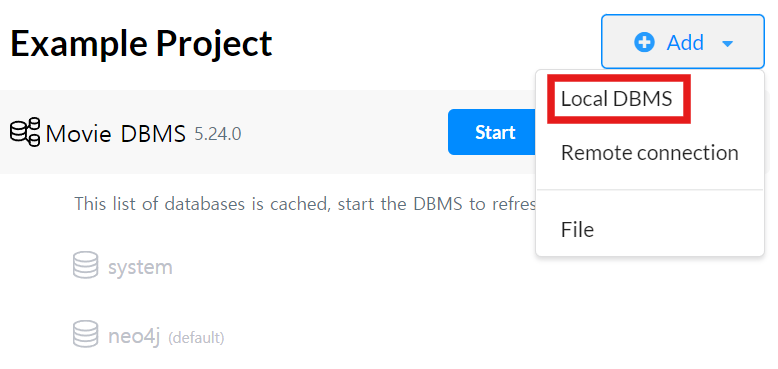
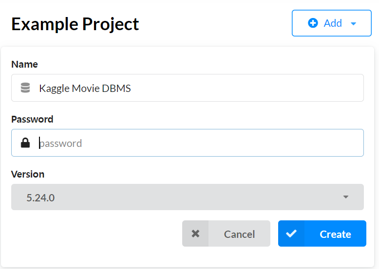
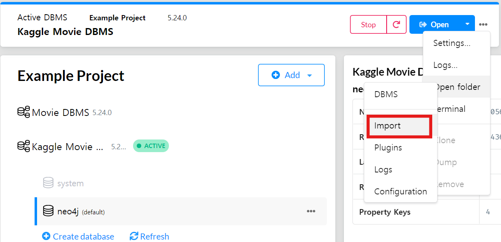

<style>
.custom {
    background-color: #008d8d;
    color: white;
    padding: 0.25em 0.5em 0.25em 0.5em;
    white-space: pre-wrap;       /* css-3 */
    white-space: -moz-pre-wrap;  /* Mozilla, since 1999 */
    white-space: -pre-wrap;      /* Opera 4-6 */
    white-space: -o-pre-wrap;    /* Opera 7 */
    word-wrap: break-word;
}

pre {
    background-color: #027c7c;
    padding-left: 0.5em;
}

</style>

# Movie QA System with Graph Database

- Author: [Heesun Moon](https://github.com/MoonHeesun)
- Design: 
- Peer Review: [Jongcheol Kim](https://github.com/greencode-99), [Taylor(Jihyun Kim)](https://github.com/Taylor0819)
- This is a part of [LangChain Open Tutorial](https://github.com/LangChain-OpenTutorial/LangChain-OpenTutorial)

[](https://colab.research.google.com/github/LangChain-OpenTutorial/LangChain-OpenTutorial/blob/main/19-Cookbook/03-GraphDB/04-MovieQASystem.ipynb) [](https://github.com/LangChain-OpenTutorial/LangChain-OpenTutorial/blob/main/19-Cookbook/03-GraphDB/04-MovieQASystem.ipynb)

## Overview

This tutorial covers the implementation of **a movie QA system using a graph database** with `Neo4j` .

It explains the process of storing data in a graph database and implementing a `text2Cypher` conversion feature using LLMs. This allows natural language queries to be converted into Cypher queries, and the answers retrieved from the database are returned in natural language as well.



>### ⚠️Security Note
>Building Q&A systems with graph databases involves executing model-generated queries, which carries inherent risks. To minimize these risks, restrict database permissions to the narrowest scope required for your chain or agent. While this reduces vulnerabilities, it does not eliminate them entirely. For more security best practices, see the [LangChain security documentation](https://python.langchain.com/docs/security/).

### Table of Contents

- [Overview](#overview)
- [Environement Setup](#environment-setup)
- [Connect to Neo4j Graph Database](#connect-to-neo4j-graph-database)
- [Graph Schema](#graph-schema)
- [GraphQACypherChain](#graphqacypherchain)
- [Using a New Dataset](#using-a-new-dataset)

### References

- [Neo4j](https://neo4j.com/)
- [LangChain: Build a Question Answering application over a Graph Database](https://python.langchain.com/docs/tutorials/graph/#graphqacypherchain)
- [Kaggle: The Movies Dataset](https://www.kaggle.com/datasets/rounakbanik/the-movies-dataset?)
----

## Environment Setup

Set up the environment. You may refer to [Environment Setup](https://wikidocs.net/257836) for more details.

**[Note]**
- `langchain-opentutorial` is a package that provides a set of easy-to-use environment setup, useful functions and utilities for tutorials. 
- You can checkout the [`langchain-opentutorial`](https://github.com/LangChain-OpenTutorial/langchain-opentutorial-pypi) for more details.

```python
%%capture --no-stderr
%pip install langchain-opentutorial
```

```python
# Install required packages
from langchain_opentutorial import package

package.install(
    [
        "langchain",
        "langchain_neo4j",
        "langchain_openai",
        "kagglehub",
        "ipywidgets",
    ],
    verbose=False,
    upgrade=False,
)
```

```python
# Set environment variables
from langchain_opentutorial import set_env

set_env(
    {
        "OPENAI_API_KEY": "",
        "NEO4J_URI": "",
        "NEO4J_USERNAME": "",
        "NEO4J_PASSWORD": "",
        "LANGCHAIN_API_KEY": "",
        "LANGCHAIN_TRACING_V2": "true",
        "LANGCHAIN_ENDPOINT": "https://api.smith.langchain.com",
        "LANGCHAIN_PROJECT": "04-MovieQASystem",
    }
)
```

You can alternatively set API keys such as `OPENAI_API_KEY` in a `.env` file and load them.

[Note] This is not necessary if you've already set the required API keys in previous steps.

```python
# Load API keys from .env file
from dotenv import load_dotenv

load_dotenv(override=True)
```


<pre class="custom">True</pre>


## Connect to Neo4j Graph Database

First, install the Neo4j graph database. This tutorial is based on `Neo4j Desktop` .

- [installation](https://neo4j.com/docs/operations-manual/current/installation/)

[Note] You can also set up a free, cloud-based Neo4j instance using [Neo4j Sandbox](https://neo4j.com/sandbox/), an online platform for working with graph databases.

After installing, open Neo4j Desktop. A default **Example Project** should be available. We'll use this project for this tutorial.

### Activate Database

Click the `Start` to activate the `Movie DBMS` .



### Setup APOC Plugin

- Open the `Movie DBMS` project.  
- Go to the `Plugins` section.  
- Select `APOC` and click `Install and Restart` .



To allow external network connections, you need to update the `neo4j.conf` file.

Open the terminal in `Neo4j Desktop` .



Navigate to the configuration file directory and edit `neo4j.conf` .

```python
# Change Directory
cd conf
# Windows
notepad neo4j.conf
# Linux/Mac
nano neo4j.conf
```

Add or modify the following line in the `neo4j.conf` file:  

- `server.default_listen_address=0.0.0.0`

### Define Neo4j Credentials

Next, you need to define your Neo4j credentials. If you haven't done this in the previous steps, you can define them using the `os` package.

[Note] This is not necessary if you've already set the required Neo4j credentials in previous steps.

>The default user account information:
>
>- Default username: `neo4j`
>- Default password: `neo4j`
>
>You are required to change the password upon your first login.

```python
import os

os.environ["NEO4J_URI"] = "bolt://localhost:7687"
os.environ["NEO4J_USERNAME"] = "neo4j"
os.environ["NEO4J_PASSWORD"] = "neo4j"
```

The following example demonstrates how to connect to a Neo4j database and populate it with sample data about movies and actors.

```python
from langchain_neo4j import Neo4jGraph

graph = Neo4jGraph()

# Step 1: Delete all existing data
delete_query = """
MATCH (n)
DETACH DELETE n
"""
graph.query(delete_query)

# Step 2: Load new movie dataset
movies_query = """
LOAD CSV WITH HEADERS FROM 
'https://raw.githubusercontent.com/tomasonjo/blog-datasets/main/movies/movies_small.csv'
AS row
MERGE (m:Movie {id:row.movieId})
SET m.released = date(row.released),
    m.title = row.title,
    m.imdbRating = toFloat(row.imdbRating)
FOREACH (director in split(row.director, '|') | 
    MERGE (p:Person {name:trim(director)})
    MERGE (p)-[:DIRECTED]->(m))
FOREACH (actor in split(row.actors, '|') | 
    MERGE (p:Person {name:trim(actor)})
    MERGE (p)-[:ACTED_IN]->(m))
FOREACH (genre in split(row.genres, '|') | 
    MERGE (g:Genre {name:trim(genre)})
    MERGE (m)-[:IN_GENRE]->(g))
"""

graph.query(movies_query)
```


<pre class="custom">[]</pre>


## Graph Schema

LLMs use graph schema information to convert natural language questions into Cypher queries. The converted query is executed in the database, and the execution results are provied to the LLM for question answering.

```python
# Update schema
graph.refresh_schema()
# Print the current schema
print(graph.schema)
```

<pre class="custom">Node properties:
    Movie {title: STRING, released: DATE, id: STRING, imdbRating: FLOAT}
    Person {name: STRING}
    Genre {name: STRING}
    Relationship properties:
    
    The relationships:
    (:Movie)-[:IN_GENRE]->(:Genre)
    (:Person)-[:DIRECTED]->(:Movie)
    (:Person)-[:ACTED_IN]->(:Movie)
</pre>

Now, let's check the enhanced schema information. Enhanced Schema Information provides a detailed overview of the graph structure, including node labels, relationship types, and property details such as data types and value ranges. This is particularly useful for generating more complex queries and leveraging LLMs for advanced use cases.

To enable Enhanced Schema, set the parameter `enhanced_schema=True` when initializing the graph object.

Key Features: 

- `Property Types` : Shows the data type (e.g., STRING, INTEGER, FLOAT) of each property.
- `Value Ranges` : Displays minimum and maximum values for numeric fields.
- `Examples` : Provides sample values for quick reference.
- `Relationships` : Lists connection types between nodes and their property details.

```python
enhanced_graph = Neo4jGraph(enhanced_schema=True)
print(enhanced_graph.schema)
```

<pre class="custom">Received notification from DBMS server: {severity: WARNING} {code: Neo.ClientNotification.Statement.FeatureDeprecationWarning} {category: DEPRECATION} {title: This feature is deprecated and will be removed in future versions.} {description: The procedure has a deprecated field. ('config' used by 'apoc.meta.graphSample' is deprecated.)} {position: line: 1, column: 1, offset: 0} for query: "CALL apoc.meta.graphSample() YIELD nodes, relationships RETURN nodes, [rel in relationships | {name:apoc.any.property(rel, 'type'), count: apoc.any.property(rel, 'count')}] AS relationships"
</pre>

    Node properties:
    - **Movie**
      - `title`: STRING Example: "Toy Story"
      - `released`: DATE Min: 1964-12-16, Max: 1996-09-15
      - `id`: STRING Example: "1"
      - `imdbRating`: FLOAT Min: 2.4, Max: 9.3
    - **Person**
      - `name`: STRING Example: "John Lasseter"
    - **Genre**
      - `name`: STRING Example: "Adventure"
    Relationship properties:
    
    The relationships:
    (:Movie)-[:IN_GENRE]->(:Genre)
    (:Person)-[:DIRECTED]->(:Movie)
    (:Person)-[:ACTED_IN]->(:Movie)
    

## GraphQACypherChain

The `GraphCypherQAChain` simplifies the process of querying graph databases using natural language by integrating LLMs and Neo4j. It enables users to interact with graph data through natural language queries by converting them into Cypher queries, which are executed against a Neo4j database.

Key Features:

- `Text-to-Cypher Conversion` : Automatically translates natural language questions into Cypher queries.
- `Query Execution` : Executes the generated queries against a Neo4j graph database.
- `Natural Language Answers` : Processes and formats query results into human-readable answers.
- `LLM Integration` : Leverages Large Language Models (LLMs), like OpenAI’s GPT, for query generation and result interpretation.
- `Enhanced Schema Support` : Can work with enhanced schema information for more accurate query generation.



```python
from langchain_neo4j import GraphCypherQAChain
from langchain_openai import ChatOpenAI

llm = ChatOpenAI(model="gpt-4o", temperature=0)
chain = GraphCypherQAChain.from_llm(
    graph=enhanced_graph, llm=llm, verbose=True, allow_dangerous_requests=True
)
response = chain.invoke({"query": "What was the cast of the Casino?"})
response
```

<pre class="custom">
    
    > Entering new GraphCypherQAChain chain...
    Generated Cypher:
    cypher
    MATCH (p:Person)-[:ACTED_IN]->(m:Movie {title: "Casino"})
    RETURN p.name
    
    Full Context:
    [{'p.name': 'Robert De Niro'}, {'p.name': 'Joe Pesci'}, {'p.name': 'Sharon Stone'}, {'p.name': 'James Woods'}]
    
    > Finished chain.
</pre>


    {'query': 'What was the cast of the Casino?',
     'result': 'Robert De Niro, Joe Pesci, Sharon Stone, and James Woods were the cast of Casino.'}


```python
response = chain.invoke({"query": "Recommend the popular romance movie."})
response
```

<pre class="custom">
    
    > Entering new GraphCypherQAChain chain...
    Generated Cypher:
    cypher
    MATCH (m:Movie)-[:IN_GENRE]->(g:Genre {name: "Romance"})
    RETURN m.title, m.imdbRating
    ORDER BY m.imdbRating DESC
    LIMIT 1
    
    Full Context:
    [{'m.title': 'Chungking Express (Chung Hing sam lam)', 'm.imdbRating': 8.1}]
    
    > Finished chain.
</pre>


    {'query': 'Recommend the popular romance movie.',
     'result': 'Chungking Express (Chung Hing sam lam) with an IMDb rating of 8.1 is a popular romance movie.'}


## Using a New Dataset

Now that we’re incorporating more diverse user and movie information, we can expand our perspective on movie recommendations. We'll utilize [Kaggle's The Movies Dataset](https://www.kaggle.com/datasets/rounakbanik/the-movies-dataset?) to run simple queries for recommendations.

To begin, we'll set up a new local DBMS to import and use this external dataset.

### Create a New Local DBMS

Refer to the images below to create a new Local DBMS named `Kaggle Movie DBMS` :





Next, connect to the Neo4j Graph Database as previously explained.

- [Connect to Neo4j Graph Database](#connect-to-neo4j-graph-database)

### Define Neo4j Credentials

Next, you need to define your Neo4j credentials. If you haven't done this in the previous steps, you can define them using the `os` package.

To import the dataset, you need to set the `import path` environment variable. In the image below, you can check the `import path` by clicking the `import` button. This path is where you will download and store the dataset.



[Note] This is not necessary if you've already set the required Neo4j credentials in previous steps.

```python
from langchain_neo4j import Neo4jGraph
import os

os.environ["NEO4J_URI"] = "bolt://localhost:7687"
os.environ["NEO4J_USERNAME"] = "neo4j"
os.environ["NEO4J_PASSWORD"] = "neo4j"
os.environ["IMPORT_DIR"] = "YOUR_IMPORT_DIR"

graph = Neo4jGraph()
```

### Download a New Dataset: Kaggle's The Movies Dataset

Download the Kaggle dataset and move it to the `import path` .

```python
import kagglehub
import shutil

# Download the Kaggle dataset
path = kagglehub.dataset_download("rounakbanik/the-movies-dataset")

print("Path to dataset files:", path)
print("*" * 30)

# Target path where the dataset files will be moved
target_path = os.environ.get("IMPORT_DIR")
os.makedirs(target_path, exist_ok=True)

# Move dataset files to the target path
for file_name in os.listdir(path):
    shutil.move(os.path.join(path, file_name), os.path.join(target_path, file_name))

print("Files moved to:", target_path)
```

<pre class="custom">Downloading from https://www.kaggle.com/api/v1/datasets/download/rounakbanik/the-movies-dataset?dataset_version_number=7...
</pre>

    100%|██████████| 228M/228M [00:08<00:00, 26.7MB/s] 

    Extracting files...
    

    
    

    Path to dataset files: C:\Users\user\.cache\kagglehub\datasets\rounakbanik\the-movies-dataset\versions\7
    ******************************
    Files moved to: C:\Users\user\.Neo4jDesktop\relate-data\dbmss\dbms-a942a090-d1b1-4a85-aef4-bbcc4186d101\import
    

Below is a simple example code that connects to a Neo4j database and populates it with a portion of the downloaded dataset:

```python
movies_query = f"""
LOAD CSV WITH HEADERS FROM 'file:///movies_metadata.csv' AS row
MERGE (m:Movie {{id: row.id}})
SET m.title = row.title,
    m.popularity = toFloat(row.popularity)
"""
graph.query(movies_query)
```


<pre class="custom">[]</pre>


```python
keywords_query = f"""
CALL apoc.periodic.iterate(
    "LOAD CSV WITH HEADERS FROM 'file:///keywords.csv' AS row RETURN row",
    "WITH row, apoc.convert.fromJsonList(row.keywords) AS keywords
     UNWIND keywords AS keyword
     MERGE (k:Keyword {{name: keyword.name}})
     MERGE (m:Movie {{id: row.id}})
     MERGE (m)-[:HAS_KEYWORD]->(k)",
    {{batchSize: 1000, parallel: true}}
)
"""
graph.query(keywords_query)
```


<pre class="custom">[{'batches': 47,
      'total': 46419,
      'timeTaken': 611,
      'committedOperations': 9000,
      'failedOperations': 37419,
      'failedBatches': 38,
      'retries': 0,
      'errorMessages': {"ForsetiClient[transactionId=63, clientId=17] can't acquire ExclusiveLock{owner=ForsetiClient[transactionId=35, clientId=12]} on NODE_RELATIONSHIP_GROUP_DELETE(45599) because holders of that lock are waiting for ForsetiClient[transactionId=63, clientId=17].\r\n Wait list:ExclusiveLock[\r\nClient[35] waits for [ForsetiClient[transactionId=63, clientId=17],ForsetiClient[transactionId=56, clientId=11]]]": 1,
       "ForsetiClient[transactionId=71, clientId=17] can't acquire ExclusiveLock{owner=ForsetiClient[transactionId=69, clientId=8]} on NODE_RELATIONSHIP_GROUP_DELETE(45541) because holders of that lock are waiting for ForsetiClient[transactionId=71, clientId=17].\r\n Wait list:ExclusiveLock[\r\nClient[69] waits for [ForsetiClient[transactionId=71, clientId=17]]]": 1,
       "ForsetiClient[transactionId=74, clientId=15] can't acquire ExclusiveLock{owner=ForsetiClient[transactionId=69, clientId=8]} on NODE_RELATIONSHIP_GROUP_DELETE(45541) because holders of that lock are waiting for ForsetiClient[transactionId=74, clientId=15].\r\n Wait list:ExclusiveLock[\r\nClient[69] waits for [ForsetiClient[transactionId=74, clientId=15]]]": 1,
       "ForsetiClient[transactionId=66, clientId=18] can't acquire ExclusiveLock{owner=ForsetiClient[transactionId=35, clientId=12]} on NODE_RELATIONSHIP_GROUP_DELETE(48126) because holders of that lock are waiting for ForsetiClient[transactionId=66, clientId=18].\r\n Wait list:ExclusiveLock[\r\nClient[35] waits for [ForsetiClient[transactionId=66, clientId=18]]]": 1,
       "ForsetiClient[transactionId=68, clientId=6] can't acquire ExclusiveLock{owner=ForsetiClient[transactionId=69, clientId=8]} on NODE_RELATIONSHIP_GROUP_DELETE(46494) because holders of that lock are waiting for ForsetiClient[transactionId=68, clientId=6].\r\n Wait list:ExclusiveLock[\r\nClient[69] waits for [ForsetiClient[transactionId=68, clientId=6]]]": 1,
       "ForsetiClient[transactionId=46, clientId=16] can't acquire ExclusiveLock{owner=ForsetiClient[transactionId=34, clientId=11]} on NODE_RELATIONSHIP_GROUP_DELETE(48158) because holders of that lock are waiting for ForsetiClient[transactionId=46, clientId=16].\r\n Wait list:ExclusiveLock[\r\nClient[34] waits for [ForsetiClient[transactionId=46, clientId=16],ForsetiClient[transactionId=-1, clientId=17],ForsetiClient[transactionId=49, clientId=18],ForsetiClient[transactionId=-1, clientId=6]]]": 1,
       "ForsetiClient[transactionId=29, clientId=6] can't acquire ExclusiveLock{owner=ForsetiClient[transactionId=34, clientId=11]} on NODE_RELATIONSHIP_GROUP_DELETE(46076) because holders of that lock are waiting for ForsetiClient[transactionId=29, clientId=6].\r\n Wait list:ExclusiveLock[\r\nClient[34] waits for [ForsetiClient[transactionId=45, clientId=17],ForsetiClient[transactionId=-1, clientId=18],ForsetiClient[transactionId=29, clientId=6]]]": 1,
       "ForsetiClient[transactionId=30, clientId=7] can't acquire ExclusiveLock{owner=ForsetiClient[transactionId=34, clientId=11]} on NODE_RELATIONSHIP_GROUP_DELETE(53312) because holders of that lock are waiting for ForsetiClient[transactionId=30, clientId=7].\r\n Wait list:ExclusiveLock[\r\nClient[34] waits for [ForsetiClient[transactionId=30, clientId=7]]]": 1,
       "ForsetiClient[transactionId=44, clientId=18] can't acquire ExclusiveLock{owner=ForsetiClient[transactionId=34, clientId=11]} on NODE_RELATIONSHIP_GROUP_DELETE(46076) because holders of that lock are waiting for ForsetiClient[transactionId=44, clientId=18].\r\n Wait list:ExclusiveLock[\r\nClient[34] waits for [ForsetiClient[transactionId=45, clientId=17],ForsetiClient[transactionId=44, clientId=18],ForsetiClient[transactionId=-1, clientId=5]]]": 1,
       "ForsetiClient[transactionId=50, clientId=17] can't acquire ExclusiveLock{owner=ForsetiClient[transactionId=51, clientId=6]} on NODE_RELATIONSHIP_GROUP_DELETE(45541) because holders of that lock are waiting for ForsetiClient[transactionId=50, clientId=17].\r\n Wait list:ExclusiveLock[\r\nClient[51] waits for [ForsetiClient[transactionId=50, clientId=17]]]": 1,
       "ForsetiClient[transactionId=31, clientId=8] can't acquire ExclusiveLock{owner=ForsetiClient[transactionId=34, clientId=11]} on NODE_RELATIONSHIP_GROUP_DELETE(48510) because holders of that lock are waiting for ForsetiClient[transactionId=31, clientId=8].\r\n Wait list:ExclusiveLock[\r\nClient[34] waits for [ForsetiClient[transactionId=31, clientId=8]]]": 1,
       "ForsetiClient[transactionId=28, clientId=5] can't acquire ExclusiveLock{owner=ForsetiClient[transactionId=31, clientId=8]} on NODE_RELATIONSHIP_GROUP_DELETE(47215) because holders of that lock are waiting for ForsetiClient[transactionId=28, clientId=5].\r\n Wait list:ExclusiveLock[\r\nClient[31] waits for [ForsetiClient[transactionId=45, clientId=17],ForsetiClient[transactionId=28, clientId=5]]]": 1,
       "ForsetiClient[transactionId=51, clientId=6] can't acquire ExclusiveLock{owner=ForsetiClient[transactionId=35, clientId=12]} on NODE_RELATIONSHIP_GROUP_DELETE(50318) because holders of that lock are waiting for ForsetiClient[transactionId=51, clientId=6].\r\n Wait list:ExclusiveLock[\r\nClient[35] waits for [ForsetiClient[transactionId=51, clientId=6]]]": 1,
       "ForsetiClient[transactionId=59, clientId=4] can't acquire ExclusiveLock{owner=ForsetiClient[transactionId=35, clientId=12]} on NODE_RELATIONSHIP_GROUP_DELETE(47502) because holders of that lock are waiting for ForsetiClient[transactionId=59, clientId=4].\r\n Wait list:ExclusiveLock[\r\nClient[35] waits for [ForsetiClient[transactionId=59, clientId=4],ForsetiClient[transactionId=-1, clientId=11]]]": 1,
       "ForsetiClient[transactionId=70, clientId=7] can't acquire ExclusiveLock{owner=ForsetiClient[transactionId=35, clientId=12]} on NODE_RELATIONSHIP_GROUP_DELETE(45541) because holders of that lock are waiting for ForsetiClient[transactionId=70, clientId=7].\r\n Wait list:ExclusiveLock[\r\nClient[35] waits for [ForsetiClient[transactionId=70, clientId=7]]]": 1,
       "ForsetiClient[transactionId=53, clientId=8] can't acquire ExclusiveLock{owner=ForsetiClient[transactionId=56, clientId=11]} on NODE_RELATIONSHIP_GROUP_DELETE(45541) because holders of that lock are waiting for ForsetiClient[transactionId=53, clientId=8].\r\n Wait list:ExclusiveLock[\r\nClient[56] waits for [ForsetiClient[transactionId=55, clientId=7],ForsetiClient[transactionId=53, clientId=8]]]": 1,
       "ForsetiClient[transactionId=36, clientId=13] can't acquire ExclusiveLock{owner=ForsetiClient[transactionId=33, clientId=10]} on NODE_RELATIONSHIP_GROUP_DELETE(46809) because holders of that lock are waiting for ForsetiClient[transactionId=36, clientId=13].\r\n Wait list:ExclusiveLock[\r\nClient[33] waits for [ForsetiClient[transactionId=36, clientId=13]]]": 1,
       "ForsetiClient[transactionId=52, clientId=16] can't acquire ExclusiveLock{owner=ForsetiClient[transactionId=51, clientId=6]} on NODE_RELATIONSHIP_GROUP_DELETE(50973) because holders of that lock are waiting for ForsetiClient[transactionId=52, clientId=16].\r\n Wait list:ExclusiveLock[\r\nClient[51] waits for [ForsetiClient[transactionId=52, clientId=16],ForsetiClient[transactionId=63, clientId=17],ForsetiClient[transactionId=-1, clientId=15]]]": 1,
       "ForsetiClient[transactionId=58, clientId=13] can't acquire ExclusiveLock{owner=ForsetiClient[transactionId=56, clientId=11]} on NODE_RELATIONSHIP_GROUP_DELETE(62794) because holders of that lock are waiting for ForsetiClient[transactionId=58, clientId=13].\r\n Wait list:ExclusiveLock[\r\nClient[56] waits for [ForsetiClient[transactionId=-1, clientId=17],ForsetiClient[transactionId=35, clientId=12],ForsetiClient[transactionId=58, clientId=13]]]": 1,
       "ForsetiClient[transactionId=37, clientId=14] can't acquire ExclusiveLock{owner=ForsetiClient[transactionId=36, clientId=13]} on NODE_RELATIONSHIP_GROUP_DELETE(47277) because holders of that lock are waiting for ForsetiClient[transactionId=37, clientId=14].\r\n Wait list:ExclusiveLock[\r\nClient[36] waits for [ForsetiClient[transactionId=37, clientId=14]]]": 1,
       "ForsetiClient[transactionId=64, clientId=15] can't acquire ExclusiveLock{owner=ForsetiClient[transactionId=56, clientId=11]} on NODE_RELATIONSHIP_GROUP_DELETE(45541) because holders of that lock are waiting for ForsetiClient[transactionId=64, clientId=15].\r\n Wait list:ExclusiveLock[\r\nClient[56] waits for [ForsetiClient[transactionId=64, clientId=15]]]": 1,
       "ForsetiClient[transactionId=27, clientId=4] can't acquire ExclusiveLock{owner=ForsetiClient[transactionId=33, clientId=10]} on NODE_RELATIONSHIP_GROUP_DELETE(50272) because holders of that lock are waiting for ForsetiClient[transactionId=27, clientId=4].\r\n Wait list:ExclusiveLock[\r\nClient[33] waits for [ForsetiClient[transactionId=27, clientId=4]]]": 1,
       "ForsetiClient[transactionId=65, clientId=16] can't acquire ExclusiveLock{owner=ForsetiClient[transactionId=56, clientId=11]} on NODE_RELATIONSHIP_GROUP_DELETE(45441) because holders of that lock are waiting for ForsetiClient[transactionId=65, clientId=16].\r\n Wait list:ExclusiveLock[\r\nClient[56] waits for [ForsetiClient[transactionId=65, clientId=16],ForsetiClient[transactionId=-1, clientId=17],ForsetiClient[transactionId=35, clientId=12],ForsetiClient[transactionId=-1, clientId=13]]]": 1,
       "ForsetiClient[transactionId=54, clientId=3] can't acquire ExclusiveLock{owner=ForsetiClient[transactionId=35, clientId=12]} on NODE_RELATIONSHIP_GROUP_DELETE(45541) because holders of that lock are waiting for ForsetiClient[transactionId=54, clientId=3].\r\n Wait list:ExclusiveLock[\r\nClient[35] waits for [ForsetiClient[transactionId=54, clientId=3],ForsetiClient[transactionId=61, clientId=5]]]": 1,
       "ForsetiClient[transactionId=57, clientId=14] can't acquire ExclusiveLock{owner=ForsetiClient[transactionId=35, clientId=12]} on NODE_RELATIONSHIP_GROUP_DELETE(45599) because holders of that lock are waiting for ForsetiClient[transactionId=57, clientId=14].\r\n Wait list:ExclusiveLock[\r\nClient[35] waits for [ForsetiClient[transactionId=-1, clientId=16],ForsetiClient[transactionId=57, clientId=14]]]": 1,
       "ForsetiClient[transactionId=60, clientId=1] can't acquire ExclusiveLock{owner=ForsetiClient[transactionId=35, clientId=12]} on NODE_RELATIONSHIP_GROUP_DELETE(46245) because holders of that lock are waiting for ForsetiClient[transactionId=60, clientId=1].\r\n Wait list:ExclusiveLock[\r\nClient[35] waits for [ForsetiClient[transactionId=60, clientId=1]]]": 1,
       "ForsetiClient[transactionId=73, clientId=16] can't acquire ExclusiveLock{owner=ForsetiClient[transactionId=35, clientId=12]} on NODE_RELATIONSHIP_GROUP_DELETE(46030) because holders of that lock are waiting for ForsetiClient[transactionId=73, clientId=16].\r\n Wait list:ExclusiveLock[\r\nClient[35] waits for [ForsetiClient[transactionId=73, clientId=16]]]": 1,
       "ForsetiClient[transactionId=25, clientId=1] can't acquire ExclusiveLock{owner=ForsetiClient[transactionId=33, clientId=10]} on NODE_RELATIONSHIP_GROUP_DELETE(45599) because holders of that lock are waiting for ForsetiClient[transactionId=25, clientId=1].\r\n Wait list:ExclusiveLock[\r\nClient[33] waits for [ForsetiClient[transactionId=25, clientId=1]]]": 1,
       "ForsetiClient[transactionId=62, clientId=10] can't acquire ExclusiveLock{owner=ForsetiClient[transactionId=51, clientId=6]} on NODE_RELATIONSHIP_GROUP_DELETE(45441) because holders of that lock are waiting for ForsetiClient[transactionId=62, clientId=10].\r\n Wait list:ExclusiveLock[\r\nClient[51] waits for [ForsetiClient[transactionId=62, clientId=10]]]": 1,
       "ForsetiClient[transactionId=55, clientId=7] can't acquire ExclusiveLock{owner=ForsetiClient[transactionId=32, clientId=9]} on NODE_RELATIONSHIP_GROUP_DELETE(47193) because holders of that lock are waiting for ForsetiClient[transactionId=55, clientId=7].\r\n Wait list:ExclusiveLock[\r\nClient[32] waits for [ForsetiClient[transactionId=55, clientId=7],ForsetiClient[transactionId=-1, clientId=8],ForsetiClient[transactionId=56, clientId=11]]]": 1,
       "ForsetiClient[transactionId=48, clientId=5] can't acquire ExclusiveLock{owner=ForsetiClient[transactionId=33, clientId=10]} on NODE_RELATIONSHIP_GROUP_DELETE(63368) because holders of that lock are waiting for ForsetiClient[transactionId=48, clientId=5].\r\n Wait list:ExclusiveLock[\r\nClient[33] waits for [ForsetiClient[transactionId=48, clientId=5]]]": 1,
       "ForsetiClient[transactionId=45, clientId=17] can't acquire ExclusiveLock{owner=ForsetiClient[transactionId=29, clientId=6]} on NODE_RELATIONSHIP_GROUP_DELETE(45602) because holders of that lock are waiting for ForsetiClient[transactionId=45, clientId=17].\r\n Wait list:ExclusiveLock[\r\nClient[29] waits for [ForsetiClient[transactionId=45, clientId=17],ForsetiClient[transactionId=-1, clientId=18],ForsetiClient[transactionId=34, clientId=11]]]": 1,
       "ForsetiClient[transactionId=32, clientId=9] can't acquire ExclusiveLock{owner=ForsetiClient[transactionId=35, clientId=12]} on NODE_RELATIONSHIP_GROUP_DELETE(47502) because holders of that lock are waiting for ForsetiClient[transactionId=32, clientId=9].\r\n Wait list:ExclusiveLock[\r\nClient[35] waits for [ForsetiClient[transactionId=-1, clientId=4],ForsetiClient[transactionId=32, clientId=9],ForsetiClient[transactionId=-1, clientId=11]]]": 1,
       "ForsetiClient[transactionId=61, clientId=5] can't acquire ExclusiveLock{owner=ForsetiClient[transactionId=35, clientId=12]} on NODE_RELATIONSHIP_GROUP_DELETE(45453) because holders of that lock are waiting for ForsetiClient[transactionId=61, clientId=5].\r\n Wait list:ExclusiveLock[\r\nClient[35] waits for [ForsetiClient[transactionId=61, clientId=5]]]": 1,
       "ForsetiClient[transactionId=56, clientId=11] can't acquire ExclusiveLock{owner=ForsetiClient[transactionId=35, clientId=12]} on NODE_RELATIONSHIP_GROUP_DELETE(45599) because holders of that lock are waiting for ForsetiClient[transactionId=56, clientId=11].\r\n Wait list:ExclusiveLock[\r\nClient[35] waits for [ForsetiClient[transactionId=56, clientId=11]]]": 1,
       "ForsetiClient[transactionId=49, clientId=18] can't acquire ExclusiveLock{owner=ForsetiClient[transactionId=51, clientId=6]} on NODE_RELATIONSHIP_GROUP_DELETE(45541) because holders of that lock are waiting for ForsetiClient[transactionId=49, clientId=18].\r\n Wait list:ExclusiveLock[\r\nClient[51] waits for [ForsetiClient[transactionId=49, clientId=18]]]": 1,
       "ForsetiClient[transactionId=26, clientId=3] can't acquire ExclusiveLock{owner=ForsetiClient[transactionId=34, clientId=11]} on NODE_RELATIONSHIP_GROUP_DELETE(45599) because holders of that lock are waiting for ForsetiClient[transactionId=26, clientId=3].\r\n Wait list:ExclusiveLock[\r\nClient[34] waits for [ForsetiClient[transactionId=26, clientId=3]]]": 1,
       "ForsetiClient[transactionId=47, clientId=15] can't acquire ExclusiveLock{owner=ForsetiClient[transactionId=51, clientId=6]} on NODE_RELATIONSHIP_GROUP_DELETE(45441) because holders of that lock are waiting for ForsetiClient[transactionId=47, clientId=15].\r\n Wait list:ExclusiveLock[\r\nClient[51] waits for [ForsetiClient[transactionId=-1, clientId=17],ForsetiClient[transactionId=47, clientId=15]]]": 1},
      'batch': {'total': 47,
       'errors': {"org.neo4j.kernel.DeadlockDetectedException: ForsetiClient[transactionId=58, clientId=13] can't acquire ExclusiveLock{owner=ForsetiClient[transactionId=56, clientId=11]} on NODE_RELATIONSHIP_GROUP_DELETE(62794) because holders of that lock are waiting for ForsetiClient[transactionId=58, clientId=13].\r\n Wait list:ExclusiveLock[\r\nClient[56] waits for [ForsetiClient[transactionId=-1, clientId=17],ForsetiClient[transactionId=35, clientId=12],ForsetiClient[transactionId=58, clientId=13]]]": 1,
        "org.neo4j.kernel.DeadlockDetectedException: ForsetiClient[transactionId=48, clientId=5] can't acquire ExclusiveLock{owner=ForsetiClient[transactionId=33, clientId=10]} on NODE_RELATIONSHIP_GROUP_DELETE(63368) because holders of that lock are waiting for ForsetiClient[transactionId=48, clientId=5].\r\n Wait list:ExclusiveLock[\r\nClient[33] waits for [ForsetiClient[transactionId=48, clientId=5]]]": 1,
        "org.neo4j.kernel.DeadlockDetectedException: ForsetiClient[transactionId=68, clientId=6] can't acquire ExclusiveLock{owner=ForsetiClient[transactionId=69, clientId=8]} on NODE_RELATIONSHIP_GROUP_DELETE(46494) because holders of that lock are waiting for ForsetiClient[transactionId=68, clientId=6].\r\n Wait list:ExclusiveLock[\r\nClient[69] waits for [ForsetiClient[transactionId=68, clientId=6]]]": 1,
        "org.neo4j.kernel.DeadlockDetectedException: ForsetiClient[transactionId=46, clientId=16] can't acquire ExclusiveLock{owner=ForsetiClient[transactionId=34, clientId=11]} on NODE_RELATIONSHIP_GROUP_DELETE(48158) because holders of that lock are waiting for ForsetiClient[transactionId=46, clientId=16].\r\n Wait list:ExclusiveLock[\r\nClient[34] waits for [ForsetiClient[transactionId=46, clientId=16],ForsetiClient[transactionId=-1, clientId=17],ForsetiClient[transactionId=49, clientId=18],ForsetiClient[transactionId=-1, clientId=6]]]": 1,
        "org.neo4j.kernel.DeadlockDetectedException: ForsetiClient[transactionId=53, clientId=8] can't acquire ExclusiveLock{owner=ForsetiClient[transactionId=56, clientId=11]} on NODE_RELATIONSHIP_GROUP_DELETE(45541) because holders of that lock are waiting for ForsetiClient[transactionId=53, clientId=8].\r\n Wait list:ExclusiveLock[\r\nClient[56] waits for [ForsetiClient[transactionId=55, clientId=7],ForsetiClient[transactionId=53, clientId=8]]]": 1,
        "org.neo4j.kernel.DeadlockDetectedException: ForsetiClient[transactionId=56, clientId=11] can't acquire ExclusiveLock{owner=ForsetiClient[transactionId=35, clientId=12]} on NODE_RELATIONSHIP_GROUP_DELETE(45599) because holders of that lock are waiting for ForsetiClient[transactionId=56, clientId=11].\r\n Wait list:ExclusiveLock[\r\nClient[35] waits for [ForsetiClient[transactionId=56, clientId=11]]]": 1,
        "org.neo4j.kernel.DeadlockDetectedException: ForsetiClient[transactionId=37, clientId=14] can't acquire ExclusiveLock{owner=ForsetiClient[transactionId=36, clientId=13]} on NODE_RELATIONSHIP_GROUP_DELETE(47277) because holders of that lock are waiting for ForsetiClient[transactionId=37, clientId=14].\r\n Wait list:ExclusiveLock[\r\nClient[36] waits for [ForsetiClient[transactionId=37, clientId=14]]]": 1,
        "org.neo4j.kernel.DeadlockDetectedException: ForsetiClient[transactionId=32, clientId=9] can't acquire ExclusiveLock{owner=ForsetiClient[transactionId=35, clientId=12]} on NODE_RELATIONSHIP_GROUP_DELETE(47502) because holders of that lock are waiting for ForsetiClient[transactionId=32, clientId=9].\r\n Wait list:ExclusiveLock[\r\nClient[35] waits for [ForsetiClient[transactionId=-1, clientId=4],ForsetiClient[transactionId=32, clientId=9],ForsetiClient[transactionId=-1, clientId=11]]]": 1,
        "org.neo4j.kernel.DeadlockDetectedException: ForsetiClient[transactionId=45, clientId=17] can't acquire ExclusiveLock{owner=ForsetiClient[transactionId=29, clientId=6]} on NODE_RELATIONSHIP_GROUP_DELETE(45602) because holders of that lock are waiting for ForsetiClient[transactionId=45, clientId=17].\r\n Wait list:ExclusiveLock[\r\nClient[29] waits for [ForsetiClient[transactionId=45, clientId=17],ForsetiClient[transactionId=-1, clientId=18],ForsetiClient[transactionId=34, clientId=11]]]": 1,
        "org.neo4j.kernel.DeadlockDetectedException: ForsetiClient[transactionId=54, clientId=3] can't acquire ExclusiveLock{owner=ForsetiClient[transactionId=35, clientId=12]} on NODE_RELATIONSHIP_GROUP_DELETE(45541) because holders of that lock are waiting for ForsetiClient[transactionId=54, clientId=3].\r\n Wait list:ExclusiveLock[\r\nClient[35] waits for [ForsetiClient[transactionId=54, clientId=3],ForsetiClient[transactionId=61, clientId=5]]]": 1,
        "org.neo4j.kernel.DeadlockDetectedException: ForsetiClient[transactionId=74, clientId=15] can't acquire ExclusiveLock{owner=ForsetiClient[transactionId=69, clientId=8]} on NODE_RELATIONSHIP_GROUP_DELETE(45541) because holders of that lock are waiting for ForsetiClient[transactionId=74, clientId=15].\r\n Wait list:ExclusiveLock[\r\nClient[69] waits for [ForsetiClient[transactionId=74, clientId=15]]]": 1,
        "org.neo4j.kernel.DeadlockDetectedException: ForsetiClient[transactionId=30, clientId=7] can't acquire ExclusiveLock{owner=ForsetiClient[transactionId=34, clientId=11]} on NODE_RELATIONSHIP_GROUP_DELETE(53312) because holders of that lock are waiting for ForsetiClient[transactionId=30, clientId=7].\r\n Wait list:ExclusiveLock[\r\nClient[34] waits for [ForsetiClient[transactionId=30, clientId=7]]]": 1,
        "org.neo4j.kernel.DeadlockDetectedException: ForsetiClient[transactionId=70, clientId=7] can't acquire ExclusiveLock{owner=ForsetiClient[transactionId=35, clientId=12]} on NODE_RELATIONSHIP_GROUP_DELETE(45541) because holders of that lock are waiting for ForsetiClient[transactionId=70, clientId=7].\r\n Wait list:ExclusiveLock[\r\nClient[35] waits for [ForsetiClient[transactionId=70, clientId=7]]]": 1,
        "org.neo4j.kernel.DeadlockDetectedException: ForsetiClient[transactionId=62, clientId=10] can't acquire ExclusiveLock{owner=ForsetiClient[transactionId=51, clientId=6]} on NODE_RELATIONSHIP_GROUP_DELETE(45441) because holders of that lock are waiting for ForsetiClient[transactionId=62, clientId=10].\r\n Wait list:ExclusiveLock[\r\nClient[51] waits for [ForsetiClient[transactionId=62, clientId=10]]]": 1,
        "org.neo4j.kernel.DeadlockDetectedException: ForsetiClient[transactionId=66, clientId=18] can't acquire ExclusiveLock{owner=ForsetiClient[transactionId=35, clientId=12]} on NODE_RELATIONSHIP_GROUP_DELETE(48126) because holders of that lock are waiting for ForsetiClient[transactionId=66, clientId=18].\r\n Wait list:ExclusiveLock[\r\nClient[35] waits for [ForsetiClient[transactionId=66, clientId=18]]]": 1,
        "org.neo4j.kernel.DeadlockDetectedException: ForsetiClient[transactionId=50, clientId=17] can't acquire ExclusiveLock{owner=ForsetiClient[transactionId=51, clientId=6]} on NODE_RELATIONSHIP_GROUP_DELETE(45541) because holders of that lock are waiting for ForsetiClient[transactionId=50, clientId=17].\r\n Wait list:ExclusiveLock[\r\nClient[51] waits for [ForsetiClient[transactionId=50, clientId=17]]]": 1,
        "org.neo4j.kernel.DeadlockDetectedException: ForsetiClient[transactionId=26, clientId=3] can't acquire ExclusiveLock{owner=ForsetiClient[transactionId=34, clientId=11]} on NODE_RELATIONSHIP_GROUP_DELETE(45599) because holders of that lock are waiting for ForsetiClient[transactionId=26, clientId=3].\r\n Wait list:ExclusiveLock[\r\nClient[34] waits for [ForsetiClient[transactionId=26, clientId=3]]]": 1,
        "org.neo4j.kernel.DeadlockDetectedException: ForsetiClient[transactionId=29, clientId=6] can't acquire ExclusiveLock{owner=ForsetiClient[transactionId=34, clientId=11]} on NODE_RELATIONSHIP_GROUP_DELETE(46076) because holders of that lock are waiting for ForsetiClient[transactionId=29, clientId=6].\r\n Wait list:ExclusiveLock[\r\nClient[34] waits for [ForsetiClient[transactionId=45, clientId=17],ForsetiClient[transactionId=-1, clientId=18],ForsetiClient[transactionId=29, clientId=6]]]": 1,
        "org.neo4j.kernel.DeadlockDetectedException: ForsetiClient[transactionId=57, clientId=14] can't acquire ExclusiveLock{owner=ForsetiClient[transactionId=35, clientId=12]} on NODE_RELATIONSHIP_GROUP_DELETE(45599) because holders of that lock are waiting for ForsetiClient[transactionId=57, clientId=14].\r\n Wait list:ExclusiveLock[\r\nClient[35] waits for [ForsetiClient[transactionId=-1, clientId=16],ForsetiClient[transactionId=57, clientId=14]]]": 1,
        "org.neo4j.kernel.DeadlockDetectedException: ForsetiClient[transactionId=61, clientId=5] can't acquire ExclusiveLock{owner=ForsetiClient[transactionId=35, clientId=12]} on NODE_RELATIONSHIP_GROUP_DELETE(45453) because holders of that lock are waiting for ForsetiClient[transactionId=61, clientId=5].\r\n Wait list:ExclusiveLock[\r\nClient[35] waits for [ForsetiClient[transactionId=61, clientId=5]]]": 1,
        "org.neo4j.kernel.DeadlockDetectedException: ForsetiClient[transactionId=64, clientId=15] can't acquire ExclusiveLock{owner=ForsetiClient[transactionId=56, clientId=11]} on NODE_RELATIONSHIP_GROUP_DELETE(45541) because holders of that lock are waiting for ForsetiClient[transactionId=64, clientId=15].\r\n Wait list:ExclusiveLock[\r\nClient[56] waits for [ForsetiClient[transactionId=64, clientId=15]]]": 1,
        "org.neo4j.kernel.DeadlockDetectedException: ForsetiClient[transactionId=25, clientId=1] can't acquire ExclusiveLock{owner=ForsetiClient[transactionId=33, clientId=10]} on NODE_RELATIONSHIP_GROUP_DELETE(45599) because holders of that lock are waiting for ForsetiClient[transactionId=25, clientId=1].\r\n Wait list:ExclusiveLock[\r\nClient[33] waits for [ForsetiClient[transactionId=25, clientId=1]]]": 1,
        "org.neo4j.kernel.DeadlockDetectedException: ForsetiClient[transactionId=71, clientId=17] can't acquire ExclusiveLock{owner=ForsetiClient[transactionId=69, clientId=8]} on NODE_RELATIONSHIP_GROUP_DELETE(45541) because holders of that lock are waiting for ForsetiClient[transactionId=71, clientId=17].\r\n Wait list:ExclusiveLock[\r\nClient[69] waits for [ForsetiClient[transactionId=71, clientId=17]]]": 1,
        "org.neo4j.kernel.DeadlockDetectedException: ForsetiClient[transactionId=55, clientId=7] can't acquire ExclusiveLock{owner=ForsetiClient[transactionId=32, clientId=9]} on NODE_RELATIONSHIP_GROUP_DELETE(47193) because holders of that lock are waiting for ForsetiClient[transactionId=55, clientId=7].\r\n Wait list:ExclusiveLock[\r\nClient[32] waits for [ForsetiClient[transactionId=55, clientId=7],ForsetiClient[transactionId=-1, clientId=8],ForsetiClient[transactionId=56, clientId=11]]]": 1,
        "org.neo4j.kernel.DeadlockDetectedException: ForsetiClient[transactionId=65, clientId=16] can't acquire ExclusiveLock{owner=ForsetiClient[transactionId=56, clientId=11]} on NODE_RELATIONSHIP_GROUP_DELETE(45441) because holders of that lock are waiting for ForsetiClient[transactionId=65, clientId=16].\r\n Wait list:ExclusiveLock[\r\nClient[56] waits for [ForsetiClient[transactionId=65, clientId=16],ForsetiClient[transactionId=-1, clientId=17],ForsetiClient[transactionId=35, clientId=12],ForsetiClient[transactionId=-1, clientId=13]]]": 1,
        "org.neo4j.kernel.DeadlockDetectedException: ForsetiClient[transactionId=47, clientId=15] can't acquire ExclusiveLock{owner=ForsetiClient[transactionId=51, clientId=6]} on NODE_RELATIONSHIP_GROUP_DELETE(45441) because holders of that lock are waiting for ForsetiClient[transactionId=47, clientId=15].\r\n Wait list:ExclusiveLock[\r\nClient[51] waits for [ForsetiClient[transactionId=-1, clientId=17],ForsetiClient[transactionId=47, clientId=15]]]": 1,
        "org.neo4j.kernel.DeadlockDetectedException: ForsetiClient[transactionId=44, clientId=18] can't acquire ExclusiveLock{owner=ForsetiClient[transactionId=34, clientId=11]} on NODE_RELATIONSHIP_GROUP_DELETE(46076) because holders of that lock are waiting for ForsetiClient[transactionId=44, clientId=18].\r\n Wait list:ExclusiveLock[\r\nClient[34] waits for [ForsetiClient[transactionId=45, clientId=17],ForsetiClient[transactionId=44, clientId=18],ForsetiClient[transactionId=-1, clientId=5]]]": 1,
        "org.neo4j.kernel.DeadlockDetectedException: ForsetiClient[transactionId=36, clientId=13] can't acquire ExclusiveLock{owner=ForsetiClient[transactionId=33, clientId=10]} on NODE_RELATIONSHIP_GROUP_DELETE(46809) because holders of that lock are waiting for ForsetiClient[transactionId=36, clientId=13].\r\n Wait list:ExclusiveLock[\r\nClient[33] waits for [ForsetiClient[transactionId=36, clientId=13]]]": 1,
        "org.neo4j.kernel.DeadlockDetectedException: ForsetiClient[transactionId=51, clientId=6] can't acquire ExclusiveLock{owner=ForsetiClient[transactionId=35, clientId=12]} on NODE_RELATIONSHIP_GROUP_DELETE(50318) because holders of that lock are waiting for ForsetiClient[transactionId=51, clientId=6].\r\n Wait list:ExclusiveLock[\r\nClient[35] waits for [ForsetiClient[transactionId=51, clientId=6]]]": 1,
        "org.neo4j.kernel.DeadlockDetectedException: ForsetiClient[transactionId=31, clientId=8] can't acquire ExclusiveLock{owner=ForsetiClient[transactionId=34, clientId=11]} on NODE_RELATIONSHIP_GROUP_DELETE(48510) because holders of that lock are waiting for ForsetiClient[transactionId=31, clientId=8].\r\n Wait list:ExclusiveLock[\r\nClient[34] waits for [ForsetiClient[transactionId=31, clientId=8]]]": 1,
        "org.neo4j.kernel.DeadlockDetectedException: ForsetiClient[transactionId=28, clientId=5] can't acquire ExclusiveLock{owner=ForsetiClient[transactionId=31, clientId=8]} on NODE_RELATIONSHIP_GROUP_DELETE(47215) because holders of that lock are waiting for ForsetiClient[transactionId=28, clientId=5].\r\n Wait list:ExclusiveLock[\r\nClient[31] waits for [ForsetiClient[transactionId=45, clientId=17],ForsetiClient[transactionId=28, clientId=5]]]": 1,
        "org.neo4j.kernel.DeadlockDetectedException: ForsetiClient[transactionId=60, clientId=1] can't acquire ExclusiveLock{owner=ForsetiClient[transactionId=35, clientId=12]} on NODE_RELATIONSHIP_GROUP_DELETE(46245) because holders of that lock are waiting for ForsetiClient[transactionId=60, clientId=1].\r\n Wait list:ExclusiveLock[\r\nClient[35] waits for [ForsetiClient[transactionId=60, clientId=1]]]": 1,
        "org.neo4j.kernel.DeadlockDetectedException: ForsetiClient[transactionId=73, clientId=16] can't acquire ExclusiveLock{owner=ForsetiClient[transactionId=35, clientId=12]} on NODE_RELATIONSHIP_GROUP_DELETE(46030) because holders of that lock are waiting for ForsetiClient[transactionId=73, clientId=16].\r\n Wait list:ExclusiveLock[\r\nClient[35] waits for [ForsetiClient[transactionId=73, clientId=16]]]": 1,
        "org.neo4j.kernel.DeadlockDetectedException: ForsetiClient[transactionId=49, clientId=18] can't acquire ExclusiveLock{owner=ForsetiClient[transactionId=51, clientId=6]} on NODE_RELATIONSHIP_GROUP_DELETE(45541) because holders of that lock are waiting for ForsetiClient[transactionId=49, clientId=18].\r\n Wait list:ExclusiveLock[\r\nClient[51] waits for [ForsetiClient[transactionId=49, clientId=18]]]": 1,
        "org.neo4j.kernel.DeadlockDetectedException: ForsetiClient[transactionId=63, clientId=17] can't acquire ExclusiveLock{owner=ForsetiClient[transactionId=35, clientId=12]} on NODE_RELATIONSHIP_GROUP_DELETE(45599) because holders of that lock are waiting for ForsetiClient[transactionId=63, clientId=17].\r\n Wait list:ExclusiveLock[\r\nClient[35] waits for [ForsetiClient[transactionId=63, clientId=17],ForsetiClient[transactionId=56, clientId=11]]]": 1,
        "org.neo4j.kernel.DeadlockDetectedException: ForsetiClient[transactionId=52, clientId=16] can't acquire ExclusiveLock{owner=ForsetiClient[transactionId=51, clientId=6]} on NODE_RELATIONSHIP_GROUP_DELETE(50973) because holders of that lock are waiting for ForsetiClient[transactionId=52, clientId=16].\r\n Wait list:ExclusiveLock[\r\nClient[51] waits for [ForsetiClient[transactionId=52, clientId=16],ForsetiClient[transactionId=63, clientId=17],ForsetiClient[transactionId=-1, clientId=15]]]": 1,
        "org.neo4j.kernel.DeadlockDetectedException: ForsetiClient[transactionId=27, clientId=4] can't acquire ExclusiveLock{owner=ForsetiClient[transactionId=33, clientId=10]} on NODE_RELATIONSHIP_GROUP_DELETE(50272) because holders of that lock are waiting for ForsetiClient[transactionId=27, clientId=4].\r\n Wait list:ExclusiveLock[\r\nClient[33] waits for [ForsetiClient[transactionId=27, clientId=4]]]": 1,
        "org.neo4j.kernel.DeadlockDetectedException: ForsetiClient[transactionId=59, clientId=4] can't acquire ExclusiveLock{owner=ForsetiClient[transactionId=35, clientId=12]} on NODE_RELATIONSHIP_GROUP_DELETE(47502) because holders of that lock are waiting for ForsetiClient[transactionId=59, clientId=4].\r\n Wait list:ExclusiveLock[\r\nClient[35] waits for [ForsetiClient[transactionId=59, clientId=4],ForsetiClient[transactionId=-1, clientId=11]]]": 1},
       'committed': 9,
       'failed': 38},
      'operations': {'total': 46419,
       'errors': {"ForsetiClient[transactionId=63, clientId=17] can't acquire ExclusiveLock{owner=ForsetiClient[transactionId=35, clientId=12]} on NODE_RELATIONSHIP_GROUP_DELETE(45599) because holders of that lock are waiting for ForsetiClient[transactionId=63, clientId=17].\r\n Wait list:ExclusiveLock[\r\nClient[35] waits for [ForsetiClient[transactionId=63, clientId=17],ForsetiClient[transactionId=56, clientId=11]]]": 1,
        "ForsetiClient[transactionId=71, clientId=17] can't acquire ExclusiveLock{owner=ForsetiClient[transactionId=69, clientId=8]} on NODE_RELATIONSHIP_GROUP_DELETE(45541) because holders of that lock are waiting for ForsetiClient[transactionId=71, clientId=17].\r\n Wait list:ExclusiveLock[\r\nClient[69] waits for [ForsetiClient[transactionId=71, clientId=17]]]": 1,
        "ForsetiClient[transactionId=74, clientId=15] can't acquire ExclusiveLock{owner=ForsetiClient[transactionId=69, clientId=8]} on NODE_RELATIONSHIP_GROUP_DELETE(45541) because holders of that lock are waiting for ForsetiClient[transactionId=74, clientId=15].\r\n Wait list:ExclusiveLock[\r\nClient[69] waits for [ForsetiClient[transactionId=74, clientId=15]]]": 1,
        "ForsetiClient[transactionId=66, clientId=18] can't acquire ExclusiveLock{owner=ForsetiClient[transactionId=35, clientId=12]} on NODE_RELATIONSHIP_GROUP_DELETE(48126) because holders of that lock are waiting for ForsetiClient[transactionId=66, clientId=18].\r\n Wait list:ExclusiveLock[\r\nClient[35] waits for [ForsetiClient[transactionId=66, clientId=18]]]": 1,
        "ForsetiClient[transactionId=68, clientId=6] can't acquire ExclusiveLock{owner=ForsetiClient[transactionId=69, clientId=8]} on NODE_RELATIONSHIP_GROUP_DELETE(46494) because holders of that lock are waiting for ForsetiClient[transactionId=68, clientId=6].\r\n Wait list:ExclusiveLock[\r\nClient[69] waits for [ForsetiClient[transactionId=68, clientId=6]]]": 1,
        "ForsetiClient[transactionId=46, clientId=16] can't acquire ExclusiveLock{owner=ForsetiClient[transactionId=34, clientId=11]} on NODE_RELATIONSHIP_GROUP_DELETE(48158) because holders of that lock are waiting for ForsetiClient[transactionId=46, clientId=16].\r\n Wait list:ExclusiveLock[\r\nClient[34] waits for [ForsetiClient[transactionId=46, clientId=16],ForsetiClient[transactionId=-1, clientId=17],ForsetiClient[transactionId=49, clientId=18],ForsetiClient[transactionId=-1, clientId=6]]]": 1,
        "ForsetiClient[transactionId=29, clientId=6] can't acquire ExclusiveLock{owner=ForsetiClient[transactionId=34, clientId=11]} on NODE_RELATIONSHIP_GROUP_DELETE(46076) because holders of that lock are waiting for ForsetiClient[transactionId=29, clientId=6].\r\n Wait list:ExclusiveLock[\r\nClient[34] waits for [ForsetiClient[transactionId=45, clientId=17],ForsetiClient[transactionId=-1, clientId=18],ForsetiClient[transactionId=29, clientId=6]]]": 1,
        "ForsetiClient[transactionId=30, clientId=7] can't acquire ExclusiveLock{owner=ForsetiClient[transactionId=34, clientId=11]} on NODE_RELATIONSHIP_GROUP_DELETE(53312) because holders of that lock are waiting for ForsetiClient[transactionId=30, clientId=7].\r\n Wait list:ExclusiveLock[\r\nClient[34] waits for [ForsetiClient[transactionId=30, clientId=7]]]": 1,
        "ForsetiClient[transactionId=44, clientId=18] can't acquire ExclusiveLock{owner=ForsetiClient[transactionId=34, clientId=11]} on NODE_RELATIONSHIP_GROUP_DELETE(46076) because holders of that lock are waiting for ForsetiClient[transactionId=44, clientId=18].\r\n Wait list:ExclusiveLock[\r\nClient[34] waits for [ForsetiClient[transactionId=45, clientId=17],ForsetiClient[transactionId=44, clientId=18],ForsetiClient[transactionId=-1, clientId=5]]]": 1,
        "ForsetiClient[transactionId=50, clientId=17] can't acquire ExclusiveLock{owner=ForsetiClient[transactionId=51, clientId=6]} on NODE_RELATIONSHIP_GROUP_DELETE(45541) because holders of that lock are waiting for ForsetiClient[transactionId=50, clientId=17].\r\n Wait list:ExclusiveLock[\r\nClient[51] waits for [ForsetiClient[transactionId=50, clientId=17]]]": 1,
        "ForsetiClient[transactionId=31, clientId=8] can't acquire ExclusiveLock{owner=ForsetiClient[transactionId=34, clientId=11]} on NODE_RELATIONSHIP_GROUP_DELETE(48510) because holders of that lock are waiting for ForsetiClient[transactionId=31, clientId=8].\r\n Wait list:ExclusiveLock[\r\nClient[34] waits for [ForsetiClient[transactionId=31, clientId=8]]]": 1,
        "ForsetiClient[transactionId=28, clientId=5] can't acquire ExclusiveLock{owner=ForsetiClient[transactionId=31, clientId=8]} on NODE_RELATIONSHIP_GROUP_DELETE(47215) because holders of that lock are waiting for ForsetiClient[transactionId=28, clientId=5].\r\n Wait list:ExclusiveLock[\r\nClient[31] waits for [ForsetiClient[transactionId=45, clientId=17],ForsetiClient[transactionId=28, clientId=5]]]": 1,
        "ForsetiClient[transactionId=51, clientId=6] can't acquire ExclusiveLock{owner=ForsetiClient[transactionId=35, clientId=12]} on NODE_RELATIONSHIP_GROUP_DELETE(50318) because holders of that lock are waiting for ForsetiClient[transactionId=51, clientId=6].\r\n Wait list:ExclusiveLock[\r\nClient[35] waits for [ForsetiClient[transactionId=51, clientId=6]]]": 1,
        "ForsetiClient[transactionId=59, clientId=4] can't acquire ExclusiveLock{owner=ForsetiClient[transactionId=35, clientId=12]} on NODE_RELATIONSHIP_GROUP_DELETE(47502) because holders of that lock are waiting for ForsetiClient[transactionId=59, clientId=4].\r\n Wait list:ExclusiveLock[\r\nClient[35] waits for [ForsetiClient[transactionId=59, clientId=4],ForsetiClient[transactionId=-1, clientId=11]]]": 1,
        "ForsetiClient[transactionId=70, clientId=7] can't acquire ExclusiveLock{owner=ForsetiClient[transactionId=35, clientId=12]} on NODE_RELATIONSHIP_GROUP_DELETE(45541) because holders of that lock are waiting for ForsetiClient[transactionId=70, clientId=7].\r\n Wait list:ExclusiveLock[\r\nClient[35] waits for [ForsetiClient[transactionId=70, clientId=7]]]": 1,
        "ForsetiClient[transactionId=53, clientId=8] can't acquire ExclusiveLock{owner=ForsetiClient[transactionId=56, clientId=11]} on NODE_RELATIONSHIP_GROUP_DELETE(45541) because holders of that lock are waiting for ForsetiClient[transactionId=53, clientId=8].\r\n Wait list:ExclusiveLock[\r\nClient[56] waits for [ForsetiClient[transactionId=55, clientId=7],ForsetiClient[transactionId=53, clientId=8]]]": 1,
        "ForsetiClient[transactionId=36, clientId=13] can't acquire ExclusiveLock{owner=ForsetiClient[transactionId=33, clientId=10]} on NODE_RELATIONSHIP_GROUP_DELETE(46809) because holders of that lock are waiting for ForsetiClient[transactionId=36, clientId=13].\r\n Wait list:ExclusiveLock[\r\nClient[33] waits for [ForsetiClient[transactionId=36, clientId=13]]]": 1,
        "ForsetiClient[transactionId=52, clientId=16] can't acquire ExclusiveLock{owner=ForsetiClient[transactionId=51, clientId=6]} on NODE_RELATIONSHIP_GROUP_DELETE(50973) because holders of that lock are waiting for ForsetiClient[transactionId=52, clientId=16].\r\n Wait list:ExclusiveLock[\r\nClient[51] waits for [ForsetiClient[transactionId=52, clientId=16],ForsetiClient[transactionId=63, clientId=17],ForsetiClient[transactionId=-1, clientId=15]]]": 1,
        "ForsetiClient[transactionId=58, clientId=13] can't acquire ExclusiveLock{owner=ForsetiClient[transactionId=56, clientId=11]} on NODE_RELATIONSHIP_GROUP_DELETE(62794) because holders of that lock are waiting for ForsetiClient[transactionId=58, clientId=13].\r\n Wait list:ExclusiveLock[\r\nClient[56] waits for [ForsetiClient[transactionId=-1, clientId=17],ForsetiClient[transactionId=35, clientId=12],ForsetiClient[transactionId=58, clientId=13]]]": 1,
        "ForsetiClient[transactionId=37, clientId=14] can't acquire ExclusiveLock{owner=ForsetiClient[transactionId=36, clientId=13]} on NODE_RELATIONSHIP_GROUP_DELETE(47277) because holders of that lock are waiting for ForsetiClient[transactionId=37, clientId=14].\r\n Wait list:ExclusiveLock[\r\nClient[36] waits for [ForsetiClient[transactionId=37, clientId=14]]]": 1,
        "ForsetiClient[transactionId=64, clientId=15] can't acquire ExclusiveLock{owner=ForsetiClient[transactionId=56, clientId=11]} on NODE_RELATIONSHIP_GROUP_DELETE(45541) because holders of that lock are waiting for ForsetiClient[transactionId=64, clientId=15].\r\n Wait list:ExclusiveLock[\r\nClient[56] waits for [ForsetiClient[transactionId=64, clientId=15]]]": 1,
        "ForsetiClient[transactionId=27, clientId=4] can't acquire ExclusiveLock{owner=ForsetiClient[transactionId=33, clientId=10]} on NODE_RELATIONSHIP_GROUP_DELETE(50272) because holders of that lock are waiting for ForsetiClient[transactionId=27, clientId=4].\r\n Wait list:ExclusiveLock[\r\nClient[33] waits for [ForsetiClient[transactionId=27, clientId=4]]]": 1,
        "ForsetiClient[transactionId=65, clientId=16] can't acquire ExclusiveLock{owner=ForsetiClient[transactionId=56, clientId=11]} on NODE_RELATIONSHIP_GROUP_DELETE(45441) because holders of that lock are waiting for ForsetiClient[transactionId=65, clientId=16].\r\n Wait list:ExclusiveLock[\r\nClient[56] waits for [ForsetiClient[transactionId=65, clientId=16],ForsetiClient[transactionId=-1, clientId=17],ForsetiClient[transactionId=35, clientId=12],ForsetiClient[transactionId=-1, clientId=13]]]": 1,
        "ForsetiClient[transactionId=54, clientId=3] can't acquire ExclusiveLock{owner=ForsetiClient[transactionId=35, clientId=12]} on NODE_RELATIONSHIP_GROUP_DELETE(45541) because holders of that lock are waiting for ForsetiClient[transactionId=54, clientId=3].\r\n Wait list:ExclusiveLock[\r\nClient[35] waits for [ForsetiClient[transactionId=54, clientId=3],ForsetiClient[transactionId=61, clientId=5]]]": 1,
        "ForsetiClient[transactionId=57, clientId=14] can't acquire ExclusiveLock{owner=ForsetiClient[transactionId=35, clientId=12]} on NODE_RELATIONSHIP_GROUP_DELETE(45599) because holders of that lock are waiting for ForsetiClient[transactionId=57, clientId=14].\r\n Wait list:ExclusiveLock[\r\nClient[35] waits for [ForsetiClient[transactionId=-1, clientId=16],ForsetiClient[transactionId=57, clientId=14]]]": 1,
        "ForsetiClient[transactionId=60, clientId=1] can't acquire ExclusiveLock{owner=ForsetiClient[transactionId=35, clientId=12]} on NODE_RELATIONSHIP_GROUP_DELETE(46245) because holders of that lock are waiting for ForsetiClient[transactionId=60, clientId=1].\r\n Wait list:ExclusiveLock[\r\nClient[35] waits for [ForsetiClient[transactionId=60, clientId=1]]]": 1,
        "ForsetiClient[transactionId=73, clientId=16] can't acquire ExclusiveLock{owner=ForsetiClient[transactionId=35, clientId=12]} on NODE_RELATIONSHIP_GROUP_DELETE(46030) because holders of that lock are waiting for ForsetiClient[transactionId=73, clientId=16].\r\n Wait list:ExclusiveLock[\r\nClient[35] waits for [ForsetiClient[transactionId=73, clientId=16]]]": 1,
        "ForsetiClient[transactionId=25, clientId=1] can't acquire ExclusiveLock{owner=ForsetiClient[transactionId=33, clientId=10]} on NODE_RELATIONSHIP_GROUP_DELETE(45599) because holders of that lock are waiting for ForsetiClient[transactionId=25, clientId=1].\r\n Wait list:ExclusiveLock[\r\nClient[33] waits for [ForsetiClient[transactionId=25, clientId=1]]]": 1,
        "ForsetiClient[transactionId=62, clientId=10] can't acquire ExclusiveLock{owner=ForsetiClient[transactionId=51, clientId=6]} on NODE_RELATIONSHIP_GROUP_DELETE(45441) because holders of that lock are waiting for ForsetiClient[transactionId=62, clientId=10].\r\n Wait list:ExclusiveLock[\r\nClient[51] waits for [ForsetiClient[transactionId=62, clientId=10]]]": 1,
        "ForsetiClient[transactionId=55, clientId=7] can't acquire ExclusiveLock{owner=ForsetiClient[transactionId=32, clientId=9]} on NODE_RELATIONSHIP_GROUP_DELETE(47193) because holders of that lock are waiting for ForsetiClient[transactionId=55, clientId=7].\r\n Wait list:ExclusiveLock[\r\nClient[32] waits for [ForsetiClient[transactionId=55, clientId=7],ForsetiClient[transactionId=-1, clientId=8],ForsetiClient[transactionId=56, clientId=11]]]": 1,
        "ForsetiClient[transactionId=48, clientId=5] can't acquire ExclusiveLock{owner=ForsetiClient[transactionId=33, clientId=10]} on NODE_RELATIONSHIP_GROUP_DELETE(63368) because holders of that lock are waiting for ForsetiClient[transactionId=48, clientId=5].\r\n Wait list:ExclusiveLock[\r\nClient[33] waits for [ForsetiClient[transactionId=48, clientId=5]]]": 1,
        "ForsetiClient[transactionId=45, clientId=17] can't acquire ExclusiveLock{owner=ForsetiClient[transactionId=29, clientId=6]} on NODE_RELATIONSHIP_GROUP_DELETE(45602) because holders of that lock are waiting for ForsetiClient[transactionId=45, clientId=17].\r\n Wait list:ExclusiveLock[\r\nClient[29] waits for [ForsetiClient[transactionId=45, clientId=17],ForsetiClient[transactionId=-1, clientId=18],ForsetiClient[transactionId=34, clientId=11]]]": 1,
        "ForsetiClient[transactionId=32, clientId=9] can't acquire ExclusiveLock{owner=ForsetiClient[transactionId=35, clientId=12]} on NODE_RELATIONSHIP_GROUP_DELETE(47502) because holders of that lock are waiting for ForsetiClient[transactionId=32, clientId=9].\r\n Wait list:ExclusiveLock[\r\nClient[35] waits for [ForsetiClient[transactionId=-1, clientId=4],ForsetiClient[transactionId=32, clientId=9],ForsetiClient[transactionId=-1, clientId=11]]]": 1,
        "ForsetiClient[transactionId=61, clientId=5] can't acquire ExclusiveLock{owner=ForsetiClient[transactionId=35, clientId=12]} on NODE_RELATIONSHIP_GROUP_DELETE(45453) because holders of that lock are waiting for ForsetiClient[transactionId=61, clientId=5].\r\n Wait list:ExclusiveLock[\r\nClient[35] waits for [ForsetiClient[transactionId=61, clientId=5]]]": 1,
        "ForsetiClient[transactionId=56, clientId=11] can't acquire ExclusiveLock{owner=ForsetiClient[transactionId=35, clientId=12]} on NODE_RELATIONSHIP_GROUP_DELETE(45599) because holders of that lock are waiting for ForsetiClient[transactionId=56, clientId=11].\r\n Wait list:ExclusiveLock[\r\nClient[35] waits for [ForsetiClient[transactionId=56, clientId=11]]]": 1,
        "ForsetiClient[transactionId=49, clientId=18] can't acquire ExclusiveLock{owner=ForsetiClient[transactionId=51, clientId=6]} on NODE_RELATIONSHIP_GROUP_DELETE(45541) because holders of that lock are waiting for ForsetiClient[transactionId=49, clientId=18].\r\n Wait list:ExclusiveLock[\r\nClient[51] waits for [ForsetiClient[transactionId=49, clientId=18]]]": 1,
        "ForsetiClient[transactionId=26, clientId=3] can't acquire ExclusiveLock{owner=ForsetiClient[transactionId=34, clientId=11]} on NODE_RELATIONSHIP_GROUP_DELETE(45599) because holders of that lock are waiting for ForsetiClient[transactionId=26, clientId=3].\r\n Wait list:ExclusiveLock[\r\nClient[34] waits for [ForsetiClient[transactionId=26, clientId=3]]]": 1,
        "ForsetiClient[transactionId=47, clientId=15] can't acquire ExclusiveLock{owner=ForsetiClient[transactionId=51, clientId=6]} on NODE_RELATIONSHIP_GROUP_DELETE(45441) because holders of that lock are waiting for ForsetiClient[transactionId=47, clientId=15].\r\n Wait list:ExclusiveLock[\r\nClient[51] waits for [ForsetiClient[transactionId=-1, clientId=17],ForsetiClient[transactionId=47, clientId=15]]]": 1},
       'committed': 9000,
       'failed': 37419},
      'wasTerminated': False,
      'failedParams': {},
      'updateStatistics': {'relationshipsDeleted': 0,
       'relationshipsCreated': 54369,
       'nodesDeleted': 0,
       'nodesCreated': 15129,
       'labelsRemoved': 0,
       'labelsAdded': 15129,
       'propertiesSet': 15129}}]</pre>


```python
# Update schema
graph.refresh_schema()
# Print the current schema
print(graph.schema)
```

<pre class="custom">Node properties:
    Movie {id: STRING, title: STRING, popularity: FLOAT}
    Keyword {name: STRING}
    Relationship properties:
    
    The relationships:
    (:Movie)-[:HAS_KEYWORD]->(:Keyword)
</pre>

```python
enhanced_graph = Neo4jGraph(enhanced_schema=True)
print(enhanced_graph.schema)
```

<pre class="custom">Received notification from DBMS server: {severity: WARNING} {code: Neo.ClientNotification.Statement.FeatureDeprecationWarning} {category: DEPRECATION} {title: This feature is deprecated and will be removed in future versions.} {description: The procedure has a deprecated field. ('config' used by 'apoc.meta.graphSample' is deprecated.)} {position: line: 1, column: 1, offset: 0} for query: "CALL apoc.meta.graphSample() YIELD nodes, relationships RETURN nodes, [rel in relationships | {name:apoc.any.property(rel, 'type'), count: apoc.any.property(rel, 'count')}] AS relationships"
</pre>

    Node properties:
    - **Movie**
      - `id`: STRING Example: "862"
      - `title`: STRING Example: "Toy Story"
      - `popularity`: FLOAT Example: "21.946943"
    - **Keyword**
      - `name`: STRING Example: "terror"
    Relationship properties:
    
    The relationships:
    (:Movie)-[:HAS_KEYWORD]->(:Keyword)
    

```python
from langchain_neo4j import GraphCypherQAChain
from langchain_openai import ChatOpenAI

llm = ChatOpenAI(model="gpt-4o", temperature=0)
chain = GraphCypherQAChain.from_llm(
    graph=enhanced_graph, llm=llm, verbose=True, allow_dangerous_requests=True
)

response = chain.invoke(
    {
        "query": "What movies have a popularity score above 8.0 and are tagged with 'comedy'?"
    }
)
response
```

<pre class="custom">
    
    > Entering new GraphCypherQAChain chain...
    Generated Cypher:
    cypher
    MATCH (m:Movie)-[:HAS_KEYWORD]->(k:Keyword {name: 'comedy'})
    WHERE m.popularity > 8.0
    RETURN m.title
    
    Full Context:
    [{'m.title': 'Ratchet & Clank'}, {'m.title': 'Kick-Ass'}, {'m.title': 'Jackass 3D'}, {'m.title': 'Ratchet & Clank'}, {'m.title': 'Ratchet & Clank'}, {'m.title': 'Aliens in the Attic'}, {'m.title': 'Ratchet & Clank'}, {'m.title': "A Dog's Will"}, {'m.title': 'Ratchet & Clank'}, {'m.title': 'Ratchet & Clank'}]
    
    > Finished chain.
</pre>


    {'query': "What movies have a popularity score above 8.0 and are tagged with 'comedy'?",
     'result': "Ratchet & Clank, Kick-Ass, Jackass 3D, Aliens in the Attic, A Dog's Will have a popularity score above 8.0 and are tagged with 'comedy'."}


Let's try running a few more simple example queries.

```python
response = chain.invoke(
    {"query": "What is the average popularity score of movies tagged with 'romance'?"}
)

response
```

<pre class="custom">
    
    > Entering new GraphCypherQAChain chain...
    Generated Cypher:
    cypher
    MATCH (m:Movie)-[:HAS_KEYWORD]->(k:Keyword {name: 'romance'})
    RETURN avg(m.popularity) AS average_popularity
    
    Full Context:
    [{'average_popularity': 12.390850747422673}]
    
    > Finished chain.
</pre>


    {'query': "What is the average popularity score of movies tagged with 'romance'?",
     'result': "The average popularity score of movies tagged with 'romance' is 12.390850747422673."}


```python
response = chain.invoke(
    {"query": "What movies are tagged with both 'comedy' and 'romance'?"}
)

response
```

<pre class="custom">
    
    > Entering new GraphCypherQAChain chain...
    Generated Cypher:
    cypher
    MATCH (m:Movie)-[:HAS_KEYWORD]->(k1:Keyword {name: 'comedy'}),
          (m)-[:HAS_KEYWORD]->(k2:Keyword {name: 'romance'})
    RETURN m.title
    
    Full Context:
    [{'m.title': 'Lisbela and the Prisoner'}, {'m.title': 'Lisbela and the Prisoner'}, {'m.title': 'Lisbela and the Prisoner'}, {'m.title': 'Lisbela and the Prisoner'}, {'m.title': 'Lisbela and the Prisoner'}, {'m.title': 'Lisbela and the Prisoner'}, {'m.title': 'Love Hina Christmas Special: Silent Eve'}, {'m.title': 'Love Is in the Air'}, {'m.title': 'Love Is in the Air'}, {'m.title': 'Love Is in the Air'}]
    
    > Finished chain.
</pre>


    {'query': "What movies are tagged with both 'comedy' and 'romance'?",
     'result': "Lisbela and the Prisoner, Love Hina Christmas Special: Silent Eve, Love Is in the Air are tagged with both 'comedy' and 'romance'."}


