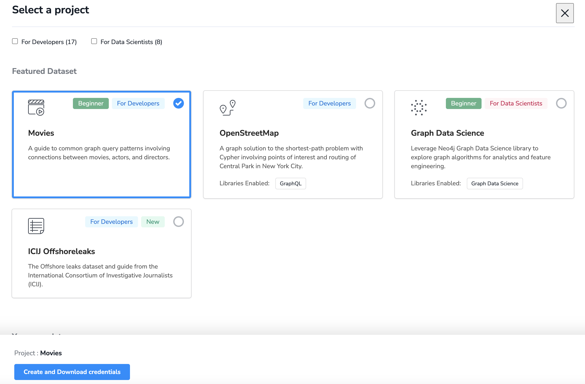
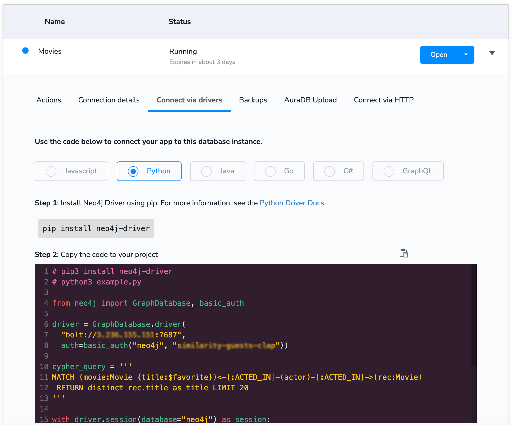
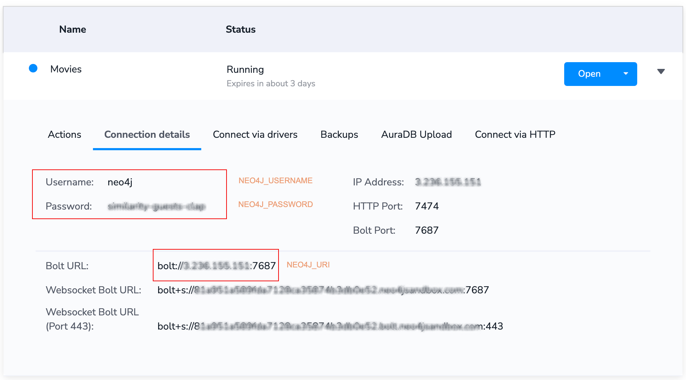

<style>
.custom {
    background-color: #008d8d;
    color: white;
    padding: 0.25em 0.5em 0.25em 0.5em;
    white-space: pre-wrap;       /* css-3 */
    white-space: -moz-pre-wrap;  /* Mozilla, since 1999 */
    white-space: -pre-wrap;      /* Opera 4-6 */
    white-space: -o-pre-wrap;    /* Opera 7 */
    word-wrap: break-word;
}

pre {
    background-color: #027c7c;
    padding-left: 0.5em;
}

</style>

# Real-Time GraphRAG QA

- Author: [Jongcheol Kim](https://github.com/greencode-99)
- Design: 
- Peer Review: [Heesun Moon](https://github.com/MoonHeesun), [Taylor(Jihyun Kim)](https://github.com/Taylor0819)
- This is a part of [LangChain Open Tutorial](https://github.com/LangChain-OpenTutorial/LangChain-OpenTutorial)

[](https://colab.research.google.com/github/LangChain-OpenTutorial/LangChain-OpenTutorial/blob/main/19-Cookbook/03-GraphDB/06-RealTimeQA.ipynb) [](https://github.com/LangChain-OpenTutorial/LangChain-OpenTutorial/blob/main/19-Cookbook/03-GraphDB/06-RealTimeQA.ipynb)

## Overview

This tutorial provides **GraphRAG QA** functionality that extracts knowledge from PDF documents and enables natural language queries through a **Neo4j graph database**. After users upload PDF documents, they are processed using **OpenAI's GPT models** (e.g., `gpt-4o`) to extract entities and relationships.

The extracted information is stored in a **Neo4j graph database**. Users can then interact with the graph in real-time by asking natural language questions, which are converted into **Cypher queries** to retrieve answers from the graph.


### Features

- **Real-time GraphRAG:** Enables real-time knowledge extraction from documents and supports interactive querying.
- **Modular and Configurable:** Users can set up their own credentials for `OpenAI` and `Neo4j`.
- **Natural Language Interface:** Ask questions in plain English and get answers from the graph database.


### Table of Contents

- [Overview](#overview)
- [Environment Setup](#environment-setup)
- [Neo4j Database Connection](#neo4j-database-connection)
- [PDF Processing](#pdf-processing)
- [Graph Transformation](#graph-transformation)
- [QA Chain Setup](#qa-chain-setup)
- [Define QA Function](#define-qa-function)
- [Usage Example](#usage-example)

### References

- [LangChain Documentation: Neo4j Integration](https://python.langchain.com/docs/integrations/retrievers/self_query/neo4j_self_query/#filter-k)
- [Neo4j Graph Labs](https://neo4j.com/labs/genai-ecosystem/langchain/)
- [LangChain Graph QA Chain](https://python.langchain.com/api_reference/community/chains/langchain_community.chains.graph_qa.base.GraphQAChain.html#graphqachain)

----

## Environment Setup

Set up the environment. You may refer to [Environment Setup](https://wikidocs.net/257836) for more details.

**[Note]**
- `langchain-opentutorial` is a package that provides a set of easy-to-use environment setup, useful functions and utilities for tutorials. 
- You can checkout the [`langchain-opentutorial`](https://github.com/LangChain-OpenTutorial/langchain-opentutorial-pypi) for more details.

```python
%%capture --no-stderr
%pip install langchain-opentutorial
```

```python
# Install required packages
from langchain_opentutorial import package

package.install(
    [
        "langchain",
        "langchain_neo4j",
        "langchain_openai",
        "langchain_core",
        "langchain_text_splitters",
        "langchain_experimental",
        "pypdf",
        "json-repair",
    ],
    verbose=False,
    upgrade=False,
)
```

```python
# Set environment variables
from langchain_opentutorial import set_env

set_env(
    {
        "OPENAI_API_KEY": "",
        "LANGCHAIN_API_KEY": "",
        "LANGCHAIN_TRACING_V2": "true",
        "LANGCHAIN_ENDPOINT": "https://api.smith.langchain.com",
        "LANGCHAIN_PROJECT": "Real-Time GraphRAG QA",
        "NEO4J_URI": "",
        "NEO4J_USERNAME": "",
        "NEO4J_PASSWORD": "",
    }
)
```

<pre class="custom">Environment variables have been set successfully.
</pre>

```python
from dotenv import load_dotenv

load_dotenv(override=True)
```


<pre class="custom">True</pre>


## Neo4j Database Connection

This tutorial uses Neo4j and Neo4j Sandbox for graph database construction.
 
`Neo4j Sandbox` is an online graph database that allows you to easily build a **free cloud-based Neo4j instance**, allowing you to experiment with graph databases in the cloud environment without local installation.

[Note] 
Neo4j can be set up in several different ways:

1. [`Neo4j Desktop`](https://neo4j.com/docs/operations-manual/current/installation/) :  A desktop application for local development

2. [`Neo4j Sandbox` ](https://neo4j.com/sandbox/) : A free, cloud-based platform for working with graph databases

3. [`Docker` ](https://neo4j.com/docs/operations-manual/current/docker/) : Run Neo4j in a container using the official Neo4j Docker image

### Setup Neo4j Sandbox
- Go to Neo4j Sandbox and click the "+ New Project" button. Select your desired dataset to create a database.



- After creation, click the toggle to see example connection code provided for different programming languages. You can easily connect using the neo4j-driver library.



- To connect the graph database with LangChain, you'll need the connection details from this section.




The following code connects to the Neo4j database and initializes the necessary components for our application.

```python
import os
from langchain_openai import ChatOpenAI
from langchain_neo4j import Neo4jGraph


OPENAI_API_KEY = os.getenv("OPENAI_API_KEY")
if not OPENAI_API_KEY:
    raise ValueError("OPENAI_API_KEY is not set")

NEO4J_URI = os.getenv("NEO4J_URI")
NEO4J_USERNAME = os.getenv("NEO4J_USERNAME")
NEO4J_PASSWORD = os.getenv("NEO4J_PASSWORD")

llm = ChatOpenAI(model_name="gpt-4o")


def connect_to_neo4j():
    try:
        graph = Neo4jGraph(
            url=NEO4J_URI, username=NEO4J_USERNAME, password=NEO4J_PASSWORD
        )
        print("Successfully connected to Neo4j database")
        return graph
    except Exception as e:
        print(f"Failed to connect to Neo4j: {e}")
        return None


graph = connect_to_neo4j()
```

<pre class="custom">Successfully connected to Neo4j database
</pre>

## PDF Processing


Here's how we process PDF documents and extract text from them.

First, we use `PyPDFLoader` to load the PDF file and split it into individual pages. Then, we use `RecursiveCharacterTextSplitter` to break these pages down into manageable chunks. We set each chunk to be 200 characters long, with a 40-character overlap between chunks to maintain smooth transitions and context.

Once all the splitting work is complete, we begin our text cleanup process. For each piece of document, we remove any newline characters and include source information so we can track where the content originated. All of this cleaned-up information gets neatly organized into a list of Document objects.

This approach helps us transform complex PDF documents into a format that's much more suitable for AI processing and analysis.

```python
from langchain_community.document_loaders import PyPDFLoader
from langchain_text_splitters import RecursiveCharacterTextSplitter
from langchain.schema import Document


def process_pdf(file_path):
    loader = PyPDFLoader(file_path)
    pages = loader.load_and_split()

    text_splitter = RecursiveCharacterTextSplitter(chunk_size=200, chunk_overlap=40)
    docs = text_splitter.split_documents(pages)

    lc_docs = []
    for doc in docs:
        lc_docs.append(
            Document(
                page_content=doc.page_content.replace("\n", ""),
                metadata={"source": file_path},
            )
        )

    return lc_docs
```

## Graph Transformation

Here's how to transform extracted text into a graph structure using our transformation function.

First, we initialize the graph database by clearing any existing nodes and relationships. We then define a set of allowed nodes and their permitted relationships:
- `Allowed nodes` : ["Device", "PowerSource", "OperatingSystem", "ConnectionStatus", "Software", "Action"]
- `Permitted relationships` : ["USES_POWER", "OPERATES_ON", "HAS_STATUS", "REQUIRES", "PERFORMS"]

For demonstration purposes, these nodes and relationships were defined using the `gpt-4o` model.

We then create a graph transformer using `LLMGraphTransformer` and configure it with our defined nodes and relationships. To keep things simple, we set both node and relationship properties to false. This transformer takes our document chunks and converts them into graph documents, which are then added to our Neo4j database along with their source information.

This whole process transforms our text data into a structured graph format, making it much easier to query and analyze relationships between different entities in our documents.

```python
from langchain_experimental.graph_transformers import LLMGraphTransformer


def transform_to_graph(docs, graph):
    cypher = """
    MATCH (n)
    DETACH DELETE n;
    """
    graph.query(cypher)

    allowed_nodes = [
        "Device",
        "PowerSource",
        "OperatingSystem",
        "ConnectionStatus",
        "Software",
        "Action",
    ]
    allowed_relationships = [
        "USES_POWER",
        "OPERATES_ON",
        "HAS_STATUS",
        "REQUIRES",
        "PERFORMS",
    ]

    transformer = LLMGraphTransformer(
        llm=llm,
        allowed_nodes=allowed_nodes,
        allowed_relationships=allowed_relationships,
        node_properties=False,
        relationship_properties=False,
    )

    graph_documents = transformer.convert_to_graph_documents(docs)
    graph.add_graph_documents(graph_documents, include_source=True)

    return graph
```

## QA Chain Setup


Here's how to create a powerful question-answering chain using the `GraphCypherQAChain`.

First, we create a custom prompt template that helps generate Cypher queries. This template is quite comprehensive - it includes all the available relationship types in our database like `MENTIONS`, `PERFORMS`, `USES_POWER`, `HAS_STATUS`, `OPERATES_ON`, and `REQUIRES`. It also provides an example query structure to ensure proper formatting and includes a placeholder where we'll insert the user's question.

Once we have our template ready, we create a `GraphCypherQAChain` with several important configurations:
- We use our configured `llm` for query generation
- We connect it to our `graph` database
- We incorporate our `cypher_prompt` template
- We enable `verbose` mode for detailed logging
- We set `return_intermediate_steps` to see what's happening under the hood
- We set `allow_dangerous_requests` to true for handling complex queries
- We limit our results to the top 3 matches with `top_k`

This whole setup creates a **powerful chain** that can take **natural language questions** from users, convert them into **proper Cypher queries**, and fetch relevant answers from our graph database. It's like having a translator that converts human questions into database language and back again.


```python
from langchain_neo4j.chains.graph_qa.cypher import GraphCypherQAChain
from langchain_core.prompts import PromptTemplate


def setup_qa_chain(graph):
    template = """
    You are a specialized assistant for the Mi Dual Mode Wireless Mouse Silent Edition manual. Generate precise Cypher queries to extract accurate information and provide well-structured responses.

    CONTEXT:
    The database contains detailed information about the Mi Dual Mode Wireless Mouse, organized into specific categories with clear relationships.

    RELATIONSHIP TYPES AND USAGE:
    1. USES_POWER (Device → PowerSource):
    - Battery requirements and installation
    - Power status and indicators
    - Example: (Device)-[:USES_POWER]->(PowerSource {type: 'AAA'})

    2. HAS_STATUS (Device → ConnectionStatus):
    - Connection modes (Bluetooth/USB)
    - Status indicators
    - Example: (Device)-[:HAS_STATUS]->(ConnectionStatus {mode: 'bluetooth', indicator: 'blue'})

    3. OPERATES_ON (Device → OperatingSystem):
    - System compatibility
    - Version requirements
    - Example: (Device)-[:OPERATES_ON]->(OperatingSystem {name: 'Windows', version: '10'})

    4. PERFORMS (Device → Action):
    - Setup procedures
    - Operation steps
    - Example: (Device)-[:PERFORMS]->(Action {type: 'setup', steps: [...]})

    QUERY PATTERNS AND RESPONSES:

    1. For Setup Instructions:
    MATCH (d:Device)-[:PERFORMS]->(a:Action)
    WHERE a.type = 'setup'
    RETURN a.steps ORDER BY a.sequence
    
    Response Format:
    Setup Steps:
    1. [First Step]
    2. [Second Step]
    • Caution: [If applicable]

    2. For Mode Switching:
    MATCH (d:Device)-[:HAS_STATUS]->(s:ConnectionStatus)
    WHERE s.type = 'mode_switch'
    RETURN s.instructions, s.indicators
    
    Response Format:
    Mode Switch Instructions:
    1. Action: [Step]
    • Indicator: [Color] = [Meaning]

    3. For Battery Status:
    MATCH (d:Device)-[:USES_POWER]->(p:PowerSource)
    RETURN p.status, p.indicators
    
    Response Format:
    Battery Information:
    • Status: [Condition]
    • Indicator: [Color] - [Meaning]

    4. For Troubleshooting:
    MATCH (d:Device)-[:PERFORMS]->(a:Action)
    WHERE a.type = 'troubleshoot'
    RETURN a.problem, a.solution
    
    Response Format:
    Problem: [Description]
    Solution:
    1. [Step 1]
    2. [Step 2]

    RESPONSE GUIDELINES:
    1. Always structure responses with clear headings
    2. Number steps for sequential instructions
    3. Include relevant indicator colors and meanings
    4. Add cautions or notes where applicable
    5. Use bullet points for non-sequential information

    EXAMPLE STRUCTURED RESPONSE:
    Setup Instructions:
    1. Battery Installation:
    • Open battery cover (turn counterclockwise)
    • Insert AAA batteries
    • Close cover (turn clockwise)

    2. Connection Setup:
    • USB Mode: [Steps]
    • Bluetooth Mode: [Steps]

    Indicators:
    • Blue = Bluetooth Mode
    • Green = USB Mode
    • Red = Low Battery

    Notes:
    • [Important information]
    • [Precautions]

    Question: {question}
    """

    question_prompt = PromptTemplate(template=template, input_variables=["question"])

    qa = GraphCypherQAChain.from_llm(
        llm=llm,
        graph=graph,
        cypher_prompt=question_prompt,
        verbose=True,
        return_intermediate_steps=True,
        allow_dangerous_requests=True,
        top_k=5,
    )

    return qa
```

## Define QA Function

Here's how this function combines a **graph database query** with an **LLM fallback** to provide answers efficiently.

First, it searches the graph database using a `Cypher query`. It looks for `Document` nodes connected via `MENTIONS` relationships that contain the question's keyword in their text. This is the primary way the function tries to find answers.

If the first query doesn't return a result, it splits the question into individual words and searches using each word as a keyword. This approach helps when a single keyword doesn't match exactly but parts of the question might.

The function includes several fallback mechanisms:
- If no answer is found in the database, the question is passed to an `LLM`
- The `LLM` processes the query and generates an answer independently
- The entire process is wrapped in a try-except block for smooth error handling
- Users receive friendly error messages if something goes wrong

The function follows a clear decision path:
- Return database answer if found
- Use LLM's answer if database search fails
- Ask user to rephrase if both methods fail

This **hybrid approach** ensures flexibility, combining the speed of database queries with the depth of LLM-generated answers. It's perfect for handling both structured and unstructured data queries seamlessly.

```python
def ask_question(qa, question):
    try:
        base_query = """
        MATCH (d:Document)-[:MENTIONS]->(a)
        WHERE toLower(d.text) CONTAINS toLower($keyword)
        RETURN DISTINCT d.text as answer
        LIMIT 1
        """

        result = graph.query(base_query, {"keyword": question.lower()})

        if not result:
            keywords = question.lower().split()
            for keyword in keywords:
                if len(keyword) > 3:
                    result = graph.query(base_query, {"keyword": keyword})
                    if result:
                        break

        if result and len(result) > 0:
            return result[0]["answer"]

        qa_result = qa.invoke({"query": question})
        if qa_result and "result" in qa_result:
            return qa_result["result"]

        return "Unable to find an answer. Please try rephrasing your question."

    except Exception as e:
        print(f"Error: {str(e)}")
        return "An error occurred while processing your question."
```

## Usage Example

Here's a practical example.
- I used the following document for this demonstration.
- Please download the document using the link below and save it to the `data` folder.

**Document Details**
- Document Name: **Lenovo Combined Mouse User Guide**
- Document Type: **User Manual**
- File Size: 744 KB
- Pages: 4

**Download Link**
[Mi Dual Mode Wireless Mouse Silent Edition User Manual](https://i01.appmifile.com/webfile/globalimg/Global_UG/Mi_Ecosystem/Mi_Dual_Mode_Wireless_Mouse_Silent_Edition/en_V1.pdf)

```python
import requests
import os


def download_pdf():
    url = "https://i01.appmifile.com/webfile/globalimg/Global_UG/Mi_Ecosystem/Mi_Dual_Mode_Wireless_Mouse_Silent_Edition/en_V1.pdf"

    if not os.path.exists("./data"):
        os.makedirs("./data")

    filename = os.path.join("./data", "Mi_Dual_Mode_Wireless_Mouse_Manual.pdf")

    try:
        response = requests.get(url)
        response.raise_for_status()

        with open(filename, "wb") as f:
            f.write(response.content)

        print(f"File successfully downloaded: {filename}")

    except requests.RequestException as e:
        print(f"An error occurred during download: {e}")
    except IOError as e:
        print(f"An error occurred while saving the file: {e}")


if __name__ == "__main__":
    download_pdf()
```

<pre class="custom">File successfully downloaded: ./data/Mi_Dual_Mode_Wireless_Mouse_Manual.pdf
</pre>

```python
pdf_path = "./data/Mi_Dual_Mode_Wireless_Mouse_Manual.pdf"

# PDF Processing
docs = process_pdf(pdf_path)
```

```python
# Graph Transformation
# The graph creation process may take a long time depending on the size of the document.
# For a 4-page document, it takes about 2 minutes.
graph = transform_to_graph(docs, graph)
```

```python
# Data Inspection
def inspect_neo4j_data(graph):
    # All Nodes Query
    nodes_query = """
    MATCH (n)
    RETURN DISTINCT labels(n) as labels, count(*) as count
    """
    print("=== Node Types and Count ===")
    nodes = graph.query(nodes_query)
    print(nodes)

    # All Relationships Query
    rels_query = """
    MATCH ()-[r]->()
    RETURN DISTINCT type(r) as type, count(*) as count
    """
    print("\n=== Relationship Types and Count ===")
    relationships = graph.query(rels_query)
    print(relationships)

    # Sample Graph Structure
    sample_query = """
    MATCH (n)-[r]->(m)
    RETURN n, r, m
    LIMIT 3
    """
    print("\n=== Sample Graph Structure ===")
    sample = graph.query(sample_query)
    print(sample)


print("Current State of Neo4j Database:")
inspect_neo4j_data(graph)
```

<pre class="custom">Current State of Neo4j Database:
    === Node Types and Count ===
    [{'labels': ['Action'], 'count': 30}, {'labels': ['Document'], 'count': 33}, {'labels': ['Device'], 'count': 34}, {'labels': ['Powersource'], 'count': 7}, {'labels': ['Connectionstatus'], 'count': 17}, {'labels': ['Operatingsystem'], 'count': 4}, {'labels': ['Software'], 'count': 4}]
    
    === Relationship Types and Count ===
    [{'type': 'MENTIONS', 'count': 123}, {'type': 'PERFORMS', 'count': 28}, {'type': 'REQUIRES', 'count': 7}, {'type': 'HAS_STATUS', 'count': 22}, {'type': 'USES_POWER', 'count': 10}, {'type': 'OPERATES_ON', 'count': 5}]
    
    === Sample Graph Structure ===
    [{'n': {'text': '23. Remove the USB receiver. 4. Insert the USB receiver into the computer’s USB port.5. Install the cover and turn it clockwise to lock it.6. Slide the on/off switch to the ON', 'source': './data/Mi_Dual_Mode_Wireless_Mouse_Manual.pdf', 'id': '6d28062345e6758a721f36c7082c6fa7'}, 'r': ({'text': '23. Remove the USB receiver. 4. Insert the USB receiver into the computer’s USB port.5. Install the cover and turn it clockwise to lock it.6. Slide the on/off switch to the ON', 'source': './data/Mi_Dual_Mode_Wireless_Mouse_Manual.pdf', 'id': '6d28062345e6758a721f36c7082c6fa7'}, 'MENTIONS', {'id': 'Install_Cover'}), 'm': {'id': 'Install_Cover'}}, {'n': {'text': '23. Remove the USB receiver. 4. Insert the USB receiver into the computer’s USB port.5. Install the cover and turn it clockwise to lock it.6. Slide the on/off switch to the ON', 'source': './data/Mi_Dual_Mode_Wireless_Mouse_Manual.pdf', 'id': '6d28062345e6758a721f36c7082c6fa7'}, 'r': ({'text': '23. Remove the USB receiver. 4. Insert the USB receiver into the computer’s USB port.5. Install the cover and turn it clockwise to lock it.6. Slide the on/off switch to the ON', 'source': './data/Mi_Dual_Mode_Wireless_Mouse_Manual.pdf', 'id': '6d28062345e6758a721f36c7082c6fa7'}, 'MENTIONS', {'id': 'Slide_Switch'}), 'm': {'id': 'Slide_Switch'}}, {'n': {'id': 'Usb_Receiver'}, 'r': ({'id': 'Usb_Receiver'}, 'PERFORMS', {'id': 'Remove_Usb_Receiver'}), 'm': {'id': 'Remove_Usb_Receiver'}}]
</pre>

```python
# QA Chain Setup
qa = setup_qa_chain(graph)
```

```python
question = "What should I do if the mouse is not responding or connecting properly?"
answer = ask_question(qa, question)
print(f"\nQuestion: {question}")
print(f"Answer: {answer}")
```

<pre class="custom">
    Question: What should I do if the mouse is not responding or connecting properly?
    Answer: • Do not short-circuit the batteries.• Do not disassemble, repair, or modify this mouse except for battery removal and replacement.
</pre>

```python
# Multiple Test QA
def multiple_qa():
    questions = [
        "What are the complete steps to set up the Mi Dual Mode Wireless Mouse for first use?",
        "How do I check the battery status and what do the different indicator colors mean?",
        "What are the steps to connect and use the mouse in USB receiver mode?",
        "What are the system requirements and compatible operating systems?",
    ]

    print("\nTesting multiple questions:")
    for q in questions:
        print(f"\nQ: {q}")
        print(f"A: {ask_question(qa, q)}")


# Run
multiple_qa()
```

<pre class="custom">
    Testing multiple questions:
    
    Q: What are the complete steps to set up the Mi Dual Mode Wireless Mouse for first use?
    A: • If the mouse does not work properly, please contact the after-sales service department for relevant service or repair.SpecificationsName:  Mi Dual Mode Wireless Mouse Silent Edition
    
    Q: How do I check the battery status and what do the different indicator colors mean?
    A: blue for 3 seconds and then turn off.Note: During your use, you can check the mode by lifting the mouse at a height of 1 cm or more. The indicator will be on for
    
    Q: What are the steps to connect and use the mouse in USB receiver mode?
    A: Model: WXSMSBMW02Materials: ABS & PCOperating Mode: Photoelectric SensorWireless Connectivity: Bluetooth Low Energy 4.2, RF 2.4 GHzBluetooth Device Name: Mi Silent Mouse
    
    Q: What are the system requirements and compatible operating systems?
    A: 4Net Weight: Approx. 93 gCompatible with: Windows 10, macOS 10.10,  or Android 6.0 and aboveUSB Receiver Name: Mi Dual Mode Wireless Mouse Silent Edition ReceiverUSB Receiver Model: DWXSMSBMW02
</pre>

```python
# Check the database content for debugging
def check_database_content():
    queries = [
        # Retrieve document nodes containing specific text
        "MATCH (d:Document) WHERE toLower(d.text) CONTAINS 'battery' RETURN d.text, d.id LIMIT 5",
        # Retrieve action nodes containing specific ID
        "MATCH (a:Action) WHERE toLower(a.id) CONTAINS 'connect' RETURN a.id, a.description LIMIT 5",
        # Retrieve all node types and their counts related to documents
        "MATCH (d:Document)-[:MENTIONS]->(a) RETURN labels(a) as node_types, count(a) as count ORDER BY count DESC",
        # Retrieve all node types and their counts
        "MATCH (n) RETURN DISTINCT labels(n) as labels, count(n) as count ORDER BY count DESC",
        # Retrieve all relationship types and their counts
        "MATCH ()-[r]->() RETURN DISTINCT type(r) as type, count(r) as count ORDER BY count DESC",
    ]

    print("\nDatabase Content Check:")
    for query in queries:
        result = graph.query(query)
        print(f"\nQuery: {query}")
        print(f"Result: {result}")
        print("=" * 10)


check_database_content()
```

<pre class="custom">
    Database Content Check:
</pre>

    Received notification from DBMS server: {severity: WARNING} {code: Neo.ClientNotification.Statement.UnknownPropertyKeyWarning} {category: UNRECOGNIZED} {title: The provided property key is not in the database} {description: One of the property names in your query is not available in the database, make sure you didn't misspell it or that the label is available when you run this statement in your application (the missing property name is: description)} {position: line: 1, column: 72, offset: 71} for query: "MATCH (a:Action) WHERE toLower(a.id) CONTAINS 'connect' RETURN a.id, a.description LIMIT 5"
    

    
    Query: MATCH (d:Document) WHERE toLower(d.text) CONTAINS 'battery' RETURN d.text, d.id LIMIT 5
    Result: [{'d.text': 'replace the battery.Precautions• Improperly used batteries may leak and can cause the risk of explosion and personal injury.', 'd.id': '44e88b1f0d6c381cbd38fbfec0f644e6'}, {'d.text': 'situation.• Battery life depends on usage. Depleted batteries must be disposed of in accordance with local laws and regulations.', 'd.id': '5a1960d640c8761d728d788d1576c971'}, {'d.text': '• Do not short-circuit the batteries.• Do not disassemble, repair, or modify this mouse except for battery removal and replacement.', 'd.id': '51e07f02e5f257f57727769eeb3e447b'}, {'d.text': 'USB Receiver Mode1. Turn the battery cover counterclockwise to remove it. 2. Place two AAA batteries into the battery compartment.Middle Button/Scroll WheelRight ButtonLeft Button', 'd.id': '42cc8fd3f50d3d3d8b39fb5730b8cc12'}, {'d.text': 'Right ButtonLeft ButtonForward ButtonBackward ButtonMode button/IndicatorBattery CoverOn/Off SwitchPhotoelectric SensorUSB ReceiverBattery CompartmentBattery Compartment', 'd.id': '4fd2b8cbd7d8a2a0fc7b593cc87e9d3b'}]
    ==========
    
    Query: MATCH (a:Action) WHERE toLower(a.id) CONTAINS 'connect' RETURN a.id, a.description LIMIT 5
    Result: [{'a.id': 'Connect', 'a.description': None}]
    ==========
    
    Query: MATCH (d:Document)-[:MENTIONS]->(a) RETURN labels(a) as node_types, count(a) as count ORDER BY count DESC
    Result: [{'node_types': ['Device'], 'count': 52}, {'node_types': ['Action'], 'count': 31}, {'node_types': ['Connectionstatus'], 'count': 24}, {'node_types': ['Powersource'], 'count': 8}, {'node_types': ['Operatingsystem'], 'count': 4}, {'node_types': ['Software'], 'count': 4}]
    ==========
    
    Query: MATCH (n) RETURN DISTINCT labels(n) as labels, count(n) as count ORDER BY count DESC
    Result: [{'labels': ['Device'], 'count': 34}, {'labels': ['Document'], 'count': 33}, {'labels': ['Action'], 'count': 30}, {'labels': ['Connectionstatus'], 'count': 17}, {'labels': ['Powersource'], 'count': 7}, {'labels': ['Operatingsystem'], 'count': 4}, {'labels': ['Software'], 'count': 4}]
    ==========
    
    Query: MATCH ()-[r]->() RETURN DISTINCT type(r) as type, count(r) as count ORDER BY count DESC
    Result: [{'type': 'MENTIONS', 'count': 123}, {'type': 'PERFORMS', 'count': 28}, {'type': 'HAS_STATUS', 'count': 22}, {'type': 'USES_POWER', 'count': 10}, {'type': 'REQUIRES', 'count': 7}, {'type': 'OPERATES_ON', 'count': 5}]
    ==========
    
