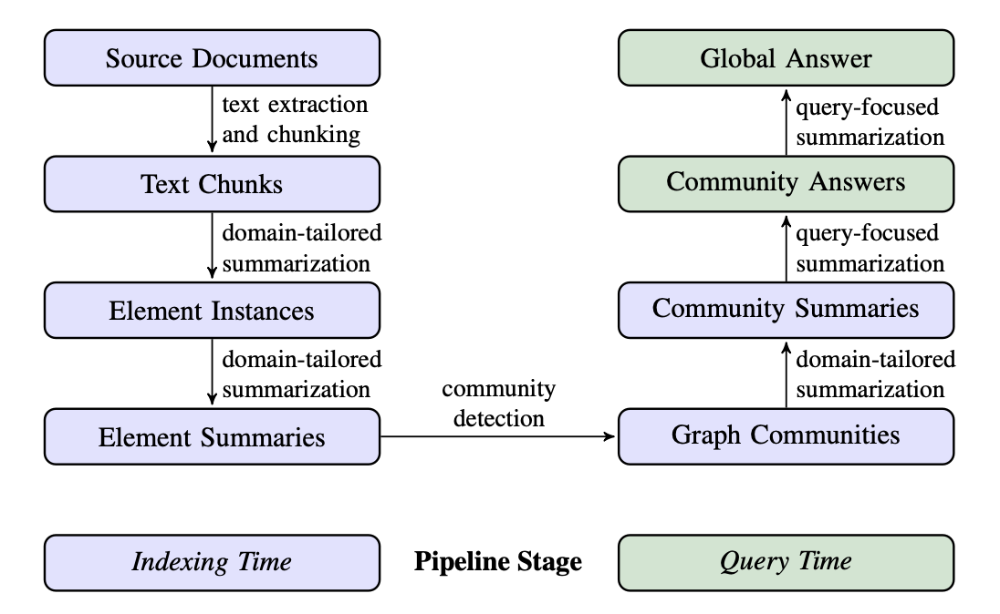

<style>
.custom {
    background-color: #008d8d;
    color: white;
    padding: 0.25em 0.5em 0.25em 0.5em;
    white-space: pre-wrap;       /* css-3 */
    white-space: -moz-pre-wrap;  /* Mozilla, since 1999 */
    white-space: -pre-wrap;      /* Opera 4-6 */
    white-space: -o-pre-wrap;    /* Opera 7 */
    word-wrap: break-word;
}

pre {
    background-color: #027c7c;
    padding-left: 0.5em;
}

</style>

# Academic QA System with GraphRAG

- Author: [Yongdam Kim](https://github.com/dancing-with-coffee)
- Design: 
- Peer Review: 
- This is a part of [LangChain Open Tutorial](https://github.com/LangChain-OpenTutorial/LangChain-OpenTutorial)

[](https://colab.research.google.com/github/LangChain-OpenTutorial/LangChain-OpenTutorial/blob/main/99-TEMPLATE/00-BASE-TEMPLATE-EXAMPLE.ipynb) [](https://github.com/LangChain-OpenTutorial/LangChain-OpenTutorial/blob/main/99-TEMPLATE/00-BASE-TEMPLATE-EXAMPLE.ipynb)

## Overview

This tutorial demonstrates how to implement a QA system that better leverages paper (academic) content by using GraphRAG.

GraphRAG is a novel system introduced by Microsoft that utilizes a graph to extract both local and global information from text, providing more contextually rich answers.

However, Microsoft’s official GraphRAG implementation is not readily integrated with LangChain, making it difficult to use.

To solve this, we use `langchain-graphrag` which allows us to implement GraphRAG within LangChain.

In this tutorial, we’ll learn how to build a QA system for the latest AI papers using `langchain-graphrag`.



> from arXiv- "From Local to Global-A Graph RAG Approach to Query-Focused Summarization"

### Table of Contents

- [Overview](#overview)
- [Environment Setup](#environment-setup)
- [Download and Load arXiv PDFs](#download-and-load-arxiv-pdfs)
- [Text Chunking and Text Extracting](#text-chunking-and-text-extracting)
- [Graph Generation](#graph-generation)
- [Graph Index Build](#graph-index-build)
- [Local Search through Knowledge Graph](#local-search-through-knowledge-graph)
- [Global Search through Knowledge Graph](#global-search-through-knowledge-graph)


### References

1. [langchain-graphrag github repo](https://github.com/ksachdeva/langchain-graphrag)
2. [GraphRAG paper](https://arxiv.org/pdf/2404.16130)
3. [GraphRAG Microsoft Official Research Blog post](https://www.microsoft.com/en-us/research/blog/graphrag-unlocking-llm-discovery-on-narrative-private-data/)

----

## Environment Setup

Set up the environment. You may refer to [Environment Setup](https://wikidocs.net/257836) for more details.

**[Note]**
- `langchain-opentutorial` is a package that provides a set of easy-to-use environment setup, useful functions and utilities for tutorials.
- You can check out the [`langchain-opentutorial`](https://github.com/LangChain-OpenTutorial/langchain-opentutorial-pypi) for more details.

```python
%%capture --no-stderr
!pip install langchain-opentutorial
```

```python
# Install required packages.
# 'langchain_opentutorial.package.install' is a helper function that installs
# the specified packages inside this environment.

from langchain_opentutorial import package

package.install(
    [
        "langsmith",
        "langchain",
        "langchain_core",
        "langchain_community",
        "langchain-graphrag",
        "langchain_chroma",
        "jq",
    ],
    verbose=False,
    upgrade=False,
)
```

You can alternatively set API keys such as `OPENAI_API_KEY` in a `.env` file and load them.

[Note] This is not necessary if you've already set the required API keys in previous steps.

```python
# Load environment variables from a .env file (e.g. OPENAI_API_KEY)
from dotenv import load_dotenv

load_dotenv(override=True)
```


<pre class="custom">True</pre>


## Download and Load arXiv PDFs

In this tutorial, we will use arXiv data. arXiv is an online archive for the latest research papers, all available in PDF format. There is an official GitHub repository containing all PDFs, but it is about 1TB in total size and can only be downloaded from AWS.
Thus, in this tutorial, we will selectively use a few PDF files instead.

- Link to the full dataset: https://github.com/mattbierbaum/arxiv-public-datasets

```python
# Download and save sample PDF file to ./data directory
import requests
import os

def download_pdf(url, save_path):
    """
    Downloads a PDF file from the given URL and saves it to the specified path.

    Args:
        url (str): The URL of the PDF file to download.
        save_path (str): The full path (including file name) where the file will be saved.
    """
    try:
        # Ensure the directory exists
        os.makedirs(os.path.dirname(save_path), exist_ok=True)

        # Download the file
        response = requests.get(url, stream=True)
        response.raise_for_status()  # Raise an error for bad status codes

        # Save the file to the specified path
        with open(save_path, "wb") as file:
            for chunk in response.iter_content(chunk_size=8192):
                file.write(chunk)

        print(f"PDF downloaded and saved to: {save_path}")
    except Exception as e:
        print(f"An error occurred while downloading the file: {e}")

# Configuration for the PDF file
pdf_url = "https://arxiv.org/pdf/2404.16130v1"
file_path = "./data/2404.16130v1.pdf"

# Download the PDF
download_pdf(pdf_url, file_path)

# Load the GraphRAG paper using PyPDFLoader.
# PyPDFLoader loads PDF content on a per-page basis.
from langchain.document_loaders import PyPDFLoader

loader = PyPDFLoader(file_path)
docs = loader.load()
print(f"Loaded {len(docs)} documents.")
print(docs[0].page_content)
```

<pre class="custom">PDF downloaded and saved to: ./data/2404.16130v1.pdf
    Loaded 15 documents.
    From Local to Global: A Graph RAG Approach to
    Query-Focused Summarization
    Darren Edge1†Ha Trinh1†Newman Cheng2Joshua Bradley2Alex Chao3
    Apurva Mody3Steven Truitt2
    Jonathan Larson1
    1Microsoft Research
    2Microsoft Strategic Missions and Technologies
    3Microsoft Office of the CTO
    {daedge,trinhha,newmancheng,joshbradley,achao,moapurva,steventruitt,jolarso }
    @microsoft.com
    †These authors contributed equally to this work
    Abstract
    The use of retrieval-augmented generation (RAG) to retrieve relevant informa-
    tion from an external knowledge source enables large language models (LLMs)
    to answer questions over private and/or previously unseen document collections.
    However, RAG fails on global questions directed at an entire text corpus, such
    as “What are the main themes in the dataset?”, since this is inherently a query-
    focused summarization (QFS) task, rather than an explicit retrieval task. Prior
    QFS methods, meanwhile, fail to scale to the quantities of text indexed by typical
    RAG systems. To combine the strengths of these contrasting methods, we propose
    a Graph RAG approach to question answering over private text corpora that scales
    with both the generality of user questions and the quantity of source text to be in-
    dexed. Our approach uses an LLM to build a graph-based text index in two stages:
    first to derive an entity knowledge graph from the source documents, then to pre-
    generate community summaries for all groups of closely-related entities. Given a
    question, each community summary is used to generate a partial response, before
    all partial responses are again summarized in a final response to the user. For a
    class of global sensemaking questions over datasets in the 1 million token range,
    we show that Graph RAG leads to substantial improvements over a na ¨ıve RAG
    baseline for both the comprehensiveness and diversity of generated answers. An
    open-source, Python-based implementation of both global and local Graph RAG
    approaches is forthcoming at https://aka .ms/graphrag .
    1 Introduction
    Human endeavors across a range of domains rely on our ability to read and reason about large
    collections of documents, often reaching conclusions that go beyond anything stated in the source
    texts themselves. With the emergence of large language models (LLMs), we are already witnessing
    attempts to automate human-like sensemaking in complex domains like scientific discovery (Mi-
    crosoft, 2023) and intelligence analysis (Ranade and Joshi, 2023), where sensemaking is defined as
    Preprint. Under review.arXiv:2404.16130v1  [cs.CL]  24 Apr 2024
</pre>

## Text Chunking and Text Extracting

In this step, we perform **query routing** and **document evaluation**. These steps are crucial parts of **Adaptive RAG**, contributing to efficient information retrieval and generation.

- **Query Routing**: Analyzes the user’s query to route it to the appropriate information source.
- **Document Evaluation**: Evaluates the quality and relevance of the retrieved documents.

These steps support the core functions of **Adaptive RAG**, aiming to provide accurate and reliable information.

```python
# Here we split the loaded documents into text chunks.
# 'RecursiveCharacterTextSplitter' is a commonly used utility in LangChain for
# chunking text with some overlap.

from langchain_core.documents import Document
from langchain_graphrag.indexing import TextUnitExtractor
from langchain_text_splitters import RecursiveCharacterTextSplitter

splitter = RecursiveCharacterTextSplitter(chunk_size=512, chunk_overlap=64)
text_unit_extractor = TextUnitExtractor(text_splitter=splitter)

# This runs the text splitting logic on the loaded PDF pages
df_text_units = text_unit_extractor.run(docs)
df_text_units
```

<pre class="custom">Extracting text units ...: 100%|██████████| 6/6 [00:00<00:00, 10437.92it/s]
    Extracting text units ...: 100%|██████████| 8/8 [00:00<00:00, 15148.73it/s]
    Extracting text units ...: 100%|██████████| 8/8 [00:00<00:00, 23746.94it/s]
    Extracting text units ...: 100%|██████████| 10/10 [00:00<00:00, 113359.57it/s]
    Extracting text units ...: 100%|██████████| 7/7 [00:00<00:00, 23413.18it/s]
    Extracting text units ...: 100%|██████████| 8/8 [00:00<00:00, 43976.98it/s]
    Extracting text units ...: 100%|██████████| 9/9 [00:00<00:00, 46603.38it/s]
    Extracting text units ...: 100%|██████████| 11/11 [00:00<00:00, 43815.14it/s]
    Extracting text units ...: 100%|██████████| 8/8 [00:00<00:00, 11188.54it/s]
    Extracting text units ...: 100%|██████████| 10/10 [00:00<00:00, 149263.49it/s]
    Extracting text units ...: 100%|██████████| 10/10 [00:00<00:00, 79891.50it/s]
    Extracting text units ...: 100%|██████████| 8/8 [00:00<00:00, 22429.43it/s]
    Extracting text units ...: 100%|██████████| 9/9 [00:00<00:00, 21794.88it/s]
    Extracting text units ...: 100%|██████████| 8/8 [00:00<00:00, 97541.95it/s]
    Extracting text units ...: 100%|██████████| 2/2 [00:00<00:00, 39199.10it/s]
    Processing documents ...: 100%|██████████| 15/15 [00:00<00:00, 506.48it/s]
</pre>


<div>
<style scoped>
    .dataframe tbody tr th:only-of-type {
        vertical-align: middle;
    }

    .dataframe tbody tr th {
        vertical-align: top;
    }

    .dataframe thead th {
        text-align: right;
    }
</style>
<table border="1" class="dataframe">
  <thead>
    <tr style="text-align: right;">
      <th></th>
      <th>document_id</th>
      <th>id</th>
      <th>text_unit</th>
    </tr>
  </thead>
  <tbody>
    <tr>
      <th>0</th>
      <td>1e3e4efb-27de-44c1-9854-4b4176ed618b</td>
      <td>6fe80d15-f2b2-47f2-8570-b5a64042d2f5</td>
      <td>From Local to Global: A Graph RAG Approach to\...</td>
    </tr>
    <tr>
      <th>1</th>
      <td>1e3e4efb-27de-44c1-9854-4b4176ed618b</td>
      <td>7a73bcf9-3874-40eb-ad70-e6c1070dd207</td>
      <td>tion from an external knowledge source enables...</td>
    </tr>
    <tr>
      <th>2</th>
      <td>1e3e4efb-27de-44c1-9854-4b4176ed618b</td>
      <td>63e41d22-ac60-48b8-8e70-d3e88ea2a7bc</td>
      <td>RAG systems. To combine the strengths of these...</td>
    </tr>
    <tr>
      <th>3</th>
      <td>1e3e4efb-27de-44c1-9854-4b4176ed618b</td>
      <td>861b4797-2cfd-4811-9cdf-efe0eb6a2bee</td>
      <td>question, each community summary is used to ge...</td>
    </tr>
    <tr>
      <th>4</th>
      <td>1e3e4efb-27de-44c1-9854-4b4176ed618b</td>
      <td>d543cef6-4565-4b73-9364-075b325ae290</td>
      <td>approaches is forthcoming at https://aka .ms/g...</td>
    </tr>
    <tr>
      <th>...</th>
      <td>...</td>
      <td>...</td>
      <td>...</td>
    </tr>
    <tr>
      <th>117</th>
      <td>65133966-6472-4c24-8520-40fccbfd666b</td>
      <td>52cd8901-0e27-4f0e-93e2-bfeade1cdad9</td>
      <td>with chain-of-thought reasoning for knowledge-...</td>
    </tr>
    <tr>
      <th>118</th>
      <td>65133966-6472-4c24-8520-40fccbfd666b</td>
      <td>36449b6c-150a-451a-b6fc-1a3081757068</td>
      <td>Wang, Y ., Lipka, N., Rossi, R. A., Siu, A., Z...</td>
    </tr>
    <tr>
      <th>119</th>
      <td>65133966-6472-4c24-8520-40fccbfd666b</td>
      <td>7f1c0194-ba84-4fe5-b81f-659aa62d89cf</td>
      <td>Empirical Methods in Natural Language Processi...</td>
    </tr>
    <tr>
      <th>120</th>
      <td>c4225aec-3b51-4bd6-bb1b-53c66d42229c</td>
      <td>e73e8ca0-417d-462c-8c84-bce611bf50e4</td>
      <td>Yao, L., Peng, J., Mao, C., and Luo, Y . (2023...</td>
    </tr>
    <tr>
      <th>121</th>
      <td>c4225aec-3b51-4bd6-bb1b-53c66d42229c</td>
      <td>94b7803f-07dc-45a3-a12f-cec090a7f721</td>
      <td>Zheng, L., Chiang, W.-L., Sheng, Y ., Zhuang, ...</td>
    </tr>
  </tbody>
</table>
<p>122 rows × 3 columns</p>
</div>


## Entity Relationship Extraction

GraphRAG extracts entities and relationships from the text chunks to automatically build a knowledge graph.

When constructing a Knowledge Graph, an LLM is used. In this tutorial, we use `gpt-4o-mini` for performance and cost reasons. The LLM uses a predefined prompt to extract entity and relationship information.

```python
# This process can take about 20 minutes.
# EntityRelationshipExtractor uses a language model to identify entities & relationships in the text.

from langchain_graphrag.indexing.graph_generation import EntityRelationshipExtractor
from langchain_openai import ChatOpenAI

# We instantiate a ChatOpenAI with 'gpt-4o-mini' model.
er_llm = ChatOpenAI(model="gpt-4o-mini", temperature=0.0)

# Build the default entity-relationship extractor.
extractor = EntityRelationshipExtractor.build_default(llm=er_llm)

# Invoke extractor on the text units (chunks)
text_unit_graphs = extractor.invoke(df_text_units)
```

<pre class="custom">Extracting entities and relationships ...: 100%|██████████| 122/122 [12:53<00:00,  6.34s/it]
</pre>

```python
# Display the graph information (nodes/edges) extracted from each chunk.
for index, g in enumerate(text_unit_graphs):
    if index == 5: # show 5 graphs
        break
    print("---------------------------------")
    print(f"Graph: {index}")
    print(f"Number of nodes - {len(g.nodes)}")
    print(f"Number of edges - {len(g.edges)}")
    print(g.nodes())
    print(g.edges())
    print("---------------------------------")
```

<pre class="custom">---------------------------------
    Graph: 0
    Number of nodes - 11
    Number of edges - 8
    ['DARREN EDGE', 'HA TRINH', 'NEWMAN CHENG', 'JOSHUA BRADLEY', 'ALEX CHAO', 'APURVA MODY', 'STEVEN TRUITT', 'JONATHAN LARSON', 'MICROSOFT RESEARCH', 'MICROSOFT STRATEGIC MISSIONS AND TECHNOLOGIES', 'MICROSOFT OFFICE OF THE CTO']
    [('DARREN EDGE', 'MICROSOFT RESEARCH'), ('HA TRINH', 'MICROSOFT RESEARCH'), ('NEWMAN CHENG', 'MICROSOFT STRATEGIC MISSIONS AND TECHNOLOGIES'), ('JOSHUA BRADLEY', 'MICROSOFT STRATEGIC MISSIONS AND TECHNOLOGIES'), ('ALEX CHAO', 'MICROSOFT OFFICE OF THE CTO'), ('APURVA MODY', 'MICROSOFT OFFICE OF THE CTO'), ('STEVEN TRUITT', 'MICROSOFT STRATEGIC MISSIONS AND TECHNOLOGIES'), ('JONATHAN LARSON', 'MICROSOFT RESEARCH')]
    ---------------------------------
    ---------------------------------
    Graph: 1
    Number of nodes - 3
    Number of edges - 2
    ['LARGE LANGUAGE MODELS', 'RAG', 'QFS']
    [('LARGE LANGUAGE MODELS', 'RAG'), ('RAG', 'QFS')]
    ---------------------------------
    ---------------------------------
    Graph: 2
    Number of nodes - 3
    Number of edges - 2
    ['RAG SYSTEMS', 'GRAPH RAG', 'LLM']
    [('RAG SYSTEMS', 'GRAPH RAG'), ('GRAPH RAG', 'LLM')]
    ---------------------------------
    ---------------------------------
    Graph: 3
    Number of nodes - 3
    Number of edges - 2
    ['GRAPH RAG', 'PYTHON', 'USER']
    [('GRAPH RAG', 'USER'), ('GRAPH RAG', 'PYTHON')]
    ---------------------------------
    ---------------------------------
    Graph: 4
    Number of nodes - 2
    Number of edges - 1
    ['HUMAN ENDEAVORS', 'LARGE LANGUAGE MODELS']
    [('HUMAN ENDEAVORS', 'LARGE LANGUAGE MODELS')]
    ---------------------------------
</pre>

```python
# Example: search for a specific extracted node
text_unit_graphs[2].nodes["GRAPH RAG"]
```


<pre class="custom">{'type': 'ORGANIZATION',
     'description': ['Graph RAG is an approach that utilizes a graph-based text index to enhance question answering capabilities.'],
     'text_unit_ids': ['63e41d22-ac60-48b8-8e70-d3e88ea2a7bc']}</pre>


```python
# Example: check the relationship (edge) between two extracted entities
text_unit_graphs[2].edges[("GRAPH RAG", "LLM")]
```


<pre class="custom">{'weight': 1.0,
     'description': ['LLM is used in the Graph RAG approach to build a graph-based text index'],
     'text_unit_ids': ['63e41d22-ac60-48b8-8e70-d3e88ea2a7bc']}</pre>


## Graph Generation

GraphRAG does not use all extracted entities and relationships individually; it merges them into a more comprehensive structure. We call this process Summarization.

Through element summarization, GraphRAG enhances search functionality by improving global context understanding.

```python
# This process can take about 22 minutes.
# We merge all local graphs into a single consolidated graph, then run summarization.

from langchain_graphrag.indexing.graph_generation import (
    GraphsMerger,
    EntityRelationshipDescriptionSummarizer,
    GraphGenerator,
)

graphs_merger = GraphsMerger()

es_llm = ChatOpenAI(model="gpt-4o-mini", temperature=0.0)

summarizer = EntityRelationshipDescriptionSummarizer.build_default(llm=es_llm)

graph_generator = GraphGenerator(
    er_extractor=extractor,
    graphs_merger=GraphsMerger(),
    er_description_summarizer=summarizer,
)

# Execute the graph generation.
graph = graph_generator.run(df_text_units)
```

<pre class="custom">Extracting entities and relationships ...: 100%|██████████| 122/122 [13:00<00:00,  6.40s/it]
    Summarizing entities descriptions: 100%|██████████| 482/482 [02:40<00:00,  2.99it/s]
    Summarizing relationship descriptions: 100%|██████████| 689/689 [00:30<00:00, 22.51it/s]
</pre>

```python
# Check how many nodes and edges are in the final merged+summarized graph.
print(f"Number of nodes - {len(graph[0].nodes)}")
print(f"Number of edges - {len(graph[0].edges)}")
```

<pre class="custom">Number of nodes - 482
    Number of edges - 689
</pre>

## Graph Index Build

- We run all steps from Text Chunking to Community Detection and Community Summarization in code.
- For community detection, we use the Leiden algorithm, known for good performance.
- In GraphRAG, we create an index called an artifact. We ultimately store the artifact using the `save_artifact` function.

```python
# Below we define functions to save and load the final Graph Index artifacts.

import pickle
from pathlib import Path
import pandas as pd
from langchain_graphrag.indexing.artifacts import IndexerArtifacts


# This function saves the IndexerArtifacts object to disk.
def save_artifacts(artifacts: IndexerArtifacts, path: str):
    artifacts.entities.to_parquet(f"{path}/entities.parquet")
    artifacts.relationships.to_parquet(f"{path}/relationships.parquet")
    artifacts.text_units.to_parquet(f"{path}/text_units.parquet")
    artifacts.communities_reports.to_parquet(f"{path}/communities_reports.parquet")

    if artifacts.merged_graph is not None:
        with path.joinpath("merged-graph.pickle").open("wb") as fp:
            pickle.dump(artifacts.merged_graph, fp)

    if artifacts.summarized_graph is not None:
        with path.joinpath("summarized-graph.pickle").open("wb") as fp:
            pickle.dump(artifacts.summarized_graph, fp)

    if artifacts.communities is not None:
        with path.joinpath("community_info.pickle").open("wb") as fp:
            pickle.dump(artifacts.communities, fp)


# This function loads the IndexerArtifacts object from disk.
def load_artifacts(path: Path) -> IndexerArtifacts:
    entities = pd.read_parquet(f"{path}/entities.parquet")
    relationships = pd.read_parquet(f"{path}/relationships.parquet")
    text_units = pd.read_parquet(f"{path}/text_units.parquet")
    communities_reports = pd.read_parquet(f"{path}/communities_reports.parquet")

    merged_graph = None
    summarized_graph = None
    communities = None

    merged_graph_pickled = path.joinpath("merged-graph.pickle")
    if merged_graph_pickled.exists():
        with merged_graph_pickled.open("rb") as fp:
            merged_graph = pickle.load(fp)

    summarized_graph_pickled = path.joinpath("summarized-graph.pickle")
    if summarized_graph_pickled.exists():
        with summarized_graph_pickled.open("rb") as fp:
            summarized_graph = pickle.load(fp)

    community_info_pickled = path.joinpath("community_info.pickle")
    if community_info_pickled.exists():
        with community_info_pickled.open("rb") as fp:
            communities = pickle.load(fp)

    return IndexerArtifacts(
        entities,
        relationships,
        text_units,
        communities_reports,
        merged_graph=merged_graph,
        summarized_graph=summarized_graph,
        communities=communities,
    )
```

```python
# The entire indexing pipeline: from chunking, graph generation, community detection to generating final artifacts (entities, relationships, communities, etc.).
# This step can take about 22 minutes.

from langchain_chroma.vectorstores import Chroma as ChromaVectorStore
from langchain_openai import OpenAIEmbeddings
from langchain_graphrag.indexing import SimpleIndexer
from langchain_graphrag.indexing.artifacts_generation import (
    CommunitiesReportsArtifactsGenerator,
    EntitiesArtifactsGenerator,
    RelationshipsArtifactsGenerator,
    TextUnitsArtifactsGenerator,
)
from langchain_graphrag.indexing.graph_clustering.leiden_community_detector import (
    HierarchicalLeidenCommunityDetector,
)
from langchain_graphrag.indexing.report_generation import (
    CommunityReportGenerator,
    CommunityReportWriter,
)

# Initialize the community detector
community_detector = HierarchicalLeidenCommunityDetector()

# Define the LLM and embedding model
ls_llm = ChatOpenAI(model="gpt-4o-mini", temperature=0.0)
embeddings = OpenAIEmbeddings(model="text-embedding-3-small")

# Create a Chroma vector store for entities.
entities_collection_name = f"entity-openai-embeddings"
entities_vector_store = ChromaVectorStore(
    collection_name=entities_collection_name,
    persist_directory="./",
    embedding_function=embeddings,
)

# Generators for different artifact types
entities_artifacts_generator = EntitiesArtifactsGenerator(
    entities_vector_store=entities_vector_store
)
relationships_artifacts_generator = RelationshipsArtifactsGenerator()

# Community Report Generator & Writer
report_generator = CommunityReportGenerator.build_default(
    llm=ls_llm,
    chain_config={"tags": ["community-report"]},
)
report_writer = CommunityReportWriter()

communities_report_artifacts_generator = CommunitiesReportsArtifactsGenerator(
    report_generator=report_generator,
    report_writer=report_writer,
)

# For text units
text_units_artifacts_generator = TextUnitsArtifactsGenerator()

# The SimpleIndexer orchestrates all indexing steps
indexer = SimpleIndexer(
    text_unit_extractor=text_unit_extractor,
    graph_generator=graph_generator,
    community_detector=community_detector,
    entities_artifacts_generator=entities_artifacts_generator,
    relationships_artifacts_generator=relationships_artifacts_generator,
    text_units_artifacts_generator=text_units_artifacts_generator,
    communities_report_artifacts_generator=communities_report_artifacts_generator,
)

# Run the entire pipeline on the loaded docs
artifacts = indexer.run(docs)

# Save the final artifacts to disk
artifacts_dir = Path("./")
save_artifacts(artifacts, artifacts_dir)
```

<pre class="custom">Matplotlib is building the font cache; this may take a moment.
    Extracting text units ...: 100%|██████████| 6/6 [00:00<00:00, 30320.27it/s]
    Extracting text units ...: 100%|██████████| 8/8 [00:00<00:00, 21690.00it/s]
    Extracting text units ...: 100%|██████████| 8/8 [00:00<00:00, 26132.74it/s]
    Extracting text units ...: 100%|██████████| 10/10 [00:00<00:00, 32488.80it/s]
    Extracting text units ...: 100%|██████████| 7/7 [00:00<00:00, 111212.61it/s]
    Extracting text units ...: 100%|██████████| 8/8 [00:00<00:00, 59178.89it/s]
    Extracting text units ...: 100%|██████████| 9/9 [00:00<00:00, 182361.04it/s]
    Extracting text units ...: 100%|██████████| 11/11 [00:00<00:00, 40294.62it/s]
    Extracting text units ...: 100%|██████████| 8/8 [00:00<00:00, 29720.49it/s]
    Extracting text units ...: 100%|██████████| 10/10 [00:00<00:00, 54899.27it/s]
    Extracting text units ...: 100%|██████████| 10/10 [00:00<00:00, 140748.46it/s]
    Extracting text units ...: 100%|██████████| 8/8 [00:00<00:00, 68338.97it/s]
    Extracting text units ...: 100%|██████████| 9/9 [00:00<00:00, 79471.02it/s]
    Extracting text units ...: 100%|██████████| 8/8 [00:00<00:00, 111476.52it/s]
    Extracting text units ...: 100%|██████████| 2/2 [00:00<00:00, 62601.55it/s]
    Processing documents ...: 100%|██████████| 15/15 [00:00<00:00, 706.08it/s]
    Extracting entities and relationships ...: 100%|██████████| 122/122 [14:50<00:00,  7.30s/it]
    Summarizing entities descriptions: 100%|██████████| 489/489 [02:08<00:00,  3.80it/s]
    Summarizing relationship descriptions: 100%|██████████| 500/500 [00:26<00:00, 19.00it/s]
    Generating report for level=0 commnuity_id=9: 100%|██████████| 10/10 [01:43<00:00, 10.35s/it]
    Generating report for level=1 commnuity_id=30: 100%|██████████| 21/21 [03:16<00:00,  9.37s/it]
    Generating report for level=2 commnuity_id=32: 100%|██████████| 2/2 [00:17<00:00,  8.95s/it]
</pre>

## Local Search through Knowledge Graph

We perform a local search using the Knowledge Graph built by GraphRAG. Local Search is helpful for retrieving specific passages or details. Compare this with a simple gpt-4o-mini answer. The GraphRAG-based answer is much more detailed and grounded in the paper content.

```python
# Load the artifacts we saved earlier
artifacts = load_artifacts(artifacts_dir)
```

```python
# Now we demonstrate local search on the knowledge graph.

from typing import cast

from langchain_graphrag.query.local_search import (
    LocalSearch,
    LocalSearchPromptBuilder,
    LocalSearchRetriever,
)
from langchain_graphrag.query.local_search.context_builders import (
    ContextBuilder,
)
from langchain_graphrag.query.local_search.context_selectors import (
    ContextSelector,
)
from langchain_graphrag.types.graphs.community import CommunityLevel
from langchain_graphrag.utils import TiktokenCounter

# Build a default ContextSelector that will figure out which entities and communities
# are most relevant based on the user query.
context_selector = ContextSelector.build_default(
    entities_vector_store=entities_vector_store,
    entities_top_k=10,
    community_level=cast(CommunityLevel, 2),  # e.g. second-level community granularity
)

# The ContextBuilder merges the context from the selection step into a final prompt context.
context_builder = ContextBuilder.build_default(
    token_counter=TiktokenCounter(),
)

# LocalSearchRetriever uses the context_selector and context_builder to retrieve relevant data.
retriever = LocalSearchRetriever(
    context_selector=context_selector,
    context_builder=context_builder,
    artifacts=artifacts,
)

# LocalSearch ties everything together into a query chain.
local_search = LocalSearch(
    prompt_builder=LocalSearchPromptBuilder(),
    llm=ls_llm,
    retriever=retriever,
)

# We get a chain object by calling local_search().
search_chain = local_search()

# Let's make a query.
query = "What community detection algorithm does GraphRAG use?"
print(search_chain.invoke(query))
```

<pre class="custom">Graph RAG utilizes the **Leiden algorithm** for community detection within its framework. The Leiden algorithm is recognized for its efficiency in identifying communities in large networks, making it a pivotal tool in the analysis of the MultiHop-RAG dataset, which is integral to the Graph RAG approach. This algorithm enhances the understanding of relationships among different entities by effectively partitioning graphs into well-connected communities [Data: Entities (88); Relationships (149, 160)].
    
    ### Significance of the Leiden Algorithm
    
    The Leiden algorithm improves upon earlier methods, such as the Louvain method, by ensuring that the resulting communities reflect meaningful relationships among nodes. Its ability to recover hierarchical community structures is particularly valuable for analyzing large-scale graphs, which is a common challenge in network analysis. This capability is essential for the comprehensive data analysis that Graph RAG aims to achieve [Data: Entities (88); Reports (12)].
    
    ### Application in Graph RAG
    
    In the context of Graph RAG, the Leiden algorithm is employed to analyze the MultiHop-RAG dataset, which encompasses a wide range of news articles across various categories. This application underscores the importance of computational methods in extracting meaningful insights from complex data structures, thereby enhancing the overall quality of information retrieval and summarization processes [Data: Reports (0); Relationships (149)].
    
    In summary, the Leiden algorithm plays a crucial role in the community detection capabilities of Graph RAG, facilitating effective data analysis and enhancing the understanding of complex relationships within large datasets.
</pre>

## Global Search through Knowledge Graph

We can also perform a global search using the Knowledge Graph built by GraphRAG. A global search is useful for getting answers with broader context. However, global search requires a model with a sufficiently large max token length. For example, `gpt-4o-mini` (max token size = 16k) may not handle the entire content of a large paper-based graph. If possible, try `gpt-4o` (max token size = 32k) for larger contexts!

```python
# Demonstrate global search using the knowledge graph.
# Here, we generate key points from the entire graph and then aggregate them.

from langchain_graphrag.query.global_search import GlobalSearch
from langchain_graphrag.query.global_search.community_weight_calculator import (
    CommunityWeightCalculator,
)
from langchain_graphrag.query.global_search.key_points_aggregator import (
    KeyPointsAggregator,
    KeyPointsAggregatorPromptBuilder,
    KeyPointsContextBuilder,
)
from langchain_graphrag.query.global_search.key_points_generator import (
    CommunityReportContextBuilder,
    KeyPointsGenerator,
    KeyPointsGeneratorPromptBuilder,
)

# The CommunityReportContextBuilder creates a context from community reports based on user query.
report_context_builder = CommunityReportContextBuilder(
    community_level=cast(CommunityLevel, 1),
    weight_calculator=CommunityWeightCalculator(),
    artifacts=artifacts,
    token_counter=TiktokenCounter(),
    max_tokens=16384,  # This is the limit for 'gpt-4o-mini'.
)

# KeyPointsGenerator creates key points from the available content.
kp_generator = KeyPointsGenerator(
    llm=ls_llm,
    prompt_builder=KeyPointsGeneratorPromptBuilder(
        show_references=True, repeat_instructions=True
    ),
    context_builder=report_context_builder,
)

# KeyPointsAggregator merges (aggregates) the key points from each relevant community.
kp_aggregator = KeyPointsAggregator(
    llm=ls_llm,
    prompt_builder=KeyPointsAggregatorPromptBuilder(
        show_references=True, repeat_instructions=True
    ),
    context_builder=KeyPointsContextBuilder(token_counter=TiktokenCounter()),
    output_raw=False,
)

# GlobalSearch orchestrates the generation and aggregation of key points for an entire knowledge graph.
global_search = GlobalSearch(
    kp_generator=kp_generator,
    kp_aggregator=kp_aggregator,
    generation_chain_config={"tags": ["kp-generation"]},
    aggregation_chain_config={"tags": ["kp-aggregation"]},
)

# Perform a synchronous invoke of the global search.
response = global_search.invoke(query)
print(response)
```

<pre class="custom">Reached max tokens for a community report call ...
</pre>

    ## Community Detection Algorithm in GraphRAG
    
    GraphRAG utilizes the **Leiden algorithm** for community detection. This algorithm is specifically designed to partition graphs into well-connected communities, which enhances the understanding of relationships among different entities within the dataset. The Leiden algorithm represents a significant advancement over earlier methodologies, such as the Louvain method, by providing improved performance and accuracy in detecting communities within complex networks [Data: Reports (8, 12)].
    
    ### Implications of Using the Leiden Algorithm
    
    The choice of the Leiden algorithm indicates a focus on achieving more reliable and meaningful community structures. This may lead to better insights into the interactions and connections among various entities represented in the data. By employing this advanced algorithm, GraphRAG may facilitate more effective analysis and interpretation of the underlying relationships, which is crucial for applications that rely on community detection.
    
    In summary, the use of the Leiden algorithm in GraphRAG enhances its capability to analyze and interpret complex relationships, thereby providing a robust framework for community detection in the dataset.
    

```python

```
