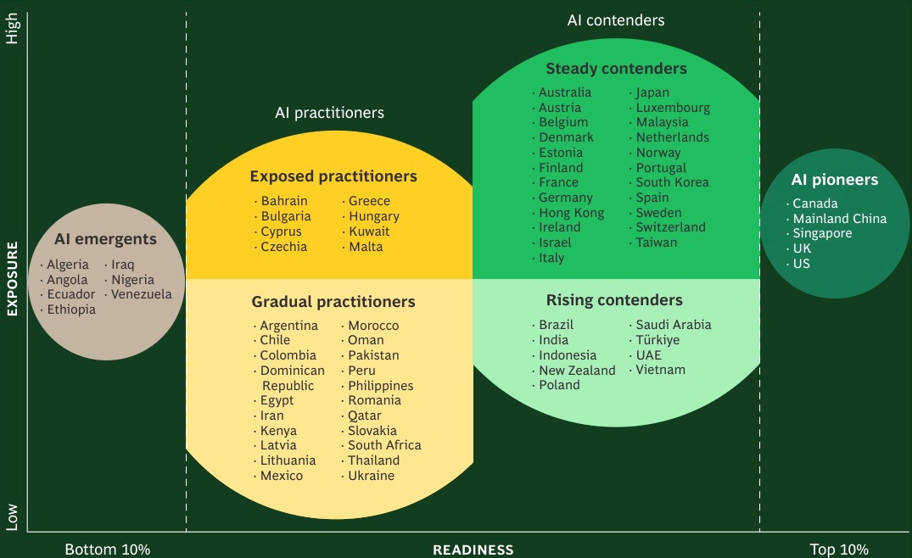
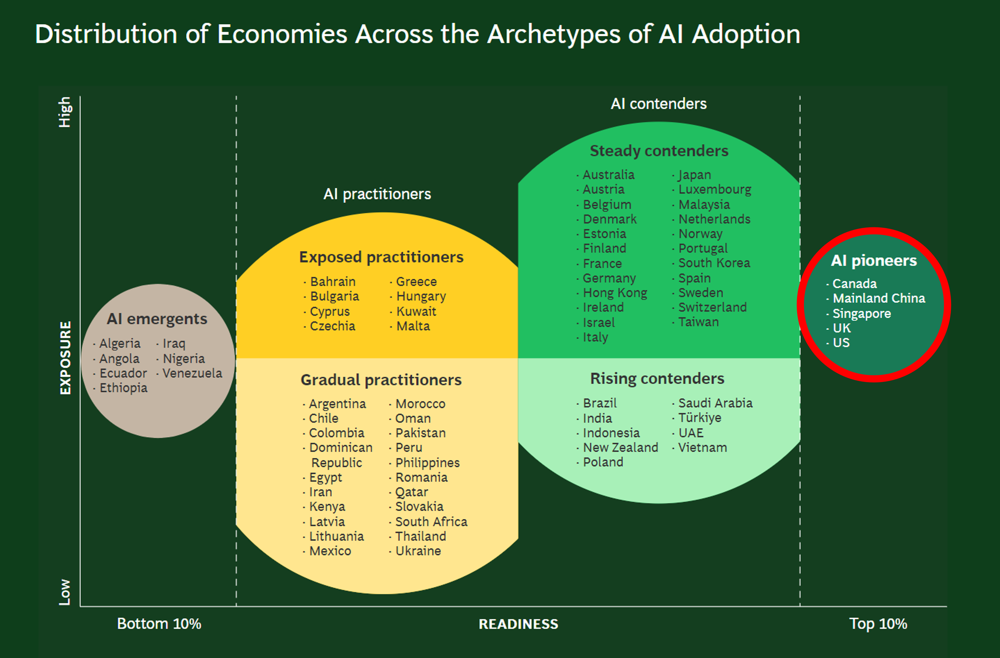

<style>
.custom {
    background-color: #008d8d;
    color: white;
    padding: 0.25em 0.5em 0.25em 0.5em;
    white-space: pre-wrap;       /* css-3 */
    white-space: -moz-pre-wrap;  /* Mozilla, since 1999 */
    white-space: -pre-wrap;      /* Opera 4-6 */
    white-space: -o-pre-wrap;    /* Opera 7 */
    word-wrap: break-word;
}

pre {
    background-color: #027c7c;
    padding-left: 0.5em;
}

</style>

# Multimodal RAG

- Author: [Kane](https://github.com/HarryKane11)
- Design: [Kane](https://github.com/HarryKane11)
- Peer Review : [Mark](https://github.com/obov), [Brian](https://github.com/brian604)
- This is a part of [LangChain Open Tutorial](https://github.com/LangChain-OpenTutorial/LangChain-OpenTutorial)

## Overview

This tutorial demonstrates how to build a Multimodal RAG (Retrieval-Augmented Generation) system using LangChain. The system processes both text and images from documents, creating a unified knowledge base for question-answering.

Key features include:
- Text content extraction to markdown using pymupdf4llm
- Image content extraction using Upstage Document AI API
- Text and image content merging by page
- RAG implementation using OpenAI embeddings and GPT-4o
- Langgraph based RAG pipeline


### Table of Contents

- [Environment Setup](#environment-setup)
- [Text Processing](#extract-and-preprocess-text-contents-from-pdf-using-pymupdf4llm)
- [Image Processing](#layout-parsing-to-extract-image-from-pdf-using-upstage-document-parse-api)
- [Multimodal RAG graph Implementation](#building-a-rag-pipeline-with-langgraph)

### References

- [PyMuPDF4LLM](https://pymupdf.readthedocs.io/en/latest/pymupdf4llm/api.html#pymupdf4llm-api)
- [Upstage Document AI](https://www.upstage.ai/blog/en/let-llms-read-your-documents-with-speed-and-accuracy)
- [Gemini in Langchain](https://python.langchain.com/docs/integrations/chat/google_generative_ai/)
- [Multimodal input in Langchain](https://python.langchain.com/docs/how_to/multimodal_inputs/)

## Environment Setup

Set up the environment. You may refer to [Environment Setup](https://wikidocs.net/257836) for more details.

**[Note]**
- `langchain-opentutorial` is a package that provides a set of easy-to-use environment setup, useful functions and utilities for tutorials. 
- You can checkout the [`langchain-opentutorial`](https://github.com/LangChain-OpenTutorial/langchain-opentutorial-pypi) for more details.

```python
%%capture --no-stderr
%pip install langchain-opentutorial
```

```python
# Install required packages
from langchain_opentutorial import package

package.install(
    [
        "pymupdf4llm",
        "langchain-upstage",
        "langchain-google-genai",
        "langchain-chroma",
        "langchain-openai",       
    ],
    verbose=False,
    upgrade=False,
)
```

```python
# Set environment variables
from langchain_opentutorial import set_env

set_env(
    {
        "GOOGLE_API_KEY": "",
        "LANGCHAIN_API_KEY": "",
        "LANGCHAIN_TRACING_V2": "true",
        "LANGCHAIN_ENDPOINT": "https://api.smith.langchain.com",
        "LANGCHAIN_PROJECT": "06-Multimodal",
        "UPSTAGE_API_KEY": ""
    }
)
```

<pre class="custom">Environment variables have been set successfully.
</pre>

```python
from dotenv import load_dotenv

load_dotenv(override=True)
```


<pre class="custom">True</pre>


## Extract and preprocess Text contents from PDF using PyMuPDF4LLM
### PyMuPDF4LLM

PyMuPDF4LLM is a Python package designed to facilitate the extraction of PDF content into formats suitable for Large Language Models (LLMs) and Retrieval-Augmented Generation (RAG) environments. It supports Markdown extraction and LlamaIndex document output, making it a valuable tool for developing document-based AI applications.

### Key Features

- **Multi-Column Page Support**: Accurately extracts text from pages with multiple columns.

- **Image and Vector Graphics Extraction**: Extracts images and vector graphics from pages, including references in the Markdown text.

- **Page Chunking Output**: Outputs pages in chunks, facilitating use in LLM and RAG systems.

- **LlamaIndex Document Output**: Directly converts PDFs into LlamaIndex document format.

```python
# Install PyMuPDF4LLM using pip:
# %pip install pymupdf4llm
```

```python
import pymupdf4llm

file_path = "data/BCG-ai-maturity-matrix-nov-2024.pdf"

# to_markdown() function extracts text content and converts it into markdown format
md_text = pymupdf4llm.to_markdown(
    doc=file_path,  # The file, either as a file path or a PyMuPDF Document.
    page_chunks=True,  # If True, output is a list of page-specific dictionaries.
    show_progress=True  # Displays a progress bar during processing.
    # pages=[0, 1, 2],  - Optional, specify 0-based page numbers to process.
    # hdr_info=False,  - Optional, disables header detection logic.
    # write_images=True,  - Saves images found in the document as files.
    # embed_images=True,  - Embeds images directly as base64 in markdown.
    # image_size_limit=0.05,  - Exclude small images below this size threshold.
    # dpi=150,  - Image resolution in dots per inch, if write_images=True.
    # image_path="output_images",  - Directory to save images if write_images=True.
    # image_format="png",  - Image file format, e.g., "png" or "jpg".
    # force_text=True,  - Include text overlapping images/graphics.
    # margins=0,  - Specify page margins for text extraction.
    # page_width=612,  - Desired page width for reflowable documents.
    # page_height=None,  - Desired page height for reflowable documents.
    # table_strategy="lines_strict",  - Strategy for table detection.
    # graphics_limit=5000,  - Limit the number of vector graphics processed.
    # ignore_code=False,  - If True, avoids special formatting for mono-spaced text.
    # extract_words=False,  - Adds word-level data to each page dictionary.
)

```

<pre class="custom">Processing data/BCG-ai-maturity-matrix-nov-2024.pdf...
    [                                        ] (0/2[=                                       ] ( 1/2=[===                                     ] ( 2/2=[=====                                   ] ( 3/2[======                                  ] ( 4/23=[========                                ] ( 5/23=[==========                              ] ( 6/23=[============                            ] ( 7/23[=============                           ] ( 8/2=[===============                         ] ( 9/2=[=================                       ] (10/2=[===================                     ] (11/2[====================                    ] (12/23=[======================                  ] (13/23=[========================                ] (14/23=[==========================              ] (15/23[===========================             ] (16/2=[=============================           ] (17/2=[===============================         ] (18/2=[=================================       ] (19/2[==================================      ] (20/23=[====================================    ] (21/23=[======================================  ] (22/23[========================================] (23/23]
</pre>

```python
md_text[0]
```


<pre class="custom">{'metadata': {'format': 'PDF 1.4',
      'title': '',
      'author': '',
      'subject': '',
      'keywords': '',
      'creator': 'Adobe InDesign 19.5 (Macintosh)',
      'producer': 'Adobe PDF Library 17.0',
      'creationDate': "D:20241115111150-06'00'",
      'modDate': "D:20241115111159-06'00'",
      'trapped': '',
      'encryption': None,
      'file_path': 'data/BCG-ai-maturity-matrix-nov-2024.pdf',
      'page_count': 23,
      'page': 1},
     'toc_items': [],
     'tables': [],
     'images': [{'number': 0,
       'bbox': Rect(0.0, 50.0, 595.2760009765625, 791.8900146484375),
       'transform': (597.5172729492188,
        0.0,
        -0.0,
        844.1083374023438,
        -1.0398268699645996,
        -1.1094970703125),
       'width': 2789,
       'height': 3940,
       'colorspace': 3,
       'cs-name': 'ICCBased(RGB,Adobe RGB (1998))',
       'xres': 96,
       'yres': 96,
       'bpc': 8,
       'size': 3307487}],
     'graphics': [],
     'text': '## The AI Maturity Matrix \n\n###### Which Economies Are Ready for AI?\n\nNovember 2024\nBy Christian Schwaerzler, Miguel Carrasco, Christopher Daniel,\nBrooke Bollyky, Yoshihisa Niwa, Aparna Bharadwaj, Akram Awad,\nRichard Sargeant, Sanjay Nawandhar, and Svetlana Kostikova\n\n\n-----\n\n',
     'words': []}</pre>


```python
for i, j in enumerate(md_text[:3]):
    print(f"page {i+1}: {j['text'][:500]}")
```

<pre class="custom">page 1: ## The AI Maturity Matrix 
    
    ###### Which Economies Are Ready for AI?
    
    November 2024
    By Christian Schwaerzler, Miguel Carrasco, Christopher Daniel,
    Brooke Bollyky, Yoshihisa Niwa, Aparna Bharadwaj, Akram Awad,
    Richard Sargeant, Sanjay Nawandhar, and Svetlana Kostikova
    
    
    -----
    
    
    page 2: ### Contents
    
    #### 03 Introduction
    
     04 Key Findings
    
     05 The Relationship Between
     Exposure and Readiness
    
     10 The Archetypes of AI Adoption
    
     15 Strategic Next Steps
    
     17 Methodology
    
     21 About the Authors
    
    
    -----
    
    
    page 3: ### Introduction
    
    iews vary on how much AI is changing the world
    today, but one thing is clear: the technology is on
    course to shape the future of economic development.
    
    # V
    
    Business leaders expect large impacts on operations and
    value creation in the 3-to-10-year timeframe, and world­
    wide spending on artificial intelligence will more than
    double to $632 billion by 2028.[1] The long-term, expansive
    scale of this growth makes AI an economic priority in every
    region across the globe.
    
    This growt
</pre>

## Layout parsing to extract image from PDF using Upstage Document Parse API

The Upstage Document Parse API is a robust AI model that converts various document formats, including PDFs and images, into HTML by detecting layout elements such as paragraphs, tables, and images. This facilitates the integration of document content into applications requiring structured data.

**Key Features:**

- **Layout Detection:** Identifies and preserves document structures, including paragraphs, tables, and images.

- **Format Conversion:** Transforms documents into HTML, maintaining the original layout and reading order.

- **High Performance:** Processes documents swiftly, handling up to 100 pages per minute.
  


Source: [Upstage Official Website](https://www.upstage.ai/blog/en/let-llms-read-your-documents-with-speed-and-accuracy)


### UpstageDocumentParseLoader in LangChain
The UpstageDocumentParseLoader is a component of the langchain_upstage package that integrates Upstage's Document Parser API into the LangChain framework. It enables seamless loading and parsing of documents within LangChain applications. 


```python
# Install the langchain-upstage package using pip:
# pip install -U langchain-upstage
```

```python
from langchain_upstage import UpstageDocumentParseLoader

loader = UpstageDocumentParseLoader(
            file_path, split="page", 
            output_format="markdown",
            base64_encoding=["figure", "chart", "table"]
         )
docs = loader.load_and_split()
```

```python
len(docs)
```


<pre class="custom">25</pre>


Inspect parsed documents to check for and display base64-encoded content along with a brief summary of each document's content and metadata.


```python
for i, j in enumerate(docs[:5]):
    bs_encoding = j.metadata['base64_encodings']

    if len(bs_encoding) > 0:
        print(f"📄 **Page {i+1}**\n{'='*20}")
        print(f"📝 **Page Content Preview:** {j.page_content[:100]}...")
        print(f"🔑 **Metadata Keys:** {', '.join(j.metadata.keys())}")
        print(f"🖼️ **Base64 Encoding (Preview):** {bs_encoding[0][:10]}...")
        print("\n")
```

<pre class="custom">📄 **Page 3**
    ====================
    📝 **Page Content Preview:** 
     # Introduction Views but one thing is clear: the technology is on
    vary...
    🔑 **Metadata Keys:** page, base64_encodings, coordinates
    🖼️ **Base64 Encoding (Preview):** /9j/2wCEAA...
    
    
    📄 **Page 4**
    ====================
    📝 **Page Content Preview:** # Key Findings Out of 73 economies assessed, only
    five—Canada, Mainland China,
    Singapore, the UK, an...
    🔑 **Metadata Keys:** page, base64_encodings, coordinates
    🖼️ **Base64 Encoding (Preview):** /9j/2wCEAA...
    
    
    📄 **Page 5**
    ====================
    📝 **Page Content Preview:** 
     # The Relationship Between Exposure
    and Readiness The adoption is alre...
    🔑 **Metadata Keys:** page, base64_encodings, coordinates
    🖼️ **Base64 Encoding (Preview):** /9j/2wCEAA...
    
    
</pre>

```python
import base64
from IPython.display import Image, display

img_data = base64.b64decode(docs[3].metadata['base64_encodings'][0])  # Decode base64
display(Image(data=img_data))  # Display the image
```


    

    


This process generates multimodal descriptions of images detected on each page using the Gemini 1.5 Flash 8B API. These descriptions are combined with the previously extracted text to create a complete embedding, enabling a RAG pipeline capable of understanding images as well.

```python
from langchain_core.messages import HumanMessage
from langchain_google_genai import ChatGoogleGenerativeAI
from langchain_core.documents import Document
import base64

def create_image_descriptions(docs):
    # Initialize the Gemini model
    model = ChatGoogleGenerativeAI(model="gemini-1.5-flash-8b")
    
    new_documents = []
    
    for doc in docs:
        # Check if base64_encodings exist in metadata
        if 'base64_encodings' in doc.metadata and len(doc.metadata['base64_encodings']) > 0:
            for idx, img_base64 in enumerate(doc.metadata['base64_encodings']):
                # Create a message containing the image
                message = HumanMessage(
                    content=[
                        {"type": "text", 
                         "text": """
                                    Describe only the factual content visible in the image:

                                    1. If decorative/non-informational: output '<---image--->'

                                    2. For content images:
                                    - General Images: List visible objects, text, and measurable attributes
                                    - Charts/Infographics: State all numerical values and labels present
                                    - Tables: Convert to markdown table format with exact data

                                    Rules:
                                    * Include only directly observable information
                                    * Use original numbers and text without modification
                                    * Avoid any interpretation or analysis
                                    * Preserve all labels and measurements exactly as shown
                                """
                        },
                        {
                            "type": "image_url",
                            "image_url": {"url": f"data:image/jpeg;base64,{img_base64}"},
                        },
                    ]
                )
                
                # Obtain image description from the model
                response = model.invoke([message])
                
                # Create a new Document
                new_doc = Document(
                    page_content=response.content,
                    metadata={
                        "page": f"{doc.metadata.get('page', 'unknown')}"
                    }
                )
                
                new_documents.append(new_doc)
    
    return new_documents
```

```python
# Generate image description documents from existing documents
image_description_docs = create_image_descriptions(docs)

# Check the results
for doc in image_description_docs:
    print(f"Page: {doc.metadata['page']}")
    print(f"Description: {doc.page_content}")
    print("---")
```

<pre class="custom">Failed to multipart ingest runs: langsmith.utils.LangSmithError: Failed to POST https://api.smith.langchain.com/runs/multipart in LangSmith API. HTTPError('403 Client Error: Forbidden for url: https://api.smith.langchain.com/runs/multipart', '{"detail":"Forbidden"}')
    Failed to multipart ingest runs: langsmith.utils.LangSmithError: Failed to POST https://api.smith.langchain.com/runs/multipart in LangSmith API. HTTPError('403 Client Error: Forbidden for url: https://api.smith.langchain.com/runs/multipart', '{"detail":"Forbidden"}')
    Failed to multipart ingest runs: langsmith.utils.LangSmithError: Failed to POST https://api.smith.langchain.com/runs/multipart in LangSmith API. HTTPError('403 Client Error: Forbidden for url: https://api.smith.langchain.com/runs/multipart', '{"detail":"Forbidden"}')
    Failed to multipart ingest runs: langsmith.utils.LangSmithError: Failed to POST https://api.smith.langchain.com/runs/multipart in LangSmith API. HTTPError('403 Client Error: Forbidden for url: https://api.smith.langchain.com/runs/multipart', '{"detail":"Forbidden"}')
    Failed to multipart ingest runs: langsmith.utils.LangSmithError: Failed to POST https://api.smith.langchain.com/runs/multipart in LangSmith API. HTTPError('403 Client Error: Forbidden for url: https://api.smith.langchain.com/runs/multipart', '{"detail":"Forbidden"}')
    Failed to multipart ingest runs: langsmith.utils.LangSmithError: Failed to POST https://api.smith.langchain.com/runs/multipart in LangSmith API. HTTPError('403 Client Error: Forbidden for url: https://api.smith.langchain.com/runs/multipart', '{"detail":"Forbidden"}')
    Failed to multipart ingest runs: langsmith.utils.LangSmithError: Failed to POST https://api.smith.langchain.com/runs/multipart in LangSmith API. HTTPError('403 Client Error: Forbidden for url: https://api.smith.langchain.com/runs/multipart', '{"detail":"Forbidden"}')
    Failed to multipart ingest runs: langsmith.utils.LangSmithError: Failed to POST https://api.smith.langchain.com/runs/multipart in LangSmith API. HTTPError('403 Client Error: Forbidden for url: https://api.smith.langchain.com/runs/multipart', '{"detail":"Forbidden"}')
    Failed to multipart ingest runs: langsmith.utils.LangSmithError: Failed to POST https://api.smith.langchain.com/runs/multipart in LangSmith API. HTTPError('403 Client Error: Forbidden for url: https://api.smith.langchain.com/runs/multipart', '{"detail":"Forbidden"}')
    Failed to multipart ingest runs: langsmith.utils.LangSmithError: Failed to POST https://api.smith.langchain.com/runs/multipart in LangSmith API. HTTPError('403 Client Error: Forbidden for url: https://api.smith.langchain.com/runs/multipart', '{"detail":"Forbidden"}')
    Failed to multipart ingest runs: langsmith.utils.LangSmithError: Failed to POST https://api.smith.langchain.com/runs/multipart in LangSmith API. HTTPError('403 Client Error: Forbidden for url: https://api.smith.langchain.com/runs/multipart', '{"detail":"Forbidden"}')
    Failed to multipart ingest runs: langsmith.utils.LangSmithError: Failed to POST https://api.smith.langchain.com/runs/multipart in LangSmith API. HTTPError('403 Client Error: Forbidden for url: https://api.smith.langchain.com/runs/multipart', '{"detail":"Forbidden"}')
    Failed to multipart ingest runs: langsmith.utils.LangSmithError: Failed to POST https://api.smith.langchain.com/runs/multipart in LangSmith API. HTTPError('403 Client Error: Forbidden for url: https://api.smith.langchain.com/runs/multipart', '{"detail":"Forbidden"}')
    Failed to multipart ingest runs: langsmith.utils.LangSmithError: Failed to POST https://api.smith.langchain.com/runs/multipart in LangSmith API. HTTPError('403 Client Error: Forbidden for url: https://api.smith.langchain.com/runs/multipart', '{"detail":"Forbidden"}')
    Failed to multipart ingest runs: langsmith.utils.LangSmithError: Failed to POST https://api.smith.langchain.com/runs/multipart in LangSmith API. HTTPError('403 Client Error: Forbidden for url: https://api.smith.langchain.com/runs/multipart', '{"detail":"Forbidden"}')
    Failed to multipart ingest runs: langsmith.utils.LangSmithError: Failed to POST https://api.smith.langchain.com/runs/multipart in LangSmith API. HTTPError('403 Client Error: Forbidden for url: https://api.smith.langchain.com/runs/multipart', '{"detail":"Forbidden"}')
</pre>

    Page: 3
    Description: <---image--->
    ---
    Page: 4
    Description: - **Al emergents:** Algeria, Angola, Ecuador, Ethiopia, Iraq, Nigeria, Venezuela
    - **Exposed practitioners:** Bahrain, Bulgaria, Cyprus, Czechia, Greece, Hungary, Kuwait, Malta
    - **Gradual practitioners:** Argentina, Chile, Colombia, Dominican Republic, Egypt, Iran, Kenya, Latvia, Lithuania, Mexico, Morocco, Oman, Pakistan, Peru, Philippines, Qatar, Romania, Slovakia, South Africa, Thailand, Ukraine
    - **Steady contenders:** Australia, Austria, Belgium, Denmark, Estonia, Finland, France, Germany, Hong Kong, Ireland, Israel, Italy, Japan, Luxembourg, Malaysia, Netherlands, Norway, Portugal, South Korea, Spain, Sweden, Switzerland, Taiwan
    - **Rising contenders:** Brazil, India, Indonesia, New Zealand, Poland, Saudi Arabia, Türkiye, UAE, Vietnam
    - **Al pioneers:** Canada, Mainland China, Singapore, UK, US
    - **Exposure:** Low, High
    - **Readiness:** Bottom 10%, Top 10%
    ---
    Page: 5
    Description: <---image--->
    ---
    Page: 6
    Description: <---image--->
    ---
    Page: 7
    Description: | Sector | Survey of business leaders | Publicly listed companies | Job vacancies on LinkedIn | GenAI-sourced insights |
    |---|---|---|---|---|
    | Information and communication |  |  |  |  |
    | High-tech goods |  |  |  |  |
    | Retail and wholesale |  |  |  |  |
    | Financial services |  |  |  |  |
    | Public services |  |  |  |  |
    | Motor vehicles and parts |  |  |  |  |
    | Business services |  |  |  |  |
    | Accommodation and catering |  |  |  |  |
    | Machinery and equipment |  |  |  |  |
    | Transport and storage services |  |  |  |  |
    | Oil and gas, coke, and refined petroleum |  |  |  |  |
    | Utilities |  |  |  |  |
    | Pharmaceuticals |  |  |  |  |
    | Arts, recreation, union, and personal services |  |  |  |  |
    | Textiles, leather, and clothing |  |  |  |  |
    | Mining |  |  |  |  |
    | Metals |  |  |  |  |
    | Food, beverages, and tobacco |  |  |  |  |
    | Other transport equipment |  |  |  |  |
    | Nonmetallic minerals |  |  |  |  |
    | Chemical, rubber, plastics |  |  |  |  |
    | Construction |  |  |  |  |
    | Other miscellaneous |  |  |  |  |
    | Agriculture, forestry, and fishery |  |  |  |  |
    | Furniture manufacturing |  |  |  |  |
    | Paper and wood products (without furniture) |  |  |  |  |
    
    ---
    Page: 9
    Description: A
    Ambition
    * Existence of AI strategy
    * Existence of specialized AI government agency/ministry
    
    S
    Skills
    * Concentration of AI-related specialists
    * Pool of AI-related specialists
    * Total public contributions in GitHub by top 1,000 users
    * Kaggle Grandmasters
    * Number of Python package downloads per 1,000 people
    
    P
    Policy and regulation
    * Regulatory quality
    * Governance effectiveness
    * Governance of data
    * Economic freedom index
    * AI and democratic values index
    
    I
    Investment
    * Value of AI unicorns
    * Mcap of IT-related and tech-related companies/GDP
    * Value of trade in ICT services (per capita)
    * Value of trade in ICT goods (per capita)
    * VC availability
    * Funding of AI companies
    * Computer software spending
    
    R
    Research and innovation
    * Research papers published on AI
    * AI-related patents
    * Top-ranked universities in data science and AI fields
    * Number of AI startups
    
    E
    Ecosystem
    * Fixed broadband internet traffic per capita
    * Electricity prices
    * Telecommunication infrastructure index
    * Average download speed
    * Online service index
    * Performance of economy-wide statistical systems
    ---
    Page: 9
    Description: | Country | Total ASPIRE | Ambition | Skills | Policy and regulation | Investment | Research and innovation | Ecosystem |
    |---|---|---|---|---|---|---|---|
    | Canada | 68 | 10 | 17 | 8 | 8 | 8 | 19 |
    | Mainland China |  |  |  |  |  |  |  |
    | Singapore |  |  |  |  |  |  |  |
    | United Kingdom |  |  |  |  |  |  |  |
    | United States |  |  |  |  |  |  |  |
    | Australia |  |  |  |  |  |  |  |
    | Finland |  |  |  |  |  |  |  |
    | France |  |  |  |  |  |  |  |
    | Japan |  | 58 | 10 | 8 | 6 | 4 | 16 |
    | Netherlands |  |  |  |  |  |  |  |
    | South Korea |  |  |  |  |  |  |  |
    | Sweden |  |  |  |  |  |  |  |
    | Germany |  |  |  |  |  |  |  |
    | India |  |  |  |  |  |  |  |
    | Ireland |  |  |  |  |  |  |  |
    | Spain |  |  |  |  |  |  |  |
    | Taiwan |  |  |  |  |  |  |  |
    | UAE |  |  |  |  |  |  |  |
    | Austria |  |  |  |  |  |  |  |
    | Belgium |  |  |  |  |  |  |  |
    | Brazil |  |  |  |  |  |  |  |
    | Denmark |  |  |  |  |  |  |  |
    | Estonia |  |  |  |  |  |  |  |
    | Hong Kong |  |  |  |  |  |  |  |
    | Indonesia |  |  |  |  |  |  |  |
    | Italy |  |  |  |  |  |  |  |
    | Malaysia |  |  |  |  |  |  |  |
    | New Zealand |  |  |  |  |  |  |  |
    | Norway |  |  |  |  |  |  |  |
    | Poland |  |  |  |  |  |  |  |
    | Portugal |  |  |  |  |  |  |  |
    | Saudi Arabia |  |  |  |  |  |  |  |
    | Switzerland |  |  |  |  |  |  |  |
    | Türkiye |  |  |  |  |  |  |  |
    | Luxembourg |  |  |  |  |  |  |  |
    | Malta |  |  |  |  |  |  |  |
    | Vietnam |  |  |  |  |  |  |  |
    | Argentina |  |  |  |  |  |  |  |
    | Chile |  |  |  |  |  |  |  |
    | Colombia |  |  |  |  |  |  |  |
    | Mexico |  |  |  |  |  |  |  |
    | Pakistan |  |  |  |  |  |  |  |
    | Cyprus |  |  |  |  |  |  |  |
    | Czechia |  |  |  |  |  |  |  |
    | Peru |  |  |  |  |  |  |  |
    | Qatar |  |  |  |  |  |  |  |
    | Egypt |  |  |  |  |  |  |  |
    | Greece |  |  |  |  |  |  |  |
    | Romania |  |  |  |  |  |  |  |
    | South Africa |  |  |  |  |  |  |  |
    | Hungary |  |  |  |  |  |  |  |
    | Thailand |  |  |  |  |  |  |  |
    | Latvia |  |  |  |  |  |  |  |
    | Lithuania |  |  |  |  |  |  |  |
    | Ukraine |  |  |  |  |  |  |  |
    | Bahrain |  |  |  |  |  |  |  |
    | Kuwait |  |  |  |  |  |  |  |
    | Bulgaria |  |  |  |  |  |  |  |
    | Morocco |  |  |  |  |  |  |  |
    | Dominican Republic |  |  |  |  |  |  |  |
    | Oman |  |  |  |  |  |  |  |
    | Philippines |  |  |  |  |  |  |  |
    | Iran |  |  |  |  |  |  |  |
    | Slovakia |  |  |  |  |  |  |  |
    | Kenya |  |  |  |  |  |  |  |
    | Algeria |  |  |  |  |  |  |  |
    | Angola |  |  |  |  |  |  |  |
    | Iraq |  |  |  |  |  |  |  |
    | Nigeria |  |  |  |  |  |  |  |
    | Ecuador |  |  |  |  |  |  |  |
    | Venezuela |  |  |  |  |  |  |  |
    | Ethiopia |  |  |  |  |  |  |  |
    |Minimum for dimension| 20 | 4 | 4 | 3 | 1 | 1 | 6 |
    |Maximum for dimension |  |  |  |  |  |  |  |
    
    
    **(Note):**  Some cells are blank because the corresponding data was not present in the image.  The data is presented as it appears in the chart, so the rows and columns are not perfectly aligned.
    ---
    Page: 10
    Description: <---image--->
    ---
    Page: 11
    Description: - **EXPOSURE:** Low, High
    - **READINESS:** Bottom 10%, Top 10%
    - **Categories:**
        - Al emergents
        - Exposed practitioners
        - Steady contenders
        - Al pioneers
        - Gradual practitioners
        - Rising contenders
    
    - **Descriptions:**
        - **Al emergents:** Economies with extremely low readiness and different levels of exposure to Al.
        - **Exposed practitioners:** Economies with relatively high exposure to Al and insufficient levels of readiness.
        - **Steady contenders:** Economies with relatively high exposure to Al and sufficient levels of readiness for its adoption.
        - **Al pioneers:** Economies able to meet high levels of exposure with extremely high readiness.
        - **Gradual practitioners:** Economies with relatively low exposure to Al and low readiness for its adoption.
        - **Rising contenders:** Economies with relatively low exposure to Al despite high readiness for its adoption.
    ---
    Page: 12
    Description: Large, tall structure resembling a tree with a green, intricate framework.  The framework is composed of numerous interconnected, light-green/teal colored branches/supports.  The structure is extensively decorated with numerous small, multicolored lights/decorations that appear as strands or clusters.  Visible are portions of other buildings/structures in the background.  The overall impression is of a large Christmas tree or similar festive display at night.
    ---
    Page: 15
    Description: <---image--->
    ---
    Page: 16
    Description: A
    Ambition
    Enable AI adoption through a national AI strategy and a dedicated entity to oversee implementation.
    
    S
    Skills
    Provide basic AI training and digital programs to modernize the workforce.
    
    P
    Policy and regulation
    Enhance government effectiveness to build a foundation for AI.
    
    I
    Investment
    Boost investments in R&D, university programs, workshops, and engage the private sector.
    
    R
    Research and innovation
    Establish research centers in AI and work to ensure industry collaboration.
    
    E
    Ecosystem
    Ensure basic digital infrastructure (e.g., high-speed internet) to enable AI adoption.
    
    Al emergents
    Enable AI adoption through a national AI strategy and a dedicated entity to oversee implementation.
    Provide basic AI training and digital programs to modernize the workforce.
    Enhance government effectiveness to build a foundation for AI.
    Boost investments in R&D, university programs, workshops, and engage the private sector.
    Establish research centers in AI and work to ensure industry collaboration.
    Ensure basic digital infrastructure (e.g., high-speed internet) to enable AI adoption.
    
    Al contenders
    Actively oversee AI adoption, with a focus on addressing lagging topics.
    Attract and retain AI talent pool (software developers, engineers) and focus on big data and advanced trainings in AI.
    Focus on AI ethics and flexible rules for experimentation.
    Boost investment in high-performance computing and data centers, and attract FDI in AI.
    Create test beds for developers and startups.
    Promote AI solutions and new technologies for strategic sectors.
    
    Al pioneers
    Support leading AI industry(ies) across the tech value chain.
    Enhance cross-cutting AI expertise and sector specialization among AI specialists.
    Ensure centralized oversight and more flexible rules on open data.
    Provide tailored support for national AI champions, unicorns, and startups.
    Focus on applied research and ensure cross-industry sharing.
    Enhance cross-cutting AI application and support advanced tech infrastructure.
    ---
    Page: 18
    Description: | INDICATOR | DIMENSION | SOURCE(S) | DESCRIPTION | WEIGHT |
    |---|---|---|---|---|
    | Existence of Al strategy | Ambition | Government websites | 100, if Al strategy exists; 0 if not | 5.0% |
    | Existence of specialized Al government agency/ ministry | Ambition | Government websites | 100 if Al entity exists; 0 if not | 5.0% |
    | Concentration of Al-related specialists | Skills | LinkedIn; World Bank | Number of LinkedIn accounts with Al-filtered skills per 1,000 people | 3.0% |
    | Pool of Al-related specialists | Skills | LinkedIn | Number of LinkedIn accounts with Al-filtered skills | 8.0% |
    | Total public contributions in GitHub by top 1,000 users | Skills | GitHub | Public contributions from top 1,000 users per economy | 3.0% |
    | Kaggle Grandmasters | Skills | Kaggle | Number of grandmasters in Al competitions | 8.0% |
    | Number of Python package downloads per 1,000 people | Skills | Python.org community | Number of scikit-learn downloads per 1,000 people | 3.0% |
    | Regulatory quality | Policy and regulation | World Bank | Government ability to create sound policies | 2.0% |
    | Governance effectiveness | Policy and regulation | World Bank | Quality of public services and civil service | 2.0% |
    | Governance of data | Policy and regulation | Global Data Barometer | Quality of data management frameworks and security | 2.0% |
    | Economic freedom index | Policy and regulation | The Heritage Foundation | Composite index based on four pillars-rule of law, government size, regulatory efficiency, and open markets | 2.0% |
    | Al and democratic values index | Policy and regulation | Center for Al and Digital Policy | The extent of how well Al development aligns with democratic values | 2.0% |
    
    ---
    Page: 19
    Description: | INDICATOR | DIMENSION | SOURCE(S) | DESCRIPTION | WEIGHT |
    |---|---|---|---|---|
    | Value of Al unicorns | Investment | CB Insights, Global Unicorn Club with applied filter for "enterprise tech" | Total value of Al companies exceeding $1 billion valuation | 3.0% |
    | Mcap of IT-related and tech-related companies/GDP | Investment | S&P Capital IQ | Market capitalization of companies in the IT and tech sectors as a proportion of an economy's gross domestic product (GDP) | 3.0% |
    | Value of trade in ICT services (per capita) | Investment | UN Trade & Development (UNCTAD) | Value of information and communication technology services traded (imported and exported) per capita | 1.5% |
    | Value of trade in ICT goods (per capita) | Investment | UNCTAD | Value of ICT goods traded (imported and exported) per capita | 1.5% |
    | VC availability | Investment | Pitchbook | Total funding in $ billions provided by VCs | 1.5% |
    | Funding of Al companies | Investment | Pitchbook | Total funding in $ billions provided to Al companies | 3.0% |
    | Computer software spending | Investment | World Intellectual Property Organization | Economy-wide investment in software relative to its economic output | 1.5% |
    | Research papers published on Al | Research and innovation | Scimago Journal & Country Rank | Composite index: 0.5* papers + 0.25 h index + 0.25 citations | 2.5% |
    | Al-related patents | Research and innovation | WIPO | Number of patents filed that are specifically related to Al | 5.0% |
    | Top-ranked universities in data science and Al fields | Research and innovation | QS World University Rankings | Number of universities in an economy that are ranked among the top institutions in these fields by QS | 2.5% |
    | Number of Al startups | Research and innovation | Artificial Intelligence Index Report 2024, Stanford University Human-Centered Artificial Intelligence | Number of Al startups in an economy | 5.0% |
    | Number of data centers | Ecosystem | Cloudscene data | Number of different data centers in an economy | 4.0% |
    | Public cloud spend per employee | Ecosystem | Statista | Average expenditure on public cloud services per employee | 4.0% |
    | Adoption of emerging technologies by companies | Ecosystem | Network Readiness Index, Portulans Institute and the University of Oxford | Extent to which companies in an economy adopt and integrate emerging technologies | 4.0% |
    | Accessible supercomputer capacity by economy | Ecosystem | Manual assessment of accessibility based on top 500 supercomputers | Composite score that assesses the accessibility of processing cores of the top 500 supercomputers | 1.0% |
    
    ---
    Page: 20
    Description: | INDICATOR | DIMENSION | SOURCE(S) | DESCRIPTION | WEIGHT |
    |---|---|---|---|---|
    | Fixed broadband internet traffic per capita | Ecosystem | DataHub | Average data transferred per person | 4.0% |
    | Electricity prices | Ecosystem | World Population Review | Price of electricity per kilowatt-hour | 1.0% |
    | Telecommunication infrastructure index | Ecosystem | World Bank GovTech Maturity Index 2022 | Availability and quality of telecom infrastructure | 1.0% |
    | Average download speed | Ecosystem | Speedtest Global Index (for fixed broadband) | Internet download speed in megabits per second | 4.0% |
    | Online service index | Ecosystem | United Nations | Government use of digital solutions | 1.0% |
    | Performance of economy-wide statistical systems | Ecosystem | World Bank | Quality of economy-wide statistical agencies | 1.0% |
    ---
    Page: 20
    Description: | INDICATOR | DIMENSION |
    |---|---|
    | Ambition | 10% |
    | Skills | 25% |
    | Policy and regulation | 10% |
    | Investment | 15% |
    | Research and innovation | 15% |
    | Ecosystem | 25% |
    
    ---
    

    Failed to multipart ingest runs: langsmith.utils.LangSmithError: Failed to POST https://api.smith.langchain.com/runs/multipart in LangSmith API. HTTPError('403 Client Error: Forbidden for url: https://api.smith.langchain.com/runs/multipart', '{"detail":"Forbidden"}')
    Failed to multipart ingest runs: langsmith.utils.LangSmithError: Failed to POST https://api.smith.langchain.com/runs/multipart in LangSmith API. HTTPError('403 Client Error: Forbidden for url: https://api.smith.langchain.com/runs/multipart', '{"detail":"Forbidden"}')
    Failed to multipart ingest runs: langsmith.utils.LangSmithError: Failed to POST https://api.smith.langchain.com/runs/multipart in LangSmith API. HTTPError('403 Client Error: Forbidden for url: https://api.smith.langchain.com/runs/multipart', '{"detail":"Forbidden"}')
    Failed to multipart ingest runs: langsmith.utils.LangSmithError: Failed to POST https://api.smith.langchain.com/runs/multipart in LangSmith API. HTTPError('403 Client Error: Forbidden for url: https://api.smith.langchain.com/runs/multipart', '{"detail":"Forbidden"}')
    Failed to multipart ingest runs: langsmith.utils.LangSmithError: Failed to POST https://api.smith.langchain.com/runs/multipart in LangSmith API. HTTPError('403 Client Error: Forbidden for url: https://api.smith.langchain.com/runs/multipart', '{"detail":"Forbidden"}')
    Failed to multipart ingest runs: langsmith.utils.LangSmithError: Failed to POST https://api.smith.langchain.com/runs/multipart in LangSmith API. HTTPError('403 Client Error: Forbidden for url: https://api.smith.langchain.com/runs/multipart', '{"detail":"Forbidden"}')
    Failed to multipart ingest runs: langsmith.utils.LangSmithError: Failed to POST https://api.smith.langchain.com/runs/multipart in LangSmith API. HTTPError('403 Client Error: Forbidden for url: https://api.smith.langchain.com/runs/multipart', '{"detail":"Forbidden"}')
    

```python
from langchain_core.documents import Document
from collections import defaultdict

def merge_text_and_images(md_text, image_description_docs):
    # Create a dictionary to collect data by page
    page_contents = defaultdict(list)
    page_metadata = {}
    
    # Process md_text
    for text_item in md_text:
        # Standardize page numbers to integer
        page = int(text_item['metadata']['page'])
        page_contents[page].append(text_item['text'])
        # Save metadata for each page
        if page not in page_metadata:
            page_metadata[page] = {
                'source': text_item['metadata']['file_path'],
                'page': page
            }
    
    # Process image_description_docs
    for img_doc in image_description_docs:
        # Standardize page numbers to integer
        page = int(img_doc.metadata['page'])
        page_contents[page].append(img_doc.page_content)
    
    # Create the final list of Document objects
    merged_docs = []
    for page in sorted(page_contents.keys()):
        # Combine all content of the page into a single string
        full_content = '\n\n'.join(page_contents[page])
        
        # Create a Document object
        doc = Document(
            page_content=full_content,
            metadata=page_metadata[page]
        )
        merged_docs.append(doc)
    
    return merged_docs
```

```python
merged_documents = merge_text_and_images(md_text, image_description_docs)
```

```python
print(merged_documents[3].page_content)
```

<pre class="custom">###### y g
    
    **Out of 73 economies assessed, only**
    **five—Canada, Mainland China,**
    **Singapore, the UK, and the US—**
    **are categorized as AI pioneers.**
    They have reached a high level of
    readiness by blending elements like
    investment and infrastructure, turning
    disruption into a competitive edge.
    They are in a unique position to guide
    the world forward in innovation,
    talent development, and AI regulation
    and ethics.
    
    
    **Several economies with high**
    **AI readiness are just behind the**
    **pace of AI pioneers. While this**
    group of AI contenders includes
    established economies, it also
    features emerging ones like India,
    Saudi Arabia, and the UAE that are
    using policy and targeted investments
    to adopt AI on an advanced level. As
    these economies strengthen their
    innovation capabilities, they will grow
    more competitive and influential in
    the AI space.
    
    
    **Most economies in the study are**
    **not ready for AI disruption. More**
    **than 70% score below the halfway**
    **mark in categories like ecosystem**
    **participation, skills, and R&D.**
    Policymakers must act now to adjust
    to a world of AI and boost resiliency,
    productivity, jobs, modernization, and
    competitiveness.
    
    
    ###### Distribution of Economies Across the Archetypes of AI Adoption
    
    AI contenders
    
    **Steady contenders**
    
                                                       - Australia                                                   - Japan
    
    AI practitioners                      - Austria                      - Luxembourg
    
                                                - Belgium                                            - Malaysia
    
                                            - Denmark                                         - Netherlands
    
                                                     - Estonia                                                 - Norway
    
                                                    - Finland                                                 - Portugal
    
    **Exposed practitioners**                  - France                  - South Korea
    
                           - Bahrain                        - Greece                        - Germany                        - Spain
    
                            - Bulgaria                         - Hungary                         - Hong Kong                         - Sweden
    
                           - Cyprus                        - Kuwait                        - Ireland                        - Switzerland
    
    **AI emergents**     - Czechia     - Malta     - Israel     - Taiwan
    
                                                               - Italy
    
          - Algeria      - Iraq
    
         - Angola      - Nigeria
    
         - Ecuador      - Venezuela **Gradual practitioners** **Rising contenders**
    
          - Ethiopia
    
                           - Argentina                        - Morocco                        - Brazil                        - Saudi Arabia
    
                              - Chile                           - Oman                           - India                           - Türkiye
    
                          - Colombia                      - Pakistan                      - Indonesia                      - UAE
    
                          - Dominican                      - Peru                      - New Zealand                      - Vietnam
    Republic                      - Philippines                      - Poland
    
                            - Egypt                        - Romania
    
                               - Iran                           - Qatar
    
                          - Kenya                       - Slovakia
    
                             - Latvia                          - South Africa
    
                            - Lithuania                         - Thailand
    
                          - Mexico                       - Ukraine
    
    Bottom 10% **READINESS**
    
    **Sources: BCG Center for Public Economics; BCG analysis.**
    
    **Note: Within each archetype, economies appear in alphabetical order.**
    
    
    -----
    
    
    
    - **Al emergents:** Algeria, Angola, Ecuador, Ethiopia, Iraq, Nigeria, Venezuela
    - **Exposed practitioners:** Bahrain, Bulgaria, Cyprus, Czechia, Greece, Hungary, Kuwait, Malta
    - **Gradual practitioners:** Argentina, Chile, Colombia, Dominican Republic, Egypt, Iran, Kenya, Latvia, Lithuania, Mexico, Morocco, Oman, Pakistan, Peru, Philippines, Qatar, Romania, Slovakia, South Africa, Thailand, Ukraine
    - **Steady contenders:** Australia, Austria, Belgium, Denmark, Estonia, Finland, France, Germany, Hong Kong, Ireland, Israel, Italy, Japan, Luxembourg, Malaysia, Netherlands, Norway, Portugal, South Korea, Spain, Sweden, Switzerland, Taiwan
    - **Rising contenders:** Brazil, India, Indonesia, New Zealand, Poland, Saudi Arabia, Türkiye, UAE, Vietnam
    - **Al pioneers:** Canada, Mainland China, Singapore, UK, US
    - **Exposure:** Low, High
    - **Readiness:** Bottom 10%, Top 10%
</pre>

## Building a RAG Pipeline with LangGraph

This guide demonstrates how to use LangGraph to build a unified RAG (Retrieval-Augmented Generation) application. By combining retrieval and generation into a single flow, LangGraph offers streamlined execution, deployment, and additional features like persistence and human-in-the-loop approval.

### Key Components

1. **Application State**:
   - Tracks input (`question`), intermediate (`context`), and output (`answer`) data using a `TypedDict`.

2. **Application Steps**:
   - **Retrieve**: Uses `Chroma` for similarity-based document retrieval.
   - **Generate**: Formats retrieved context and question, then invokes `ChatOpenAI` to generate an answer.

3. **Control Flow**:
   - Uses `StateGraph` to define the sequence and connections between steps.

```python
from langchain_text_splitters import RecursiveCharacterTextSplitter

text_splitter = RecursiveCharacterTextSplitter(chunk_size=1000, chunk_overlap=200)
all_splits = text_splitter.split_documents(merged_documents)
```

```python
from langchain_chroma import Chroma
from langchain_openai import OpenAIEmbeddings

embeddings = OpenAIEmbeddings(model="text-embedding-3-small")
vector_store = Chroma.from_documents(
    documents=all_splits,
    embedding=embeddings
    )
```

```python
from langchain_core.prompts import ChatPromptTemplate
from langchain_core.documents import Document
from langchain_openai import ChatOpenAI
from langgraph.graph import START, StateGraph
from typing_extensions import List, TypedDict

llm = ChatOpenAI(model="gpt-4o")
# Define prompt for question-answering
prompt = ChatPromptTemplate([
    ("human", """
You are an assistant for question-answering tasks. 
Use the following pieces of retrieved context to answer the question. 
If you don't know the answer, just say that you don't know. 
Question: {question} 
Context: {context} 
Answer:
""")])


# Define state for application
class State(TypedDict):
    question: str
    context: List[Document]
    answer: str


# Define application steps
def retrieve(state: State):
    retrieved_docs = vector_store.similarity_search(state["question"])
    return {"context": retrieved_docs}


def generate(state: State):
    docs_content = "\n\n".join(doc.page_content for doc in state["context"])
    messages = prompt.invoke({"question": state["question"], "context": docs_content})
    response = llm.invoke(messages)
    return {"answer": response.content}


# Compile application and test
graph_builder = StateGraph(State).add_sequence([retrieve, generate])
graph_builder.add_edge(START, "retrieve")
graph = graph_builder.compile()
```

```python
response = graph.invoke({"question": "Please list AI pioneers"})
print(response["answer"])
```

<pre class="custom">The AI pioneers, as mentioned in the context, are Canada, Mainland China, Singapore, the UK, and the US.
</pre>

As shown in the image below, the answer was correctly predicted.

```python
import base64
from IPython.display import Image, display

display(Image(data="assets/AI_Pioneers.png"))  # Display the image
```


    

    

